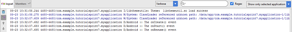

# Android - Activities
If you have worked with C, C++ or Java programming language then you must have seen that your program starts from **main()** function. Very similar way, Android system initiates its program with in an **Activity** starting with a call on  callback method. There is a sequence of callback methods that start up an activity and a sequence of callback methods that tear down an activity as shown in the below Activity life cycle diagram: ( )


The Activity class defines the following call backs i.e. events. You don't need to implement all the callbacks methods. However, it's important that you understand each one and implement those that ensure your app behaves the way users expect.

## Example
This example will take you through simple steps to show Android application activity life cycle. Follow the following steps to modify the Android application we created in  chapter −

Following is the content of the modified main activity file **src/com.example.helloworld/MainActivity.java**. This file includes each of the fundamental life cycle methods. The **Log.d()** method has been used to generate log messages −

```
package com.example.helloworld;

import android.os.Bundle;
import android.app.Activity;
import android.util.Log;

public class MainActivity extends Activity {
   String msg = "Android : ";
   
   /** Called when the activity is first created. */
   @Override
   public void onCreate(Bundle savedInstanceState) {
      super.onCreate(savedInstanceState);
      setContentView(R.layout.activity_main);
      Log.d(msg, "The onCreate() event");
   }

   /** Called when the activity is about to become visible. */
   @Override
   protected void onStart() {
      super.onStart();
      Log.d(msg, "The onStart() event");
   }

   /** Called when the activity has become visible. */
   @Override
   protected void onResume() {
      super.onResume();
      Log.d(msg, "The onResume() event");
   }

   /** Called when another activity is taking focus. */
   @Override
   protected void onPause() {
      super.onPause();
      Log.d(msg, "The onPause() event");
   }

   /** Called when the activity is no longer visible. */
   @Override
   protected void onStop() {
      super.onStop();
      Log.d(msg, "The onStop() event");
   }

   /** Called just before the activity is destroyed. */
   @Override
   public void onDestroy() {
      super.onDestroy();
      Log.d(msg, "The onDestroy() event");
   }
}
```
An activity class loads all the UI component using the XML file available in  folder of the project. Following statement loads UI components from :

```
setContentView(R.layout.activity_main);
```
An application can have one or more activities without any restrictions. Every activity you define for your application must be declared in your  file and the main activity for your app must be declared in the manifest with an &lt;intent-filter&gt; that includes the MAIN action and LAUNCHER category as follows:

```
<?xml version="1.0" encoding="utf-8"?>
<manifest xmlns:android="http://schemas.android.com/apk/res/android"
    package="com.example.tutorialspoint7.myapplication">

    <application
        android:allowBackup="true"
        android:icon="@mipmap/ic_launcher"
        android:label="@string/app_name"
        android:supportsRtl="true"
        android:theme="@style/AppTheme">
        <activity android:name=".MainActivity">
            <intent-filter>
                <action android:name="android.intent.action.MAIN" />

                <category android:name="android.intent.category.LAUNCHER" />
            </intent-filter>
        </activity>
    </application>

</manifest>
```
If either the MAIN action or LAUNCHER category are not declared for one of your activities, then your app icon will not appear in the Home screen's list of apps.

Let's try to run our modified **Hello World!** application we just modified. I assume you had created your **AVD** while doing environment setup. To run the app from Android studio, open one of your project's activity files and click Run  icon from the toolbar. Android studio installs the app on your AVD and starts it and if everything is fine with your setup and application, it will display Emulator window and you should see following log messages in **LogCat** window in Android studio −

```
08-23 10:32:07.682 4480-4480/com.example.helloworld D/Android :: The onCreate() event
08-23 10:32:07.683 4480-4480/com.example.helloworld D/Android :: The onStart() event
08-23 10:32:07.685 4480-4480/com.example.helloworld D/Android :: The onResume() event
```




Let us try to click lock screen button on the Android emulator and it will generate following events messages in **LogCat** window in android studio:

```
08-23 10:32:53.230 4480-4480/com.example.helloworld D/Android :: The onPause() event
08-23 10:32:53.294 4480-4480/com.example.helloworld D/Android :: The onStop() event
```
Let us again try to unlock your screen on the Android emulator and it will generate following events messages in **LogCat** window in Android studio:

```
08-23 10:34:41.390 4480-4480/com.example.helloworld D/Android :: The onStart() event
08-23 10:34:41.392 4480-4480/com.example.helloworld D/Android :: The onResume() event
```
Next, let us again try to click Back button  on the Android emulator and it will generate following events messages in **LogCat** window in Android studio and this completes the Activity Life Cycle for an Android Application.

```
08-23 10:37:24.806 4480-4480/com.example.helloworld D/Android :: The onPause() event
08-23 10:37:25.668 4480-4480/com.example.helloworld D/Android :: The onStop() event
08-23 10:37:25.669 4480-4480/com.example.helloworld D/Android :: The onDestroy() event
```

[Previous Page](../android/android_resources.md) [Next Page](../android/android_services.md) 
