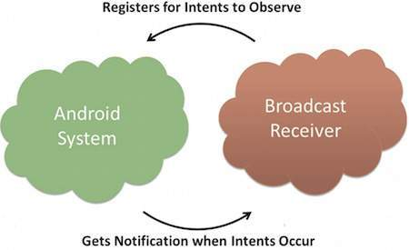
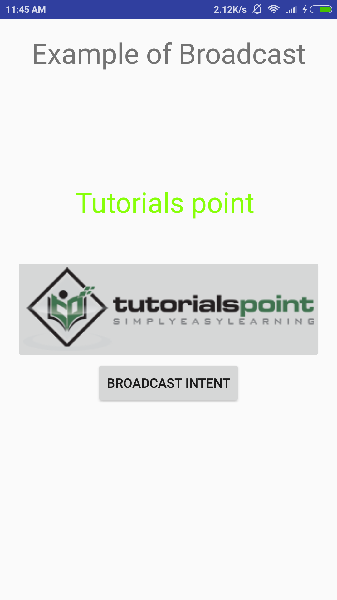
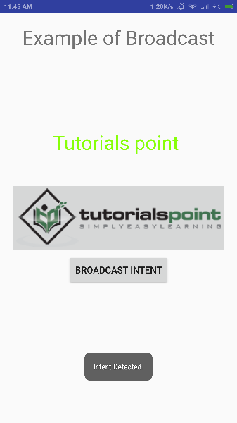

# Android - Broadcast Receivers
There are following two important steps to make BroadcastReceiver works for the system broadcasted intents −

   * Creating the Broadcast Receiver.
   * Registering Broadcast Receiver

There is one additional steps in case you are going to implement your custom intents then you will have to create and broadcast those intents.

## Creating the Broadcast Receiver
A broadcast receiver is implemented as a subclass of **BroadcastReceiver** class and overriding the onReceive() method where each message is received as a **Intent** object parameter.

```
public class MyReceiver extends BroadcastReceiver {
   @Override
   public void onReceive(Context context, Intent intent) {
      Toast.makeText(context, "Intent Detected.", Toast.LENGTH_LONG).show();
   }
}
```
## Registering Broadcast Receiver
An application listens for specific broadcast intents by registering a broadcast receiver in  file. Consider we are going to register  for system generated event ACTION_BOOT_COMPLETED which is fired by the system once the Android system has completed the boot process.



#### Broadcast-Receiver
```
<application
   android:icon="@drawable/ic_launcher"
   android:label="@string/app_name"
   android:theme="@style/AppTheme" >
   <receiver android:name="MyReceiver">
   
      <intent-filter>
         <action android:name="android.intent.action.BOOT_COMPLETED">
         </action>
      </intent-filter>
   
   </receiver>
</application>
```
Now whenever your Android device gets booted, it will be intercepted by BroadcastReceiver  and implemented logic inside  will be executed.

There are several system generated events defined as final static fields in the **Intent** class. The following table lists a few important system events.

## Broadcasting Custom Intents
If you want your application itself should generate and send custom intents then you will have to create and send those intents by using the  method inside your activity class. If you use the  method, the Intent is **sticky**, meaning the  you are sending stays around after the broadcast is complete.

```
public void broadcastIntent(View view) {
   Intent intent = new Intent();
   intent.setAction("com.tutorialspoint.CUSTOM_INTENT");
   sendBroadcast(intent);
}
```
This intent  can also be registered in similar way as we have regsitered system generated intent.

```
<application
   android:icon="@drawable/ic_launcher"
   android:label="@string/app_name"
   android:theme="@style/AppTheme" >
   <receiver android:name="MyReceiver">
   
      <intent-filter>
         <action android:name="com.tutorialspoint.CUSTOM_INTENT">
         </action>
      </intent-filter>
   
   </receiver>
</application>
```
## Example
This example will explain you how to create  to intercept custom intent. Once you are familiar with custom intent, then you can program your application to intercept system generated intents. So let's follow the following steps to modify the Android application we created in  chapter −

Following is the content of the modified main activity file **MainActivity.java**. This file can include each of the fundamental life cycle methods. We have added  method to broadcast a custom intent.

```
package com.example.tutorialspoint7.myapplication;

import android.app.Activity;
import android.content.Intent;
import android.os.Bundle;
import android.view.View;

public class MainActivity extends Activity {

   /** Called when the activity is first created. */
   @Override
   
   public void onCreate(Bundle savedInstanceState) {
      super.onCreate(savedInstanceState);
      setContentView(R.layout.activity_main);
   }


   // broadcast a custom intent.
      
   public void broadcastIntent(View view){
      Intent intent = new Intent();
      intent.setAction("com.tutorialspoint.CUSTOM_INTENT"); sendBroadcast(intent);
   }
}
```
Following is the content of **MyReceiver.java**:

```
package com.example.tutorialspoint7.myapplication;

import android.content.BroadcastReceiver;
import android.content.Context;
import android.content.Intent;
import android.widget.Toast;

/**
 * Created by TutorialsPoint7 on 8/23/2016.
 */
public class MyReceiver extends BroadcastReceiver{
   @Override
   public void onReceive(Context context, Intent intent) {
      Toast.makeText(context, "Intent Detected.", Toast.LENGTH_LONG).show();
   }
}
```
Following will the modified content of  file. Here we have added &lt;receiver.../&gt; tag to include our service:

```
<?xml version="1.0" encoding="utf-8"?>
<manifest xmlns:android="http://schemas.android.com/apk/res/android"
   package="com.example.tutorialspoint7.myapplication">

   <application
      android:allowBackup="true"
      android:icon="@mipmap/ic_launcher"
      android:label="@string/app_name"
      android:supportsRtl="true"
      android:theme="@style/AppTheme">
		
      <activity android:name=".MainActivity">
         <intent-filter>
            <action android:name="android.intent.action.MAIN" />

            <category android:name="android.intent.category.LAUNCHER" />
         </intent-filter>
      </activity>
   
      <receiver android:name="MyReceiver">
         <intent-filter>
            <action android:name="com.tutorialspoint.CUSTOM_INTENT">
            </action>
         </intent-filter>

      </receiver>
   </application>

</manifest>
```
Following will be the content of **res/layout/activity_main.xml** file to include a button to broadcast our custom intent −

```
<RelativeLayout 
   xmlns:android="http://schemas.android.com/apk/res/android"
   xmlns:tools="http://schemas.android.com/tools" 
   android:layout_width="match_parent"
   android:layout_height="match_parent" 
   android:paddingLeft="@dimen/activity_horizontal_margin"
   android:paddingRight="@dimen/activity_horizontal_margin"
   android:paddingTop="@dimen/activity_vertical_margin"
   android:paddingBottom="@dimen/activity_vertical_margin" 
   tools:context=".MainActivity">
   
   <TextView
      android:id="@+id/textView1"
      android:layout_width="wrap_content"
      android:layout_height="wrap_content"
      android:text="Example of Broadcast"
      android:layout_alignParentTop="true"
      android:layout_centerHorizontal="true"
      android:textSize="30dp" />
      
   <TextView
      android:id="@+id/textView2"
      android:layout_width="wrap_content"
      android:layout_height="wrap_content"
      android:text="Tutorials point "
      android:textColor="#ff87ff09"
      android:textSize="30dp"
      android:layout_above="@+id/imageButton"
      android:layout_centerHorizontal="true"
      android:layout_marginBottom="40dp" />
      
   <ImageButton
      android:layout_width="wrap_content"
      android:layout_height="wrap_content"
      android:id="@+id/imageButton"
      android:src="@drawable/abc"
      android:layout_centerVertical="true"
      android:layout_centerHorizontal="true" />
      
   <Button
      android:layout_width="wrap_content"
      android:layout_height="wrap_content"
      android:id="@+id/button2"
      android:text="Broadcast Intent"
      android:onClick="broadcastIntent"
      android:layout_below="@+id/imageButton"
      android:layout_centerHorizontal="true" />

</RelativeLayout>
```
Let's try to run our modified **Hello World!** application we just modified. I assume you had created your **AVD** while doing environment set-up. To run the app from Android studio, open one of your project's activity files and click Run  icon from the tool bar. Android Studio installs the app on your AVD and starts it and if everything is fine with your set-up and application, it will display following Emulator window −



Now to broadcast our custom intent, let's click on **Broadcast Intent** button, this will broadcast our custom intent  which will be intercepted by our registered BroadcastReceiver i.e. MyReceiver and as per our implemented logic a toast will appear on the bottom of the the simulator as follows −



You can try implementing other BroadcastReceiver to intercept system generated intents like system boot up, date changed, low battery etc.


[Previous Page](../android/android_services.md) [Next Page](../android/android_content_providers.md) 
