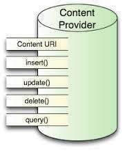
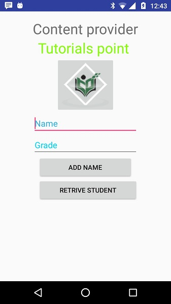
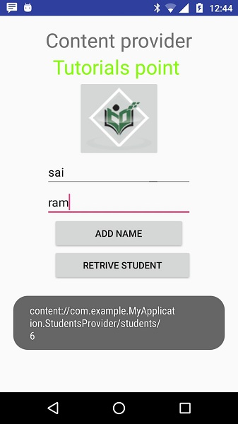

# Android - Content Providers


#### ContentProvider
Content providers let you centralize content in one place and have many different applications access it as needed. A content provider behaves very much like a database where you can query it, edit its content, as well as add or delete content using insert(), update(), delete(), and query() methods. In most cases this data is stored in an **SQlite** database.

A content provider is implemented as a subclass of **ContentProvider** class and must implement a standard set of APIs that enable other applications to perform transactions.

```
public class My Application extends  ContentProvider {
}
```
## Content URIs
To query a content provider, you specify the query string in the form of a URI which has following format −

```
<prefix>://<authority>/<data_type>/<id>
```
Here is the detail of various parts of the URI −

## Create Content Provider
This involves number of simple steps to create your own content provider.

   * First of all you need to create a Content Provider class that extends the  
   * Second, you need to define your content provider URI address which will be used to access the content.
   * Next you will need to create your own database to keep the content. Usually, Android uses SQLite database and framework needs to override  method which will use SQLite Open Helper method to create or open the provider's database. When your application is launched, the  handler of each of its Content Providers is called on the main application thread.
   * Next you will have to implement Content Provider queries to perform different database specific operations.
   * Finally register your Content Provider in your activity file using &lt;provider&gt; tag.

Here is the list of methods which you need to override in Content Provider class to have your Content Provider working −



#### ContentProvider
   * **onCreate()** This method is called when the provider is started.
   * **query()** This method receives a request from a client. The result is returned as a Cursor object.
   * **insert()**This method inserts a new record into the content provider.
   * **delete()** This method deletes an existing record from the content provider.
   * **update()** This method updates an existing record from the content provider.
   * **getType()** This method returns the MIME type of the data at the given URI.

## Example
This example will explain you how to create your own . So let's follow the following steps to similar to what we followed while creating −

Following is the content of the modified main activity file **src/com.example.MyApplication/MainActivity.java**. This file can include each of the fundamental life cycle methods. We have added two new methods  and  to handle user interaction with the application.

```
package com.example.MyApplication;

import android.net.Uri;
import android.os.Bundle;
import android.app.Activity;

import android.content.ContentValues;
import android.content.CursorLoader;

import android.database.Cursor;

import android.view.Menu;
import android.view.View;

import android.widget.EditText;
import android.widget.Toast;

public class MainActivity extends Activity {

   @Override
   protected void onCreate(Bundle savedInstanceState) {
      super.onCreate(savedInstanceState);
      setContentView(R.layout.activity_main);
   }
   public void onClickAddName(View view) {
      // Add a new student record
      ContentValues values = new ContentValues();
      values.put(StudentsProvider.NAME,
         ((EditText)findViewById(R.id.editText2)).getText().toString());

      values.put(StudentsProvider.GRADE,
         ((EditText)findViewById(R.id.editText3)).getText().toString());

      Uri uri = getContentResolver().insert(
         StudentsProvider.CONTENT_URI, values);

      Toast.makeText(getBaseContext(),
         uri.toString(), Toast.LENGTH_LONG).show();
   }
   public void onClickRetrieveStudents(View view) {
      // Retrieve student records
      String URL = "content://com.example.MyApplication.StudentsProvider";

      Uri students = Uri.parse(URL);
      Cursor c = managedQuery(students, null, null, null, "name");

      if (c.moveToFirst()) {
         do{
            Toast.makeText(this,
               c.getString(c.getColumnIndex(StudentsProvider._ID)) +
                  ", " +  c.getString(c.getColumnIndex( StudentsProvider.NAME)) +
                     ", " + c.getString(c.getColumnIndex( StudentsProvider.GRADE)),
            Toast.LENGTH_SHORT).show();
         } while (c.moveToNext());
      }
   }
}
```
Create new file StudentsProvider.java under  package and following is the content of **src/com.example.MyApplication/StudentsProvider.java** −

```
package com.example.MyApplication;

import java.util.HashMap;

import android.content.ContentProvider;
import android.content.ContentUris;
import android.content.ContentValues;
import android.content.Context;
import android.content.UriMatcher;

import android.database.Cursor;
import android.database.SQLException;

import android.database.sqlite.SQLiteDatabase;
import android.database.sqlite.SQLiteOpenHelper;
import android.database.sqlite.SQLiteQueryBuilder;

import android.net.Uri;
import android.text.TextUtils;

public class StudentsProvider extends ContentProvider {
   static final String PROVIDER_NAME = "com.example.MyApplication.StudentsProvider";
   static final String URL = "content://" + PROVIDER_NAME + "/students";
   static final Uri CONTENT_URI = Uri.parse(URL);

   static final String _ID = "_id";
   static final String NAME = "name";
   static final String GRADE = "grade";

   private static HashMap<String, String> STUDENTS_PROJECTION_MAP;

   static final int STUDENTS = 1;
   static final int STUDENT_ID = 2;

   static final UriMatcher uriMatcher;
   static{
      uriMatcher = new UriMatcher(UriMatcher.NO_MATCH);
      uriMatcher.addURI(PROVIDER_NAME, "students", STUDENTS);
      uriMatcher.addURI(PROVIDER_NAME, "students/#", STUDENT_ID);
   }

   /**
      * Database specific constant declarations
   */
   
   private SQLiteDatabase db;
   static final String DATABASE_NAME = "College";
   static final String STUDENTS_TABLE_NAME = "students";
   static final int DATABASE_VERSION = 1;
   static final String CREATE_DB_TABLE =
      " CREATE TABLE " + STUDENTS_TABLE_NAME +
         " (_id INTEGER PRIMARY KEY AUTOINCREMENT, " +
         " name TEXT NOT NULL, " +
         " grade TEXT NOT NULL);";

   /**
      * Helper class that actually creates and manages
      * the provider's underlying data repository.
   */
   
   private static class DatabaseHelper extends SQLiteOpenHelper {
      DatabaseHelper(Context context){
         super(context, DATABASE_NAME, null, DATABASE_VERSION);
      }

      @Override
      public void onCreate(SQLiteDatabase db) {
         db.execSQL(CREATE_DB_TABLE);
      }

      @Override
      public void onUpgrade(SQLiteDatabase db, int oldVersion, int newVersion) {
         db.execSQL("DROP TABLE IF EXISTS " +  STUDENTS_TABLE_NAME);
         onCreate(db);
      }
   }

   @Override
   public boolean onCreate() {
      Context context = getContext();
      DatabaseHelper dbHelper = new DatabaseHelper(context);

      /**
         * Create a write able database which will trigger its
         * creation if it doesn't already exist.
      */
         
      db = dbHelper.getWritableDatabase();
      return (db == null)? false:true;
   }

   @Override
   public Uri insert(Uri uri, ContentValues values) {
      /**
         * Add a new student record
      */
      long rowID = db.insert(	STUDENTS_TABLE_NAME, "", values);

      /**
         * If record is added successfully
      */
      if (rowID > 0) {
         Uri _uri = ContentUris.withAppendedId(CONTENT_URI, rowID);
         getContext().getContentResolver().notifyChange(_uri, null);
         return _uri;
      }
        
      throw new SQLException("Failed to add a record into " + uri);
   }

   @Override
   public Cursor query(Uri uri, String[] projection, 
      String selection,String[] selectionArgs, String sortOrder) {
      SQLiteQueryBuilder qb = new SQLiteQueryBuilder();
      qb.setTables(STUDENTS_TABLE_NAME);

      switch (uriMatcher.match(uri)) {
         case STUDENTS:
            qb.setProjectionMap(STUDENTS_PROJECTION_MAP);
         break;

         case STUDENT_ID:
            qb.appendWhere( _ID + "=" + uri.getPathSegments().get(1));
         break;
         
         default:   
      }

      if (sortOrder == null || sortOrder == ""){
         /**
            * By default sort on student names
         */
         sortOrder = NAME;
      }
      
      Cursor c = qb.query(db,	projection,	selection, 
         selectionArgs,null, null, sortOrder);
      /**
         * register to watch a content URI for changes
      */
      c.setNotificationUri(getContext().getContentResolver(), uri);
      return c;
   }

   @Override
   public int delete(Uri uri, String selection, String[] selectionArgs) {
      int count = 0;
      switch (uriMatcher.match(uri)){
         case STUDENTS:
            count = db.delete(STUDENTS_TABLE_NAME, selection, selectionArgs);
         break;

         case STUDENT_ID:
            String id = uri.getPathSegments().get(1);
            count = db.delete( STUDENTS_TABLE_NAME, _ID +  " = " + id +
               (!TextUtils.isEmpty(selection) ? " 
               AND (" + selection + ')' : ""), selectionArgs);
            break;
         default:
            throw new IllegalArgumentException("Unknown URI " + uri);
      }

      getContext().getContentResolver().notifyChange(uri, null);
      return count;
   }

   @Override
   public int update(Uri uri, ContentValues values, 
      String selection, String[] selectionArgs) {
      int count = 0;
      switch (uriMatcher.match(uri)) {
         case STUDENTS:
            count = db.update(STUDENTS_TABLE_NAME, values, selection, selectionArgs);
         break;

         case STUDENT_ID:
            count = db.update(STUDENTS_TABLE_NAME, values, 
               _ID + " = " + uri.getPathSegments().get(1) +
               (!TextUtils.isEmpty(selection) ? " 
               AND (" +selection + ')' : ""), selectionArgs);
            break;
         default:
            throw new IllegalArgumentException("Unknown URI " + uri );
      }
        
      getContext().getContentResolver().notifyChange(uri, null);
      return count;
   }

   @Override
   public String getType(Uri uri) {
      switch (uriMatcher.match(uri)){
         /**
            * Get all student records
         */
         case STUDENTS:
            return "vnd.android.cursor.dir/vnd.example.students";
         /**
            * Get a particular student
         */
         case STUDENT_ID:
            return "vnd.android.cursor.item/vnd.example.students";
         default:
            throw new IllegalArgumentException("Unsupported URI: " + uri);
      }
   }
}
```
Following will the modified content of  file. Here we have added &lt;provider.../&gt; tag to include our content provider:

```
<?xml version="1.0" encoding="utf-8"?>
<manifest xmlns:android="http://schemas.android.com/apk/res/android"
    package="com.example.MyApplication">

   <application
      android:allowBackup="true"
      android:icon="@mipmap/ic_launcher"
      android:label="@string/app_name"
      android:supportsRtl="true"
      android:theme="@style/AppTheme">
         <activity android:name=".MainActivity">
            <intent-filter>
               <action android:name="android.intent.action.MAIN" />
               <category android:name="android.intent.category.LAUNCHER" />
            </intent-filter>
         </activity>
        
      <provider android:name="StudentsProvider"
         android:authorities="com.example.MyApplication.StudentsProvider"/>
   </application>
</manifest>
```
Following will be the content of **res/layout/activity_main.xml** file−

```
<?xml version="1.0" encoding="utf-8"?>
<RelativeLayout xmlns:android="http://schemas.android.com/apk/res/android"
   xmlns:tools="http://schemas.android.com/tools"
   android:layout_width="match_parent"
   android:layout_height="match_parent"
   android:paddingBottom="@dimen/activity_vertical_margin"
   android:paddingLeft="@dimen/activity_horizontal_margin"
   android:paddingRight="@dimen/activity_horizontal_margin"
   android:paddingTop="@dimen/activity_vertical_margin"
   tools:context="com.example.MyApplication.MainActivity">

   <TextView
      android:id="@+id/textView1"
      android:layout_width="wrap_content"
      android:layout_height="wrap_content"
      android:text="Content provider"
      android:layout_alignParentTop="true"
      android:layout_centerHorizontal="true"
      android:textSize="30dp" />

   <TextView
      android:id="@+id/textView2"
      android:layout_width="wrap_content"
      android:layout_height="wrap_content"
      android:text="Tutorials point "
      android:textColor="#ff87ff09"
      android:textSize="30dp"
      android:layout_below="@+id/textView1"
      android:layout_centerHorizontal="true" />

   <ImageButton
      android:layout_width="wrap_content"
      android:layout_height="wrap_content"
      android:id="@+id/imageButton"
      android:src="@drawable/abc"
      android:layout_below="@+id/textView2"
      android:layout_centerHorizontal="true" />

   <Button
      android:layout_width="wrap_content"
      android:layout_height="wrap_content"
      android:id="@+id/button2"
      android:text="Add Name"
      android:layout_below="@+id/editText3"
      android:layout_alignRight="@+id/textView2"
      android:layout_alignEnd="@+id/textView2"
      android:layout_alignLeft="@+id/textView2"
      android:layout_alignStart="@+id/textView2"
      android:onClick="onClickAddName"/>

   <EditText
      android:layout_width="wrap_content"
      android:layout_height="wrap_content"
      android:id="@+id/editText"
      android:layout_below="@+id/imageButton"
      android:layout_alignRight="@+id/imageButton"
      android:layout_alignEnd="@+id/imageButton" />

   <EditText
      android:layout_width="wrap_content"
      android:layout_height="wrap_content"
      android:id="@+id/editText2"
      android:layout_alignTop="@+id/editText"
      android:layout_alignLeft="@+id/textView1"
      android:layout_alignStart="@+id/textView1"
      android:layout_alignRight="@+id/textView1"
      android:layout_alignEnd="@+id/textView1"
      android:hint="Name"
      android:textColorHint="@android:color/holo_blue_light" />

   <EditText
      android:layout_width="wrap_content"
      android:layout_height="wrap_content"
      android:id="@+id/editText3"
      android:layout_below="@+id/editText"
      android:layout_alignLeft="@+id/editText2"
      android:layout_alignStart="@+id/editText2"
      android:layout_alignRight="@+id/editText2"
      android:layout_alignEnd="@+id/editText2"
      android:hint="Grade"
      android:textColorHint="@android:color/holo_blue_bright" />

   <Button
      android:layout_width="wrap_content"
      android:layout_height="wrap_content"
      android:text="Retrive student"
      android:id="@+id/button"
      android:layout_below="@+id/button2"
      android:layout_alignRight="@+id/editText3"
      android:layout_alignEnd="@+id/editText3"
      android:layout_alignLeft="@+id/button2"
      android:layout_alignStart="@+id/button2"
      android:onClick="onClickRetrieveStudents"/>
</RelativeLayout>
```
Make sure you have following content of **res/values/strings.xml** file:

```
<?xml version="1.0" encoding="utf-8"?>
<resources>
    <string name="app_name">My Application</string>
</resources>;
```
Let's try to run our modified **My Application** application we just created. I assume you had created your **AVD** while doing environment set-up. To run the app from Android Studio IDE, open one of your project's activity files and click Run  icon from the tool bar. Android Studio installs the app on your AVD and starts it and if everything is fine with your set-up and application, it will display following Emulator window, be patience because it may take sometime based on your computer speed −



Now let's enter student **Name** and **Grade** and finally click on **Add Name** button, this will add student record in the database and will flash a message at the bottom showing ContentProvider URI along with record number added in the database. This operation makes use of our **insert()** method. Let's repeat this process to add few more students in the database of our content provider.



Once you are done with adding records in the database, now its time to ask ContentProvider to give us those records back, so let's click **Retrieve Students** button which will fetch and display all the records one by one which is as per our the implementation of our **query()** method.

You can write activities against update and delete operations by providing callback functions in **MainActivity.java** file and then modify user interface to have buttons for update and deleted operations in the same way as we have done for add and read operations.

This way you can use existing Content Provider like Address Book or you can use Content Provider concept in developing nice database oriented applications where you can perform all sort of database operations like read, write, update and delete as explained above in the example.


[Previous Page](../android/android_broadcast_receivers.md) [Next Page](../android/android_fragments.md) 
