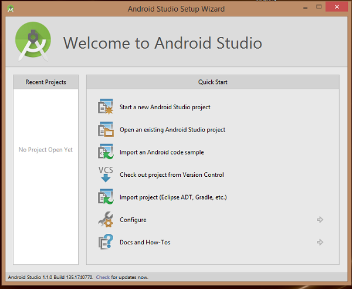
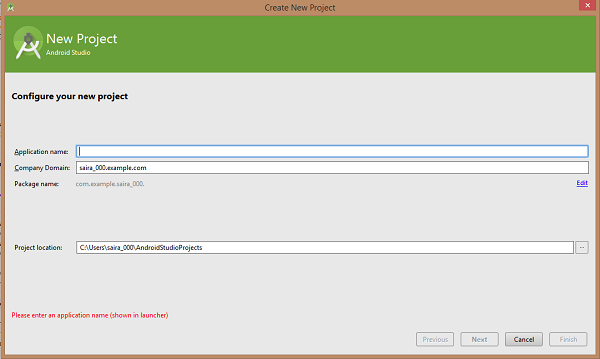
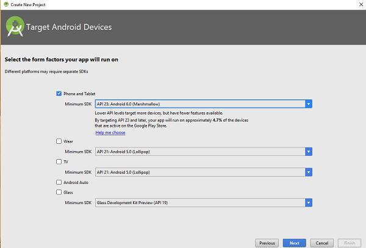
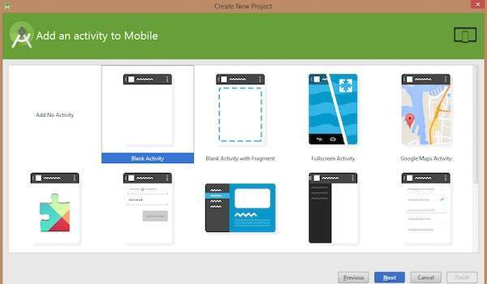
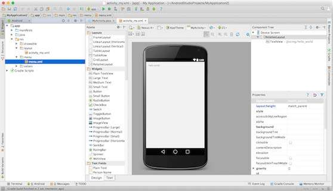
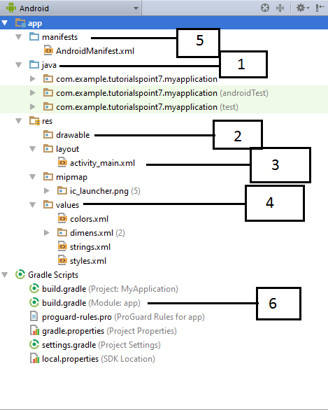

# Android - Hello World Example
Let us start actual programming with Android Framework. Before you start writing your first example using Android SDK, you have to make sure that you have set-up your Android development environment properly as explained in [Android - Environment Set-up](/android/android_environment_setup.htm)  tutorial. I also assume that you have a little bit working knowledge with Android studio.

So let us proceed to write a simple Android Application which will print "Hello World!".

## Create Android Application
The first step is to create a simple Android Application using Android studio. When you click on Android studio icon, it will show screen as shown below



You can start your application development by calling start a new android studio project. in a new installation frame should ask Application name, package information and location of the project.−



After entered application name, it going to be called select the form factors your application runs on, here need to specify Minimum SDK, in our tutorial, I have declared as API23: Android 6.0(Mashmallow) −



The next level of installation should contain selecting the activity to mobile, it specifies the default layout for Applications.



At the final stage it going to be open development tool to write the application code.



## Anatomy of Android Application
Before you run your app, you should be aware of a few directories and files in the Android project −



Following section will give a brief overview of the important application files.

## The Main Activity File
The main activity code is a Java file **MainActivity.java**. This is the actual application file which ultimately gets converted to a Dalvik executable and runs your application. Following is the default code generated by the application wizard for  application −

```
package com.example.helloworld;

import android.support.v7.app.AppCompatActivity;
import android.os.Bundle;

public class MainActivity extends AppCompatActivity {
   @Override
   protected void onCreate(Bundle savedInstanceState) {
      super.onCreate(savedInstanceState);
      setContentView(R.layout.activity_main);
   }
}
```
Here,  refers to the  file located in the  folder. The  method is one of many methods that are figured when an activity is loaded.

## The Manifest File
Whatever component you develop as a part of your application, you must declare all its components in a  which resides at the root of the application project directory. This file works as an interface between Android OS and your application, so if you do not declare your component in this file, then it will not be considered by the OS. For example, a default manifest file will look like as following file −

```
<?xml version="1.0" encoding="utf-8"?>
<manifest xmlns:android="http://schemas.android.com/apk/res/android"
    package="com.example.tutorialspoint7.myapplication">

   <application
      android:allowBackup="true"
      android:icon="@mipmap/ic_launcher"
      android:label="@string/app_name"
      android:supportsRtl="true"
      android:theme="@style/AppTheme">
      
      <activity android:name=".MainActivity">
         <intent-filter>
            <action android:name="android.intent.action.MAIN" />
            <category android:name="android.intent.category.LAUNCHER" />
         </intent-filter>
      </activity>
   </application>
</manifest>
```
Here &lt;application&gt;...&lt;/application&gt; tags enclosed the components related to the application. Attribute  will point to the application icon available under . The application uses the image named ic_launcher.png located in the drawable folders

The &lt;activity&gt; tag is used to specify an activity and  attribute specifies the fully qualified class name of the  subclass and the  attributes specifies a string to use as the label for the activity. You can specify multiple activities using &lt;activity&gt; tags.

The **action** for the intent filter is named  to indicate that this activity serves as the entry point for the application. The **category** for the intent-filter is named  to indicate that the application can be launched from the device's launcher icon.

The  refers to the  file explained below. Hence,  refers to the  string defined in the strings.xml file, which is "HelloWorld". Similar way, other strings get populated in the application.

Following is the list of tags which you will use in your manifest file to specify different Android application components −

   * &lt;activity&gt;elements for activities
   * &lt;service&gt; elements for services
   * &lt;receiver&gt; elements for broadcast receivers
   * &lt;provider&gt; elements for content providers

## The Strings File
The **strings.xml** file is located in the  folder and it contains all the text that your application uses. For example, the names of buttons, labels, default text, and similar types of strings go into this file. This file is responsible for their textual content. For example, a default strings file will look like as following file −

```
<resources>
   <string name="app_name">HelloWorld</string>
   <string name="hello_world">Hello world!</string>
   <string name="menu_settings">Settings</string>
   <string name="title_activity_main">MainActivity</string>
</resources>
```
## The Layout File
The **activity_main.xml** is a layout file available in  directory, that is referenced by your application when building its interface. You will modify this file very frequently to change the layout of your application. For your "Hello World!" application, this file will have following content related to default layout −

```
<RelativeLayout xmlns:android="http://schemas.android.com/apk/res/android"
   xmlns:tools="http://schemas.android.com/tools"
   android:layout_width="match_parent"
   android:layout_height="match_parent" >
   
   <TextView
      android:layout_width="wrap_content"
      android:layout_height="wrap_content"
      android:layout_centerHorizontal="true"
      android:layout_centerVertical="true"
      android:padding="@dimen/padding_medium"
      android:text="@string/hello_world"
      tools:context=".MainActivity" />
      
</RelativeLayout>
```
This is an example of simple  which we will study in a separate chapter. The  is an Android control used to build the GUI and it have various attributes like ,  etc which are being used to set its width and height etc.. The  refers to the strings.xml file located in the res/values folder. Hence, @string/hello_world refers to the hello string defined in the strings.xml file, which is "Hello World!".

## Running the Application
Let's try to run our **Hello World!** application we just created. I assume you had created your **AVD** while doing environment set-up. To run the app from Android studio, open one of your project's activity files and click Run  icon from the tool bar. Android studio installs the app on your AVD and starts it and if everything is fine with your set-up and application, it will display following Emulator window −


Congratulations!!! you have developed your first Android Application and now just keep following rest of the tutorial step by step to become a great Android Developer. All the very best.


[Previous Page](../android/android_application_components.md) [Next Page](../android/android_resources.md) 
