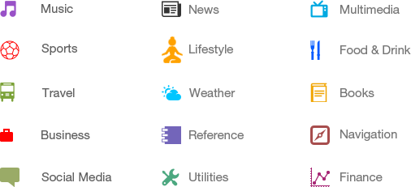
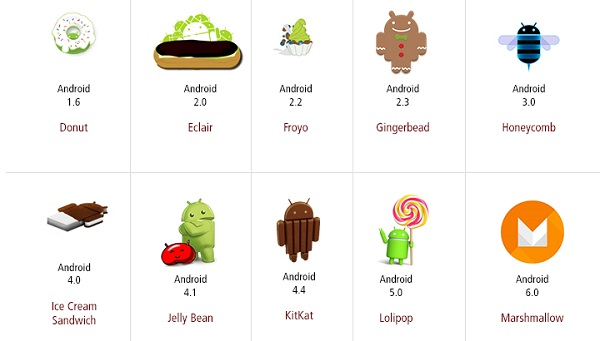

# Android - Overview
## What is Android?

Android is an open source and Linux-based **Operating System** for mobile devices such as smartphones and tablet computers. Android was developed by the , led by Google, and other companies.

Android offers a unified approach to application development for mobile devices which means developers need only develop for Android, and their applications should be able to run on different devices powered by Android.

The first beta version of the Android Software Development Kit (SDK) was released by Google in 2007 where as the first commercial version, Android 1.0, was released in September 2008.

On June 27, 2012, at the Google I/O conference, Google announced the next Android version, 4.1 **Jelly Bean**. Jelly Bean is an incremental update, with the primary aim of improving the user interface, both in terms of functionality and performance.

The source code for Android is available under free and open source software licenses. Google publishes most of the code under the Apache License version 2.0 and the rest, Linux kernel changes, under the GNU General Public License version 2.

## Why Android ?

## Features of Android
Android is a powerful operating system competing with Apple 4GS and supports great features. Few of them are listed below −

## Android Applications
Android applications are usually developed in the Java language using the Android Software Development Kit.

Once developed, Android applications can be packaged easily and sold out either through a store such as **Google Play**, **SlideME**, **Opera Mobile Store**, **Mobango**, **F-droid** and the **Amazon Appstore**.

Android powers hundreds of millions of mobile devices in more than 190 countries around the world. It's the largest installed base of any mobile platform and growing fast. Every day more than 1 million new Android devices are activated worldwide.

This tutorial has been written with an aim to teach you how to develop and package Android application. We will start from environment setup for Android application programming and then drill down to look into various aspects of Android applications.

## Categories of Android applications
There are many android applications in the market. The top categories are −

## History of Android
The code names of android ranges from A to N currently, such as Aestro, Blender, Cupcake, Donut, Eclair, Froyo, Gingerbread, Honeycomb, Ice Cream Sandwitch, Jelly Bean, KitKat, Lollipop and Marshmallow. Let's understand the android history in a sequence.

## What is API level?

[Previous Page](../android/index.md) [Next Page](../android/android_environment_setup.md) 
