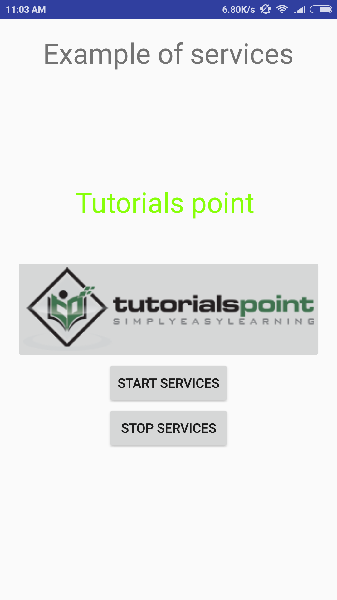
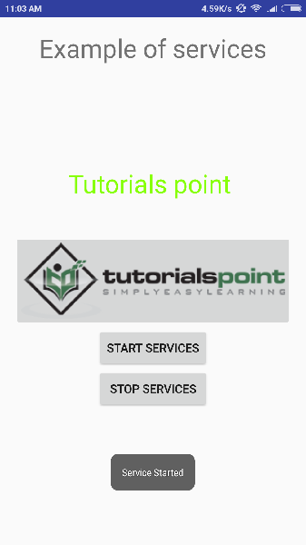

# Android - Services
A service has life cycle callback methods that you can implement to monitor changes in the service's state and you can perform work at the appropriate stage. The following diagram on the left shows the life cycle when the service is created with startService() and the diagram on the right shows the life cycle when the service is created with bindService(): 


To create an service, you create a Java class that extends the Service base class or one of its existing subclasses. The **Service** base class defines various callback methods and the most important are given below. You don't need to implement all the callbacks methods. However, it's important that you understand each one and implement those that ensure your app behaves the way users expect.

The following skeleton service demonstrates each of the life cycle methods −

```
package com.tutorialspoint;

import android.app.Service;
import android.os.IBinder;
import android.content.Intent;
import android.os.Bundle;

public class HelloService extends Service {
   
   /** indicates how to behave if the service is killed */
   int mStartMode;
   
   /** interface for clients that bind */
   IBinder mBinder;     
   
   /** indicates whether onRebind should be used */
   boolean mAllowRebind;

   /** Called when the service is being created. */
   @Override
   public void onCreate() {
     
   }

   /** The service is starting, due to a call to startService() */
   @Override
   public int onStartCommand(Intent intent, int flags, int startId) {
      return mStartMode;
   }

   /** A client is binding to the service with bindService() */
   @Override
   public IBinder onBind(Intent intent) {
      return mBinder;
   }

   /** Called when all clients have unbound with unbindService() */
   @Override
   public boolean onUnbind(Intent intent) {
      return mAllowRebind;
   }

   /** Called when a client is binding to the service with bindService()*/
   @Override
   public void onRebind(Intent intent) {

   }

   /** Called when The service is no longer used and is being destroyed */
   @Override
   public void onDestroy() {

   }
}
```
## Example
This example will take you through simple steps to show how to create your own Android Service. Follow the following steps to modify the Android application we created in  chapter −

Following is the content of the modified main activity file **MainActivity.java**. This file can include each of the fundamental life cycle methods. We have added  and  methods to start and stop the service.

```
package com.example.tutorialspoint7.myapplication;

import android.content.Intent;
import android.support.v7.app.AppCompatActivity;
import android.os.Bundle;

import android.os.Bundle;
import android.app.Activity;
import android.util.Log;
import android.view.View;

public class MainActivity extends Activity {
   String msg = "Android : ";

   /** Called when the activity is first created. */
   @Override
   public void onCreate(Bundle savedInstanceState) {
      super.onCreate(savedInstanceState);
      setContentView(R.layout.activity_main);
      Log.d(msg, "The onCreate() event");
   }

   public void startService(View view) {
      startService(new Intent(getBaseContext(), MyService.class));
   }

   // Method to stop the service
   public void stopService(View view) {
      stopService(new Intent(getBaseContext(), MyService.class));
   }
}
```
Following is the content of **MyService.java**. This file can have implementation of one or more methods associated with Service based on requirements. For now we are going to implement only two methods  and  −

```
package com.example.tutorialspoint7.myapplication;

import android.app.Service;
import android.content.Intent;
import android.os.IBinder;
import android.support.annotation.Nullable;
import android.widget.Toast;

/**
   * Created by TutorialsPoint7 on 8/23/2016.
*/

public class MyService extends Service {
   @Nullable
   @Override
   public IBinder onBind(Intent intent) {
      return null;
   }
	
   @Override
   public int onStartCommand(Intent intent, int flags, int startId) {
      // Let it continue running until it is stopped.
      Toast.makeText(this, "Service Started", Toast.LENGTH_LONG).show();
      return START_STICKY;
   }

   @Override
   public void onDestroy() {
      super.onDestroy();
      Toast.makeText(this, "Service Destroyed", Toast.LENGTH_LONG).show();
   }
}
```
Following will the modified content of  file. Here we have added &lt;service.../&gt; tag to include our service −

```
<?xml version="1.0" encoding="utf-8"?>
<manifest xmlns:android="http://schemas.android.com/apk/res/android"
   package="com.example.tutorialspoint7.myapplication">

   <application
      android:allowBackup="true"
      android:icon="@mipmap/ic_launcher"
      android:label="@string/app_name"
      android:supportsRtl="true"
      android:theme="@style/AppTheme">
		
      <activity android:name=".MainActivity">
         <intent-filter>
            <action android:name="android.intent.action.MAIN" />

            <category android:name="android.intent.category.LAUNCHER" />
         </intent-filter>
      </activity>
		
      <service android:name=".MyService" />
   </application>

</manifest>
```
Following will be the content of **res/layout/activity_main.xml** file to include two buttons −

```
<RelativeLayout xmlns:android="http://schemas.android.com/apk/res/android"
   xmlns:tools="http://schemas.android.com/tools" android:layout_width="match_parent"
   android:layout_height="match_parent" android:paddingLeft="@dimen/activity_horizontal_margin"
   android:paddingRight="@dimen/activity_horizontal_margin"
   android:paddingTop="@dimen/activity_vertical_margin"
   android:paddingBottom="@dimen/activity_vertical_margin" tools:context=".MainActivity">
   
   <TextView
      android:id="@+id/textView1"
      android:layout_width="wrap_content"
      android:layout_height="wrap_content"
      android:text="Example of services"
      android:layout_alignParentTop="true"
      android:layout_centerHorizontal="true"
      android:textSize="30dp" />
      
   <TextView
      android:id="@+id/textView2"
      android:layout_width="wrap_content"
      android:layout_height="wrap_content"
      android:text="Tutorials point "
      android:textColor="#ff87ff09"
      android:textSize="30dp"
      android:layout_above="@+id/imageButton"
      android:layout_centerHorizontal="true"
      android:layout_marginBottom="40dp" />

   <ImageButton
      android:layout_width="wrap_content"
      android:layout_height="wrap_content"
      android:id="@+id/imageButton"
      android:src="@drawable/abc"
      android:layout_centerVertical="true"
      android:layout_centerHorizontal="true" />

   <Button
      android:layout_width="wrap_content"
      android:layout_height="wrap_content"
      android:id="@+id/button2"
      android:text="Start Services"
      android:onClick="startService"
      android:layout_below="@+id/imageButton"
      android:layout_centerHorizontal="true" />

   <Button
      android:layout_width="wrap_content"
      android:layout_height="wrap_content"
      android:text="Stop Services"
      android:id="@+id/button"
      android:onClick="stopService"
      android:layout_below="@+id/button2"
      android:layout_alignLeft="@+id/button2"
      android:layout_alignStart="@+id/button2"
      android:layout_alignRight="@+id/button2"
      android:layout_alignEnd="@+id/button2" />

</RelativeLayout>
```
Let's try to run our modified **Hello World!** application we just modified. I assume you had created your **AVD** while doing environment setup. To run the app from Android studio, open one of your project's activity files and click Run  icon from the tool bar. Android Studio installs the app on your AVD and starts it and if everything is fine with your set-up and application, it will display following Emulator window −



Now to start your service, let's click on **Start Service** button, this will start the service and as per our programming in  method, a message  will appear on the bottom of the the simulator as follows −



To stop the service, you can click the Stop Service button.


[Previous Page](../android/android_acitivities.md) [Next Page](../android/android_broadcast_receivers.md) 
