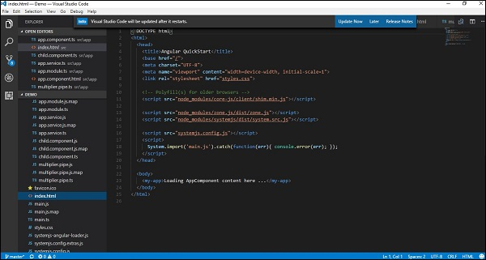
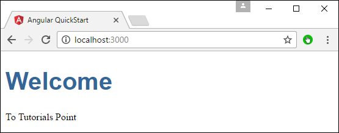

# Angular 2 - Components
Components are a logical piece of code for Angular JS application. A Component consists of the following −

   * **Template** − This is used to render the view for the application. This contains the HTML that needs to be rendered in the application. This part also includes the binding and directives.
   * **Class** − This is like a class defined in any language such as C. This contains properties and methods. This has the code which is used to support the view. It is defined in TypeScript.
   * **Metadata** − This has the extra data defined for the Angular class. It is defined with a decorator.

Let’s now go to the app.component.ts file and create our first Angular component.


Let’s add the following code to the file and look at each aspect in detail.

## Class
The class decorator. The class is defined in TypeScript. The class normally has the following syntax in TypeScript.

### Syntax
```
class classname {
   Propertyname: PropertyType = Value
}
```
### Parameters
   * **Classname** − This is the name to be given to the class.
   * **Propertyname** − This is the name to be given to the property.
   * **PropertyType** − Since TypeScript is strongly typed, you need to give a type to the property.
   * **Value** − This is the value to be given to the property.

### Example
```
export class AppComponent {
   appTitle: string = 'Welcome';
}
```
In the example, the following things need to be noted −

   * We are defining a class called AppComponent.
   * The export keyword is used so that the component can be used in other modules in the Angular JS application.
   * appTitle is the name of the property.
   * The property is given the type of string.
   * The property is given a value of ‘Welcome’.

## Template
This is the view which needs to be rendered in the application.

### Syntax
```
Template: '
   <HTML code>
   class properties
'
```
### Parameters
   * **HTML Code** − This is the HTML code which needs to be rendered in the application.
   * **Class properties** − These are the properties of the class which can be referenced in the template.

### Example
```
template: '
   <div>
      <h1>{{appTitle}}</h1>
      <div>To Tutorials Point</div>
   </div>
'
```
In the example, the following things need to be noted −

   * We are defining the HTML code which will be rendered in our application
   * We are also referencing the appTitle property from our class.

## Metadata
This is used to decorate Angular JS class with additional information.

Let’s take a look at the completed code with our class, template, and metadata.

### Example
```
import { Component } from '@angular/core';

@Component ({
   selector: 'my-app',
   template: ` <div>
      <h1>{{appTitle}}</h1>
      <div>To Tutorials Point</div>
   </div> `,
})

export class AppComponent {
   appTitle: string = 'Welcome';
}
```
In the above example, the following things need to be noted −

   * We are using the import keyword to import the ‘Component’ decorator from the angular/core module.
   * We are then using the decorator to define a component.
   * The component has a selector called ‘my-app’. This is nothing but our custom html tag which can be used in our main html page.

Now, let’s go to our index.html file in our code.



Let’s make sure that the body tag now contains a reference to our custom tag in the component. Thus in the above case, we need to make sure that the body tag contains the following code −

```
<body>
   <my-app></my-app>
</body>
```
### Output
Now if we go to the browser and see the output, we will see that the output is rendered as it is in the component.




[Previous Page](../angular2/angular2_architecture.md) [Next Page](../angular2/angular2_templates.md) 
