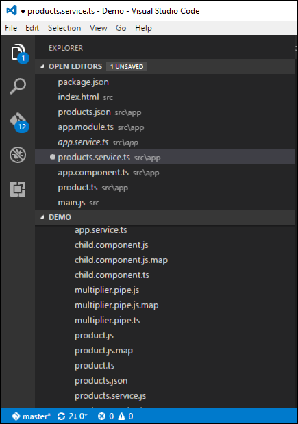
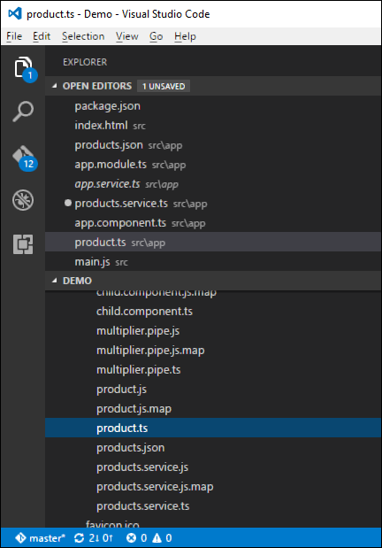
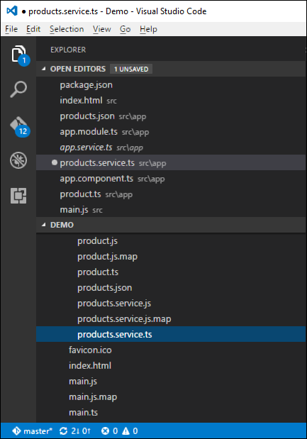

# Angular 2 - CRUD Operations Using HTTP
The basic CRUD operation we will look into this chapter is the reading of data from a web service using Angular 2.

## Example
In this example, we are going to define a data source which is a simple **json** file of products. Next, we are going to define a service which will be used to read the data from the **json** file. And then next, we will use this service in our main app.component.ts file.

**Step 1** − First let’s define our product.json file in Visual Studio code.



In the products.json file, enter the following text. This will be the data which will be taken from the Angular JS application.

```
[{
   "ProductID": 1,
   "ProductName": "ProductA"
},

{
   "ProductID": 2,
   "ProductName": "ProductB"
}]
```
**Step 2** − Define an interface which will be the class definition to store the information from our products.json file. Create a file called products.ts.



**Step 3** − Insert the following code in the file.

```
export interface IProduct {
   ProductID: number;
   ProductName: string;
}
```
The above interface has the definition for the ProductID and ProductName as properties for the interface.

**Step 4** − In the app.module.ts file include the following code −

```
import { NgModule }      from '@angular/core';
import { BrowserModule } from '@angular/platform-browser';
import { AppComponent }  from './app.component';
import { HttpModule } from '@angular/http';

@NgModule ({
   imports:      [ BrowserModule,HttpModule],
   declarations: [ AppComponent],
   bootstrap:    [ AppComponent ]
})
export class AppModule { }
```
**Step 5** − Define a products.service.ts file in Visual Studio code



**Step 6** − Insert the following code in the file.

```
import { Injectable } from '@angular/core';
import { Http , Response } from '@angular/http';
import { Observable } from 'rxjs/Observable';
import 'rxjs/add/operator/map';
import 'rxjs/add/operator/do';
import { IProduct } from './product';

@Injectable()
export class ProductService {
   private _producturl='app/products.json';
   constructor(private _http: Http){}
   
   getproducts(): Observable<IProduct[]> {
      return this._http.get(this._producturl)
      .map((response: Response) => <IProduct[]> response.json())
      .do(data => console.log(JSON.stringify(data)));
   }
}
```
Following points need to be noted about the above program.

   * The import {Http, Response} from '@angular/http' statement is used to ensure that the http function can be used to get the data from the products.json file.
   * The following statements are used to make use of the Reactive framework which can be used to create an Observable variable. The Observable framework is used to detect any changes in the http response which can then be sent back to the main application.

```
import { Observable } from 'rxjs/Observable';
import 'rxjs/add/operator/map';
import 'rxjs/add/operator/do';
```
   * The statement private _producturl = 'app/products.json' in the class is used to specify the location of our data source. It can also specify the location of web service if required.
   * Next, we define a variable of the type Http which will be used to get the response from the data source.
   * Once we get the data from the data source, we then use the JSON.stringify(data) command to send the data to the console in the browser.

**Step 7** − Now in the app.component.ts file, place the following code.

```
import { Component } from '@angular/core';
import { IProduct } from './product';
import { ProductService } from './products.service';
import { appService } from './app.service';
import { Http , Response } from '@angular/http';
import { Observable } from 'rxjs/Observable';
import 'rxjs/add/operator/map';

@Component ({
   selector: 'my-app',
   template: '<div>Hello</div>',
   providers: [ProductService]
})

export   class   AppComponent  {
   iproducts: IProduct[];
   constructor(private _product: ProductService) {
   }
   
   ngOnInit() : void {
      this._product.getproducts()
      .subscribe(iproducts => this.iproducts = iproducts);
   }
}
```
Here, the main thing in the code is the subscribe option which is used to listen to the Observable getproducts() function to listen for data from the data source.

Now save all the codes and run the application using **npm**. Go to the browser, we will see the following output.


In the Console, we will see the data being retrieved from products.json file.


[Previous Page](../angular2/angular2_data_binding.md) [Next Page](../angular2/angular2_error_handling.md) 
