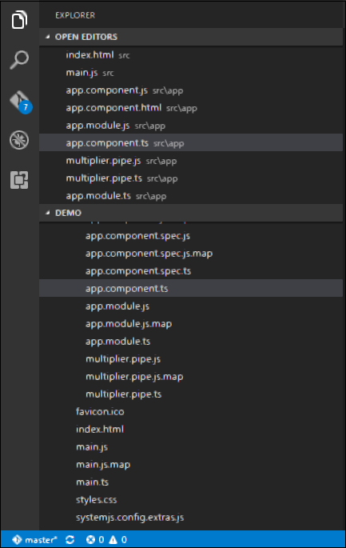
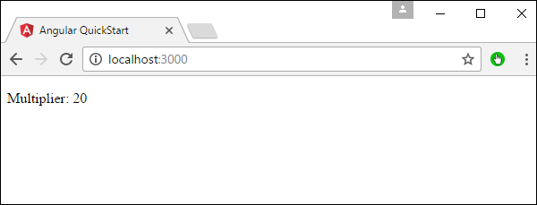

# Angular 2 - Custom Pipes
Angular 2 also has the facility to create custom pipes. The general way to define a custom pipe is as follows.

```
import { Pipe, PipeTransform } from '@angular/core';  
@Pipe({name: 'Pipename'}) 

export class Pipeclass implements PipeTransform { 
   transform(parameters): returntype { } 
}
```
Where,

   * **'Pipename'** − This is the name of the pipe.
   * **Pipeclass** − This is name of the class assigned to the custom pipe.
   * **Transform** − This is the function to work with the pipe.
   * **Parameters** − This are the parameters which are passed to the pipe.
   * **Returntype** − This is the return type of the pipe.

Let’s create a custom pipe that multiplies 2 numbers. We will then use that pipe in our component class.

**Step 1** − First, create a file called multiplier.pipe.ts.



**Step 2** − Place the following code in the above created file.

```
import { 
   Pipe, 
   PipeTransform 
} from '@angular/core';  

@Pipe ({ 
   name: 'Multiplier' 
}) 

export class MultiplierPipe implements PipeTransform { 
   transform(value: number, multiply: string): number { 
      let mul = parseFloat(multiply); 
      return mul * value 
   } 
}
```
Following points need to be noted about the above code.

   * We are first importing the Pipe and PipeTransform modules.
   * Then, we are creating a Pipe with the name 'Multiplier'.
   * Creating a class called MultiplierPipe that implements the PipeTransform module. 
   * The transform function will then take in the value and multiple parameter and output the multiplication of both numbers.

**Step 3** − In the app.component.ts file, place the following code.

```
import { 
   Component 
} from '@angular/core';  

@Component ({ 
   selector: 'my-app', 
   template: '<p>Multiplier: {{2 | Multiplier: 10}}</p>' 
}) 
export class AppComponent {  }
```
**Note** − In our template, we use our new custom pipe.

**Step 4** − Ensure the following code is placed in the app.module.ts file.

```
import {
   NgModule
} from '@angular/core';

import {
   BrowserModule
} from '@angular/platform-browser';

import {
   AppComponent
} from './app.component';

import {
   MultiplierPipe
} from './multiplier.pipe'

@NgModule ({
   imports: [BrowserModule],
   declarations: [AppComponent, MultiplierPipe],
   bootstrap: [AppComponent]
})

export class AppModule {}
```
Following things need to be noted about the above code.

   * We need to ensure to include our MultiplierPipe module.
   * We also need to ensure it is included in the declarations section.

Once you save all the code changes and refresh the browser, you will get the following output.




[Previous Page](../angular2/angular2_transforming_data.md) [Next Page](../angular2/angular2_user_input.md) 
