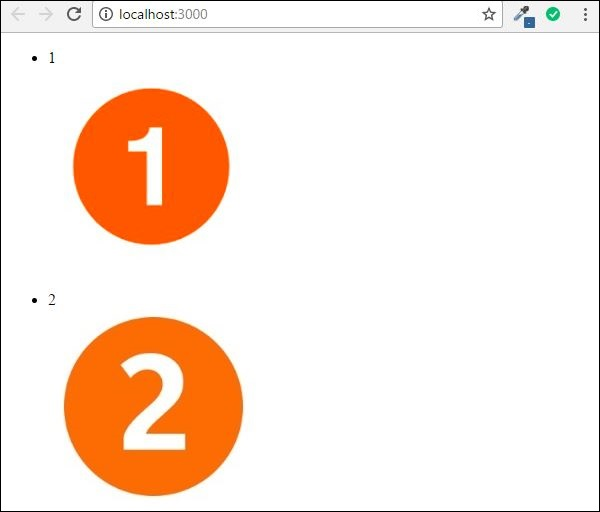

# Angular 2 - Data Binding
Two-way binding was a functionality in Angular JS, but has been removed from Angular 2.x onwards. But now, since the event of classes in Angular 2, we can bind to properties in AngularJS class.

Suppose if you had a class with a class name, a property which had a type and value.

```
export class className {
   property: propertytype = value;
}
```
You could then bind the property of an html tag to the property of the class.

```
<html tag htmlproperty = 'property'>
```
The value of the property would then be assigned to the htmlproperty of the html.

Let’s look at an example of how we can achieve data binding. In our example, we will look at displaying images wherein the images source will come from the properties in our class. Following are the steps to achieve this.

**Step 1** − Download any 2 images. For this example, we will download some simple images shown below.


**Step 2** − Store these images in a folder called **Images** in the app directory. If the images folder is not present, please create it.

**Step 3** − Add the following content in app.component.ts as shown below.

```
import { Component } from '@angular/core';

@Component ({
   selector: 'my-app',
   templateUrl: 'app/app.component.html'
})

export class AppComponent {
   appTitle: string = 'Welcome';
   appList: any[] = [ {
      "ID": "1",
      "url": 'app/Images/One.jpg'
   },

   {
      "ID": "2",
      "url": 'app/Images/Two.jpg'
   } ];
}
```
**Step 4** − Add the following content in app.component.html as shown below.

```
<div *ngFor = 'let lst of appList'>
   <ul>
      <li>{{lst.ID}}</li>
      
   </ul>
</div>
```
In the above app.component.html file, we are accessing the images from the properties in our class.

### Output
The output of the above program should be like this −




[Previous Page](../angular2/angular2_metadata.md) [Next Page](../angular2/angular2_crud_operations_using_http.md) 
