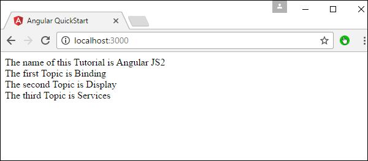
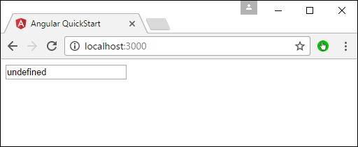
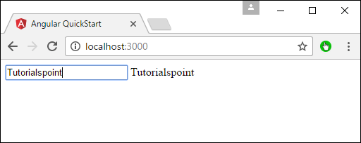

# Angular 2 - Data Display
In Angular JS, it very easy to display the value of the properties of the class in the HTML form.

Let’s take an example and understand more about Data Display. In our example, we will look at displaying the values of the various properties in our class in an HTML page.

**Step 1** − Change the code of the app.component.ts file to the following.

```
import {
   Component
} from '@angular/core';

@Component ({
   selector: 'my-app',
   templateUrl: 'app/app.component.html'
})

export class AppComponent {
   TutorialName: string = 'Angular JS2';
   appList: string[] = ["Binding", "Display", "Services"];
}
```
Following points need to be noted about the above code.

   * We are defining an array called appList which of the type string.
   * We are defining 3 string elements as part of the array which is Binding, Display, and Services.
   * We have also defined a property called TutorialName which has a value of Angular 2.

**Step 2** − Make the following changes to the app/app.component.html file which is your template file.

```
<div>
   The name of this Tutorial is {{TutorialName}}<br>
   The first Topic is {{appList[0]}}<br>
   The second Topic is {{appList[1]}}<br>
   The third Topic is {{appList[2]}}<br>
</div>
```
Following points need to be noted about the above code.

   * We are referencing the TutorialName property to tell “what is the name of the tutorial in our HTML page”.
   * We are using the index value for the array to display each of the 3 topics in our array.

**Step 3** − Save all the code changes and refresh the browser, you will get the below output. From the output, you can clearly see that the data is displayed as per the values of the properties in the class.



Another simple example, which is binding on the fly is the use of the input html tag. It just displays the data as the data is being typed in the html tag.

Make the following changes to the app/app.component.html file which is your template file.

```
<div>
   <input [value] = "name" (input) = "name = $event.target.value">
   {{name}}
</div>
```
Following points need to be noted about the above code.

   * **[value] = ”username”** − This is used to bind the expression username to the input element’s value property.
   * **(input) = ”expression”** − This a declarative way of binding an expression to the input element’s input event.
   * **username = $event.target.value** − The expression that gets executed when the input event is fired.
   * **$event** − An expression exposed in event bindings by Angular, which has the value of the event’s payload.

When you save all the code changes and refresh the browser, you will get the following output.



Now, type something in the Input box such as “Tutorialspoint”. The output will change accordingly.




[Previous Page](../angular2/angular2_third_party_controls.md) [Next Page](../angular2/angular2_handling_events.md) 
