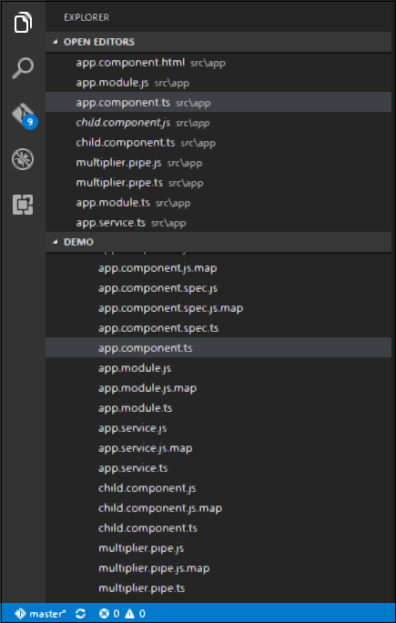
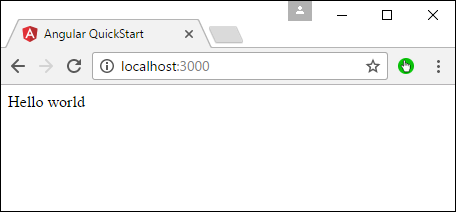

# Angular 2 - Dependency Injection
Dependency injection is the ability to add the functionality of components at runtime. Let’s take a look at an example and the steps used to implement dependency injection.

**Step 1** − Create a separate class which has the injectable decorator. The injectable decorator allows the functionality of this class to be injected and used in any Angular JS module.

```
@Injectable() 
   export class classname {  
}
```
**Step 2** − Next in your appComponent module or the module in which you want to use the service, you need to define it as a provider in the @Component decorator.

```
@Component ({  
   providers : [classname] 
})
```
Let’s look at an example on how to achieve this.

**Step 1** − Create a **ts** file for the service called app.service.ts.



**Step 2** − Place the following code in the file created above.

```
import { 
   Injectable 
} from '@angular/core'; 

@Injectable() 
export class appService {  
   getApp(): string { 
      return "Hello world"; 
   } 
}
```
The following points need to be noted about the above program.

   * The Injectable decorator is imported from the angular/core module.
   * We are creating a class called appService that is decorated with the Injectable decorator.
   * We are creating a simple function called getApp which returns a simple string called “Hello world”.

**Step 3** − In the app.component.ts file place the following code.

```
import { 
   Component 
} from '@angular/core';  

import { 
   appService 
} from './app.service';  

@Component({ 
   selector: 'my-app', 
   template: '<div>{{value}}</div>', 
   providers: [appService]  
}) 

export class AppComponent { 
   value: string = ""; 
   constructor(private _appService: appService) { } 
   ngOnInit(): void { 
      this.value = this._appService.getApp(); 
   }   
}
```
The following points need to be noted about the above program.

   * First, we are importing our appService module in the appComponent module.
   * Then, we are registering the service as a provider in this module.
   * In the constructor, we define a variable called _appService of the type appService so that it can be called anywhere in the appComponent module.
   * As an example, in the ngOnInit lifecyclehook, we called the getApp function of the service and assigned the output to the value property of the AppComponent class.

Save all the code changes and refresh the browser, you will get the following output.




[Previous Page](../angular2/angular2_cli.md) [Next Page](../angular2/angular2_advanced_configuration.md) 
