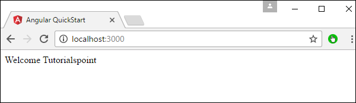
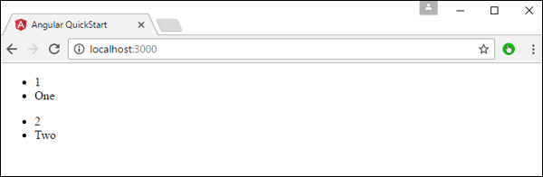

# Angular 2 - Directives
A **directive** is a custom HTML element that is used to extend the power of HTML. Angular 2 has the following directives that get called as part of the BrowserModule module.

   * ngif
   * ngFor

If you view the app.module.ts file, you will see the following code and the BrowserModule module defined. By defining this module, you will have access to the 2 directives.

```
import { NgModule }      from '@angular/core';
import { BrowserModule } from '@angular/platform-browser';
import { AppComponent }  from './app.component';

@NgModule ({
   imports:      [ BrowserModule ],
   declarations: [ AppComponent ],
   bootstrap:    [ AppComponent ]
})
export class AppModule { }
```
Now let’s look at each directive in detail.

## ngIf
The **ngif** element is used to add elements to the HTML code if it evaluates to true, else it will not add the elements to the HTML code.

### Syntax
```
*ngIf = 'expression'
```
If the expression evaluates to true then the corresponding gets added, else the elements are not added.

Let’s now take a look at an example of how we can use the *ngif directive.

**Step 1** − First add a property to the class named appStatus. This will be of type Boolean. Let’s keep this value as true.

```
import { Component } from '@angular/core';  

@Component ({
   selector: 'my-app',
   templateUrl: 'app/app.component.html'
})

export class AppComponent {
   appTitle: string = 'Welcome';
   appStatus: boolean = true;
}
```
**Step 2** − Now in the app.component.html file, add the following code.

```
<div *ngIf = 'appStatus'>{{appTitle}} Tutorialspoint </div>
```
In the above code, we now have the *ngIf directive. In the directive we are evaluating the value of the appStatus property. Since the value of the property should evaluate to true, it means the div tag should be displayed in the browser.

Once we add the above code, we will get the following output in the browser.

### Output


## ngFor
The **ngFor** element is used to elements based on the condition of the For loop.

### Syntax
```
*ngFor = 'let variable of variablelist'
```
The variable is a temporary variable to display the values in the **variablelist**.

Let’s now take a look at an example of how we can use the *ngFor directive.

**Step 1** − First add a property to the class named appList. This will be of the type which can be used to define any type of arrays.

```
import { Component } from '@angular/core';
 
@Component ({
   selector: 'my-app',
   templateUrl: 'app/app.component.html'
})

export class AppComponent {
   appTitle: string = 'Welcome';
   appList: any[] = [ {
      "ID": "1",
      "Name" : "One"
   },

   {
      "ID": "2",
      "Name" : "Two"
   } ];
}
```
Hence, we are defining the appList as an array which has 2 elements. Each element has 2 sub properties as ID and Name.

**Step 2** − In the app.component.html, define the following code.

```
<div *ngFor = 'let lst of appList'> 
   <ul> 
      <li>{{lst.ID}}</li> 
      <li>{{lst.Name}}</li> 
   </ul> 
</div>
```
In the above code, we are now using the ngFor directive to iterate through the appList array. We then define a list where each list item is the ID and name parameter of the array.

Once we add the above code, we will get the following output in the browser.

### Output



[Previous Page](../angular2/angular2_templates.md) [Next Page](../angular2/angular2_metadata.md) 
