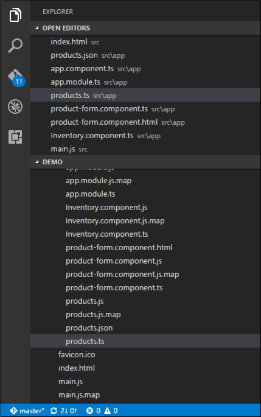
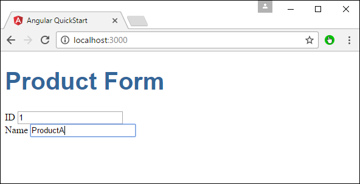

# Angular 2 - Forms
Angular 2 can also design forms which can use two-way binding using the **ngModel** directive. Let’s see how we can achieve this.

**Step 1** − Create a model which is a products model. Create a file called **products.ts** file.



**Step 2** − Place the following code in the file.

```
export class Product { 
   constructor ( 
      public productid: number, 
      public productname: string 
   ) {  } 
}
```
This is a simple class which has 2 properties, productid and productname.

**Step 3** − Create a product form component called product-form.component.ts component and add the following code −

```
import { Component } from '@angular/core';
import { Product } from './products';

@Component ({
   selector: 'product-form',
   templateUrl: './product-form.component.html'
})

export class ProductFormComponent {
   model = new Product(1,'ProductA');
}
```
The following points need to be noted about the above program.

   * Create an object of the Product class and add values to the productid and productname.
   * Use the templateUrl to specify the location of our product-form.component.html which will render the component.

**Step 4** − Create the actual form. Create a file called product-form.component.html and place the following code.

```
<div class = "container">
   <h1>Product Form</h1>
   <form>
      <div class = "form-group">
         <label for = "productid">ID</label>
         <input type = "text" class = "form-control" id = "productid" required
            [(ngModel)] = "model.productid" name = "id">
      </div>
      
      <div class = "form-group">
         <label for = "name">Name</label>
         <input type = "text" class = "form-control" id = "name"
            [(ngModel)] = "model.productname" name = "name">
      </div>
   </form>
</div>
```
The following point needs to be noted about the above program.

   * The **ngModel** directive is used to bind the object of the product to the separate elements on the form.

**Step 5** − Place the following code in the app.component.ts file.

```
import { Component } from '@angular/core';

@Component ({
   selector: 'my-app',
   template: '<product-form></product-form>'
})
export class AppComponent { }
```
**Step 6** − Place the below code in the app.module.ts file

```
import { NgModule } from '@angular/core';
import { BrowserModule } from '@angular/platform-browser';
import { AppComponent } from './app.component';
import { FormsModule } from '@angular/forms';
import { ProductFormComponent } from './product-form.component';

@NgModule ({
   imports: [ BrowserModule,FormsModule],
   declarations: [ AppComponent,ProductFormComponent],
   bootstrap: [ AppComponent ]
})
export class AppModule { }
```
**Step 7** − Save all the code and run the application using npm. Go to your browser, you will see the following output.




[Previous Page](../angular2/angular2_navigation.md) [Next Page](../angular2/angular2_cli.md) 
