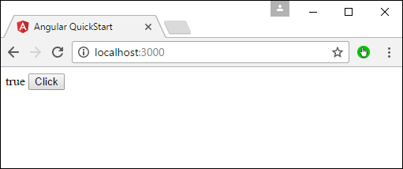
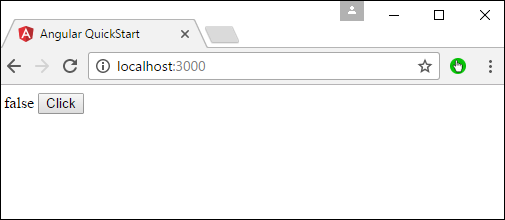

# Angular 2 - Handling Events
In Angular 2, events such as button click or any other sort of events can also be handled very easily. The events get triggered from the html page and are sent across to Angular JS class for further processing.

Let’s look at an example of how we can achieve event handling. In our example, we will look at displaying a click button and a status property. Initially, the status property will be true. When the button is clicked, the status property will then become false.

**Step 1** − Change the code of the app.component.ts file to the following.

```
import { 
   Component 
} from '@angular/core';  

@Component ({ 
   selector: 'my-app', 
   templateUrl: 'app/app.component.html' 
}) 

export class AppComponent { 
   Status: boolean = true; 
   clicked(event) { 
      this.Status = false; 
   } 
}
```
Following points need to be noted about the above code.

   * We are defining a variable called status of the type Boolean which is initially true.
   * Next, we are defining the clicked function which will be called whenever our button is clicked on our html page. In the function, we change the value of the Status property from true to false.

**Step 2** − Make the following changes to the app/app.component.html file, which is the template file.

```
<div> 
   {{Status}} 
   <button (click) = "clicked()">Click</button> 
</div>
```
Following points need to be noted about the above code.

   * We are first just displaying the value of the Status property of our class.
   * Then are defining the button html tag with the value of Click. We then ensure that the click event of the button gets triggered to the clicked event in our class.

**Step 3** − Save all the code changes and refresh the browser, you will get the following output.



**Step 4** − Click the Click button, you will get the following output.




[Previous Page](../angular2/angular2_data_display.md) [Next Page](../angular2/angular2_transforming_data.md) 
