# Angular 2 - Hello World
There are various ways to get started with your first Angular JS application.

   * One way is to do everything from scratch which is the most difficult and not the preferred way. Due to the many dependencies, it becomes difficult to get this setup.
   * Another way is to use the quick start at Angular Github. This contains the necessary code to get started. This is normally what is opted by all developers and this is what we will show for the Hello World application.
   * The final way is to use Angular CLI. We will discuss this in detail in a separate chapter.

Following are the steps to get a sample application up and running via github.

**Step 1** − Go the github url - [https://github.com/angular/quickstart](https://github.com/angular/quickstart) 

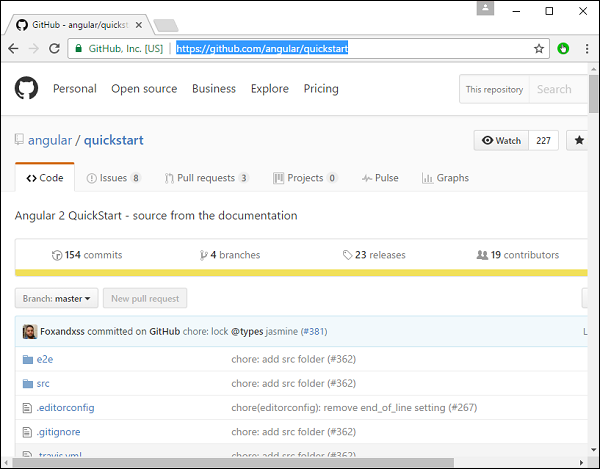

**Step 2** − Go to your command prompt, create a project directory. This can be an empty directory. In our example, we have created a directory called Project.

**Step 3** − Next, in the command prompt, go to this directory and issue the following command to clone the github repository on your local system. You can do this by issuing the following command −

```
git clone https://github.com/angular/quickstart Demo
```


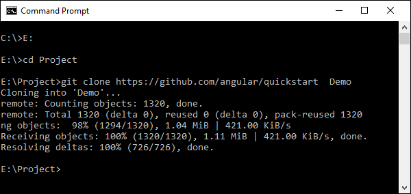

This will create a sample Angular JS application on your local machine.

**Step 4** − Open the code in Visual Studio code.

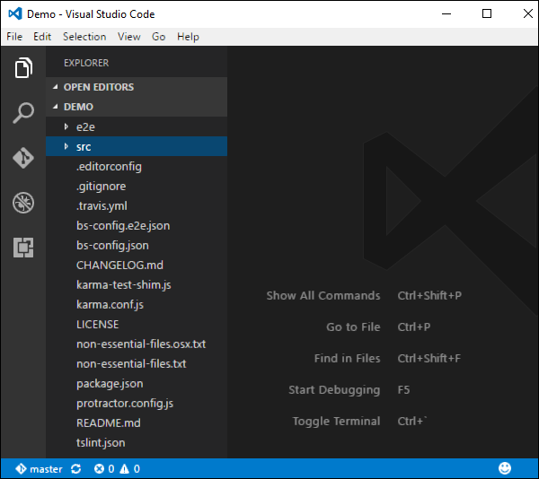

**Step 5** − Go to the command prompt and in your project folder again and issue the following command −

```
npm install
```
This will install all the necessary packages which are required for the Angular JS application to work.


Once done, you should see a tree structure with all dependencies installed.


**Step 6** − Go to the folder Demo → src → app → app.component.ts. Find the following lines of code −

```
import { Component } from '@angular/core';

@Component ({
   selector: 'my-app',
   template: `<h1>Hello {{name}}</h1>`,
})
export class AppComponent  { name = 'Angular'; }
```
And replace the Angular keyword with World as shown below −

```
import { Component } from '@angular/core';

@Component ({
   selector: 'my-app',
   template: `<h1>Hello {{name}}</h1>`,
})
export class AppComponent  { name = 'World'; }
```
There are other files that get created as part of the project creation for Angular 2 application. At the moment, you don’t need to bother about the other code files because these are all included as part of your Angular 2 application and don’t need to be changed for the Hello World application.

We will be discussing these files in the subsequent chapters in detail.

**Note** − Visual Studio Code will automatically compile all your files and create JavaScript files for all your typescript files.

**Step 7** − Now go to your command prompt and issue the command npm start. This will cause the Node package manager to start a lite web server and launch your Angular application.

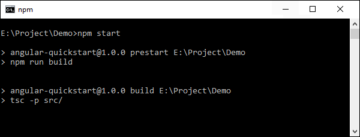


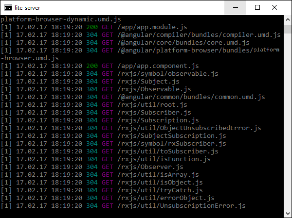

The Angular JS application will now launch in the browser and you will see “Hello World” in the browser as shown in the following screenshot.

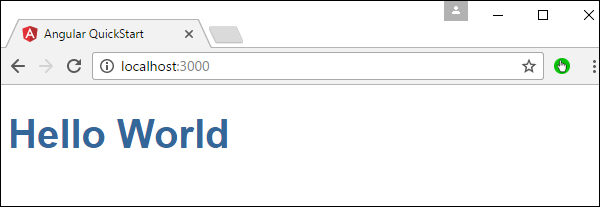

## Deployment
This topic focuses on the deployment of the above Hello world application. Since this is an Angular JS application, it can be deployed onto any platform. Your development can be on any platform.

In this case, it will be on Windows using Visual Studio code. Now let’s look at two deployment options.

## Deployment on NGNIX Servers on Windows
Note that you can use any web server on any platform to host Angular JS applications. In this case, we will take the example of NGNIX which is a popular web server.

**Step 1** − Download the NGNIX web server from the following url [http://nginx.org/en/download.html](https://nginx.org/en/download.html) 

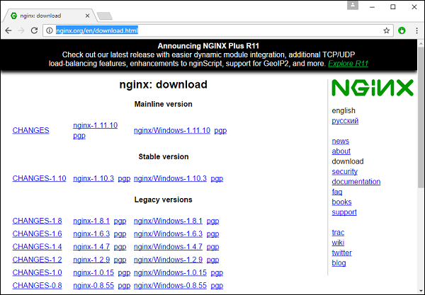

**Step 2** − After extracting the downloaded zip file, run the nginx exe component which will make the web server run in the background. You will then be able to go to the home page in the url – **http://localhost**

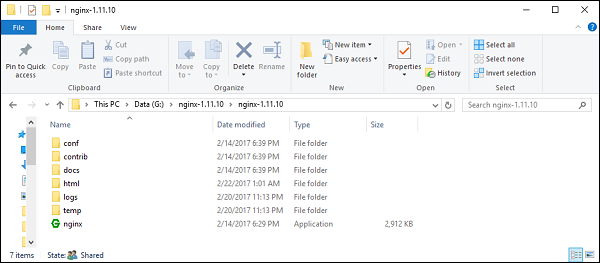

**Step 3** − Go to Angular JS project folder in Windows explorer.

**Step 4** − Copy the Project → Demo → node-modules folder.

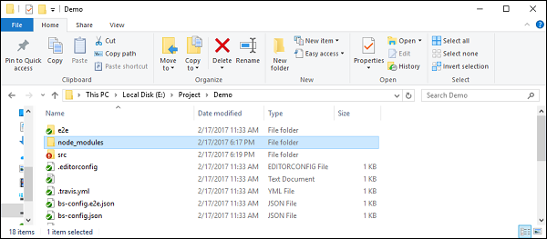

**Step 5** − Copy all the contents from the Project → Demo → src folder.

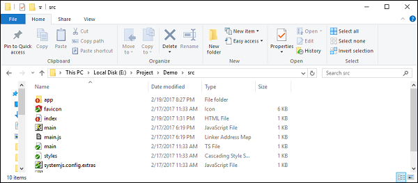

**Step 6** − Copy all contents to the nginx/html folder.

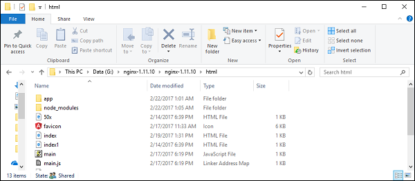

Now go to the URL − **http://localhost**, you will actually see the hello world application as shown in the following screenshot.

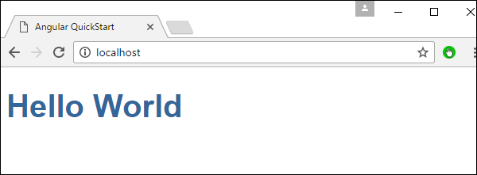

## Setting Up on Ubuntu
Now let’s see how to host the same hello world application onto an Ubuntu server.

**Step 1** − Issue the following commands on your Ubuntu server to install nginx.

```
apt-get update
```
The above command will ensure all the packages on the system are up to date.

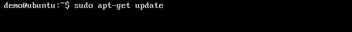

Once done, the system should be up to date.

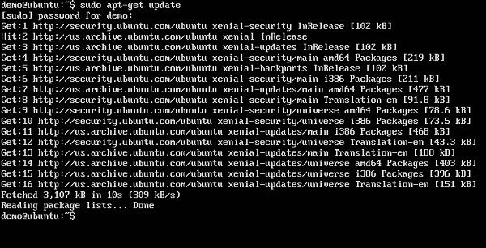

**Step 2** − Now, install GIT on the Ubuntu server by issuing the following command.

```
sudo apt-get install git
```


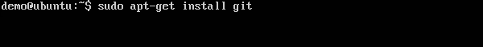

Once done, GIT will be installed on the system.

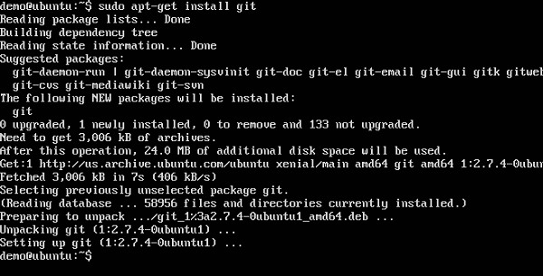

**Step 3** − To check the **git** version, issue the following command.

```
sudo git –version
```


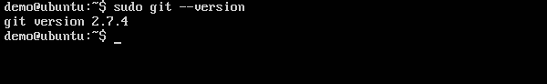

**Step 4** − Install **npm** which is the node package manager on Ubuntu. To do this, issue the following command.

```
sudo apt-get install npm
```


Once done, **npm** will be installed on the system.

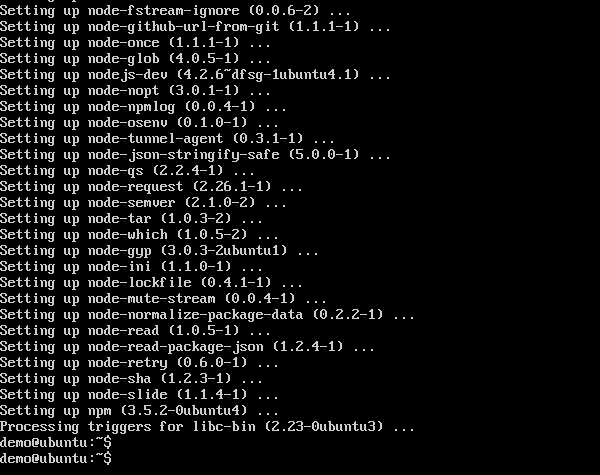

**Step 5** − To check the **npm** version, issue the following command.

```
sudo npm -version
```


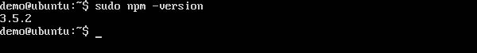

**Step 6** − Next, install **nodejs**. This can be done via the following command.

```
sudo npm install nodejs
```


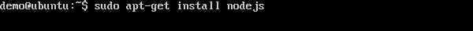

**Step 7** − To see the version of Node.js, just issue the following command.

```
sudo nodejs –version
```


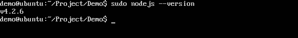

**Step 8** − Create a project folder and download the github starter project using the following git command.

```
git clone https://github.com/angular/quickstart Demo
```


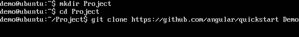

This will download all the files on the local system.

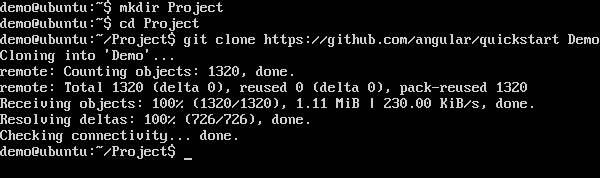

You can navigate through the folder to see the files have been successfully downloaded from github.


**Step 9** − Next issue the following command for npm.

```
npm install
```
This will install all the necessary packages which are required for Angular JS application to work.

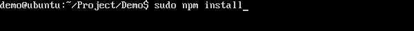

Once done, you will see all the dependencies installed on the system.

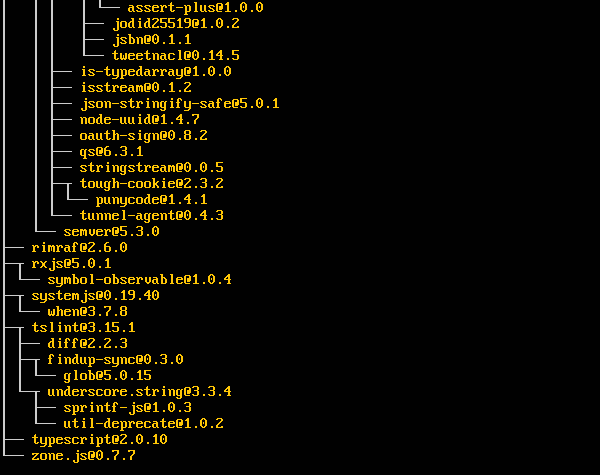

**Step 10** − Go to the folder Demo → src → app → app.component.ts. Use the vim editor if required. Find the following lines of code −

```
import { Component } from '@angular/core';  

@Component ({ 
   selector: 'my-app', 
   template: '<h1>Hello {{name}}</h1>'; 
}) 
export class AppComponent { name = 'Angular'; }
```
And replace the Angular keyword with World as shown in the following code.

```
import { Component } from '@angular/core';  

@Component ({ 
   selector: 'my-app', 
   template: '<h1>Hello {{name}}</h1>'; 
}) 
export class AppComponent { name = 'World'; }
```
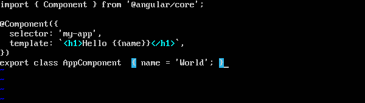

There are other files that get created as part of the project creation for Angular 2 application. At the moment, you don’t need to bother about the other code files because they are included as part of your Angular 2 application and don’t need to be changed for the Hello World application.

We will be discussing these files in the subsequent chapters in detail.

**Step 11** − Next, install the lite server which can be used to run the Angular 2 application. You can do this by issuing the following command −

```
sudo npm install –save-dev lite-server
```


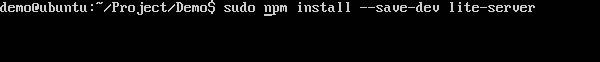

Once done, you will see the completion status. You don’t need to worry about the warnings.

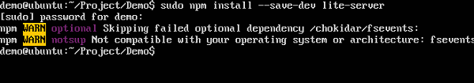

**Step 12** − Create a symbolic link to the node folder via the following command. This helps in ensuring the node package manager can locate the nodejs installation.

```
sudo ln -s /usr/bin/nodejs /usr/bin/node
```


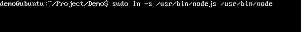

**Step 13** − Now it’s time to start Angular 2 Application via the npm start command. This will first build the files and then launch the Angular app in the lite server which was installed in the earlier step.

Issue the following command −

```
sudo npm start
```


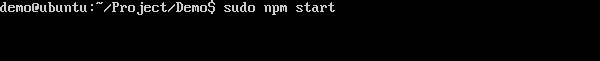

Once done, you will be presented with the URL.

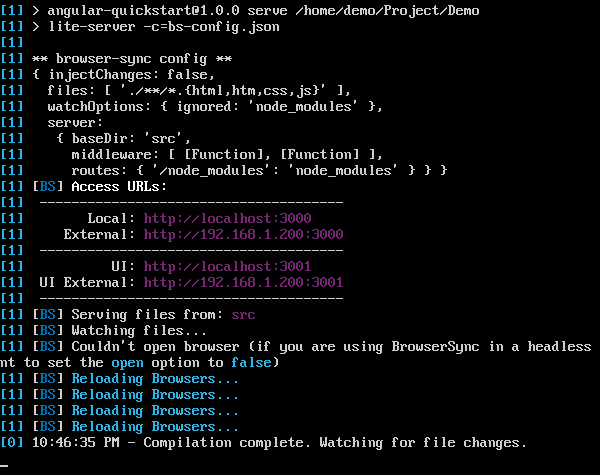

If you go to the URL, you will now see the Angular 2 app loading the browser.

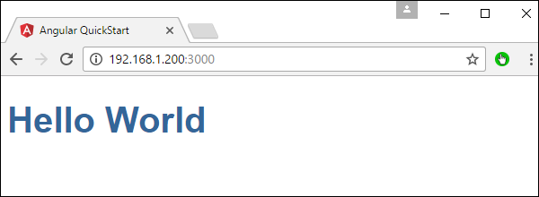

## Deploying nginx on Ubuntu
**Note** − You can use any web server on any platform to host Angular JS applications. In this case, we will take the example of NGNIX which is a popular web server.

**Step 1** − Issue the following command on your Ubuntu server to install nginx as a web server.

```
sudo apt-get update
```
This command will ensure all the packages on the system are up to date.

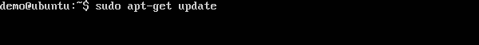

Once done, the system should be up to date.

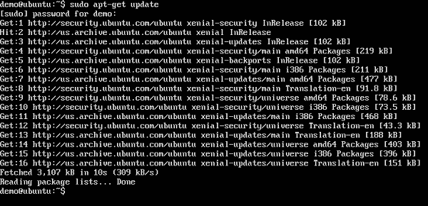

**Step 2** − Now issue the following command to install **nginx**.

```
apt-get install nginx
```


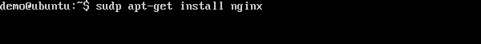

Once done, nginx will be running in the background.

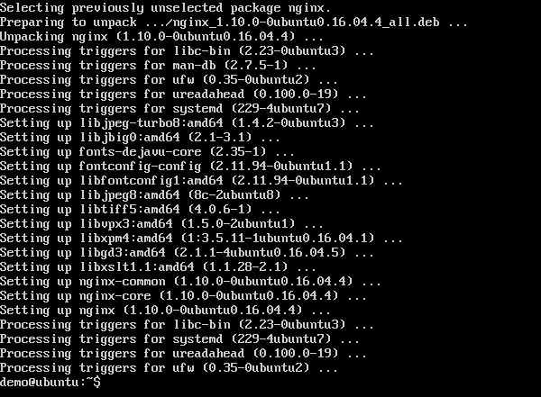

**Step 3** − Run the following command to confirm that the **nginx** services are running.

```
ps –ef | grep nginx
```


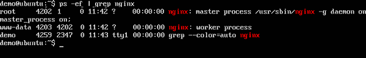

Now by default, the files for nginx are stored in /var/www/html folder. Hence, give the required permissions to copy your Hello World files to this location.

**Step 4** − Issue the following command.

```
sudo chmod 777 /var/www/html
```


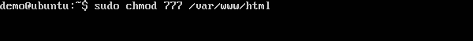

**Step 5** − Copy the files using any method to copy the project files to the /var/www/html folder.

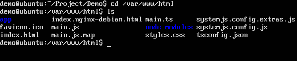

Now, if you browse to the URL − **http://192.168.1.200/index.html** you will find the Hello world Angular JS application.

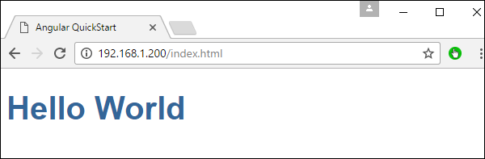


[Previous Page](../angular2/angular2_environment.md) [Next Page](../angular2/angular2_modules.md) 
