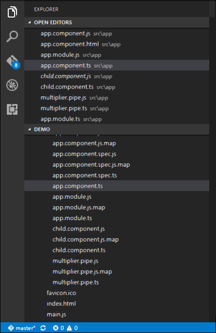

# Angular 2 - Nested Containers
In Angular JS, it is possible to nest containers inside each other. The outside container is known as the parent container and the inner one is known as the child container. Let’s look at an example on how to achieve this. Following are the steps.

**Step 1** − Create a **ts** file for the child container called **child.component.ts**.



**Step 2** − In the file created in the above step, place the following code.

```
import { 
   Component 
} from '@angular/core';  

@Component ({ 
   selector: 'child-app', 
   template: '<div> {{values}} </div> ' 
}) 

export class ChildComponent { 
   values = ''; 
   ngOnInit() { 
      this.values = "Hello"; 
   } 
}
```
The above code sets the value of the parameter this.values to “Hello”.

**Step 3** − In the app.component.ts file, place the following code.

```
import { 
   Component 
} from '@angular/core'; 

import { 
   ChildComponent 
} from './child.component'; 

@Component ({ 
   selector: 'my-app', 
   template: '<child-app></child-app> ' 
}) 

export class AppComponent { }
```
In the above code, notice that we are now calling the import statement to import the **child.component** module. Also we are calling the &lt;child-app&gt; selector from the child component to our main component.

**Step 4** − Next, we need to ensure the child component is also included in the app.module.ts file.

```
import { 
   NgModule 
} from '@angular/core'; 

import { 
   BrowserModule 
} from '@angular/platform-browser';  

import { 
   AppComponent 
} from './app.component';  

import { 
   MultiplierPipe 
} from './multiplier.pipe' 

import { 
   ChildComponent 
} from './child.component';  

@NgModule ({ 
   imports: [BrowserModule], 
   declarations: [AppComponent, MultiplierPipe, ChildComponent], 
   bootstrap: [AppComponent] 
}) 

export class AppModule {}
```
Once you save all the code changes and refresh the browser, you will get the following output.


[Previous Page](../angular2/angular2_lifecycle_hooks.md) [Next Page](../angular2/angular2_services.md) 
