# Angular 2 - Quick Guide
# Angular 2 - Overview
Angular JS is an open source framework built over JavaScript. It was built by the developers at Google. This framework was used to overcome obstacles encountered while working with Single Page applications. Also, testing was considered as a key aspect while building the framework. It was ensured that the framework could be easily tested. The initial release of the framework was in October 2010.

## Features of Angular 2
Following are the key features of Angular 2 −

   * **Components** − The earlier version of Angular had a focus of Controllers but now has changed the focus to having components over controllers. Components help to build the applications into many modules. This helps in better maintaining the application over a period of time.
   * **TypeScript** − The newer version of Angular is based on TypeScript. This is a superset of JavaScript and is maintained by Microsoft.
   * **Services** − Services are a set of code that can be shared by different components of an application. So for example if you had a data component that picked data from a database, you could have it as a shared service that could be used across multiple applications.

In addition, Angular 2 has better event-handling capabilities, powerful templates, and better support for mobile devices.

## Components of Angular 2
Angular 2 has the following components −

   * **Modules** − This is used to break up the application into logical pieces of code. Each piece of code or module is designed to perform a single task.
   * **Component** − This can be used to bring the modules together.
   * **Templates** − This is used to define the views of an Angular JS application.
   * **Metadata** − This can be used to add more data to an Angular JS class.
   * **Service** − This is used to create components which can be shared across the entire application.

We will discuss all these components in detail in the subsequent chapters of this tutorial.

The official site for Angular is [https://angular.io/](https://angular.io/)  The site has all information and documentation about Angular 2.


# Angular 2 - Environment
To start working with Angular 2, you need to get the following key components installed.

   * **Npm** − This is known as the node package manager that is used to work with the open source repositories. Angular JS as a framework has dependencies on other components. And **npm** can be used to download these dependencies and attach them to your project.
   * **Git** − This is the source code software that can be used to get the sample application from the **github** angular site.
   * **Editor** − There are many editors that can be used for Angular JS development such as Visual Studio code and WebStorm. In our tutorial, we will use Visual Studio code which comes free of cost from Microsoft.

## npm Installation
Let�s now look at the steps to get npm installed. The official site for npm is [https://www.npmjs.com/](https://www.npmjs.com/) 

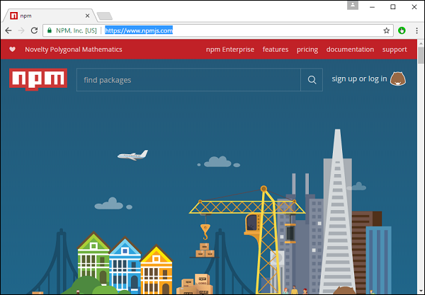

**Step 1** − Go to the �get started with npm� section in the site.

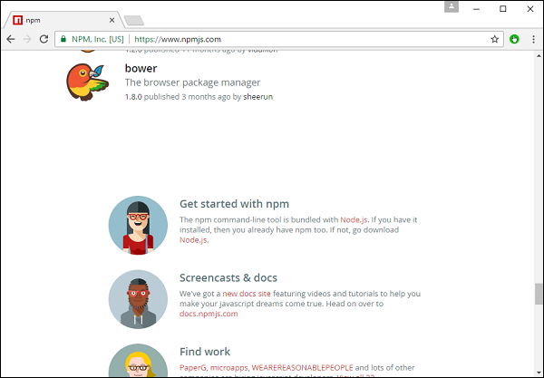

**Step 2** − In the next screen, choose the installer to download, depending on the operating system. For the purpose of this exercise, download the Windows 64 bit version.

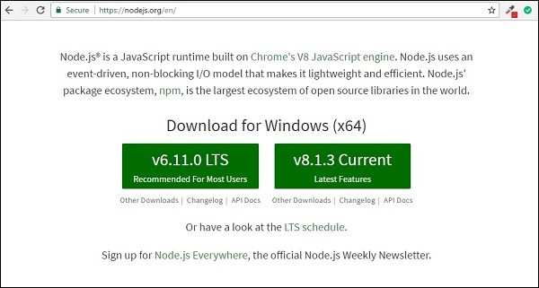

**Step 3** − Launch the installer. In the initial screen, click the Next button.

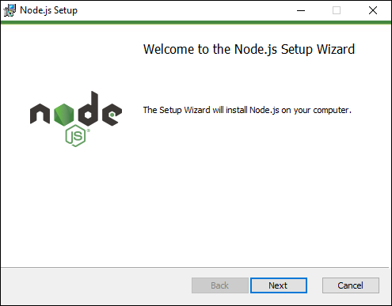

**Step 4** − In the next screen, Accept the license agreement and click the next button.

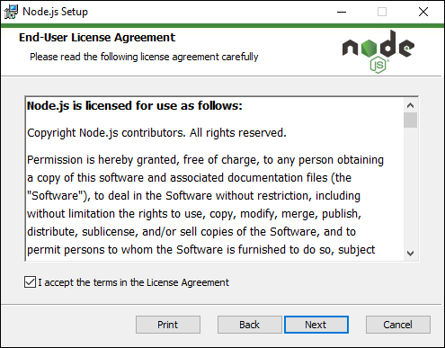

**Step 5** − In the next screen, choose the destination folder for the installation and click the Next button.

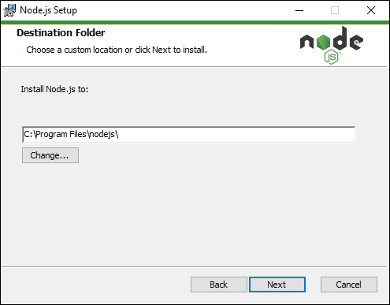

**Step 6** − Choose the components in the next screen and click the Next button. You can accept all the components for the default installation.

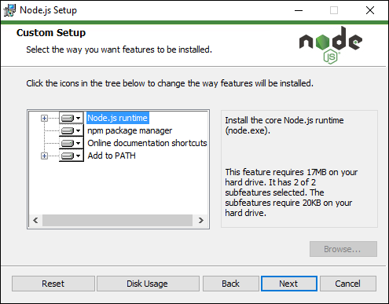

**Step 7** − In the next screen, click the Install button.

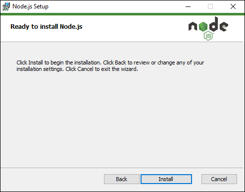

**Step 8** − Once the installation is complete, click the Finish button.


**Step 9** − To confirm the installation, in the command prompt you can issue the command npm version. You will get the version number of npm as shown in the following screenshot.

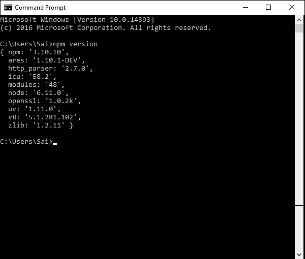

## Installation of Visual Studio Code
Following are the features of Visual Studio Code −

   * Light editor when compared to the actual version of Visual Studio.
   * Can be used for coding languages such as Clojure, Java, Objective-C and many other languages.
   * Built-in Git extension.
   * Built-in IntelliSense feature.
   * Many more extensions for development.

The official site for Visual Studio code is [https://code.visualstudio.com/](https://code.visualstudio.com/) 

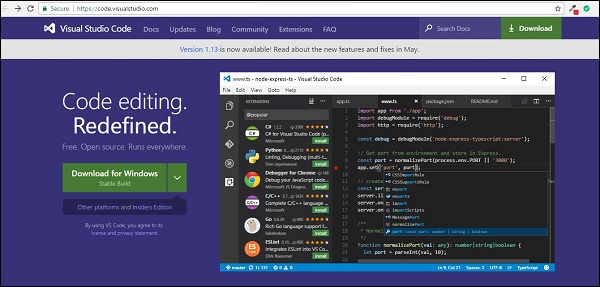

**Step 1** − After the download is complete, please follow the installation steps. In the initial screen, click the Next button.

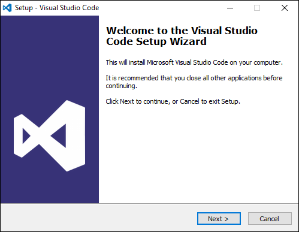

**Step 2** − In the next screen, accept the license agreement and click the Next button.

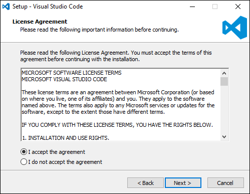

**Step 3** − In the next screen, choose the destination location for the installation and click the next button.

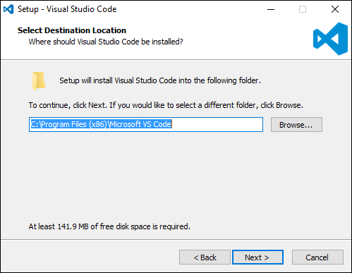

**Step 4** − Choose the name of the program shortcut and click the Next button.

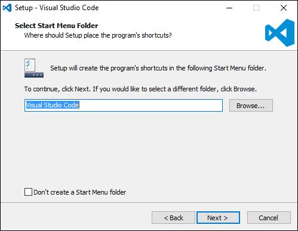

**Step 5** − Accept the default settings and click the Next button.

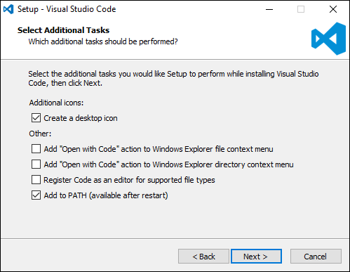

**Step 6** − Click the Install button in the next screen.

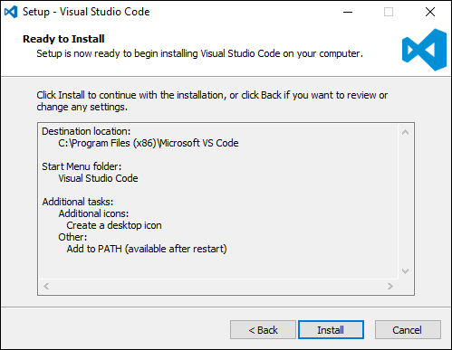

**Step 7** − In the final screen, click the Finish button to launch Visual Studio Code.

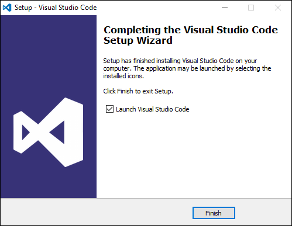

## Installing Git
Some of the key features of Git are −

   * Easy branching and merging of code.
   * Provision to use many techniques for the flow of code within Git.
   * Git is very fast when compared with other SCM tools.
   * Offers better data assurance.
   * Free and open source.

The official site for Git is [https://git-scm.com/](https://git-scm.com/) 


**Step 1** − After the download is complete, please follow the installation steps. In the initial screen, click the Next button.

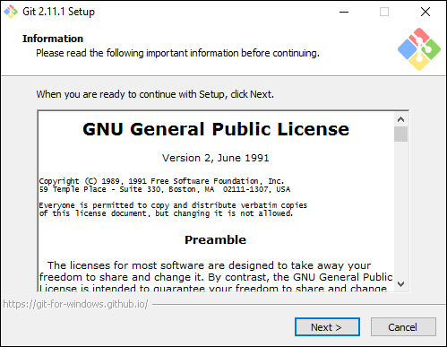

**Step 2** − Choose the components which needs to be installed. You can accept the default components.

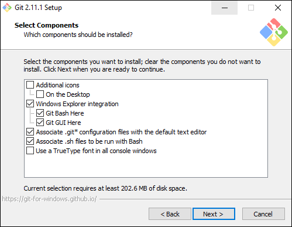

**Step 3** − In the next step, choose the program shortcut name and click the Next button.

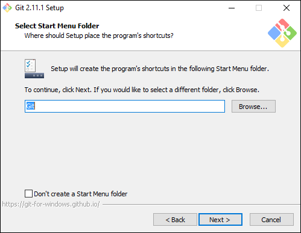

**Step 4** − Accept the default SSH executable and click the Next button.

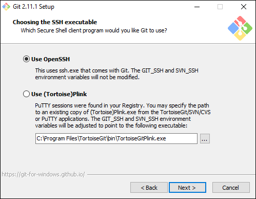

**Step 5** − Accept the default setting of �Checkout Windows style, commit Unix style endings� and click the Next button.

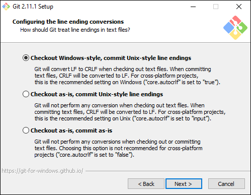

**Step 6** − Now, accept the default setting of the terminal emulator and click the Next button.

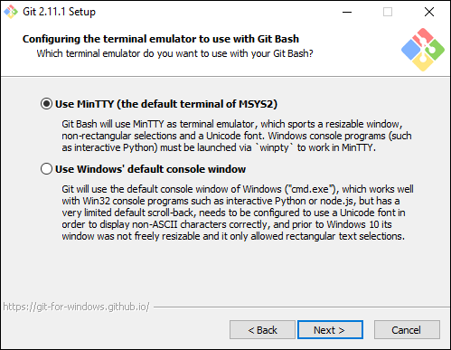

**Step 7** − Accept the default settings and click the Next button.

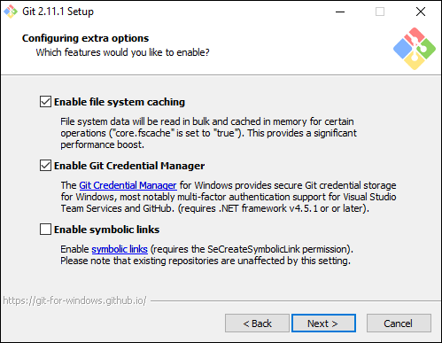

**Step 8** − You can skip the experimental options and click the Install button.

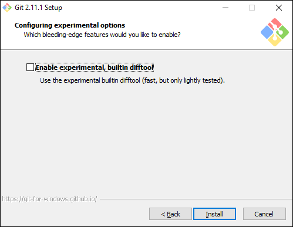

**Step 9** − In the final screen, click the Finish button to complete the installation.

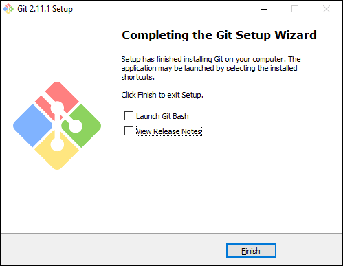

# Angular 2 - Hello World
There are various ways to get started with your first Angular JS application.

   * One way is to do everything from scratch which is the most difficult and not the preferred way. Due to the many dependencies, it becomes difficult to get this setup.
   * Another way is to use the quick start at Angular Github. This contains the necessary code to get started. This is normally what is opted by all developers and this is what we will show for the Hello World application.
   * The final way is to use Angular CLI. We will discuss this in detail in a separate chapter.

Following are the steps to get a sample application up and running via github.

**Step 1** − Go the github url - [https://github.com/angular/quickstart](https://github.com/angular/quickstart) 


**Step 2** − Go to your command prompt, create a project directory. This can be an empty directory. In our example, we have created a directory called Project.

**Step 3** − Next, in the command prompt, go to this directory and issue the following command to clone the github repository on your local system. You can do this by issuing the following command −

```
git clone https://github.com/angular/quickstart Demo
```


This will create a sample Angular JS application on your local machine.

**Step 4** − Open the code in Visual Studio code.


**Step 5** − Go to the command prompt and in your project folder again and issue the following command −

```
npm install
```
This will install all the necessary packages which are required for the Angular JS application to work.


Once done, you should see a tree structure with all dependencies installed.


**Step 6** − Go to the folder Demo → src → app → app.component.ts. Find the following lines of code −

```
import { Component } from '@angular/core';

@Component ({
   selector: 'my-app',
   template: `<h1>Hello {{name}}</h1>`,
})
export class AppComponent  { name = 'Angular'; }
```
And replace the Angular keyword with World as shown below −

```
import { Component } from '@angular/core';

@Component ({
   selector: 'my-app',
   template: `<h1>Hello {{name}}</h1>`,
})
export class AppComponent  { name = 'World'; }
```
There are other files that get created as part of the project creation for Angular 2 application. At the moment, you don�t need to bother about the other code files because these are all included as part of your Angular 2 application and don�t need to be changed for the Hello World application.

We will be discussing these files in the subsequent chapters in detail.

**Note** − Visual Studio Code will automatically compile all your files and create JavaScript files for all your typescript files.

**Step 7** − Now go to your command prompt and issue the command npm start. This will cause the Node package manager to start a lite web server and launch your Angular application.


The Angular JS application will now launch in the browser and you will see �Hello World� in the browser as shown in the following screenshot.


## Deployment
This topic focuses on the deployment of the above Hello world application. Since this is an Angular JS application, it can be deployed onto any platform. Your development can be on any platform.

In this case, it will be on Windows using Visual Studio code. Now let�s look at two deployment options.

## Deployment on NGNIX Servers on Windows
Note that you can use any web server on any platform to host Angular JS applications. In this case, we will take the example of NGNIX which is a popular web server.

**Step 1** − Download the NGNIX web server from the following url [http://nginx.org/en/download.html](https://nginx.org/en/download.html) 


**Step 2** − After extracting the downloaded zip file, run the nginx exe component which will make the web server run in the background. You will then be able to go to the home page in the url � **http://localhost**


**Step 3** − Go to Angular JS project folder in Windows explorer.

**Step 4** − Copy the Project → Demo → node-modules folder.


**Step 5** − Copy all the contents from the Project → Demo → src folder.


**Step 6** − Copy all contents to the nginx/html folder.


Now go to the URL − **http://localhost**, you will actually see the hello world application as shown in the following screenshot.


## Setting Up on Ubuntu
Now let�s see how to host the same hello world application onto an Ubuntu server.

**Step 1** − Issue the following commands on your Ubuntu server to install nginx.

```
apt-get update
```
The above command will ensure all the packages on the system are up to date.


Once done, the system should be up to date.


**Step 2** − Now, install GIT on the Ubuntu server by issuing the following command.

```
sudo apt-get install git
```


Once done, GIT will be installed on the system.


**Step 3** − To check the **git** version, issue the following command.

```
sudo git �version
```


**Step 4** − Install **npm** which is the node package manager on Ubuntu. To do this, issue the following command.

```
sudo apt-get install npm
```


Once done, **npm** will be installed on the system.


**Step 5** − To check the **npm** version, issue the following command.

```
sudo npm -version
```


**Step 6** − Next, install **nodejs**. This can be done via the following command.

```
sudo npm install nodejs
```


**Step 7** − To see the version of Node.js, just issue the following command.

```
sudo nodejs �version
```


**Step 8** − Create a project folder and download the github starter project using the following git command.

```
git clone https://github.com/angular/quickstart Demo
```


This will download all the files on the local system.


You can navigate through the folder to see the files have been successfully downloaded from github.


**Step 9** − Next issue the following command for npm.

```
npm install
```
This will install all the necessary packages which are required for Angular JS application to work.


Once done, you will see all the dependencies installed on the system.


**Step 10** − Go to the folder Demo → src → app → app.component.ts. Use the vim editor if required. Find the following lines of code −

```
import { Component } from '@angular/core';  

@Component ({ 
   selector: 'my-app', 
   template: '<h1>Hello {{name}}</h1>'; 
}) 
export class AppComponent { name = 'Angular'; }
```
And replace the Angular keyword with World as shown in the following code.

```
import { Component } from '@angular/core';  

@Component ({ 
   selector: 'my-app', 
   template: '<h1>Hello {{name}}</h1>'; 
}) 
export class AppComponent { name = 'World'; }
```


There are other files that get created as part of the project creation for Angular 2 application. At the moment, you don�t need to bother about the other code files because they are included as part of your Angular 2 application and don�t need to be changed for the Hello World application.

We will be discussing these files in the subsequent chapters in detail.

**Step 11** − Next, install the lite server which can be used to run the Angular 2 application. You can do this by issuing the following command −

```
sudo npm install �save-dev lite-server
```


Once done, you will see the completion status. You don�t need to worry about the warnings.


**Step 12** − Create a symbolic link to the node folder via the following command. This helps in ensuring the node package manager can locate the nodejs installation.

```
sudo ln -s /usr/bin/nodejs /usr/bin/node
```


**Step 13** − Now it�s time to start Angular 2 Application via the npm start command. This will first build the files and then launch the Angular app in the lite server which was installed in the earlier step.

Issue the following command −

```
sudo npm start
```


Once done, you will be presented with the URL.


If you go to the URL, you will now see the Angular 2 app loading the browser.


## Deploying nginx on Ubuntu
**Note** − You can use any web server on any platform to host Angular JS applications. In this case, we will take the example of NGNIX which is a popular web server.

**Step 1** − Issue the following command on your Ubuntu server to install nginx as a web server.

```
sudo apt-get update
```
This command will ensure all the packages on the system are up to date.


Once done, the system should be up to date.


**Step 2** − Now issue the following command to install **nginx**.

```
apt-get install nginx
```


Once done, nginx will be running in the background.


**Step 3** − Run the following command to confirm that the **nginx** services are running.

```
ps �ef | grep nginx
```


Now by default, the files for nginx are stored in /var/www/html folder. Hence, give the required permissions to copy your Hello World files to this location.

**Step 4** − Issue the following command.

```
sudo chmod 777 /var/www/html
```


**Step 5** − Copy the files using any method to copy the project files to the /var/www/html folder.


Now, if you browse to the URL − **http://192.168.1.200/index.html** you will find the Hello world Angular JS application.


# Angular 2 - Modules
Modules are used in Angular JS to put logical boundaries in your application. Hence, instead of coding everything into one application, you can instead build everything into separate modules to separate the functionality of your application. Let�s inspect the code which gets added to the demo application.

In Visual Studio code, go to the app.module.ts folder in your app folder. This is known as the root module class.


The following code will be present in the **app.module.ts** file.

```
import { NgModule }      from '@angular/core'; 
import { BrowserModule } from '@angular/platform-browser';  
import { AppComponent }  from './app.component';  

@NgModule ({ 
   imports:      [ BrowserModule ], 
   declarations: [ AppComponent ], 
   bootstrap:    [ AppComponent ] 
}) 
export class AppModule { }
```
Let�s go through each line of the code in detail.

   * The import statement is used to import functionality from the existing modules. Thus, the first 3 statements are used to import the NgModule, BrowserModule and AppComponent modules into this module.
   * The NgModule decorator is used to later on define the imports, declarations, and bootstrapping options.
   * The BrowserModule is required by default for any web based angular application.
   * The bootstrap option tells Angular which Component to bootstrap in the application.

A module is made up of the following parts −

   * **Bootstrap array** − This is used to tell Angular JS which components need to be loaded so that its functionality can be accessed in the application. Once you include the component in the bootstrap array, you need to declare them so that they can be used across other components in the Angular JS application.
   * **Export array** − This is used to export components, directives, and pipes which can then be used in other modules.
   * **Import array** − Just like the export array, the import array can be used to import the functionality from other Angular JS modules.

# Angular 2 - Architecture
The following screenshot shows the anatomy of an Angular 2 application. Each application consists of Components. Each component is a logical boundary of functionality for the application. You need to have layered services, which are used to share the functionality across components.


Following is the anatomy of a Component. A component consists of −

   * **Class** − This is like a C++ or Java class which consists of properties and methods.
   * **Metadata** − This is used to decorate the class and extend the functionality of the class.
   * **Template** − This is used to define the HTML view which is displayed in the application.


Following is an example of a component.

```
import { Component } from '@angular/core';

@Component ({ 
   selector: 'my-app', 
   templateUrl: 'app/app.component.html' 
}) 

export class AppComponent { 
   appTitle: string = 'Welcome';
}
```
Each application is made up of modules. Each Angular 2 application needs to have one Angular Root Module. Each Angular Root module can then have multiple components to separate the functionality.


Following is an example of a root module.

```
import { NgModule }      from '@angular/core'; 
import { BrowserModule } from '@angular/platform-browser'; 
import { AppComponent }  from './app.component';  

@NgModule ({ 
   imports:      [ BrowserModule ], 
   declarations: [ AppComponent ], 
   bootstrap:    [ AppComponent ] 
}) 
export class AppModule { }
```
Each application is made up of feature modules where each module has a separate feature of the application. Each Angular feature module can then have multiple components to separate the functionality.


# Angular 2 - Components
Components are a logical piece of code for Angular JS application. A Component consists of the following −

   * **Template** − This is used to render the view for the application. This contains the HTML that needs to be rendered in the application. This part also includes the binding and directives.
   * **Class** − This is like a class defined in any language such as C. This contains properties and methods. This has the code which is used to support the view. It is defined in TypeScript.
   * **Metadata** − This has the extra data defined for the Angular class. It is defined with a decorator.

Let�s now go to the app.component.ts file and create our first Angular component.


Let�s add the following code to the file and look at each aspect in detail.

## Class
The class decorator. The class is defined in TypeScript. The class normally has the following syntax in TypeScript.

### Syntax
```
class classname {
   Propertyname: PropertyType = Value
}
```
### Parameters
   * **Classname** − This is the name to be given to the class.
   * **Propertyname** − This is the name to be given to the property.
   * **PropertyType** − Since TypeScript is strongly typed, you need to give a type to the property.
   * **Value** − This is the value to be given to the property.

### Example
```
export class AppComponent {
   appTitle: string = 'Welcome';
}
```
In the example, the following things need to be noted −

   * We are defining a class called AppComponent.
   * The export keyword is used so that the component can be used in other modules in the Angular JS application.
   * appTitle is the name of the property.
   * The property is given the type of string.
   * The property is given a value of �Welcome�.

## Template
This is the view which needs to be rendered in the application.

### Syntax
```
Template: '
   <HTML code>
   class properties
'
```
### Parameters
   * **HTML Code** − This is the HTML code which needs to be rendered in the application.
   * **Class properties** − These are the properties of the class which can be referenced in the template.

### Example
```
template: '
   <div>
      <h1>{{appTitle}}</h1>
      <div>To Tutorials Point</div>
   </div>
'
```
In the example, the following things need to be noted −

   * We are defining the HTML code which will be rendered in our application
   * We are also referencing the appTitle property from our class.

## Metadata
This is used to decorate Angular JS class with additional information.

Let�s take a look at the completed code with our class, template, and metadata.

### Example
```
import { Component } from '@angular/core';

@Component ({
   selector: 'my-app',
   template: ` <div>
      <h1>{{appTitle}}</h1>
      <div>To Tutorials Point</div>
   </div> `,
})

export class AppComponent {
   appTitle: string = 'Welcome';
}
```
In the above example, the following things need to be noted −

   * We are using the import keyword to import the �Component� decorator from the angular/core module.
   * We are then using the decorator to define a component.
   * The component has a selector called �my-app�. This is nothing but our custom html tag which can be used in our main html page.

Now, let�s go to our index.html file in our code.


Let�s make sure that the body tag now contains a reference to our custom tag in the component. Thus in the above case, we need to make sure that the body tag contains the following code −

```
<body>
   <my-app></my-app>
</body>
```
### Output
Now if we go to the browser and see the output, we will see that the output is rendered as it is in the component.


# Angular 2 - Templates
In the chapter on Components, we have already seen an example of the following template.

```
template: '
   <div>
      <h1>{{appTitle}}</h1>
      <div>To Tutorials Point</div>
   </div>
'
```
This is known as an **inline template**. There are other ways to define a template and that can be done via the templateURL command. The simplest way to use this in the component is as follows.

## Syntax
```
templateURL:
viewname.component.html
```
## Parameters
   * **viewname** − This is the name of the app component module.

After the viewname, the component needs to be added to the file name.

Following are the steps to define an inline template.

**Step 1** − Create a file called app.component.html. This will contain the html code for the view.


**Step 2** − Add the following code in the above created file.

```
<div>{{appTitle}} Tutorialspoint </div>
```
This defines a simple div tag and references the appTitle property from the app.component class.

**Step 3** − In the app.component.ts file, add the following code.

```
import { Component } from '@angular/core';

@Component ({
   selector: 'my-app',
   templateUrl: 'app/app.component.html'  
})

export class AppComponent {
   appTitle: string = 'Welcome';
}
```
From the above code, the only change that can be noted is from the templateURL, which gives the link to the app.component.html file which is located in the app folder.

**Step 4** − Run the code in the browser, you will get the following output.


From the output, it can be seen that the template file (app.component.html) file is being called accordingly.

# Angular 2 - Directives
A **directive** is a custom HTML element that is used to extend the power of HTML. Angular 2 has the following directives that get called as part of the BrowserModule module.

   * ngif
   * ngFor

If you view the app.module.ts file, you will see the following code and the BrowserModule module defined. By defining this module, you will have access to the 2 directives.

```
import { NgModule }      from '@angular/core';
import { BrowserModule } from '@angular/platform-browser';
import { AppComponent }  from './app.component';

@NgModule ({
   imports:      [ BrowserModule ],
   declarations: [ AppComponent ],
   bootstrap:    [ AppComponent ]
})
export class AppModule { }
```
Now let�s look at each directive in detail.

## ngIf
The **ngif** element is used to add elements to the HTML code if it evaluates to true, else it will not add the elements to the HTML code.

### Syntax
```
*ngIf = 'expression'
```
If the expression evaluates to true then the corresponding gets added, else the elements are not added.

Let�s now take a look at an example of how we can use the *ngif directive.

**Step 1** − First add a property to the class named appStatus. This will be of type Boolean. Let�s keep this value as true.

```
import { Component } from '@angular/core';  

@Component ({
   selector: 'my-app',
   templateUrl: 'app/app.component.html'
})

export class AppComponent {
   appTitle: string = 'Welcome';
   appStatus: boolean = true;
}
```
**Step 2** − Now in the app.component.html file, add the following code.

```
<div *ngIf = 'appStatus'>{{appTitle}} Tutorialspoint </div>
```
In the above code, we now have the *ngIf directive. In the directive we are evaluating the value of the appStatus property. Since the value of the property should evaluate to true, it means the div tag should be displayed in the browser.

Once we add the above code, we will get the following output in the browser.

### Output


## ngFor
The **ngFor** element is used to elements based on the condition of the For loop.

### Syntax
```
*ngFor = 'let variable of variablelist'
```
The variable is a temporary variable to display the values in the **variablelist**.

Let�s now take a look at an example of how we can use the *ngFor directive.

**Step 1** − First add a property to the class named appList. This will be of the type which can be used to define any type of arrays.

```
import { Component } from '@angular/core';
 
@Component ({
   selector: 'my-app',
   templateUrl: 'app/app.component.html'
})

export class AppComponent {
   appTitle: string = 'Welcome';
   appList: any[] = [ {
      "ID": "1",
      "Name" : "One"
   },

   {
      "ID": "2",
      "Name" : "Two"
   } ];
}
```
Hence, we are defining the appList as an array which has 2 elements. Each element has 2 sub properties as ID and Name.

**Step 2** − In the app.component.html, define the following code.

```
<div *ngFor = 'let lst of appList'> 
   <ul> 
      <li>{{lst.ID}}</li> 
      <li>{{lst.Name}}</li> 
   </ul> 
</div>
```
In the above code, we are now using the ngFor directive to iterate through the appList array. We then define a list where each list item is the ID and name parameter of the array.

Once we add the above code, we will get the following output in the browser.

### Output


# Angular 2 - Metadata
Metadata is used to decorate a class so that it can configure the expected behavior of the class. Following are the different parts for metadata.

**Annotations** − These are decorators at the class level. This is an array and an example having both the @Component and @Routes decorator.

Following is a sample code, which is present in the app.component.ts file.

```
@Component ({ 
   selector: 'my-app', 
   templateUrl: 'app/app.component.html' 
})
```
The component decorator is used to declare the class in the app.component.ts file as a component.

   * **Design:paramtypes** − These are only used for the constructors and applied only to Typescript.
   * **propMetadata** − This is the metadata which is applied to the properties of the class.

Following is an example code.

```
export class AppComponent {
   @Environment(�test�)
   appTitle: string = 'Welcome';
}
```
Here, the @Environment is the metadata applied to the property appTitle and the value given is �test�.

**Parameters** − This is set by the decorators at the constructor level.

Following is an example code.

```
export class AppComponent {
   constructor(@Environment(�test� private appTitle:string) { }
}
```
In the above example, metadata is applied to the parameters of the constructor.

# Angular 2 - Data Binding
Two-way binding was a functionality in Angular JS, but has been removed from Angular 2.x onwards. But now, since the event of classes in Angular 2, we can bind to properties in AngularJS class.

Suppose if you had a class with a class name, a property which had a type and value.

```
export class className {
   property: propertytype = value;
}
```
You could then bind the property of an html tag to the property of the class.

```
<html tag htmlproperty = 'property'>
```
The value of the property would then be assigned to the htmlproperty of the html.

Let�s look at an example of how we can achieve data binding. In our example, we will look at displaying images wherein the images source will come from the properties in our class. Following are the steps to achieve this.

**Step 1** − Download any 2 images. For this example, we will download some simple images shown below.


**Step 2** − Store these images in a folder called **Images** in the app directory. If the images folder is not present, please create it.

**Step 3** − Add the following content in app.component.ts as shown below.

```
import { Component } from '@angular/core';

@Component ({
   selector: 'my-app',
   templateUrl: 'app/app.component.html'
})

export class AppComponent {
   appTitle: string = 'Welcome';
   appList: any[] = [ {
      "ID": "1",
      "url": 'app/Images/One.jpg'
   },

   {
      "ID": "2",
      "url": 'app/Images/Two.jpg'
   } ];
}
```
**Step 4** − Add the following content in app.component.html as shown below.

```
<div *ngFor = 'let lst of appList'>
   <ul>
      <li>{{lst.ID}}</li>
      
   </ul>
</div>
```
In the above app.component.html file, we are accessing the images from the properties in our class.

### Output
The output of the above program should be like this −


# Angular 2 - CRUD Operations Using HTTP
The basic CRUD operation we will look into this chapter is the reading of data from a web service using Angular 2.

## Example
In this example, we are going to define a data source which is a simple **json** file of products. Next, we are going to define a service which will be used to read the data from the **json** file. And then next, we will use this service in our main app.component.ts file.

**Step 1** − First let�s define our product.json file in Visual Studio code.


In the products.json file, enter the following text. This will be the data which will be taken from the Angular JS application.

```
[{
   "ProductID": 1,
   "ProductName": "ProductA"
},

{
   "ProductID": 2,
   "ProductName": "ProductB"
}]
```
**Step 2** − Define an interface which will be the class definition to store the information from our products.json file. Create a file called products.ts.


**Step 3** − Insert the following code in the file.

```
export interface IProduct {
   ProductID: number;
   ProductName: string;
}
```
The above interface has the definition for the ProductID and ProductName as properties for the interface.

**Step 4** − In the app.module.ts file include the following code −

```
import { NgModule }      from '@angular/core';
import { BrowserModule } from '@angular/platform-browser';
import { AppComponent }  from './app.component';
import { HttpModule } from '@angular/http';

@NgModule ({
   imports:      [ BrowserModule,HttpModule],
   declarations: [ AppComponent],
   bootstrap:    [ AppComponent ]
})
export class AppModule { }
```
**Step 5** − Define a products.service.ts file in Visual Studio code


**Step 6** − Insert the following code in the file.

```
import { Injectable } from '@angular/core';
import { Http , Response } from '@angular/http';
import { Observable } from 'rxjs/Observable';
import 'rxjs/add/operator/map';
import 'rxjs/add/operator/do';
import { IProduct } from './product';

@Injectable()
export class ProductService {
   private _producturl='app/products.json';
   constructor(private _http: Http){}
   
   getproducts(): Observable<IProduct[]> {
      return this._http.get(this._producturl)
      .map((response: Response) => <IProduct[]> response.json())
      .do(data => console.log(JSON.stringify(data)));
   }
}
```
Following points need to be noted about the above program.

   * The import {Http, Response} from '@angular/http' statement is used to ensure that the http function can be used to get the data from the products.json file.
   * The following statements are used to make use of the Reactive framework which can be used to create an Observable variable. The Observable framework is used to detect any changes in the http response which can then be sent back to the main application.

```
import { Observable } from 'rxjs/Observable';
import 'rxjs/add/operator/map';
import 'rxjs/add/operator/do';
```
   * The statement private _producturl = 'app/products.json' in the class is used to specify the location of our data source. It can also specify the location of web service if required.
   * Next, we define a variable of the type Http which will be used to get the response from the data source.
   * Once we get the data from the data source, we then use the JSON.stringify(data) command to send the data to the console in the browser.

**Step 7** − Now in the app.component.ts file, place the following code.

```
import { Component } from '@angular/core';
import { IProduct } from './product';
import { ProductService } from './products.service';
import { appService } from './app.service';
import { Http , Response } from '@angular/http';
import { Observable } from 'rxjs/Observable';
import 'rxjs/add/operator/map';

@Component ({
   selector: 'my-app',
   template: '<div>Hello</div>',
   providers: [ProductService]
})

export   class   AppComponent  {
   iproducts: IProduct[];
   constructor(private _product: ProductService) {
   }
   
   ngOnInit() : void {
      this._product.getproducts()
      .subscribe(iproducts => this.iproducts = iproducts);
   }
}
```
Here, the main thing in the code is the subscribe option which is used to listen to the Observable getproducts() function to listen for data from the data source.

Now save all the codes and run the application using **npm**. Go to the browser, we will see the following output.


In the Console, we will see the data being retrieved from products.json file.

# Angular 2 - Error Handling
Angular 2 applications have the option of error handling. This is done by including the ReactJS catch library and then using the catch function.

Let�s see the code required for error handling. This code can be added on top of the chapter for CRUD operations using http.

In the product.service.ts file, enter the following code −

```
import { Injectable } from '@angular/core'; 
import { Http , Response } from '@angular/http'; 
import { Observable } from 'rxjs/Observable'; 

import 'rxjs/add/operator/map'; 
import 'rxjs/add/operator/do'; 
import 'rxjs/add/operator/catch'; 
import { IProduct } from './product';  

@Injectable() 
export class ProductService { 
   private _producturl = 'app/products.json'; 
   constructor(private _http: Http){}  

   getproducts(): Observable<IProduct[]> { 
      return this._http.get(this._producturl) 
      .map((response: Response) => <IProduct[]> response.json()) 
      .do(data => console.log(JSON.stringify(data))) 
      .catch(this.handleError); 
   }  
   
   private handleError(error: Response) { 
      console.error(error); 
      return Observable.throw(error.json().error()); 
   } 
}
```


   * The catch function contains a link to the Error Handler function.
   * In the error handler function, we send the error to the console. We also throw the error back to the main program so that the execution can continue.

Now, whenever you get an error it will be redirected to the error console of the browser.

# Angular 2 - Routing
Routing helps in directing users to different pages based on the option they choose on the main page. Hence, based on the option they choose, the required Angular Component will be rendered to the user.

Let�s see the necessary steps to see how we can implement routing in an Angular 2 application.

**Step 1** − Add the base reference tag in the index.html file.

```
<!DOCTYPE html>
<html>
   <head>
      <base href = "/">
      <title>Angular QuickStart</title>
      <meta charset = "UTF-8">
      <meta name = "viewport" content = "width = device-width, initial-scale = 1">
      
      <base href = "/">
      <link rel = "stylesheet" href = "styles.css">

      <!-- Polyfill(s) for older browsers -->
      <script src = "node_modules/core-js/client/shim.min.js"></script>
      <script src = "node_modules/zone.js/dist/zone.js"></script>
      <script src = "node_modules/systemjs/dist/system.src.js"></script>
      <script src = "systemjs.config.js"></script>

      <script>
         System.import('main.js').catch(function(err){ console.error(err); });
      </script>
   </head>

   <body>
      <my-app></my-app>
   </body>
</html>
```
**Step 2** − Create two routes for the application. For this, create 2 files called **Inventory.component.ts** and **product.component.ts**


**Step 3** − Place the following code in the product.component.ts file.

```
import { Component } from '@angular/core';

@Component ({
   selector: 'my-app',
   template: 'Products',
})
export   class   Appproduct  {
}
```
**Step 4** − Place the following code in the Inventory.component.ts file.

```
import { Component } from '@angular/core';

@Component ({
   selector: 'my-app',
   template: 'Inventory',
})
export class AppInventory  {
}
```
Both of the components don�t do anything fancy, they just render the keywords based on the component. So for the Inventory component, it will display the Inventory keyword to the user. And for the products component, it will display the product keyword to the user.

**Step 5** − In the app.module.ts file, add the following code −

```
import { NgModule } from '@angular/core';
import { BrowserModule } from '@angular/platform-browser';
import { AppComponent }  from './app.component';
import { Appproduct } from './product.component';
import { AppInventory } from './Inventory.component';
import { RouterModule, Routes } from '@angular/router';

const appRoutes: Routes = [
   { path: 'Product', component: Appproduct },
   { path: 'Inventory', component: AppInventory },
];

@NgModule ({
   imports: [ BrowserModule,
   RouterModule.forRoot(appRoutes)],
   declarations: [ AppComponent,Appproduct,AppInventory],
   bootstrap: [ AppComponent ]
})
export class AppModule { }
```
The following points need to be noted about the above program −

   * The appRoutes contain 2 routes, one is the Appproduct component and the other is the AppInventory component.
   * Ensure to declare both of the components.
   * The RouterModule.forRoot ensures to add the routes to the application.

**Step 6** − In the app.component.ts file, add the following code.

```
import { Component } from '@angular/core';

@Component ({
   selector: 'my-app',
   template: `
   <ul>
      <li><a [routerLink] = "['/Product']">Product</a></li>
      <li><a [routerLink] = "['/Inventory']">Inventory</a></li>
   </ul>
   <router-outlet></router-outlet>`
})
export class AppComponent  { }
```
The following point needs to be noted about the above program −

   * &lt;router-outlet&gt;&lt;/router-outlet&gt; is the placeholder to render the component based on which option the user chooses.

Now, save all the code and run the application using npm. Go to the browser, you will see the following output.


Now if you click the Inventory link, you will get the following output.


## Adding an Error Route
In Routing, one can also add an error route. This can happen if the user goes to a page which does not exist in the application.

Let�s see how we can go about implementing this.

**Step 1** − Add a PageNotFound component as NotFound.component.ts as shown below −


**Step 2** − Add the following code to the new file.

```
import { Component } from '@angular/core';

@Component ({  
   selector: 'my-app',  
   template: 'Not Found', 
})  
export class PageNotFoundComponent {  
}
```
**Step 3** − Add the following code to the app.module.ts file.

```
import { NgModule } from '@angular/core'; 
import { BrowserModule } from '@angular/platform-browser'; 
import { AppComponent } from './app.component'; 
import { Appproduct } from './product.component' 
import { AppInventory } from  './Inventory.component' 
import { PageNotFoundComponent } from  './NotFound.component' 
import { RouterModule, Routes } from '@angular/router';  

const appRoutes: Routes = [ 
   { path: 'Product', component: Appproduct }, 
   { path: 'Inventory', component: AppInventory }, 
   { path: '**', component: PageNotFoundComponent } 
];  

@NgModule ({ 
   imports: [ BrowserModule, 
   RouterModule.forRoot(appRoutes)], 
   declarations: [ AppComponent,Appproduct,AppInventory,PageNotFoundComponent], 
   bootstrap: [ AppComponent ] 
}) 

export class AppModule {
}
```
The following point needs to be noted about the above program −

   * Now we have an extra route called path: '**', component: PageNotFoundComponent. Hence, ** is for any route which does not fit the default route. They will be directed to the PageNotFoundComponent component.

Now, save all the code and run the application using npm. Go to your browser, and you will see the following output. Now, when you go to any wrong link you will get the following output.


# Angular 2 - Navigation
In Angular 2, it is also possible to carry out manual navigation. Following are the steps.

**Step 1** − Add the following code to the Inventory.component.ts file.

```
import { Component } from '@angular/core'; 
import { Router }  from '@angular/router';  

@Component ({  
   selector: 'my-app',  
   template: 'Inventory 
   <a class = "button" (click) = "onBack()">Back to Products</a>' 
})  

export class AppInventory {  
   constructor(private _router: Router){} 

   onBack(): void { 
      this._router.navigate(['/Product']); 
   } 
}
```
The following points need to be noted about the above program −

   * Declare an html tag which has an onBack function tagged to the click event. Thus, when a user clicks this, they will be directed back to the Products page.
   * In the onBack function, use the router.navigate to navigate to the required page.

**Step 2** − Now, save all the code and run the application using npm. Go to the browser, you will see the following output.

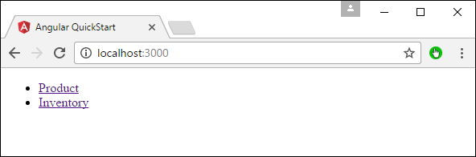

**Step 3** − Click the Inventory link.

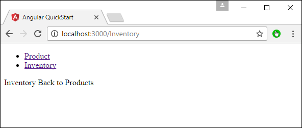

**Step 4** − Click the �Back to products� link, you will get the following output which takes you back to the Products page.

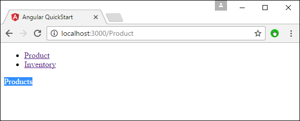

# Angular 2 - Forms
Angular 2 can also design forms which can use two-way binding using the **ngModel** directive. Let�s see how we can achieve this.

**Step 1** − Create a model which is a products model. Create a file called **products.ts** file.


**Step 2** − Place the following code in the file.

```
export class Product { 
   constructor ( 
      public productid: number, 
      public productname: string 
   ) {  } 
}
```
This is a simple class which has 2 properties, productid and productname.

**Step 3** − Create a product form component called product-form.component.ts component and add the following code −

```
import { Component } from '@angular/core';
import { Product } from './products';

@Component ({
   selector: 'product-form',
   templateUrl: './product-form.component.html'
})

export class ProductFormComponent {
   model = new Product(1,'ProductA');
}
```
The following points need to be noted about the above program.

   * Create an object of the Product class and add values to the productid and productname.
   * Use the templateUrl to specify the location of our product-form.component.html which will render the component.

**Step 4** − Create the actual form. Create a file called product-form.component.html and place the following code.

```
<div class = "container">
   <h1>Product Form</h1>
   <form>
      <div class = "form-group">
         <label for = "productid">ID</label>
         <input type = "text" class = "form-control" id = "productid" required
            [(ngModel)] = "model.productid" name = "id">
      </div>
      
      <div class = "form-group">
         <label for = "name">Name</label>
         <input type = "text" class = "form-control" id = "name"
            [(ngModel)] = "model.productname" name = "name">
      </div>
   </form>
</div>
```
The following point needs to be noted about the above program.

   * The **ngModel** directive is used to bind the object of the product to the separate elements on the form.

**Step 5** − Place the following code in the app.component.ts file.

```
import { Component } from '@angular/core';

@Component ({
   selector: 'my-app',
   template: '<product-form></product-form>'
})
export class AppComponent { }
```
**Step 6** − Place the below code in the app.module.ts file

```
import { NgModule } from '@angular/core';
import { BrowserModule } from '@angular/platform-browser';
import { AppComponent } from './app.component';
import { FormsModule } from '@angular/forms';
import { ProductFormComponent } from './product-form.component';

@NgModule ({
   imports: [ BrowserModule,FormsModule],
   declarations: [ AppComponent,ProductFormComponent],
   bootstrap: [ AppComponent ]
})
export class AppModule { }
```
**Step 7** − Save all the code and run the application using npm. Go to your browser, you will see the following output.


# Angular 2 - CLI
Command Line Interface (CLI) can be used to create our Angular JS application. It also helps in creating a unit and end-to-end tests for the application.

The official site for Angular CLI is [https://cli.angular.io/](https://cli.angular.io/) 


If you click on the Get started option, you will be directed to the github repository for the CLI [https://github.com/angular/angular-cli](https://github.com/angular/angular-cli) 

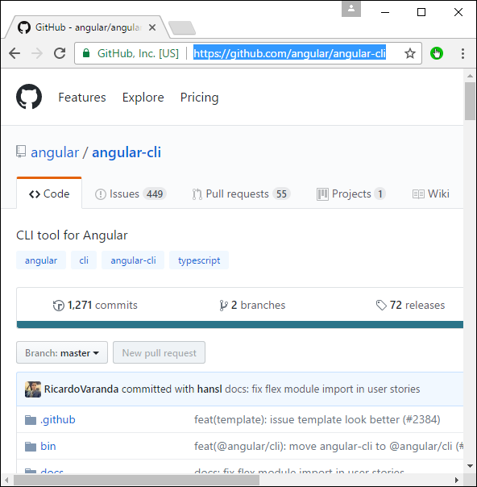

Let�s now look at some of the things we can do with Angular CLI.

## Installing CLI
**Note** − Please ensure that Python is installed on the system. Python can be downloaded from the site [https://www.python.org/](https://www.python.org/) 

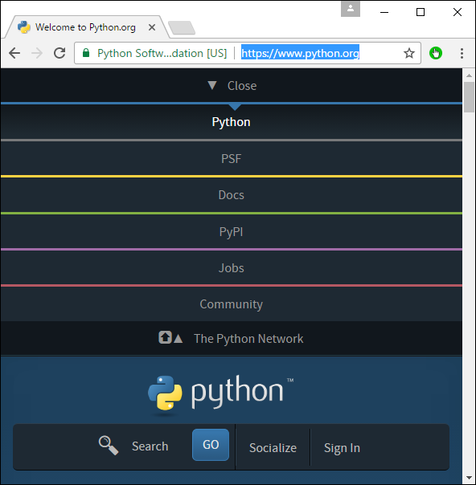

The first step is to install the CLI. We can do this with the following command −

```
npm install �g angular-cli
```
Now, create a new folder called angularCLI in any directory and issue the above command.

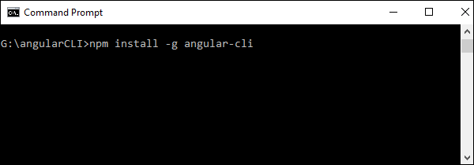

Once done, the CLI will be installed.

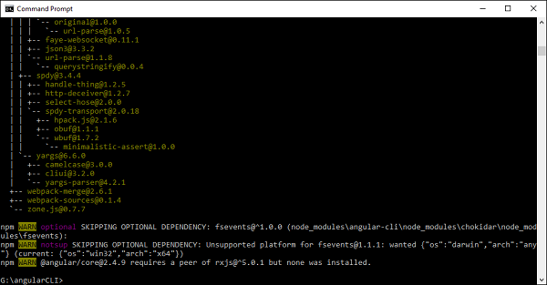

## Creating a Project
Angular JS project can be created using the following command.

### Syntax
```
ng new Project_name
```
### Parameters
**Project_name** − This is the name of the project which needs to be created.

### Output
None.

### Example
Let�s execute the following command to create a new project.

```
ng new demo2
```
It will automatically create the files and start downloading the necessary npm packages.

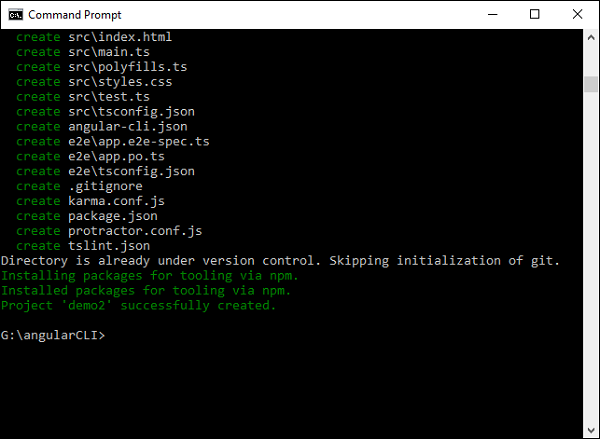

Now in Visual Studio code, we can open the newly created project.

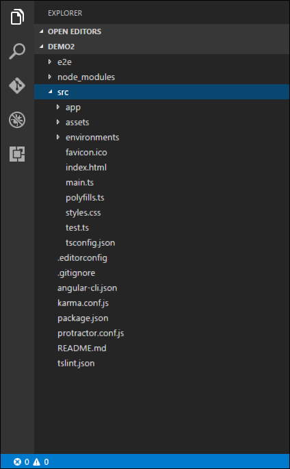

## Running the project
To run the project, you need to issue the following command −

```
ng server
```


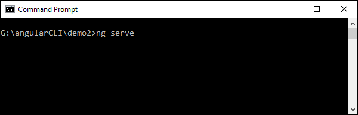

The default port number for the running application is 4200. You can browse to the port and see the application running.

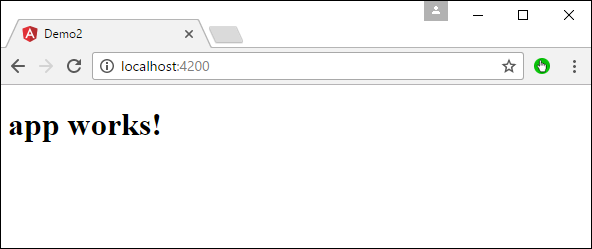

# Angular 2 - Dependency Injection
Dependency injection is the ability to add the functionality of components at runtime. Let�s take a look at an example and the steps used to implement dependency injection.

**Step 1** − Create a separate class which has the injectable decorator. The injectable decorator allows the functionality of this class to be injected and used in any Angular JS module.

```
@Injectable() 
   export class classname {  
}
```
**Step 2** − Next in your appComponent module or the module in which you want to use the service, you need to define it as a provider in the @Component decorator.

```
@Component ({  
   providers : [classname] 
})
```
Let�s look at an example on how to achieve this.

**Step 1** − Create a **ts** file for the service called app.service.ts.


**Step 2** − Place the following code in the file created above.

```
import { 
   Injectable 
} from '@angular/core'; 

@Injectable() 
export class appService {  
   getApp(): string { 
      return "Hello world"; 
   } 
}
```
The following points need to be noted about the above program.

   * The Injectable decorator is imported from the angular/core module.
   * We are creating a class called appService that is decorated with the Injectable decorator.
   * We are creating a simple function called getApp which returns a simple string called �Hello world�.

**Step 3** − In the app.component.ts file place the following code.

```
import { 
   Component 
} from '@angular/core';  

import { 
   appService 
} from './app.service';  

@Component({ 
   selector: 'my-app', 
   template: '<div>{{value}}</div>', 
   providers: [appService]  
}) 

export class AppComponent { 
   value: string = ""; 
   constructor(private _appService: appService) { } 
   ngOnInit(): void { 
      this.value = this._appService.getApp(); 
   }   
}
```
The following points need to be noted about the above program.

   * First, we are importing our appService module in the appComponent module.
   * Then, we are registering the service as a provider in this module.
   * In the constructor, we define a variable called _appService of the type appService so that it can be called anywhere in the appComponent module.
   * As an example, in the ngOnInit lifecyclehook, we called the getApp function of the service and assigned the output to the value property of the AppComponent class.

Save all the code changes and refresh the browser, you will get the following output.


# Angular 2 - Advanced Configuration
In this chapter, we will look at the other configuration files which are part of Angular 2 project.

## tsconfig.json
This file is used to give the options about TypeScript used for the Angular JS project.

```
{ 
   "compilerOptions": {
      "target": "es5",
      "module": "commonjs",
      "moduleResolution": "node",
      "sourceMap": true,
      "emitDecoratorMetadata": true,
      "experimentalDecorators": true,
      "lib": [ "es2015", "dom" ],
      "noImplicitAny": true,
      "suppressImplicitAnyIndexErrors": true
   }
}
```
Following are some key points to note about the above code.

   * The target for the compilation is es5 and that is because most browsers can only understand ES5 typescript.
   * The sourceMap option is used to generate Map files, which are useful when debugging. Hence, during development it is good to keep this option as true.
   * The "emitDecoratorMetadata": true and "experimentalDecorators": true is required for Angular JS decorators. If not in place, Angular JS application will not compile.

## package.json
This file contains information about Angular 2 project. Following are the typical settings in the file.

```
{
   "name": "angular-quickstart",
   "version": "1.0.0",
   "description": "QuickStart package.json from the documentation,
      supplemented with testing support",
   
   "scripts": {
      "build": "tsc -p src/",
      "build:watch": "tsc -p src/ -w",
      "build:e2e": "tsc -p e2e/",
      "serve": "lite-server -c=bs-config.json",
      "serve:e2e": "lite-server -c=bs-config.e2e.json",
      "prestart": "npm run build",
      "start": "concurrently \"npm run build:watch\" \"npm run serve\"",
      "pree2e": "npm run build:e2e",
      "e2e": "concurrently \"npm run serve:e2e\" \"npm run protractor\" 
         --killothers --success first",
      "preprotractor": "webdriver-manager update",
      "protractor": "protractor protractor.config.js",
      "pretest": "npm run build",
      "test": "concurrently \"npm run build:watch\" \"karma start karma.conf.js\"",
      "pretest:once": "npm run build",
      "test:once": "karma start karma.conf.js --single-run",
      "lint": "tslint ./src/**/*.ts -t verbose"
   },

   "keywords": [],
   "author": "",
   "license": "MIT",
   "dependencies": {
      "@angular/common": "~2.4.0",
      "@angular/compiler": "~2.4.0",
      "@angular/core": "~2.4.0",
      "@angular/forms": "~2.4.0",
      "@angular/http": "~2.4.0",
      "@angular/platform-browser": "~2.4.0",
      "@angular/platform-browser-dynamic": "~2.4.0",
      "@angular/router": "~3.4.0",
      "angular-in-memory-web-api": "~0.2.4",
      "systemjs": "0.19.40",
      "core-js": "^2.4.1",
      "rxjs": "5.0.1",
      "zone.js": "^0.7.4"
   },

   "devDependencies": {
      "concurrently": "^3.2.0",
      "lite-server": "^2.2.2",
      "typescript": "~2.0.10",
      "canonical-path": "0.0.2",
      "tslint": "^3.15.1",
      "lodash": "^4.16.4",
      "jasmine-core": "~2.4.1",
      "karma": "^1.3.0",
      "karma-chrome-launcher": "^2.0.0",
      "karma-cli": "^1.0.1",
      "karma-jasmine": "^1.0.2",
      "karma-jasmine-html-reporter": "^0.2.2",
      "protractor": "~4.0.14",
      "rimraf": "^2.5.4",
      "@types/node": "^6.0.46",
      "@types/jasmine": "2.5.36"
   },
   "repository": {}
}
```
Some key points to note about the above code −

   * There are two types of dependencies, first is the dependencies and then there are dev dependencies. The dev ones are required during the development process and the others are needed to run the application.
   * The "build:watch": "tsc -p src/ -w" command is used to compile the typescript in the background by looking for changes in the typescript files.

## systemjs.config.json
This file contains the system files required for Angular JS application. This loads all the necessary script files without the need to add a script tag to the html pages. The typical files will have the following code.

```
/** 
 * System configuration for Angular samples 
 * Adjust as necessary for your application needs. 
*/ 
(function (global) { 
   System.config ({ 
      paths: { 
         // paths serve as alias 
         'npm:': 'node_modules/' 
      }, 
      
      // map tells the System loader where to look for things 
      map: { 
         // our app is within the app folder 
         app: 'app',  
         
         // angular bundles 
         '@angular/core': 'npm:@angular/core/bundles/core.umd.js', 
         '@angular/common': 'npm:@angular/common/bundles/common.umd.js', 
         '@angular/compiler': 'npm:@angular/compiler/bundles/compiler.umd.js', 
         '@angular/platform-browser': 'npm:@angular/platformbrowser/bundles/platform-browser.umd.js', 
         '@angular/platform-browser-dynamic': 
            'npm:@angular/platform-browserdynamic/bundles/platform-browser-dynamic.umd.js', 
         '@angular/http': 'npm:@angular/http/bundles/http.umd.js', 
         '@angular/router': 'npm:@angular/router/bundles/router.umd.js', 
         '@angular/forms': 'npm:@angular/forms/bundles/forms.umd.js',  
         
         // other libraries 
         'rxjs':  'npm:rxjs', 
         'angular-in-memory-web-api': 
            'npm:angular-in-memory-web-api/bundles/inmemory-web-api.umd.js' 
      }, 
     
      // packages tells the System loader how to load when no filename 
         and/or no extension 
      packages: { 
         app: { 
            defaultExtension: 'js' 
         }, 
         
         rxjs: { 
            defaultExtension: 'js' 
         } 
      } 
   
   }); 
})(this);
```
Some key points to note about the above code −

   * 'npm:': 'node_modules/' tells the location in our project where all the npm modules are located.
   * The mapping of app: 'app' tells the folder where all our applications files are loaded.

# Angular 2 - Third Party Controls
Angular 2 allows you to work with any third party controls. Once you decide on the control to implement, you need to perform the following steps −

**Step 1** − Install the component using the npm command.

For example, we will install the ng2-pagination third party control via the following command.

```
npm install ng2-pagination --save
```


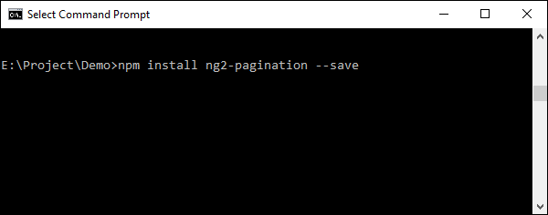

Once done, you will see that the component is successfully installed.

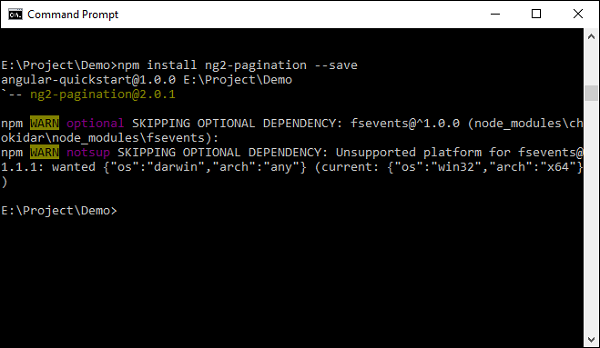

**Step 2** − Include the component in the app.module.ts file.

```
import { NgModule }      from '@angular/core';
import { BrowserModule } from '@angular/platform-browser';
import { AppComponent }  from './app.component';
import {Ng2PaginationModule} from 'ng2-pagination';

@NgModule ({
   imports:      [ BrowserModule,Ng2PaginationModule],
   declarations: [ AppComponent],
   bootstrap:    [ AppComponent ]
})
export class AppModule { }
```
**Step 3** − Finally, implement the component in your app.component.ts file.

```
import { Component } from '@angular/core';
import {PaginatePipe, PaginationService} from 'ng2-pagination';

@Component ({
   selector: 'my-app',
   template: '
      <ul>
         <li *ngFor = "let item of collection | paginate: {
            itemsPerPage: 5, currentPage: p }"> ... </li>
      </ul>
      <pagination-controls (pageChange) = "p = $event"></pagination-controls>
   '
})
export class AppComponent { }
```
**Step 4** − Save all the code changes and refresh the browser, you will get the following output.

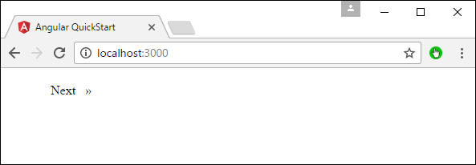


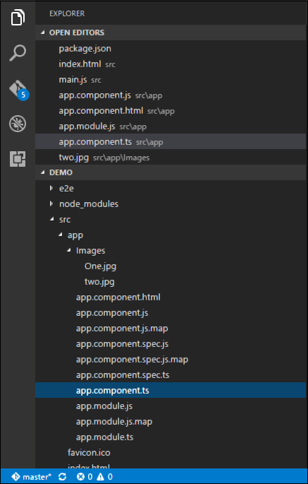

In the above picture, you can see that the images have been stored as One.jpg and two.jpg in the Images folder.

**Step 5** − Change the code of the app.component.ts file to the following.

```
import {
   Component
} from '@angular/core';

@Component ({
   selector: 'my-app',
   templateUrl: 'app/app.component.html'
})

export class AppComponent {
   appTitle: string = 'Welcome';
   
   appList: any[] = [{
      "ID": "1",
      "Name": "One",
      "url": 'app/Images/One.jpg'
   },
   {
      "ID": "2",
      "Name": "Two",
      "url": 'app/Images/two.jpg'
   } ];
}
```
Following points need to be noted about the above code.

   * We are defining an array called appList which is of the type any. This is so that it can store any type of element.
   * We are defining 2 elements. Each element has 3 properties, ID, Name and url.
   * The URL for each element is the relative path to the 2 images.

**Step 6** − Make the following changes to the app/app.component.html file which is your template file.

```
<div *ngFor = 'let lst of appList'> 
   <ul> 
      <li>{{lst.ID}}</li> 
      <li>{{lst.Name}}</li> 
       
   </ul> 
</div>
```
Following points need to be noted about the above program −

   * The ngFor directive is used to iterate through all the elements of the appList property.
   * For each property, it is using the list element to display an image.
   * The src property of the img tag is then bounded to the url property of appList in our class.

**Step 7** − Save all the code changes and refresh the browser, you will get the following output. From the output, you can clearly see that the images have been picked up and shown in the output.

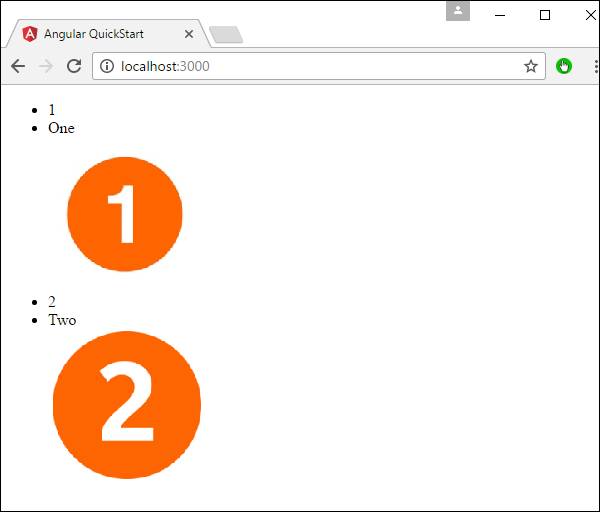

# Angular 2 - Data Display
In Angular JS, it very easy to display the value of the properties of the class in the HTML form.

Let�s take an example and understand more about Data Display. In our example, we will look at displaying the values of the various properties in our class in an HTML page.

**Step 1** − Change the code of the app.component.ts file to the following.

```
import {
   Component
} from '@angular/core';

@Component ({
   selector: 'my-app',
   templateUrl: 'app/app.component.html'
})

export class AppComponent {
   TutorialName: string = 'Angular JS2';
   appList: string[] = ["Binding", "Display", "Services"];
}
```
Following points need to be noted about the above code.

   * We are defining an array called appList which of the type string.
   * We are defining 3 string elements as part of the array which is Binding, Display, and Services.
   * We have also defined a property called TutorialName which has a value of Angular 2.

**Step 2** − Make the following changes to the app/app.component.html file which is your template file.

```
<div>
   The name of this Tutorial is {{TutorialName}}<br>
   The first Topic is {{appList[0]}}<br>
   The second Topic is {{appList[1]}}<br>
   The third Topic is {{appList[2]}}<br>
</div>
```
Following points need to be noted about the above code.

   * We are referencing the TutorialName property to tell �what is the name of the tutorial in our HTML page�.
   * We are using the index value for the array to display each of the 3 topics in our array.

**Step 3** − Save all the code changes and refresh the browser, you will get the below output. From the output, you can clearly see that the data is displayed as per the values of the properties in the class.


Another simple example, which is binding on the fly is the use of the input html tag. It just displays the data as the data is being typed in the html tag.

Make the following changes to the app/app.component.html file which is your template file.

```
<div>
   <input [value] = "name" (input) = "name = $event.target.value">
   {{name}}
</div>
```
Following points need to be noted about the above code.

   * **[value] = �username�** − This is used to bind the expression username to the input element�s value property.
   * **(input) = �expression�** − This a declarative way of binding an expression to the input element�s input event.
   * **username = $event.target.value** − The expression that gets executed when the input event is fired.
   * **$event** − An expression exposed in event bindings by Angular, which has the value of the event�s payload.

When you save all the code changes and refresh the browser, you will get the following output.


Now, type something in the Input box such as �Tutorialspoint�. The output will change accordingly.


# Angular 2 - Handling Events
In Angular 2, events such as button click or any other sort of events can also be handled very easily. The events get triggered from the html page and are sent across to Angular JS class for further processing.

Let�s look at an example of how we can achieve event handling. In our example, we will look at displaying a click button and a status property. Initially, the status property will be true. When the button is clicked, the status property will then become false.

**Step 1** − Change the code of the app.component.ts file to the following.

```
import { 
   Component 
} from '@angular/core';  

@Component ({ 
   selector: 'my-app', 
   templateUrl: 'app/app.component.html' 
}) 

export class AppComponent { 
   Status: boolean = true; 
   clicked(event) { 
      this.Status = false; 
   } 
}
```
Following points need to be noted about the above code.

   * We are defining a variable called status of the type Boolean which is initially true.
   * Next, we are defining the clicked function which will be called whenever our button is clicked on our html page. In the function, we change the value of the Status property from true to false.

**Step 2** − Make the following changes to the app/app.component.html file, which is the template file.

```
<div> 
   {{Status}} 
   <button (click) = "clicked()">Click</button> 
</div>
```
Following points need to be noted about the above code.

   * We are first just displaying the value of the Status property of our class.
   * Then are defining the button html tag with the value of Click. We then ensure that the click event of the button gets triggered to the clicked event in our class.

**Step 3** − Save all the code changes and refresh the browser, you will get the following output.


**Step 4** − Click the Click button, you will get the following output.


# Angular 2 - Transforming Data
Angular 2 has a lot of filters and pipes that can be used to transform data.

## lowercase
This is used to convert the input to all lowercase.

### Syntax
```
Propertyvalue | lowercase
```
### Parameters
None

### Result
The property value will be converted to lowercase.

### Example
First ensure the following code is present in the app.component.ts file.

```
import { 
   Component 
} from '@angular/core'; 

@Component ({ 
   selector: 'my-app', 
   templateUrl: 'app/app.component.html' 
}) 

export class AppComponent { 
   TutorialName: string = 'Angular JS2'; 
   appList: string[] = ["Binding", "Display", "Services"]; 
}
```
Next, ensure the following code is present in the app/app.component.html file.

```
<div> 
   The name of this Tutorial is {{TutorialName}}<br>  
   The first Topic is {{appList[0] | lowercase}}<br> 
   The second Topic is {{appList[1] | lowercase}}<br> 
   The third Topic is {{appList[2]| lowercase}}<br> 
</div>
```
### Output
Once you save all the code changes and refresh the browser, you will get the following output.


## uppercase
This is used to convert the input to all uppercase.

### Syntax
```
Propertyvalue | uppercase
```
### Parameters
None.

### Result
The property value will be converted to uppercase.

### Example
First ensure the following code is present in the app.component.ts file.

```
import { 
   Component 
} from '@angular/core';

@Component ({ 
   selector: 'my-app', 
   templateUrl: 'app/app.component.html' 
}) 

export class AppComponent { 
   TutorialName: string = 'Angular JS2'; 
   appList: string[] = ["Binding", "Display", "Services"]; 
}
```
Next, ensure the following code is present in the app/app.component.html file.

```
<div> 
   The name of this Tutorial is {{TutorialName}}<br>  
   The first Topic is {{appList[0] | uppercase }}<br> 
   The second Topic is {{appList[1] | uppercase }}<br> 
   The third Topic is {{appList[2]| uppercase }}<br> 
</div>
```
### Output
Once you save all the code changes and refresh the browser, you will get the following output.


## slice
This is used to slice a piece of data from the input string.

### Syntax
```
Propertyvalue | slice:start:end
```
### Parameters
   * **start** − This is the starting position from where the slice should start.
   * **end** − This is the starting position from where the slice should end.

### Result
The property value will be sliced based on the start and end positions.

### Example
First ensure the following code is present in the app.component.ts file

```
import {
   Component
} from '@angular/core';

@Component ({
   selector: 'my-app',
   templateUrl: 'app/app.component.html'
})

export class AppComponent {
   TutorialName: string = 'Angular JS2';
   appList: string[] = ["Binding", "Display", "Services"];
}
```
Next, ensure the following code is present in the app/app.component.html file.

```
<div> 
   The name of this Tutorial is {{TutorialName}}<br>  
   The first Topic is {{appList[0] | slice:1:2}}<br> 
   The second Topic is {{appList[1] | slice:1:3}}<br> 
   The third Topic is {{appList[2]| slice:2:3}}<br> 
</div>
```
### Output
Once you save all the code changes and refresh the browser, you will get the following output.


## date
This is used to convert the input string to date format.

### Syntax
```
Propertyvalue | date:�dateformat�
```
### Parameters
**dateformat** − This is the date format the input string should be converted to.

### Result
The property value will be converted to date format.

### Example
First ensure the following code is present in the app.component.ts file.

```
import { 
   Component 
} from '@angular/core';  

@Component ({ 
   selector: 'my-app', 
   templateUrl: 'app/app.component.html' 
}) 

export class AppComponent { 
   newdate = new Date(2016, 3, 15);
}
```
Next, ensure the following code is present in the app/app.component.html file.

```
<div> 
   The date of this Tutorial is {{newdate | date:"MM/dd/yy"}}<br>  
</div>
```
### Output
Once you save all the code changes and refresh the browser, you will get the following output.


## currency
This is used to convert the input string to currency format.

### Syntax
```
Propertyvalue | currency
```
### Parameters
None.

### Result
The property value will be converted to currency format.

### Example
First ensure the following code is present in the app.component.ts file.

```
import { 
   Component 
} from '@angular/core';  

@Component ({ 
   selector: 'my-app', 
   templateUrl: 'app/app.component.html' 
}) 

export class AppComponent { 
   newValue: number = 123; 
}
```
Next, ensure the following code is present in the app/app.component.html file.

```
<div> 
   The currency of this Tutorial is {{newValue | currency}}<br>      
</div>
```
### Output
Once you save all the code changes and refresh the browser, you will get the following output.


## percentage
This is used to convert the input string to percentage format.

### Syntax
```
Propertyvalue | percent
```
### Parameters
None

### Result
The property value will be converted to percentage format.

### Example
First ensure the following code is present in the app.component.ts file.

```
import { 
   Component 
} from '@angular/core';  

@Component ({ 
   selector: 'my-app', 
   templateUrl: 'app/app.component.html' 
}) 

export class AppComponent { 
   newValue: number = 30; 
}
```
Next, ensure the following code is present in the app/app.component.html file.

```
<div>
   The percentage is {{newValue | percent}}<br> 
</div>
```
### Output
Once you save all the code changes and refresh the browser, you will get the following output.


There is another variation of the percent pipe as follows.

### Syntax
```
Propertyvalue | percent: �{minIntegerDigits}.{minFractionDigits}{maxFractionDigits}�
```
### Parameters
   * **minIntegerDigits** − This is the minimum number of Integer digits.
   * **minFractionDigits** − This is the minimum number of fraction digits.
   * **maxFractionDigits** − This is the maximum number of fraction digits.

### Result
The property value will be converted to percentage format

### Example
First ensure the following code is present in the app.component.ts file.

```
import { 
   Component 
} from '@angular/core';  

@Component ({ 
   selector: 'my-app', 
   templateUrl: 'app/app.component.html' 
}) 

export class AppComponent { 
   newValue: number = 0.3; 
}
```
Next, ensure the following code is present in the app/app.component.html file.

```
<div> 
   The percentage is {{newValue | percent:'2.2-5'}}<br>  
</div>
```
### Output
Once you save all the code changes and refresh the browser, you will get the following output.


# Angular 2 - Custom Pipes
Angular 2 also has the facility to create custom pipes. The general way to define a custom pipe is as follows.

```
import { Pipe, PipeTransform } from '@angular/core';  
@Pipe({name: 'Pipename'}) 

export class Pipeclass implements PipeTransform { 
   transform(parameters): returntype { } 
}
```
Where,

   * **'Pipename'** − This is the name of the pipe.
   * **Pipeclass** − This is name of the class assigned to the custom pipe.
   * **Transform** − This is the function to work with the pipe.
   * **Parameters** − This are the parameters which are passed to the pipe.
   * **Returntype** − This is the return type of the pipe.

Let�s create a custom pipe that multiplies 2 numbers. We will then use that pipe in our component class.

**Step 1** − First, create a file called multiplier.pipe.ts.


**Step 2** − Place the following code in the above created file.

```
import { 
   Pipe, 
   PipeTransform 
} from '@angular/core';  

@Pipe ({ 
   name: 'Multiplier' 
}) 

export class MultiplierPipe implements PipeTransform { 
   transform(value: number, multiply: string): number { 
      let mul = parseFloat(multiply); 
      return mul * value 
   } 
}
```
Following points need to be noted about the above code.

   * We are first importing the Pipe and PipeTransform modules.
   * Then, we are creating a Pipe with the name 'Multiplier'.
   * Creating a class called MultiplierPipe that implements the PipeTransform module. 
   * The transform function will then take in the value and multiple parameter and output the multiplication of both numbers.

**Step 3** − In the app.component.ts file, place the following code.

```
import { 
   Component 
} from '@angular/core';  

@Component ({ 
   selector: 'my-app', 
   template: '<p>Multiplier: {{2 | Multiplier: 10}}</p>' 
}) 
export class AppComponent {  }
```
**Note** − In our template, we use our new custom pipe.

**Step 4** − Ensure the following code is placed in the app.module.ts file.

```
import {
   NgModule
} from '@angular/core';

import {
   BrowserModule
} from '@angular/platform-browser';

import {
   AppComponent
} from './app.component';

import {
   MultiplierPipe
} from './multiplier.pipe'

@NgModule ({
   imports: [BrowserModule],
   declarations: [AppComponent, MultiplierPipe],
   bootstrap: [AppComponent]
})

export class AppModule {}
```
Following things need to be noted about the above code.

   * We need to ensure to include our MultiplierPipe module.
   * We also need to ensure it is included in the declarations section.

Once you save all the code changes and refresh the browser, you will get the following output.


# Angular 2 - User Input
In Angular 2, you can make the use of DOM element structure of HTML to change the values of the elements at run time. Let�s look at some in detail.

## The Input Tag
In the app.component.ts file place the following code.

```
import { 
   Component 
} from '@angular/core';  

@Component ({ 
   selector: 'my-app', 
   template: ' 
      <div> 
         <input [value] = "name" (input) = "name = $event.target.value"> 
         {{name}} 
      </div> 
   ' 
}) 
export class AppComponent { }
```
Following things need to be noted about the above code.

   * **[value] = �username�** − This is used to bind the expression username to the input element�s value property.
   * **(input) = �expression�** − This a declarative way of binding an expression to the input element�s input event.
   * **username = $event.target.value** − The expression that gets executed when the input event is fired.
   * **$event** − Is an expression exposed in event bindings by Angular, which has the value of the event�s payload.

Once you save all the code changes and refresh the browser, you will get the following output.

You can now type anything and the same input will reflect in the text next to the Input control.


## Click Input
In the app.component.ts file place the following code.

```
import {
   Component
} from '@angular/core';

@Component ({
   selector: 'my-app',
   template: '<button (click) = "onClickMe()"> Click Me </button> {{clickMessage}}'
})

export class AppComponent {
   clickMessage = 'Hello';
   onClickMe() {
      this.clickMessage = 'This tutorial!';
   }
}
```
Once you save all the code changes and refresh the browser, you will get the following output.


When you hit the Click Me button, you will get the following output.


# Angular 2 - Lifecycle Hooks
Angular 2 application goes through an entire set of processes or has a lifecycle right from its initiation to the end of the application.

The following diagram shows the entire processes in the lifecycle of the Angular 2 application.


Following is a description of each lifecycle hook.

   * **ngOnChanges** − When the value of a data bound property changes, then this method is called.
   * **ngOnInit** − This is called whenever the initialization of the directive/component after Angular first displays the data-bound properties happens.
   * **ngDoCheck** − This is for the detection and to act on changes that Angular can't or won't detect on its own.
   * **ngAfterContentInit** − This is called in response after Angular projects external content into the component's view.
   * **ngAfterContentChecked** − This is called in response after Angular checks the content projected into the component.
   * **ngAfterViewInit** − This is called in response after Angular initializes the component's views and child views.
   * **ngAfterViewChecked** − This is called in response after Angular checks the component's views and child views.
   * **ngOnDestroy** − This is the cleanup phase just before Angular destroys the directive/component.

Following is an example of implementing one lifecycle hook. In the **app.component.ts** file, place the following code.

```
import { 
   Component 
} from '@angular/core';  

@Component ({ 
   selector: 'my-app', 
   template: '<div> {{values}} </div> ' 
}) 

export class AppComponent { 
   values = ''; 
   ngOnInit() { 
      this.values = "Hello"; 
   } 
}
```
In the above program, we are calling the **ngOnInit** lifecycle hook to specifically mention that the value of the **this.values** parameter should be set to �Hello�.

Once you save all the code changes and refresh the browser, you will get the following output.

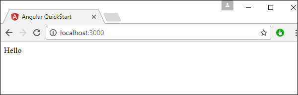

# Angular 2 - Nested Containers
In Angular JS, it is possible to nest containers inside each other. The outside container is known as the parent container and the inner one is known as the child container. Let�s look at an example on how to achieve this. Following are the steps.

**Step 1** − Create a **ts** file for the child container called **child.component.ts**.


**Step 2** − In the file created in the above step, place the following code.

```
import { 
   Component 
} from '@angular/core';  

@Component ({ 
   selector: 'child-app', 
   template: '<div> {{values}} </div> ' 
}) 

export class ChildComponent { 
   values = ''; 
   ngOnInit() { 
      this.values = "Hello"; 
   } 
}
```
The above code sets the value of the parameter this.values to �Hello�.

**Step 3** − In the app.component.ts file, place the following code.

```
import { 
   Component 
} from '@angular/core'; 

import { 
   ChildComponent 
} from './child.component'; 

@Component ({ 
   selector: 'my-app', 
   template: '<child-app></child-app> ' 
}) 

export class AppComponent { }
```
In the above code, notice that we are now calling the import statement to import the **child.component** module. Also we are calling the &lt;child-app&gt; selector from the child component to our main component.

**Step 4** − Next, we need to ensure the child component is also included in the app.module.ts file.

```
import { 
   NgModule 
} from '@angular/core'; 

import { 
   BrowserModule 
} from '@angular/platform-browser';  

import { 
   AppComponent 
} from './app.component';  

import { 
   MultiplierPipe 
} from './multiplier.pipe' 

import { 
   ChildComponent 
} from './child.component';  

@NgModule ({ 
   imports: [BrowserModule], 
   declarations: [AppComponent, MultiplierPipe, ChildComponent], 
   bootstrap: [AppComponent] 
}) 

export class AppModule {}
```
Once you save all the code changes and refresh the browser, you will get the following output.


# Angular 2 - Services
A service is used when a common functionality needs to be provided to various modules. For example, we could have a database functionality that could be reused among various modules. And hence you could create a service that could have the database functionality.


The following key steps need to be carried out when creating a service.

**Step 1** − Create a separate class which has the injectable decorator. The injectable decorator allows the functionality of this class to be injected and used in any Angular JS module.

```
@Injectable() 
   export class classname {  
}
```
**Step 2** − Next in your appComponent module or the module in which you want to use the service, you need to define it as a provider in the @Component decorator.

```
@Component ({  
   providers : [classname] 
})
```
Let�s look at an example on how to achieve this. Following are the steps involved.

**Step 1** − Create a **ts** file for the service called app.service.ts.


**Step 2** − Place the following code in the file created above.

```
import { 
   Injectable 
} from '@angular/core';  

@Injectable()
export class appService {  
   getApp(): string { 
      return "Hello world"; 
   } 
}
```
Following points need to be noted about the above program.

   * The Injectable decorator is imported from the angular/core module.
   * We are creating a class called appService that is decorated with the Injectable decorator.
   * We are creating a simple function called getApp, which returns a simple string called �Hello world�.

**Step 3** − In the app.component.ts file, place the following code.

```
import { 
   Component 
} from '@angular/core';  

import { 
   appService 
} from './app.service';  

@Component ({ 
   selector: 'demo-app', 
   template: '<div>{{value}}</div>', 
   providers: [appService] 
}) 

export class AppComponent { 
   value: string = ""; 
   constructor(private _appService: appService) { }  

   ngOnInit(): void { 
      this.value = this._appService.getApp(); 
   } 
}
```
Following points need to be noted about the above program.

   * First, we import our appService module in the appComponent module.
   * Then, we register the service as a provider in this module.
   * In the constructor, we define a variable called _appService of the type appService so that it can be called anywhere in the appComponent module.
   * As an example, in the ngOnInit lifecyclehook, we called the getApp function of the service and assign the output to the value property of the AppComponent class.

Once you save all the code changes and refresh the browser, you will get the following output.


[Previous Page](../angular2/angular2_questions_answers.md) [Next Page](../angular2/angular2_useful_resources.md) 
