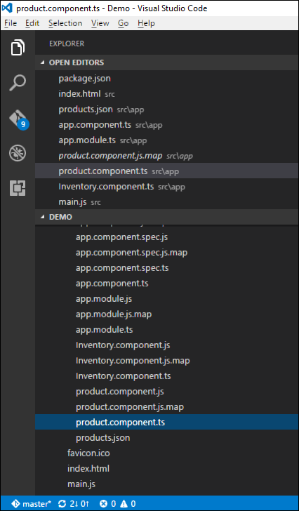
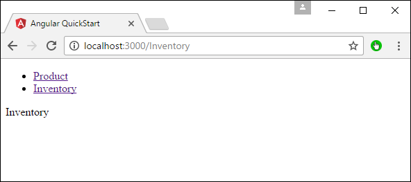
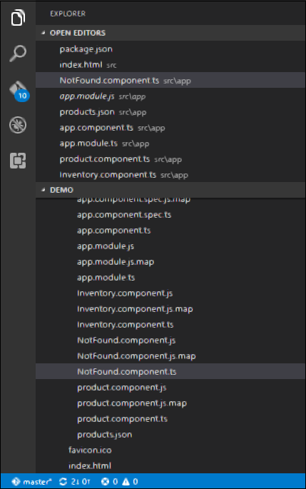
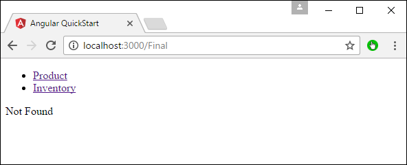

# Angular 2 - Routing
Routing helps in directing users to different pages based on the option they choose on the main page. Hence, based on the option they choose, the required Angular Component will be rendered to the user.

Let’s see the necessary steps to see how we can implement routing in an Angular 2 application.

**Step 1** − Add the base reference tag in the index.html file.

```
<!DOCTYPE html>
<html>
   <head>
      <base href = "/">
      <title>Angular QuickStart</title>
      <meta charset = "UTF-8">
      <meta name = "viewport" content = "width = device-width, initial-scale = 1">
      
      <base href = "/">
      <link rel = "stylesheet" href = "styles.css">

      <!-- Polyfill(s) for older browsers -->
      <script src = "node_modules/core-js/client/shim.min.js"></script>
      <script src = "node_modules/zone.js/dist/zone.js"></script>
      <script src = "node_modules/systemjs/dist/system.src.js"></script>
      <script src = "systemjs.config.js"></script>

      <script>
         System.import('main.js').catch(function(err){ console.error(err); });
      </script>
   </head>

   <body>
      <my-app></my-app>
   </body>
</html>
```
**Step 2** − Create two routes for the application. For this, create 2 files called **Inventory.component.ts** and **product.component.ts**



**Step 3** − Place the following code in the product.component.ts file.

```
import { Component } from '@angular/core';

@Component ({
   selector: 'my-app',
   template: 'Products',
})
export   class   Appproduct  {
}
```
**Step 4** − Place the following code in the Inventory.component.ts file.

```
import { Component } from '@angular/core';

@Component ({
   selector: 'my-app',
   template: 'Inventory',
})
export class AppInventory  {
}
```
Both of the components don’t do anything fancy, they just render the keywords based on the component. So for the Inventory component, it will display the Inventory keyword to the user. And for the products component, it will display the product keyword to the user.

**Step 5** − In the app.module.ts file, add the following code −

```
import { NgModule } from '@angular/core';
import { BrowserModule } from '@angular/platform-browser';
import { AppComponent }  from './app.component';
import { Appproduct } from './product.component';
import { AppInventory } from './Inventory.component';
import { RouterModule, Routes } from '@angular/router';

const appRoutes: Routes = [
   { path: 'Product', component: Appproduct },
   { path: 'Inventory', component: AppInventory },
];

@NgModule ({
   imports: [ BrowserModule,
   RouterModule.forRoot(appRoutes)],
   declarations: [ AppComponent,Appproduct,AppInventory],
   bootstrap: [ AppComponent ]
})
export class AppModule { }
```
The following points need to be noted about the above program −

   * The appRoutes contain 2 routes, one is the Appproduct component and the other is the AppInventory component.
   * Ensure to declare both of the components.
   * The RouterModule.forRoot ensures to add the routes to the application.

**Step 6** − In the app.component.ts file, add the following code.

```
import { Component } from '@angular/core';

@Component ({
   selector: 'my-app',
   template: `
   <ul>
      <li><a [routerLink] = "['/Product']">Product</a></li>
      <li><a [routerLink] = "['/Inventory']">Inventory</a></li>
   </ul>
   <router-outlet></router-outlet>`
})
export class AppComponent  { }
```
The following point needs to be noted about the above program −

   * &lt;router-outlet&gt;&lt;/router-outlet&gt; is the placeholder to render the component based on which option the user chooses.

Now, save all the code and run the application using npm. Go to the browser, you will see the following output.


Now if you click the Inventory link, you will get the following output.



## Adding an Error Route
In Routing, one can also add an error route. This can happen if the user goes to a page which does not exist in the application.

Let’s see how we can go about implementing this.

**Step 1** − Add a PageNotFound component as NotFound.component.ts as shown below −



**Step 2** − Add the following code to the new file.

```
import { Component } from '@angular/core';

@Component ({  
   selector: 'my-app',  
   template: 'Not Found', 
})  
export class PageNotFoundComponent {  
}
```
**Step 3** − Add the following code to the app.module.ts file.

```
import { NgModule } from '@angular/core'; 
import { BrowserModule } from '@angular/platform-browser'; 
import { AppComponent } from './app.component'; 
import { Appproduct } from './product.component' 
import { AppInventory } from  './Inventory.component' 
import { PageNotFoundComponent } from  './NotFound.component' 
import { RouterModule, Routes } from '@angular/router';  

const appRoutes: Routes = [ 
   { path: 'Product', component: Appproduct }, 
   { path: 'Inventory', component: AppInventory }, 
   { path: '**', component: PageNotFoundComponent } 
];  

@NgModule ({ 
   imports: [ BrowserModule, 
   RouterModule.forRoot(appRoutes)], 
   declarations: [ AppComponent,Appproduct,AppInventory,PageNotFoundComponent], 
   bootstrap: [ AppComponent ] 
}) 

export class AppModule {
}
```
The following point needs to be noted about the above program −

   * Now we have an extra route called path: '**', component: PageNotFoundComponent. Hence, ** is for any route which does not fit the default route. They will be directed to the PageNotFoundComponent component.

Now, save all the code and run the application using npm. Go to your browser, and you will see the following output. Now, when you go to any wrong link you will get the following output.




[Previous Page](../angular2/angular2_error_handling.md) [Next Page](../angular2/angular2_navigation.md) 
