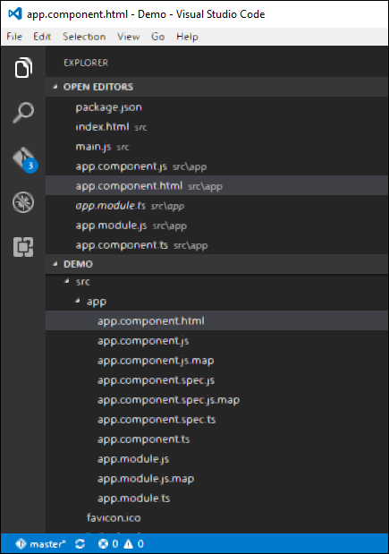
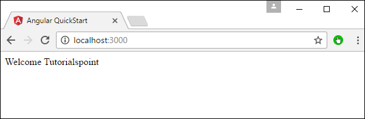

# Angular 2 - Templates
In the chapter on Components, we have already seen an example of the following template.

```
template: '
   <div>
      <h1>{{appTitle}}</h1>
      <div>To Tutorials Point</div>
   </div>
'
```
This is known as an **inline template**. There are other ways to define a template and that can be done via the templateURL command. The simplest way to use this in the component is as follows.

## Syntax
```
templateURL:
viewname.component.html
```
## Parameters
   * **viewname** − This is the name of the app component module.

After the viewname, the component needs to be added to the file name.

Following are the steps to define an inline template.

**Step 1** − Create a file called app.component.html. This will contain the html code for the view.



**Step 2** − Add the following code in the above created file.

```
<div>{{appTitle}} Tutorialspoint </div>
```
This defines a simple div tag and references the appTitle property from the app.component class.

**Step 3** − In the app.component.ts file, add the following code.

```
import { Component } from '@angular/core';

@Component ({
   selector: 'my-app',
   templateUrl: 'app/app.component.html'  
})

export class AppComponent {
   appTitle: string = 'Welcome';
}
```
From the above code, the only change that can be noted is from the templateURL, which gives the link to the app.component.html file which is located in the app folder.

**Step 4** − Run the code in the browser, you will get the following output.



From the output, it can be seen that the template file (app.component.html) file is being called accordingly.


[Previous Page](../angular2/angular2_components.md) [Next Page](../angular2/angular2_directives.md) 
