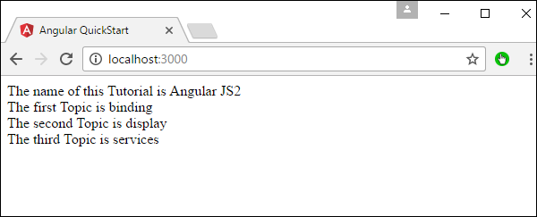
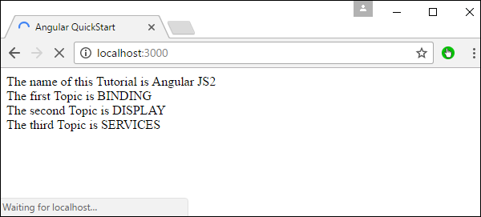
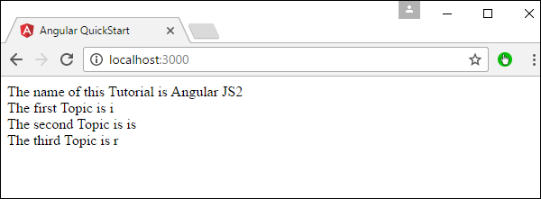
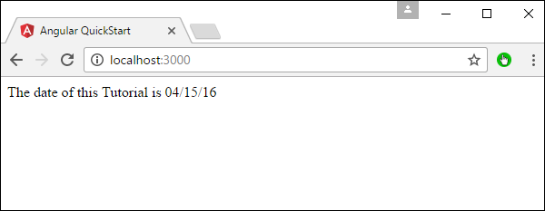
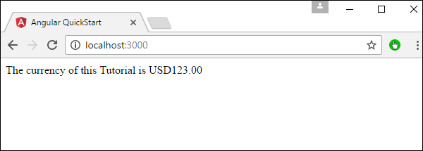
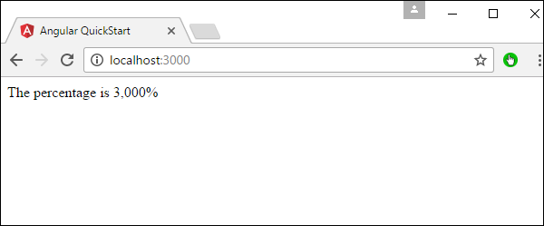
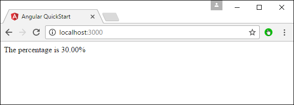

# Angular 2 - Transforming Data
Angular 2 has a lot of filters and pipes that can be used to transform data.

## lowercase
This is used to convert the input to all lowercase.

### Syntax
```
Propertyvalue | lowercase
```
### Parameters
None

### Result
The property value will be converted to lowercase.

### Example
First ensure the following code is present in the app.component.ts file.

```
import { 
   Component 
} from '@angular/core'; 

@Component ({ 
   selector: 'my-app', 
   templateUrl: 'app/app.component.html' 
}) 

export class AppComponent { 
   TutorialName: string = 'Angular JS2'; 
   appList: string[] = ["Binding", "Display", "Services"]; 
}
```
Next, ensure the following code is present in the app/app.component.html file.

```
<div> 
   The name of this Tutorial is {{TutorialName}}<br>  
   The first Topic is {{appList[0] | lowercase}}<br> 
   The second Topic is {{appList[1] | lowercase}}<br> 
   The third Topic is {{appList[2]| lowercase}}<br> 
</div>
```
### Output
Once you save all the code changes and refresh the browser, you will get the following output.



## uppercase
This is used to convert the input to all uppercase.

### Syntax
```
Propertyvalue | uppercase
```
### Parameters
None.

### Result
The property value will be converted to uppercase.

### Example
First ensure the following code is present in the app.component.ts file.

```
import { 
   Component 
} from '@angular/core';

@Component ({ 
   selector: 'my-app', 
   templateUrl: 'app/app.component.html' 
}) 

export class AppComponent { 
   TutorialName: string = 'Angular JS2'; 
   appList: string[] = ["Binding", "Display", "Services"]; 
}
```
Next, ensure the following code is present in the app/app.component.html file.

```
<div> 
   The name of this Tutorial is {{TutorialName}}<br>  
   The first Topic is {{appList[0] | uppercase }}<br> 
   The second Topic is {{appList[1] | uppercase }}<br> 
   The third Topic is {{appList[2]| uppercase }}<br> 
</div>
```
### Output
Once you save all the code changes and refresh the browser, you will get the following output.



## slice
This is used to slice a piece of data from the input string.

### Syntax
```
Propertyvalue | slice:start:end
```
### Parameters
   * **start** − This is the starting position from where the slice should start.
   * **end** − This is the starting position from where the slice should end.

### Result
The property value will be sliced based on the start and end positions.

### Example
First ensure the following code is present in the app.component.ts file

```
import {
   Component
} from '@angular/core';

@Component ({
   selector: 'my-app',
   templateUrl: 'app/app.component.html'
})

export class AppComponent {
   TutorialName: string = 'Angular JS2';
   appList: string[] = ["Binding", "Display", "Services"];
}
```
Next, ensure the following code is present in the app/app.component.html file.

```
<div> 
   The name of this Tutorial is {{TutorialName}}<br>  
   The first Topic is {{appList[0] | slice:1:2}}<br> 
   The second Topic is {{appList[1] | slice:1:3}}<br> 
   The third Topic is {{appList[2]| slice:2:3}}<br> 
</div>
```
### Output
Once you save all the code changes and refresh the browser, you will get the following output.



## date
This is used to convert the input string to date format.

### Syntax
```
Propertyvalue | date:”dateformat”
```
### Parameters
**dateformat** − This is the date format the input string should be converted to.

### Result
The property value will be converted to date format.

### Example
First ensure the following code is present in the app.component.ts file.

```
import { 
   Component 
} from '@angular/core';  

@Component ({ 
   selector: 'my-app', 
   templateUrl: 'app/app.component.html' 
}) 

export class AppComponent { 
   newdate = new Date(2016, 3, 15); 
}
```
Next, ensure the following code is present in the app/app.component.html file.

```
<div> 
   The date of this Tutorial is {{newdate | date:"MM/dd/yy"}}<br>  
</div>
```
### Output
Once you save all the code changes and refresh the browser, you will get the following output.



## currency
This is used to convert the input string to currency format.

### Syntax
```
Propertyvalue | currency
```
### Parameters
None.

### Result
The property value will be converted to currency format.

### Example
First ensure the following code is present in the app.component.ts file.

```
import { 
   Component 
} from '@angular/core';  

@Component ({ 
   selector: 'my-app', 
   templateUrl: 'app/app.component.html' 
}) 

export class AppComponent { 
   newValue: number = 123; 
}
```
Next, ensure the following code is present in the app/app.component.html file.

```
<div> 
   The currency of this Tutorial is {{newValue | currency}}<br>      
</div>
```
### Output
Once you save all the code changes and refresh the browser, you will get the following output.



## percentage
This is used to convert the input string to percentage format.

### Syntax
```
Propertyvalue | percent
```
### Parameters
None

### Result
The property value will be converted to percentage format.

### Example
First ensure the following code is present in the app.component.ts file.

```
import { 
   Component 
} from '@angular/core';  

@Component ({ 
   selector: 'my-app', 
   templateUrl: 'app/app.component.html' 
}) 

export class AppComponent { 
   newValue: number = 30; 
}
```
Next, ensure the following code is present in the app/app.component.html file.

```
<div>
   The percentage is {{newValue | percent}}<br> 
</div>
```
### Output
Once you save all the code changes and refresh the browser, you will get the following output.



There is another variation of the percent pipe as follows.

### Syntax
```
Propertyvalue | percent: ‘{minIntegerDigits}.{minFractionDigits}{maxFractionDigits}’
```
### Parameters
   * **minIntegerDigits** − This is the minimum number of Integer digits.
   * **minFractionDigits** − This is the minimum number of fraction digits.
   * **maxFractionDigits** − This is the maximum number of fraction digits.

### Result
The property value will be converted to percentage format

### Example
First ensure the following code is present in the app.component.ts file.

```
import { 
   Component 
} from '@angular/core';  

@Component ({ 
   selector: 'my-app', 
   templateUrl: 'app/app.component.html' 
}) 

export class AppComponent { 
   newValue: number = 0.3; 
}
```
Next, ensure the following code is present in the app/app.component.html file.

```
<div> 
   The percentage is {{newValue | percent:'2.2-5'}}<br>  
</div>
```
### Output
Once you save all the code changes and refresh the browser, you will get the following output.




[Previous Page](../angular2/angular2_handling_events.md) [Next Page](../angular2/angular2_custom_pipes.md) 
