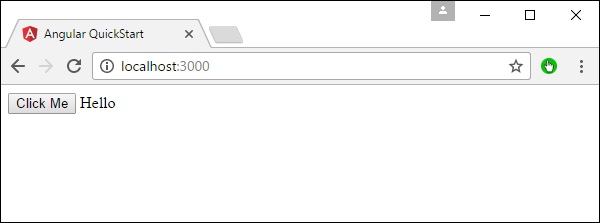
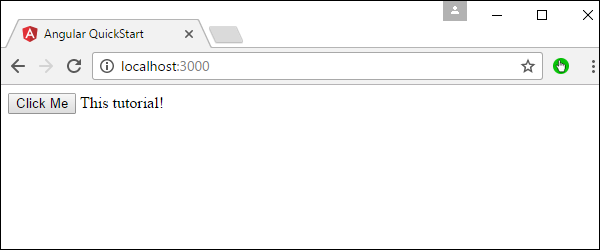

# Angular 2 - User Input
In Angular 2, you can make the use of DOM element structure of HTML to change the values of the elements at run time. Let’s look at some in detail.

## The Input Tag
In the app.component.ts file place the following code.

```
import { 
   Component 
} from '@angular/core';  

@Component ({ 
   selector: 'my-app', 
   template: ' 
      <div> 
         <input [value] = "name" (input) = "name = $event.target.value"> 
         {{name}} 
      </div> 
   ' 
}) 
export class AppComponent { }
```
Following things need to be noted about the above code.

   * **[value] = ”username”** − This is used to bind the expression username to the input element’s value property.
   * **(input) = ”expression”** − This a declarative way of binding an expression to the input element’s input event.
   * **username = $event.target.value** − The expression that gets executed when the input event is fired.
   * **$event** − Is an expression exposed in event bindings by Angular, which has the value of the event’s payload.

Once you save all the code changes and refresh the browser, you will get the following output.

You can now type anything and the same input will reflect in the text next to the Input control.


## Click Input
In the app.component.ts file place the following code.

```
import {
   Component
} from '@angular/core';

@Component ({
   selector: 'my-app',
   template: '<button (click) = "onClickMe()"> Click Me </button> {{clickMessage}}'
})

export class AppComponent {
   clickMessage = 'Hello';
   onClickMe() {
      this.clickMessage = 'This tutorial!';
   }
}
```
Once you save all the code changes and refresh the browser, you will get the following output.



When you hit the Click Me button, you will get the following output.




[Previous Page](../angular2/angular2_custom_pipes.md) [Next Page](../angular2/angular2_lifecycle_hooks.md) 
