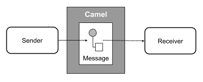
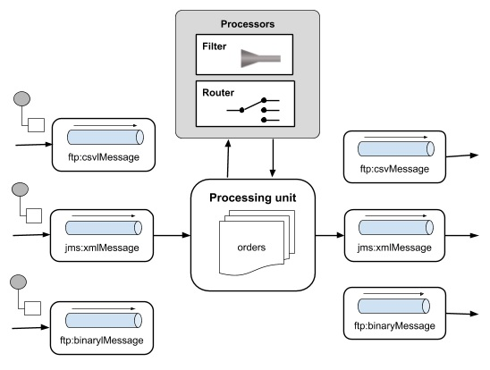

# Apache Camel - Overview
Camel is a black box that receives messages from some endpoint and sends it to another one. Within the black box, the messages may be processed or simply redirected.

So why have a framework for this? In practical situations as seen in the introduction case study, there may be many senders and many receivers each following its own protocol such as ftp, http and jms. The system may require many complex rules such as message from sender A should be delivered only to B &amp; C. In situations, you may have to translate the message to another format that the receiver expects. This translation may be subject to certain conditions based on the message contents. So essentially you may need to translate between protocols, glue components together, define routing rules, and provide filtering based on message contents. This is illustrated in the following figure −

To meet the above requirements and design a proper software architecture for many such situations, Enterprise Integration Patterns ([EIP](https://www.informit.com/store/enterprise-integration-patterns-designing-building-9780321200686) ) were documented by Gregor Hohpe and Bobby Woolf in 2003. Apache Camel provides the implementation of these patterns and the purpose of this tutorial is to teach you how to use Camel in situations like the one described in the introduction.

Apache Camel is an open source framework. It is a message-oriented middleware that provides rule-based routing and mediation engine. You can define rules such as if it is a “milk” order redirect it to a milk vendor and if it is an “oil” order redirect it to an oil vendor, and so on. Using Camel, you will be able to implement these rules and do the routing in a familiar Java code. It means that you can use your familiar Java IDE to define these rules in a type-safe environment. We do not need to use XML configuration files, which typically tend to be bulky. Camel though supports XML configuration through Spring framework, if you prefer to use XML for configuring the rules. You may even use Blueprint XML Configuration files and even a Scala DSL, if you are a Scala lover. It also means that you can use your favorite Java, Scala IDE or even a simple XML editor to configure the rules.

The input to this engine can be a comma-delimited text file, a POJO (Plain Old Java Object), XML are any of the several other formats supported by Camel. Similarly, the output of the engine can be redirected to a file, to a message queue or even your monitor screen for you to view the orders sent to respective vendors. These are called the endpoints and Camel supports the [Message Endpoint](https://camel.apache.org/message-endpoint.html)  EIP pattern. The Camel endpoints are discussed later in the Endpoints chapter.

Camel is typically used with [Apache ServiceMix](https://servicemix.apache.org/) , [Apache ActiveMQ](https://activemq.apache.org/)  and [Apache CXF](https://cxf.apache.org/)  to implement service-oriented architectures.

[Previous Page](../apache_camel/apache_camel_introduction.md) [Next Page](../apache_camel/apache_camel_features.md) 
