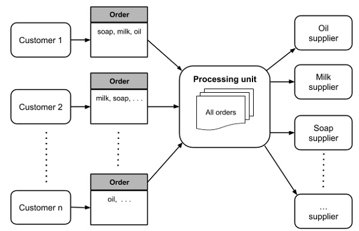
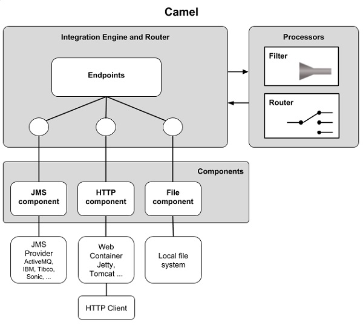

# Apache Camel - Quick Guide
# Apache Camel - Introduction
Consider a situation where a large online grocery store in your town such as the Bigbasket in India invites you to design an IT solution for them. The stable and scalable solution will help them overcome the software maintenance problems they are facing today. This online store has been running its business for the last decade. The store accepts online orders for different categories of products from their customers and distributes those to the respective suppliers. For example, suppose you order some soaps, oil and milk; these three items will be distributed to the three respective suppliers. The three suppliers will then send their supplies to a common distribution point from where the entire order will be fulfilled by the delivery center. Now, let us look at the problem they are facing today.

When this store started its business, it was accepting orders in a comma-separated plain text file. Over a period of time, the store switched to message-driven order placement. Later, some software developer suggested an XML based order placement. Eventually, the store even adapted a web service interface. Now, here comes the real problem. The orders now come in different formats. Obviously, every time the company upgraded the order acceptance format, it did not want to break the previously deployed interface so as not to cause confusions in the customer’s mind.

At the same time, as the business kept on growing, the store periodically added new suppliers to its repertoire. Each such supplier had its own protocol for accepting orders. Once again, we face the integration issue; our application architecture must be scalable to accommodate new suppliers with their unique order placement mechanism.

The entire situation is shown in the following figure −



Now, let us see how Apache Camel can come to your rescue to provide an elegant, maintainable, scalable solution architecture for the described scenario.

Before we proceed with the solution, we need to make a small assumption. For all the discussions in this tutorial, we will assume that the online orders are placed in XML format. A typical format for the order file that we will be using throughout our discussions is shown here −

```
<?xml version = "1.0" encoding = "UTF-8"?>
<OrderID Order = "001">
   <order product = "soaps">
      <items>
         <item>
            <Brand>Cinthol</Brand>
            <Type>Original</Type>
            <Quantity>4</Quantity>
            <Price>25</Price>
         </item>
         <item>
            <Brand>Cinthol</Brand>
            <Type>Lime</Type>
            <Quantity>6</Quantity>
            <Price>30</Price>
         </item>
      </items>
   </order>
   
   <order product = "Oil">
      <items>
         <item>
            <Brand>Saffola</Brand>
            <Type>Gold</Type>
            <Quantity>2</Quantity>
            <Price>649</Price>
         </item>
         <item>
            <Brand>Fortune</Brand>
            <Type>Sunlite</Type>
            <Quantity>1</Quantity>
            <Price>525</Price>
         </item>
      </items>
   </order>
   
   <order product = "Milk">
      <items>
         <item>
            <Product>Milk</Product>
            <Brand>Amul</Brand>
            <Type>Pure</Type>
            <Quantity>2</Quantity>
            <Price>60</Price>
         </item>
      </items>
   </order>
</OrderID>
```
We will be using the above XML template to illustrate the Camel examples in this tutorial.

# Apache Camel - Overview
Camel is a black box that receives messages from some endpoint and sends it to another one. Within the black box, the messages may be processed or simply redirected.


So why have a framework for this? In practical situations as seen in the introduction case study, there may be many senders and many receivers each following its own protocol such as ftp, http and jms. The system may require many complex rules such as message from sender A should be delivered only to B &amp; C. In situations, you may have to translate the message to another format that the receiver expects. This translation may be subject to certain conditions based on the message contents. So essentially you may need to translate between protocols, glue components together, define routing rules, and provide filtering based on message contents. This is illustrated in the following figure −


To meet the above requirements and design a proper software architecture for many such situations, Enterprise Integration Patterns ([EIP](https://www.informit.com/store/enterprise-integration-patterns-designing-building-9780321200686) ) were documented by Gregor Hohpe and Bobby Woolf in 2003. Apache Camel provides the implementation of these patterns and the purpose of this tutorial is to teach you how to use Camel in situations like the one described in the introduction.

Apache Camel is an open source framework. It is a message-oriented middleware that provides rule-based routing and mediation engine. You can define rules such as if it is a “milk” order redirect it to a milk vendor and if it is an “oil” order redirect it to an oil vendor, and so on. Using Camel, you will be able to implement these rules and do the routing in a familiar Java code. It means that you can use your familiar Java IDE to define these rules in a type-safe environment. We do not need to use XML configuration files, which typically tend to be bulky. Camel though supports XML configuration through Spring framework, if you prefer to use XML for configuring the rules. You may even use Blueprint XML Configuration files and even a Scala DSL, if you are a Scala lover. It also means that you can use your favorite Java, Scala IDE or even a simple XML editor to configure the rules.

The input to this engine can be a comma-delimited text file, a POJO (Plain Old Java Object), XML are any of the several other formats supported by Camel. Similarly, the output of the engine can be redirected to a file, to a message queue or even your monitor screen for you to view the orders sent to respective vendors. These are called the endpoints and Camel supports the [Message Endpoint](http://camel.apache.org/message-endpoint.html)  EIP pattern. The Camel endpoints are discussed later in the Endpoints chapter.

Camel is typically used with [Apache ServiceMix](https://servicemix.apache.org/) , [Apache ActiveMQ](https://activemq.apache.org/)  and [Apache CXF](https://cxf.apache.org/)  to implement service-oriented architectures.

# Apache Camel - Features
Having seen an overview of Apache Camel, let us now delve into its features to see what it offers. We already know Apache Camel is an open source Java framework that essentially provides an implementation of various EIPs. Camel makes the integration easier by providing connectivity to a very large variety of transports and APIs. For example, you can easily route JMS to JSON, JSON to JMS, HTTP to JMS, FTP to JMS, even HTTP to HTTP, and connectivity to Microservices. You simply need to provide appropriate endpoints at both ends. Camel is extensible and thus in future more endpoints can be added easily to the framework.

To wire EIPs and transports together, you use Domain Specific Languages (DSLs) such as Java, Scala, and Groovy. A typical Java routing rule may look like −

```
from ("file:/order").to("jms:orderQueue");
```
This routing rule loads the files from the **order** directory, creates a JMS message with the contents of the file and sends that message to a queue called **orderQueue**.

Here are some of the most important features of Camel that you would find useful in developing Camel applications −

   * Camel supports pluggable [data](https://camel.apache.org/data-format.html)  formats and type converters for such message transformations, so new formats and converters can be added in future. Currently, it supports several popular formats and converters; to name a few - CSV, EDI, JAXB, JSON, XmlBeans, XStream, Flatpack, Zip.
   * Camel supports pluggable [languages](https://camel.apache.org/languages.html)  to write predicates in DSL. Some of the supported languages include JavaScript, Groovy, Python, PHP, Ruby, SQL, XPath, XQuery.
   * Camel supports the POJO model so that you can plug in Javabeans at various points.
   * Camel eases testing of such large distributed and asynchronous systems by using messaging.

Let us now understand the architecture of Camel and see how the various features are implemented.

# Apache Camel - Architecture
The Camel architecture consists three components − Integration Engine and Router, Processors, and Components. This is illustrated in the following figure −



The Camel core itself is very small and contains 13 essential components. The rest 80+ components are outside the core. This helps in maintaining a low dependency on where it is deployed and promotes extensions in future. The **Components** module provides an **Endpoint** interface to the external world. The Endpoints are specified by URIs, such as **file:/order** and **jms:orderQueue** that you have seen in the last chapter.

The **Processors** module is used for manipulating and mediating messages between Endpoints. The EIPs that I mentioned earlier are implemented in this module. It currently supports 40+ patterns as documented in the [EIP book](https://www.informit.com/store/enterprise-integration-patterns-designing-building-9780321200686)  and other useful processing units.

The **Processors** and **Endpoints** are wired together in **Integration Engine and Router** module using DSLs. While wiring these, you may use filters to filter messages based on user-defined criteria. As mentioned earlier, you have several options in writing these rules. You may use Java, Scala, Groovy, or even XML for this.

Now, we come to the most important component of Camel, which may be considered as the core − the **CamelContext**.

# Apache Camel - CamelContext
**CamelContext** provides access to all other services in Camel as shown in the following figure −


Let us look at the various services. The **Registry** module by default is a JNDI registry, which holds the name of the various Javabeans that your application uses. If you use Camel with Spring, this will be the Spring **ApplicationContext**. If you use Camel in OSGI container, this will be **OSGI registry**. The **Type converters** as the name suggests contains the various loaded type converters, which convert your input from one format to another. You may use the built-in type converters or provide your own mechanism of conversion. The **Components** module contains the components used by your application. The components are loaded by auto discovery on the **classpath** that you specify. In case of the OSGI container, these are loaded whenever a new bundle is activated. We have already discussed the **Endpoints** and **Routes** in the previous chapters. The **Data formats** module contains the loaded data formats and finally the **Languages** module represents the loaded languages.

The code snippet here will give you a glimpse of how a **CamelContext** is created in a Camel application −

```
CamelContext context = new DefaultCamelContext();
try {
   context.addRoutes(new RouteBuilder() {
      // Configure filters and routes
   }
}
);
```
The **DefaultCamelContext** class provides a concrete implementation of **CamelContext**. In **addRoutes** method, we create an anonymous instance of **RouteBuilder**. You may create multiple **RouteBuilder** instances to define more than one routing. Each route in the same context must have a unique ID. Routes can be added dynamically at the runtime. A route with the ID same as the one previously defined will replace the older route.

What goes inside the **RouteBuilder** instance is described next.

## Routes
The router defines the rule for moving the message **from** to a **to** location. You use **RouteBuilder** to define a route in Java DSL. You create a route by extending the built-in **RouteBuilder** class. The route begins with a **from** endpoint and finishes at one or more to endpoints. In between the two, you implement the processing logic. You may configure any number of routes within a single **configure** method.

Here is a typical example of how route is created −

```
context.addRoutes(new RouteBuilder() {
   @Override
   public void configure() throws Exception {
      from("direct:DistributeOrderDSL")
      .to("stream:out");
   }
}
```
We override the configure method of **RouteBuilder** class and implement our routing and filtering mechanism in it. In the current case, we redirect the input received from the Endpoint **DistributeOrderDSL** to the console, which is specified by the Endpoint **stream:out**.

## Language Choice
You may create the routes in different languages. Here are a few examples of how the same route is defined in three different languages −

### Java DSL
```
from ("file:/order").to("jms:orderQueue");
```
### Spring DSL
```
<route>
   <from uri = "file:/order"/>
   <to uri = "jms:orderQueue"/>
</route>
```
### Scala DSL
```
from "file:/order" -> "jms:orderQueue"
```
## Filters
You use filter to select a part of input content. To set up a filter, you use any arbitrary [Predicate](https://camel.apache.org/predicate.html)  implementation. The filtered input is then sent to your desired destination Endpoint. In this example, we filter out all orders for the soap so that those can be collectively sent to a soap supplier.

```
from("direct:DistributeOrderDSL")
   .split(xpath("//order[@product = 'soaps']/items"))
      .to("stream:out");
```
In the example, we have used **xpath** predicate for filtering. If you prefer to use Java class for filtering, use the following code −

```
from("direct:DistributeOrderDSL")
   .filter()
      .method(new Order(),"filter")
         .to("stream:out");
```
The **Order** is your custom Java class with your own filtering mechanism.

You may combine multiple predicates in a single routing as here −

```
from("direct:DistributeOrderDSL")
   .choice()
      .when(header("order").isEqualTo("oil"))
         .to("direct:oil")
      .when(header("order").isEqualTo("milk"))
         .to("direct:milk")
      .otherwise()
         .to("direct:d");
```
So now all “oil” orders will go to oil vendor, “milk” orders will go to milk vendor and the rest to a common pool.

## Custom Processor
You may also use custom processing. The example below creates a custom processor called **myCustomProcessor** and uses it in the route builder.

```
Processor myCustomProcessor = new Processor() {
   public void process(Exchange exchange) {
      // implement your custom processing
   }
};
RouteBuilder builder = new RouteBuilder() {
   public void configure() {
      from("direct:DistributeOrderDSL")
      .process(myProcessor);
   }
};
```
You may use custom processors along with choice and filtering to get a better control on your mediation and routing −

```
from("direct:DistributeOrderDSL")
   .filter(header("order").isEqualTo("milk"))
      .process(myProcessor);
```
## Using XML
The routes may be defined in bulkier XML, if you prefer it. The following XML snippet shows how to create a route along with some filtering via Spring XML −

```
<camelContext xmlns = "http://camel.apache.org/schema/spring">
   <route>
      <from uri = "direct:DistributeOrderXML"/>
      <log message = "Split by Distribute Order"/>
      <split>
         <xpath>//order[@product = 'Oil']/items</xpath>
         <to uri = "file:src/main/resources/order/"/>
         <to uri = "stream:out"/>
      </split>
   </route>
</camelContext>
```
Having seen how routes are built, we will now see the various techniques of creating Endpoints.

# Apache Camel - Endpoints
We have learnt about how the endpoints look like in our integration code. The expressions that we have used so far such as **file:/order, jms:orderQueue, direct:distributeOrderDSL** are the endpoints. As you see, they follow the URI specification formats. While evaluating this URI, the **CamelContext** creates the **Endpoint** instance; you need not worry about instantiating **Endpoint** implementation in your DSL.

Taking our earlier examples, you specify endpoints in Java DSL as here −

```
from ("file:/order").to("jms:orderQueue");
```
And in Spring as here −

```
<route>
   <from uri = "file:/order"/>
   <to uri = "jms:orderQueue"/>
</route>
```
In both the cases, the endpoint is a constant string. In certain cases, you may like to build this string at runtime. You can do so by using Java **String** formatter methods. Camel provides another simpler approach to create these URI strings at runtime. For this purpose, Camel provides **fromF** and **toF** methods that accept the arguments with the user-specified parameters. The following statement illustrates the use of **toF** method −

```
from("direct:distributeOrderDSL”).toF("file://%s?fileName=%s", path, name);
```
Because of these methods, the need for using the Java built-in **String** formatter methods is obviated.

Camel uses [Simple](https://camel.apache.org/simple.html)  language by default to compute the endpoint expression. The **Simple** language was designed primarily to evaluate **Expressions** and **Predicates**without bothering much about the intricacies of **XPath**. For evaluating predicates, you can combine another language such as **xpath** with the default **Simple** language. This is done by using the plus sign to separate the other language. The code snippet here shows how to concatenate **xpath** string to the expression written in **Simple**.

```
from("direct:start")
.toD("jms:${orderQueue}+language:xpath:/order/@id");
```
In **Spring**, you can achieve the same as here −

```
<route>
   <from uri = "direct:start"/>
   <toD uri = "jms:${orderQueue}+language:xpath:/order/@id"/>
</route>
```
You may concatenate as many languages as you want, each separated with a plus sign from the previous one. The list of supported languages can be found [here](https://camel.apache.org/languages.html) .

# Apache Camel - Components
Camel provides several pre-built components.

In this chapter, we will discuss a few important components from the **camel-core** module.

## Bean
The **Bean** component binds beans to Camel message exchanges. The URI to create an Endpoint is specified as **bean:beanID**, where **beanID** is the name of the bean as specified in the **Registry**.

```
JndiContext jndiContext = new JndiContext();
jndiContext.bind("MilkOrder", new MilkOrderProcessor());
CamelContext camelContext = new DefaultCamelContext(jndiContext);

camelContext.addRoutes(new RouteBuilder() {
   public void configure() {
      from("direct:bigBasket")
         .to("bean:MilkOrder?method=placeOrder");
   }
});
```
Note how the endpoint is specified using the **bean:** protocol. You may optionally specify the bean method that is to be invoked; in this case, the method called **placeOrder** will be invoked while evaluating the Endpoint expression. The **MilkOrder** is a JNDI name to the **MilkOrderProcessor** Javabean as registered in the first two lines of the code snippet. The definition of **MilkOrderProcessor** itself is omitted here for brevity.

## Direct
You must have noticed the use of **Direct** in our previous examples. To send an order to an oil vendor, we used **direct:oil** in the Endpoint specification. The use of **Direct** component allows you to synchronously invoke an endpoint. The following two code snippets from our previous examples illustrate the use of **Direct** −

```
.when(header("order").isEqualTo("oil"))
   .to("direct:oil")
```
And,

```
from("direct:DistributeOrderDSL")
   .process(myProcessor);
```
## File
The **File** component provides access to the file system on your machine. Using this component, you will be able to save messages from other components to a local disk. In addition, it allows other Camel components to process the local files. You may use either **file:directoryName[?options]** or **file://directoryName[?options]** as a URI format while using the File component. You have earlier seen the use of this component −

```
from ("file:/order").to("jms:orderQueue");
```
Note that the **File** component by default takes the directory name. Therefore, the contents of the order directory will be taken as input contents. To specify a particular file in the **order** directory, you will use the following statement −

```
from ("file:/order?fileName = order.xml").to("jms:orderQueue");
```
## Log
The **Log** component allows you to log messages to the underlying logging mechanism. Camel uses Simple Logging Facade for Java (SLF4J) as an abstraction to various logging frameworks. You may use **java.util.logging, logback, log4j** for logging. This code snippet illustrates the use of the **Log** component −

```
from("direct:DistributeOrderDSL")
   .to("bean:MilkOrder?method = placeOrder")
   .to("log:com.example.com?level = INFO&showBody = true");
```
## SEDA
The **SEDA** component allows you to asynchronously call another endpoint in the same **CamelContext**. If you want to call across CamelContext instances, you need to use **VM** component. The use of SEDA is illustrated here −

```
from("direct:DistributeOrderDSL")
// send it to the seda queue that is async
   .to("seda:nextOrder")
```
In this route, we will simply route the orders to **nextOrder** asynchronous queue. A client who has subscribed to this queue will pick up the messages from this queue.

## Timer
The **Timer** component is used for sending out messages at regular intervals and can thus be very useful while testing Camel applications. The code snippet here fires a test message to the console every two seconds −

```
from("timer://testTimer?period = 2000")
   .setBody()
   .simple("This is a test message ${header.timer}")
      .to("stream:out");
```
# Apache Camel - Message Queues
Most of the integration projects use messaging as it helps in creating loosely coupled application architecture. Messaging can be either synchronous or asynchronous. JMS supports both **point-to-point** and **publish-subscribe** models. You use a **Queue** for point-to-point and **Topic** for a publish-subscribe model. On a Java platform, JMS - Java Messaging Service provides an interface to a messaging server. Apache activeMQ is one such open source JMS provider. Camel does not ship with a JMS provider; however, it can be configured to use activeMQ. To use this component, you need to include the following jars in your project - activemq, camel-spring, and camel-jms.

The following code snippet shows how to configure Camel for activeMQ.

```
<bean id = "jms" class = "org.apache.camel.component.jms.JmsComponent">
   <property name = "connectionFactory">
      <bean class="org.apache.activemq.ActiveMQConnectionFactory">
         <property name = "orderQueue" value = "tcp://localhost:61000" />
      </bean>
   </property>
</bean>
```
Here, the Camel application will start listening to a queue called **orderQueue**. The queue itself is set up in the activeMQ messaging server running on the local host and listing to port 61000. Once this is done, your application can send or receive message to this queue from any of the endpoints defined in your application.

Finally, it is time now to put everything together in a project to get a deeper understanding of how Camel applications are created.

# Apache Camel - Project
We will use Maven to build a Camel project. Although, we preferable use IntelliJ IDE for development. You may use any IDE of your choice for this project.

## Creating New Project
Create a new **Maven** project and specify the following −

```
GroupId: Basket
ArtifactId: Basket
```
Select the default location for your project or if you prefer specify the directory of your choice.

## Adding Dependencies
You need to add few dependencies to use Camel. The dependencies are added in **pom.xml**. So open pom.xml and add following two dependencies −

```
<dependencies>
   <dependency>
      <groupId>org.apache.camel</groupId>
      <artifactId>camel-core</artifactId>
      <version>2.20.0</version>
   </dependency>
   <dependency>
      <groupId>org.apache.camel</groupId>
      <artifactId>camel-stream</artifactId>
      <version>2.20.0</version>
   </dependency>
</dependencies>
```
**Note** − We need the bare minimum dependencies for our application. As you use more Camel components from its libraries, you will need to add the corresponding dependencies in this pom.xml file.

## Creating Java DSL
Next, you will write your filtering and routing code in a Java DSL. Create a new Java class called **DistributeOrderDSL**. Add the following code to it −

```
public class DistributeOrderDSL {
   public static void main(String[] args) throws Exception {
      CamelContext context = new DefaultCamelContext();
      try {
         context.addRoutes(new RouteBuilder() {
            @Override
            public void configure() throws Exception {
               from("direct:DistributeOrderDSL")
                  .split(xpath("//order[@product='soaps']/items")).to("stream:out");
               
               // .to("file:src/main/resources/order/");
            }
         });
         context.start();
         ProducerTemplate orderProducerTemplate = context.createProducerTemplate();
         InputStream orderInputStream = new FileInputStream(ClassLoader.getSystemClassLoader()
            .getResource("order.xml").getFile());
         orderProducerTemplate.sendBody("direct:DistributeOrderDSL", orderInputStream);
      } finally {
         context.stop();
      }
   }
}
```
In the **main** method, first we create **CamelContext** by instantiating a default implementation provided in **DefaultCamelContext** class.

```
CamelContext context = new DefaultCamelContext();
```
Next, we add a route by creating an anonymous **RouteBuilder** instance −

```
context.addRoutes(new RouteBuilder() {
```
We override the **configure** method to add a route from a direct URI **DistributeOrderDSL** to the system console. We provide some filtering by using the xpath query.

```
public void configure() throws Exception {
   from("direct:DistributeOrderDSL")
      .split(xpath("//order[@product = 'soaps']/items")).to("stream:out");
   // .to("file:src/main/resources/order/");
}
```
After adding the route, we start the context −

```
context.start();
```
Next, we add the code for creating our direct URI - **DistributeOrderDSL**.

```
ProducerTemplate orderProducerTemplate = context.createProducerTemplate();
InputStream orderInputStream = new FileInputStream(ClassLoader.getSystemClassLoader()
   .getResource("order.xml").getFile());
```
Finally, we start the processing −

```
orderProducerTemplate.sendBody("direct:DistributeOrderDSL", orderInputStream);
```
Now, as your Java DSL code is completed, the only thing that remains before testing the application is to add the **order.xml** file to your project. You may use the sample XML shown in the Introduction chapter for this purpose.

## Test Results
When you run the application, you would see the following output −

```
<items>
   <item>
      <Brand>Cinthol</Brand>
      <Type>Original</Type>
      <Quantity>4</Quantity>
      <Price>25</Price>
   </item>
   <item>
      <Brand>Cinthol</Brand>
      <Type>Lime</Type>
      <Quantity>6</Quantity>
      <Price>30</Price>
   </item>
</items>
```
Note that only orders for Soaps are listed here. If you wish to store this to a local file, just comment the **stream.out** line and uncomment the following line in your **configure** method −

```
// .to("file:src/main/resources/order/");
```
In our subsequent section, we will learn how to use Camel with Spring.

# Apache Camel - Using with Spring
We will now recreate the application from the previous chapter using Spring. This will give us an idea of how to create Camel routing in XML rather than a DSL.

## Creating New Project
Create a new **Maven** project and specify the following −

```
GroupId: BasketWithSpring
ArtifactId: BasketWithSpring
```
Select the default location for your project or if you prefer specify the directory of your choice.

## Adding Dependencies
In addition to the core dependencies that you used in the earlier application, you need to add few more dependencies to use Spring. The dependencies are added in pom.xml. Now, open pom.xml and add the following dependencies −

```
<dependencies>
   ...
   <dependency>
      <groupId>org.springframework</groupId>
      <artifactId>spring-context</artifactId>
      <version>5.1.3.RELEASE</version>
   </dependency>
   
   <dependency>
      <groupId>org.apache.activemq</groupId>
      <artifactId>activemq-pool</artifactId>
      <version>5.15.2</version>
   </dependency>
   
   <dependency>
      <groupId>org.apache.activemq</groupId>
      <artifactId>activemq-pool</artifactId>
      <version>5.15.1</version>
   </dependency>
   
   <dependency>
      <groupId>org.apache.camel</groupId>
      <artifactId>camel-spring</artifactId>
      <version>2.15.1</version>
   </dependency>
</dependencies>
```
## Creating Java DSL for Spring
Let us now create a new Java class called **DistributeOrderXML**. Add the following code to it −

```
public class DistributeOrderXML {
   public static void main(String[] args) throws Exception {
      ApplicationContext appContext = new ClassPathXmlApplicationContext(
         "SpringRouteContext.xml");
      CamelContext camelContext = SpringCamelContext.springCamelContext(appContext, false);
      try {
         camelContext.start();
         ProducerTemplate orderProducerTemplate = camelContext.createProducerTemplate();
         InputStream orderInputStream = new FileInputStream(ClassLoader.getSystemClassLoader()
            .getResource("order.xml").getFile());
         
         orderProducerTemplate.sendBody("direct:DistributeOrderXML", orderInputStream);
      } finally {
         camelContext.stop();
      }
   }
}
```
In the **main** method, first we create an instance of **ApplicationContext**, which is the central interface within a Spring application. In its constructor, we specify the name of the XML file that contains our routing and filtering information.

```
ApplicationContext appContext = new ClassPathXmlApplicationContext(
   "SpringRouteContext.xml");
```
Next, we create **CamelContext** specifying the above created **ApplicationContext** in its parameter.

```
CamelContext camelContext = SpringCamelContext.springCamelContext(appContext, false);
```
At this point, our routing and filtering is set up. Therefore, we start the **CamelContext** using its **start** method. As in the earlier case, we define the Endpoint for loading the order.xml file and start the processing. Now, let us understand how routing is defined in XML.

## Creating Application Context
Add a new XML file to the project and call it **SpringRouteContext.xml.** Cut-n-paste the following contents to this file.

```
<?xml version = "1.0" encoding = "UTF-8"?>
<beans xmlns = "http://www.springframework.org/schema/beans"
   xmlns:xsi = "http://www.w3.org/2001/XMLSchema-instance"
   xsi:schemaLocation = "
      http://www.springframework.org/schema/beans
      http://www.springframework.org/schema/beans/spring-beans.xsd
      http://camel.apache.org/schema/spring
      http://camel.apache.org/schema/spring/camel-spring.xsd ">
   <camelContext xmlns = "http://camel.apache.org/schema/spring">
      <route>
         <from uri = "direct:DistributeOrderXML"/>
         <log message = "Split by Distribute Order"/>
         <split>
            <xpath>//order[@product = 'Oil']/items</xpath>
            <to uri = "file:src/main/resources/order/"/>
            <to uri = "stream:out"/>
         </split>
      </route>
   </camelContext>
</beans>
```
Here, we define the xpath query as follows, note that we now select all orders for “oil”.

```
<xpath>//order[@product = 'Oil']/items</xpath>
```
The output Endpoints are multiple. The first endpoint specifies the **order** folder and the second one specifies the console.

```
<to uri = "file:src/main/resources/order/"/>
<to uri = "stream:out"/>
```
Run the application.

## Test Results
When you run the application, you will see the following output on screen.

```
<items>
   <item>
      <Brand>Cinthol</Brand>
      <Type>Original</Type>
      <Quantity>4</Quantity>
      <Price>25</Price>
   </item>
   <item>
      <Brand>Cinthol</Brand>
      <Type>Lime</Type>
      <Quantity>6</Quantity>
      <Price>30</Price>
   </item>
</items>
```
Check out the **order** folder in the path specified by you. You will find a newly created file that contains the above XML code.

## Conclusion
Camel provides a ready-to-use framework that implements EIPs to ease your integration projects. It supports coding in domain-specific languages and also the use of XML.


[Previous Page](../apache_camel/apache_camel_using_with_spring.md) [Next Page](../apache_camel/apache_camel_useful_resources.md) 
