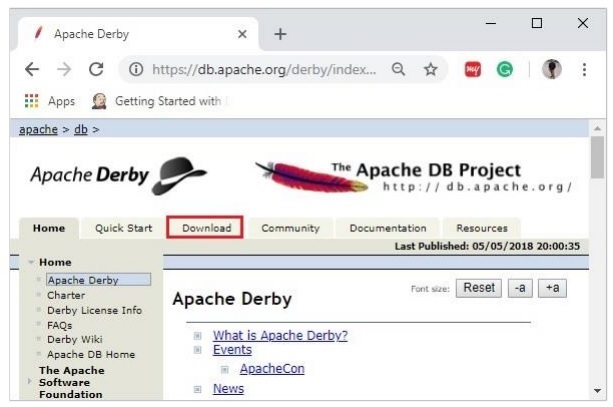
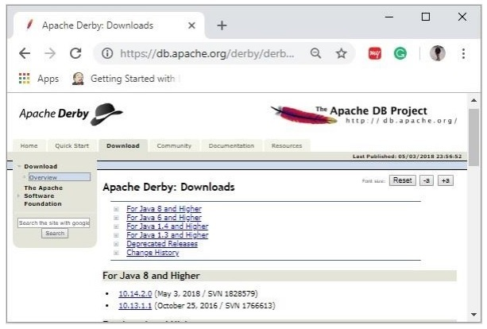
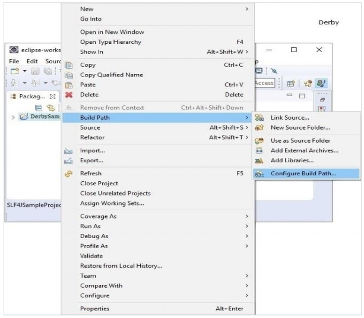
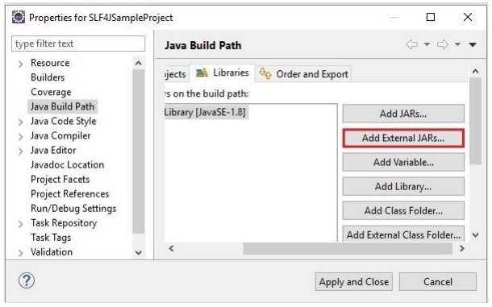

# Apache Derby - Environment Setup
Following chapter explains how to download and install Apache Derby.

## Downloading Apache Derby
Visit the home page of Apache Derby home page [https://db.apache.org/derby/](https://db.apache.org/derby/) . Click the Download tab.



Select and click on the link of the latest version of Apache Derby.



On clicking the selected link, you will be redirected to the **Distributions** page of apache derby. If you observe here, derby provides distributions namely, db-derby-bin, db-derbylib.zip, db-derby-lib-debug.zip, and db-derby-src.zip.

Download the **db-derby-bin** folder. Copy its contents to a separate folder where you wanted to install Apache Derby. (for example, say **C:\Derby**)

Now, to work with Derby,

   * Make sure that you already have set the **JAVA_HOME** variable by passing the location of bin folder of Java Installation folder, and include the **JAVA_HOME/bin** in the PATH variable.
   * Create a new environment variable, **DERBY_HOME** with value C:\Derby.
   * The bin folder of db-derby-bin distributions (we changed it as C:\Derby\bin) contains all the required jar files.

As discussed, Apache Derby can be installed/deployed in two ways as follows −

   * **Embedded mode** − In this, you need to access the database using Embedded Derby JDBC driver. You can start and stop derby through Java application. Both Database engine and your application will run on the same JVM.
   * **Network Server mode** − In this mode, you can access Derby in a typical clientserver fashion, where Derby is embedded in the server system. Then, the client machines running in different JVM’s (that of the Server) will send requests to the server, and the server responds to those requests.

The client can be another JVM in the same system machine of the server or a Java application from a remote system.

## Installing Derby in Embedded Mode
To install Apache Derby in embedded mode, include the jar file **derby.jar** in your CLASSPATH.

Or, you can set the classpath for required jar files by running the **setEmbeddedCP** command. Browse through the **bin** directory of Apache Derby and run this file as shown below −

```
C:\Users\MYUSER>cd %DERBY_HOME%/bin
C:\Derby\bin>setEmbeddedCP.bat
C:\Derby\bin>SET DERBY_HOME=C:\Derby
C:\Derby\bin>set
CLASSPATH=C:\Derby\lib\derby.jar;C:\Derby\lib\derbytools.jar;C:\Derby/lib/derby
optionaltools.jar;C:\Users\Tutorialspoint\Google
Drive\Office\Derby\derby_zip\New folder\db-derby-10.12.1.1-
bin\lib;C:\EXAMPLES_\Task\jars\*;C:\EXAMPLES\jars\mysql-connector-java-5.1.40-
bin.jar;C:\Users\Tutorialspoint\Google Drive\Office\37.Junit
Update\jars;C:\Program Files\Apache Software Foundation\Tomcat
8.5\lib\*;C:\Derby\lib\*;
```
After setting up Apache Derby, to access it, run Java programs using the embedded driver.

### Verification
You can verify the setup using the **ij** tool as shown below −

```
C:\Derby\bin>ij
ij version 10.14
ij> connect 'jdbc:derby:SampleDB;create=true';
ij>
```
## Installing Derby in Network Server Mode
To install Apache Derby in network server mode, you need to include **derbynet.jar** and **derbytools.jar** files to the CLASSPATH.

Or, you can set the class path for required jar files by running the **setNetworkServerCP** command. Browse through the **bin** directory of Apache Derby and run this file as shown below −

```
C:\Users\MYUSER>cd %DERBY_HOME%/bin
C:\Derby\bin>setNetworkServerCP.bat
C:\Derby\bin>SET DERBY_INSTALL=C:\Derby
C:\Derby\bin>set
CLASSPATH=C:\Derby\lib\derbynet.jar;C:\Derby\lib\derbytools.jar;C:\Derby/lib/de
rbyoptionaltools.jar;C:\Users\Tutorialspoint\Google
Drive\Office\Derby\derby_zip\New folder\db-derby-10.12.1.1-
bin\lib;C:\EXAMPLES_\Task\jars\*;C:\EXAMPLES\jars\mysql-connector-java-5.1.40-
bin.jar;C:\Users\Tutorialspoint\Google Drive\Office\37.Junit
Update\jars;C:\Program Files\Apache Software Foundation\Tomcat
8.5\lib\*;C:\Derby\lib\*;
```
### Starting Derby in Server Mode
You can start Network Server by running the command **startNetworkServer**. Browse through the **bin** directory of Apache Derby and run this command as shown below −

```
C:\Derby\bin>startNetworkServer
Fri Jan 04 11:20:30 IST 2019 : Security manager installed using the Basic
server security policy.
Fri Jan 04 11:20:30 IST 2019 : Apache Derby Network Server - 10.14.2.0 -
(1828579) started and ready to accept connections on port 1527
```
Or, you can start the server using **derbyrun.jar** as shown below −

```
C:\Users\MYUSER>cd %DERBY_HOME%/lib
C:\Derby\lib>java -jar derbyrun.jar server start
Fri Jan 04 11:27:20 IST 2019: Security manager installed using the Basic server
security policy.
Fri Jan 04 11:27:21 IST 2019: Apache Derby Network Server - 10.14.2.0 -
(1828579) started and ready to accept connections on port 1527
```
### Network Client
In client, add the jar files **derbyclient.jar** and **derbytools.jar** to the CLASSPATH. Or, run the **setNetworkClientCP** command as shown below −

```
C:\Users\MYUSER>cd %DERBY_HOME%/bin
C:\Derby\bin>setNetworkClientCP
C:\Derby\bin>SET DERBY_HOME=C:\Derby
C:\Derby\bin>set
CLASSPATH=C:\Derby\lib\derbyclient.jar;C:\Derby\lib\derbytools.jar;C:\Derby/lib
/derbyoptionaltools.jar;C:\Derby\lib\derby.jar;C:\Derby\lib\derbytools.jar;C:\D
erby/lib/derbyoptionaltools.jar;C:\Users\Tutorialspoint\Google
Drive\Office\Derby\derby_zip\New folder\db-derby-10.12.1.1-
bin\lib;C:\EXAMPLES_\Task\jars\*;C:\EXAMPLES\jars\mysql-connector-java-5.1.40-
bin.jar;C:\Users\Tutorialspoint\Google Drive\Office\37.Junit
Update\jars;C:\Program Files\Apache Software Foundation\Tomcat
8.5\lib\*;C:\Derby\lib\*;
```
Then from this client, you can send requests to the server.

### Verification
You can verify the setup using the **ij** tool as shown below −

```
C:\Derby\bin>ij
ij version 10.14
ij> connect 'jdbc:derby://localhost:1527/SampleDB;create=true';
ij>
```
## Apache Derby Eclipse Environment
While working with Eclipse, you need to set the build path for all the required jar files.

### Step 1: Create a project and set build path
Open eclipse and create a sample project. Right click on the project and select the option **Build Path -> Configure Build** Path as shown below −



In the **Java Build Path** frame in the **Libraries** tab, click on **Add External JARs**.



And select the required **jar** files in the lib folder of the Derby installation folder and click on **Apply and Close**.


[Previous Page](../apache_derby/apache_derby_deployment_modes.md) [Next Page](../apache_derby/apache_derby_tools.md) 
