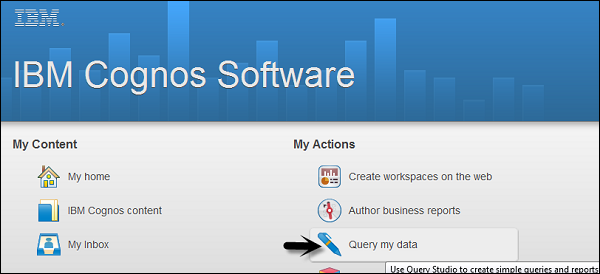
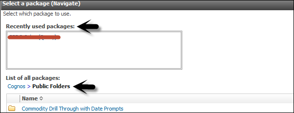
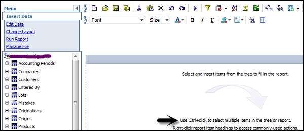
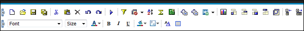

# Cognos - Ad-hoc Reports
Using ad-hoc reporting, a user can create queries or reports for ad-hoc analysis. Ad-hoc reporting feature allows business users to create simple queries and reports on the top of fact and dimension table in data Warehouse.

The Query Studio in Cognos BI, provides the following features −

   * View data and perform ad-hoc data analysis.
   * Save the report for future use.
   * Work with data in the report by applying filters, summaries and calculations.
   * To create ad-hoc report using query studio, login to IBM Cognos software and click on Query my data.

Select the report package. Next time you visit this page; you will see your selection under the recently used packages. Click on the package name.

In the next screen, you can add Dimension elements, filters and prompts, facts and calculation, etc.

You should insert the objects in this order. To insert object in the report, you can use Insert button at the bottom.

   * Insert and filter dimension elements
   * Insert filters and prompts
   * Insert facts and calculations
   * Apply finishing touches
   * Save, run, collaborate, and share

At the top, you have the tool bar, where you can create a new report, save existing report, cut, paste, insert charts, drill up and down, etc.

When you insert all the objects to a report, you can click on the Run option () at the top.

[Previous Page](../cognos/cognos_query_studio.md) [Next Page](../cognos/cognos_report_types.md) 
