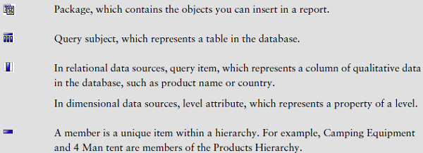
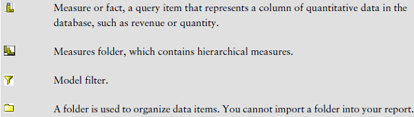

# Cognos - Add Data to a Report
You can add objects from a data source. Each object has a representative icon and can insert all the following objects to a report.

[Previous Page](../cognos/cognos_open_an_existing_report.md) [Next Page](../cognos/cognos_saving_a_report.md) 
