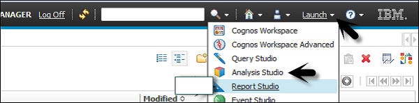
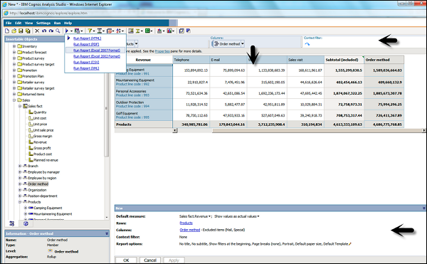

# Cognos - Create an Analysis
To create an analysis in the Analysis studio, you have to select a package as data source. You can create a new analysis or use an existing analysis as reference to create a new analysis by changing its name before saving it.

To create an Analysis − Select the Package you want to use from the Public folder. Go to Report Studio as shown in the following screenshot.

In a new dialog window, select a Blank Analysis or Default Analysis.

   * **Blank Analysis** − A blank analysis starts with a blank crosstab in the work area.
   * **Default Analysis** − A default analysis uses the default analysis for the package as defined in Cognos Connection or the first two dimensions in the data source for the crosstab rows and columns and the first measure in the data source for the crosstab measure.

After selecting, click OK. The Analysis Studio starts. The items that you can use in the analysis are listed in the Insertable Objects pane.

[Previous Page](../cognos/cognos_analysis_studio.md) [Next Page](../cognos/cognos_save_an_analysis.md) 
