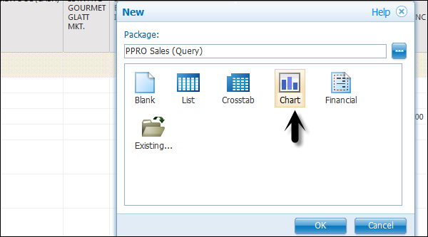
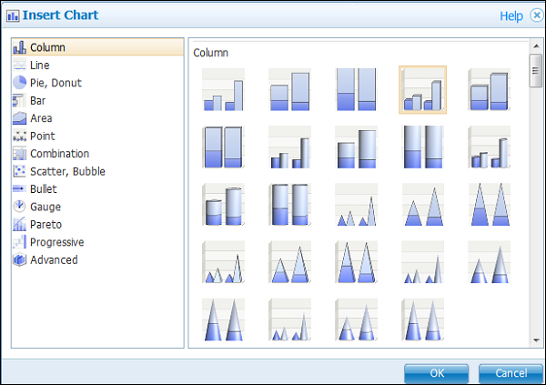
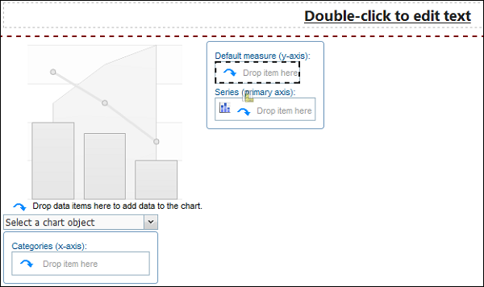
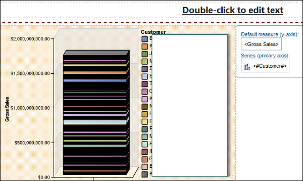

# Cognos - Creating a Chart
In Report Studio, you can create many chart types like column, bar, area, line charts or a custom chart that combines these chart types.

In the Source tab, expand the query.

   * Drag Revenue to the Measure (y-axis) drop zone.
   * Drag Current year to the Series drop zone.
   * Drag Order to the Categories (x-axis) drop zone.

Drag the objects as shown in the above screenshot.

Save the chart using the tool bar at the top. Save it to Public or My Folder as mentioned in the previous topic. Run the report to see the result in a chart format.

You can also create a Repeater table or a map report in Cognos Report Studio.

[Previous Page](../cognos/cognos_crosstab_report.md) [Next Page](../cognos/cognos_report_functions.md) 
