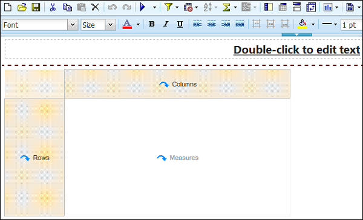
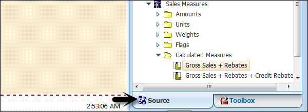
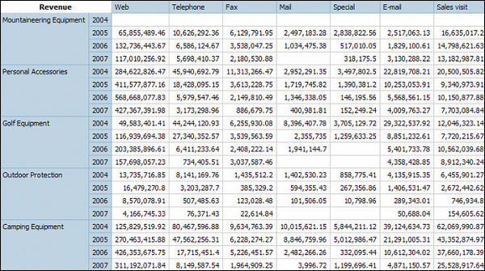
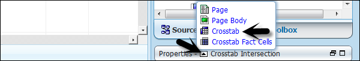
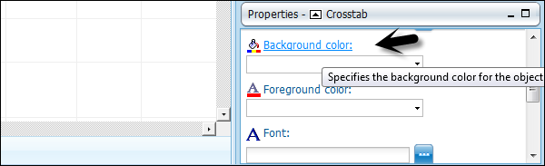
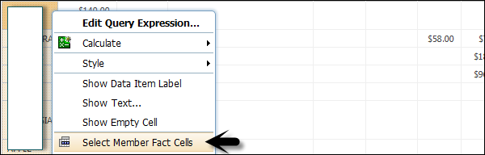

# Cognos - Crosstab Report
You will be prompted to select the type of report you want to create. You have option to select from different report types.

Select Crosstab as type of the report and click OK.

The structure of a Crosstab report is opened as shown in the following screenshot.

In the Insertable Objects pane, on the Source tab, click the data item you want to add to the crosstab and drag it to the Rows or Columns.

A black bar indicates where you can drop the data item. Repeat the above given steps to insert additional data items.

You add dimensions to rows or columns and to add measures to the crosstab, drag the measures you want to Measures.

When you run the report, a crosstab report is generated that has one edge.

## Formatting a Crosstab
You can also format the crosstab to give them appearance as per the requirement. When you specify formatting for all rows, columns, fact cells, or the crosstab, the formatting is automatically applied to any new items you add.

### Crosstab Style order
When you apply styles such as font color, rows and columns, intersections this is applied in the following order.

   * Crosstab fact cells
   * Fact cells in the outermost rows
   * Fact cells in the innermost rows
   * Fact cells in the outermost columns
   * Fact cells in the innermost columns
   * Crosstab intersections

To do formatting of crosstab, click anywhere in the Crosstab. Click the select ancestor button in the title bar of the Properties pane and then click Crosstab as shown in the following screenshot.

In the Properties pane, click the property you want and then specify a value. For example, if you want to specify a background color, click on Background Color and choose the color you want to use.

You can also right-click the row or column and click Select Member Fact Cells. In the Properties pane, click the property you want and then specify a value.

[Previous Page](../cognos/cognos_list_report.md) [Next Page](../cognos/cognos_creating_a_chart.md) 
