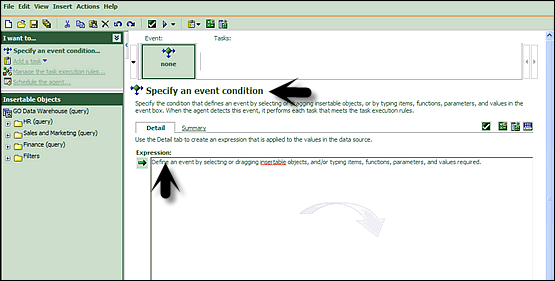

# Cognos - Event Studio
Cognos Event Studio is a Web-based tool that allows you to create and manage agents to monitor data and perform tasks when the data meets predefined thresholds.

## Events
You can specify an event condition to perform a task. An event is defined as query expression in a data package.

When a record matches the event condition, it causes an agent to perform tasks. When an agent runs, it checks the data for any event instances.

## Event Instance
An agent monitors data, each event instance is detected. Task execution rules are followed to determine if an agent will perform the task. Task frequency defines that a task should be performed once or repeated for each event instance.

## Event List
You can categorize the event as per the task performed. The event list shows all the events that are executed by an agent. Different event categorization includes −

   * New
   * Ongoing and Changed
   * Ongoing and Unchanged
   * Ceased

An event key is used to determine whether an event is new, ongoing but changed, ongoing and unchanged, or ceased. Event Studio compares the event instances detected in each agent run with those detected in the previous run. To ensure it correctly matches the event instances for comparison, you must define an event key. The event key is the combination of data items that uniquely defines an event instance.

## Agent
An agent runs to check occurrences of the event. An agent performs a task for events that meet the execution rules.

## Tasks
A task can be used to notify users about a change in business event. Users can take appropriate actions as per the event.

You can create a task for the following functions −

   * Add an Item
   * Send an Email
   * Publish a new item
   * Run a Job
   * Run an import
   * Run an Export and many more.

[Previous Page](../cognos/cognos_open_existing_analysis.md) [Next Page](../cognos/cognos_notification_methods.md) 
