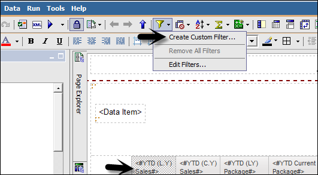
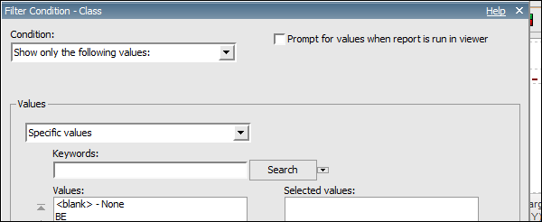
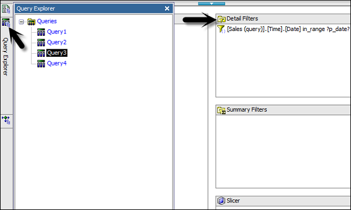
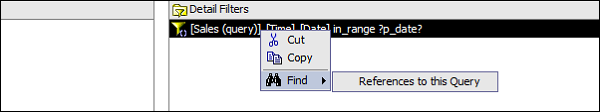

# Cognos - Filters
Filters are used to limit the data that you want in your report. You can apply one or more filters in a Cognos report and the report returns the data that meet the filter conditions. You can create various custom filters in a report as per the requirement.

   * Select the column to filter by.
   * Click the drop down list from the Filter button.
   * Choose Create Custom Filter.
   * The Filter Condition dialog displays.

In the next window, define the filter’s parameters.

   * **Condition** − click the list arrow to see your choices (Show or Don’t show the following values).
   * **Values** − click the list arrow to see your choices.
   * **Keywords** − allows you to search for specific values within the values list.
   * **Values List** − shows the field values which you can use as filter values. You can select one or many. Use the arrow button to add multiple values.

Select a value and click the right pointing arrow to move the value into the selected column. You can use the Ctrl key to add multiple values at tone time. Click OK when the filter is defined.

## Deleting a Filter
A filter can be deleted by using the following steps −

   * Go to the Query Explorer as shown in the above screenshot
   * Click on Query and Locate the Detail Filters pane in the upper right side of the window as shown in above screenshot
   * Select the filter that you want to delete and press the delete button
   * You can also cut/copy a filter

[Previous Page](../cognos/cognos_report_administration.md) [Next Page](../cognos/cognos_custom_calculations.md) 
