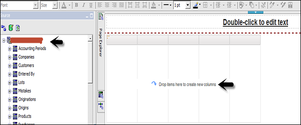
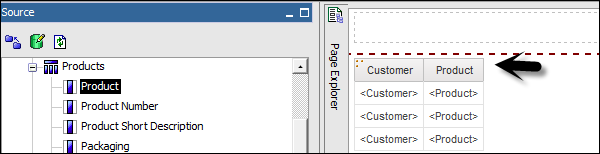
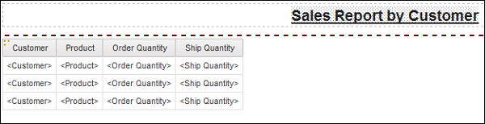
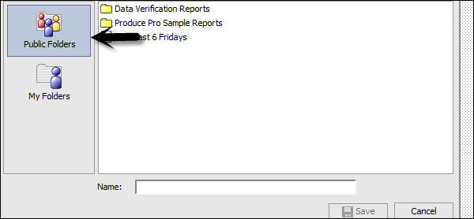
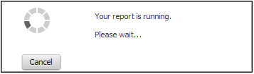
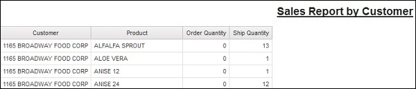

# Cognos - List Report
A list report that shows the data in rows and columns and each cell shows the data in the database or you can also add custom calculations in a list report.

To create a new list report, go to New → Blank as shown in the following screenshot.

When you select a list report, you get the following structure of the report in the Report Studio. You have to drag the objects from the package on the left side to the report structure.

You can also edit the title of the report that will appear once you run the report.

You can use different tools at the top for the report formatting. To save a report, click on the save button. To run a report, click on Run  report.

Once you save the report, you have an option to save it in the Public folder or My folder.

When you click on the Run option, you can select different formats to run the report.

[Previous Page](../cognos/cognos_report_templates.md) [Next Page](../cognos/cognos_crosstab_report.md) 
