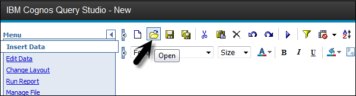
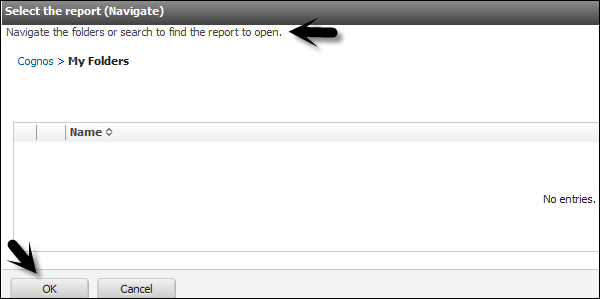

# Cognos - Open an Existing Report
You can open an existing report in the Query Studio and save it with a different name after making changes.

To open an existing report, locate and click the name of the report you want to open.

The report opens in the Query Studio. You can use the Open with Query Studio  to identify a Query Studio report in the Cognos Connection.

Or you can launch Query Studio and go to open option at the top.

Search the report in the list of Available folders → OK

[Previous Page](../cognos/cognos_creating_a_report.md) [Next Page](../cognos/cognos_add_data_to_report.md) 
