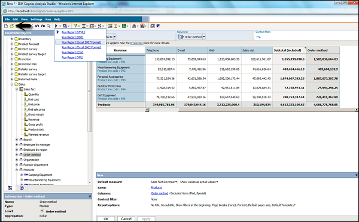

# Cognos - Open Existing Analysis
To open an existing Analysis, locate the name of the analysis that you want to open and click it. It is opened in Analysis Studio.

You can make any changes as per the requirement. Save the analysis.

You can also open a new analysis while working in an existing analysis, click the new button on the toolbar. The new analysis maintains the state of the source tree in the Insertable Objects pane and maintains any items on the Analysis Items tab.

[Previous Page](../cognos/cognos_save_an_analysis.md) [Next Page](../cognos/cognos_event_studio.md) 
