# Cognos - Quick Guide
# Data Warehouse - Overview
A Data Warehouse consists of data from **multiple heterogeneous data sources** and is used for analytical reporting and decision making. Data Warehouse is a central place where data is stored from different data sources and applications.

The term Data Warehouse was first invented by Bill Inmom in 1990. A Data Warehouse is always kept separate from an Operational Database.

The data in a DW system is loaded from operational transaction systems like −

   * Sales
   * Marketing
   * HR
   * SCM, etc.

It may pass through operational data store or other transformations before it is loaded to the DW system for information processing.

A Data Warehouse is used for reporting and analyzing of information and stores both historical and current data. The data in DW system is used for Analytical reporting, which is later used by Business Analysts, Sales Managers or Knowledge workers for decision-making.


In the above image, you can see that the data is coming from **multiple heterogeneous data** sources to a Data Warehouse. Common data sources for a data warehouse includes −

   * Operational databases
   * SAP and non-SAP Applications
   * Flat Files (xls, csv, txt files)

Data in data warehouse is accessed by BI (Business Intelligence) users for Analytical Reporting, Data Mining and Analysis. This is used for decision making by Business Users, Sales Manager, Analysts to define future strategy.

## Features of a Data Warehouse
It is a central data repository where data is stored from one or more heterogeneous data sources. A DW system stores both current and historical data. Normally a DW system stores 5-10 years of historical data. A DW system is always kept separate from an operational transaction system.

The data in a DW system is used for different types of analytical reporting range from Quarterly to Annual comparison.

### Data Warehouse Vs Operational Database
The differences between a Data Warehouse and Operational Database are as follows −

   * An **Operational System** is designed for known workloads and transactions like updating a user record, searching a record, etc. However, Data Warehouse transactions are more complex and present a general form of data.
   * An **Operational System** contains the current data of an organization and Data warehouse normally contains the historical data.
   * An **Operational Database** supports parallel processing of multiple transactions. Concurrency control and recovery mechanisms are required to maintain consistency of the database.
   * An **Operational Database** query allows to read and modify operations (insert, delete and Update) while an OLAP query needs only read-only access of stored data (Select statement).

## Architecture of Data Warehouse
Data Warehousing involves data cleaning, data integration, and data consolidations. A Data Warehouse has a 3-layer architecture −

### Data Source Layer
It defines how the data comes to a Data Warehouse. It involves various data sources and operational transaction systems, flat files, applications, etc.

### Integration Layer
It consists of Operational Data Store and Staging area. Staging area is used to perform data cleansing, data transformation and loading data from different sources to a data warehouse. As multiple data sources are available for extraction at different time zones, staging area is used to store the data and later to apply transformations on data.

### Presentation Layer
This is used to perform BI reporting by end users. The data in a DW system is accessed by BI users and used for reporting and analysis.

The following illustration shows the common architecture of a Data Warehouse System.


## Characteristics of a Data Warehouse
The following are the key characteristics of a Data Warehouse −

   * **Subject Oriented** − In a DW system, the data is categorized and stored by a business subject rather than by application like equity plans, shares, loans, etc.
   * **Integrated** − Data from multiple data sources are integrated in a Data Warehouse.
   * **Non Volatile** − Data in data warehouse is non-volatile. It means when data is loaded in DW system, it is not altered.
   * **Time Variant** − A DW system contains historical data as compared to Transactional system which contains only current data. In a Data warehouse you can see data for 3 months, 6 months, 1 year, 5 years, etc.

## OLTP vs OLAP
Firstly, OLTP stands for **Online Transaction Processing**, while OLAP stands for **Online Analytical Processing**

In an OLTP system, there are a large number of short online transactions such as INSERT, UPDATE, and DELETE.

Whereas, in an OLTP system, an effective measure is the processing time of short transactions and is very less. It controls data integrity in multi-access environments. For an OLTP system, the number of transactions per second measures the effectiveness. An OLTP Data Warehouse System contains current and detailed data and is maintained in the schemas in the entity model (3NF).

**For Example** −

A Day-to-Day transaction system in a retail store, where the customer records are inserted, updated and deleted on a daily basis. It provides faster query processing. OLTP databases contain detailed and current data. The schema used to store OLTP database is the Entity model.

In an OLAP system, there are lesser number of transactions as compared to a transactional system. The queries executed are complex in nature and involves data aggregations.

### What is an Aggregation?
We save tables with aggregated data like yearly (1 row), quarterly (4 rows), monthly (12 rows) or so, if someone has to do a year to year comparison, only one row will be processed. However, in an un-aggregated table it will compare all the rows. This is called Aggregation.

There are various Aggregation functions that can be used in an OLAP system like Sum, Avg, Max, Min, etc.

**For Example** −

```
SELECT Avg(salary)
FROM employee
WHERE title = 'Programmer';
```
### Key Differences
These are the major differences between an OLAP and an OLTP system.

   * **Indexes** − An OLTP system has only few indexes while in an OLAP system there are many indexes for performance optimization.
   * **Joins** − In an OLTP system, large number of joins and data are normalized. However, in an OLAP system there are less joins and are de-normalized.
   * **Aggregation** − In an OLTP system, data is not aggregated while in an OLAP database more aggregations are used.
   * **Normalization** − An OLTP system contains normalized data however data is not normalized in an OLAP system.


## Data Mart Vs Data Warehouse
Data mart focuses on a single functional area and represents the simplest form of a Data Warehouse. Consider a Data Warehouse that contains data for Sales, Marketing, HR, and Finance. A Data mart focuses on a single functional area like Sales or Marketing.


In the above image, you can see the difference between a Data Warehouse and a data mart.

## Fact vs Dimension Table
A fact table represents the measures on which analysis is performed. It also contains foreign keys for the dimension keys.

**For example** − Every sale is a fact.

The Dimension table represents the characteristics of a dimension. A Customer dimension can have Customer_Name, Phone_No, Sex, etc.

# Data Warehouse - Schemas
A schema is defined as a logical description of database where fact and dimension tables are joined in a logical manner. Data Warehouse is maintained in the form of Star, Snow flakes, and Fact Constellation schema.

## Star Schema
A Star schema contains a fact table and multiple dimension tables. Each dimension is represented with only one-dimension table and they are not normalized. The Dimension table contains a set of attributes.

### Characteristics
   * In a Star schema, there is only one fact table and multiple dimension tables.
   * In a Star schema, each dimension is represented by one-dimension table.
   * Dimension tables are not normalized in a Star schema.
   * Each Dimension table is joined to a key in a fact table.

The following illustration shows the sales data of a company with respect to the four dimensions, namely Time, Item, Branch, and Location.


There is a fact table at the center. It contains the keys to each of four dimensions. The fact table also contains the attributes, namely dollars sold and units sold.

**Note** − Each dimension has only one-dimension table and each table holds a set of attributes. For example, the location dimension table contains the attribute set {location_key, street, city, province_or_state, country}. This constraint may cause data redundancy.

**For example** − "Vancouver" and "Victoria" both the cities are in the Canadian province of British Columbia. The entries for such cities may cause data redundancy along the attributes province_or_state and country.

## Snowflakes Schema
Some dimension tables in the Snowflake schema are normalized. The normalization splits up the data into additional tables as shown in the following illustration.


Unlike in the Star schema, the dimension’s table in a snowflake schema are normalized.

**For example** − The item dimension table in a star schema is normalized and split into two dimension tables, namely item and supplier table. Now the item dimension table contains the attributes item_key, item_name, type, brand, and supplier-key.

The supplier key is linked to the supplier dimension table. The supplier dimension table contains the attributes supplier_key and supplier_type.

**Note** − Due to the normalization in the Snowflake schema, the redundancy is reduced and therefore, it becomes easy to maintain and the save storage space.

## Fact Constellation Schema (Galaxy Schema)
A fact constellation has multiple fact tables. It is also known as a Galaxy Schema.

The following illustration shows two fact tables, namely Sales and Shipping −


The sales fact table is the same as that in the Star Schema. The shipping fact table has five dimensions, namely item_key, time_key, shipper_key, from_location, to_location. The shipping fact table also contains two measures, namely dollars sold and units sold. It is also possible to share dimension tables between fact tables.

**For example** − Time, item, and location dimension tables are shared between the sales and shipping fact table.

# Data Warehouse - ETL & Reporting Tools
An ETL tool extracts the data from all these heterogeneous data sources, transforms the data (like applying calculations, joining fields, keys, removing incorrect data fields, etc.), and loads it into a Data Warehouse.

## Extraction
A staging area is required during the ETL load. There are various reasons why staging area is required. The source systems are only available for specific period of time to extract data. This period of time is less than the total data-load time. Therefore, staging area allows you to extract the data from the source system and keeps it in the staging area before the time slot ends.

The staging area is required when you want to get the data from multiple data sources together or if you want to join two or more systems together.

**For example** − You will not be able to perform an SQL Query joining two tables from two physically different databases.

The data extractions’ time slot for different systems vary as per the time zone and operational hours. The data extracted from the source systems can be used in multiple Data Warehouse Systems, Operation Data Stores, etc.

ETL allows you to perform complex transformations and requires extra area to store the data.


## Transform
In data transformation, you apply a set of functions on extracted data to load it into the target system. The data that does not require any transformation is known as a direct move or pass through data.

You can apply different transformations on extracted data from the source system. For example, you can perform customized calculations. If you want sum-of-sales revenue and this is not in database, you can apply the SUM formula during transformation and load the data.

**For example** − If you have the first name and the last name in a table in different columns, you can use concatenate before loading.

## Load
During the Load phase, data is loaded into the end-target system and it can be a flat file or a Data Warehouse system.

## BI Reporting Tool
BI (Business Intelligence) tools are used by business users to create basic, medium, and complex reports from the transactional data in data warehouse and by creating Universes using the **Information Design Tool/UDT**. Various SAP and non-SAP data sources can be used to create reports.

There are quite a few BI Reporting, Dashboard and Data Visualization Tools available in the market. Some of which are as follows − 

   * SAP Business Objects Web Intelligence (WebI)
   * Crystal Reports
   * SAP Lumira
   * Dashboard Designer
   * IBM Cognos
   * Microsoft BI Platform
   * Tableau Business Intelligence
   * JasperSoft
   * Oracle BI OBIEE
   * Pentaho
   * QlickView
   * SAP BW
   * SAS Business Intelligence
   * Necto
   * Tibco Spotfire

# Cognos - Introduction
IBM Cognos Business Intelligence is a **web based reporting and analytic tool**. It is used to perform data aggregation and create user friendly detailed reports. Reports can contain Graphs, Multiple Pages, Different Tabs and Interactive Prompts. These reports can be viewed on web browsers, or on hand held devices like tablets and smartphones.

Cognos also provides you an option to export the report in XML or PDF format or you can view the reports in XML format. You can also schedule the report to run in the background at specific time period so it saves the time to view the daily report as you don’t need to run the report every time.

IBM Cognos provides a wide range of features and can be considered as an enterprise software to provide flexible reporting environment and **can be used for large and medium enterprises**. It meets the need of Power Users, Analysts, Business Managers and Company Executives. Power users and analysts want to create adhoc reports and can create multiple views of the same data. Business Executives want to see summarize data in dashboard styles, cross tabs and visualizations. Cognos allows both the options for all set of users.

## Key Features of IBM Cognos
Cognos BI reporting allows you to bring the data from multiple databases into a single set of reports. IBM Cognos provides wide range of features as compared to other BI tools in the market. You can create and schedule the reports and complex report can be designed easily in the Cognos BI Reporting Tool.

The Cognos BI Reporting Tool allows to create a report for a set of users like – Power users, Analysts, and Business Executives, etc. IBM Cognos can handle a large volume of data and is suitable for medium and large enterprises to fulfil BI needs.

### 3-Tier Architecture Cognos
Cognos BI is considered to be a 3-tier architecture layout. At the top, there is a Web Client or a Web Server. The 2 tier consists of a Web Application Server. While the bottom tier consists of a Data layer.

These tiers are separated by firewalls and communication between these tiers happens using SOAP and HTTP protocols.

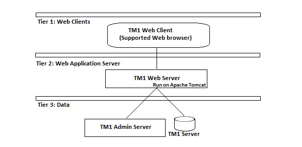

### Tier-1 Web Clients
The web client allows BI users to access TM1 data and interact with data in any of the supported browsers. Tier 1 is responsible to manage the gateway and is used for encryption and decryption of passwords, extract information needed to submit a request to the BI server, authentication of server and to pass the request to Cognos BI dispatcher for processing.

### Tier-2 Web Application Server
This tier hosts the Cognos BI server and its associated services. Application server contains Application Tier Components, Content Manager and Bootstrap service.

Cognos TM1 Web Application Server runs on Java based Apache Tomcat server. Using this tier, Microsoft Excel worksheets can be converted to TM1 Web sheets and also allows to export web sheets back to Excel and PDF format.

### Tier-3 Data
This tier contains content and data sources. It contains TM1 Admin server and at least one TM1 server.

TM1 Admin server can be installed on any computer on your LAN and it must reside on same network as TM1 server. The version of TM1 server should be equal or most recent then the version of Cognos TM1 web.

## Cognos Versions
In this section we will discuss the different versions of Cognos.

### Cognos Query Version 7
### Cognos 8 BI
### Cognos tm1
And then there were different sub-versions of the – Cognos Business Intelligence 10, which were −

   * IBM Cognos Business Intelligence 10.1
   * IBM Cognos Business Intelligence 10.1.1
   * IBM Cognos Business Intelligence 10.2
   * IBM Cognos Business Intelligence 10.2.1
   * IBM Cognos Business Intelligence 10.2.2
   * IBM Cognos Business Intelligence 11.0.0

## Cognos vs Other BI Reporting Tools
There are various other BI reporting tools in the market that are used in medium and large enterprise for analytics and reporting purpose. Some of them are described here along with its key features.

### Cognos vs Microsoft BI (Source: www.trustradius.com)
Following are the key features that are supported by both the tools −

   * Standard Reporting
   * Ad-hoc Reporting
   * Report output and Scheduling
   * Data Discovery and Visualization
   * Access Control and Security
   * Mobile Capabilities

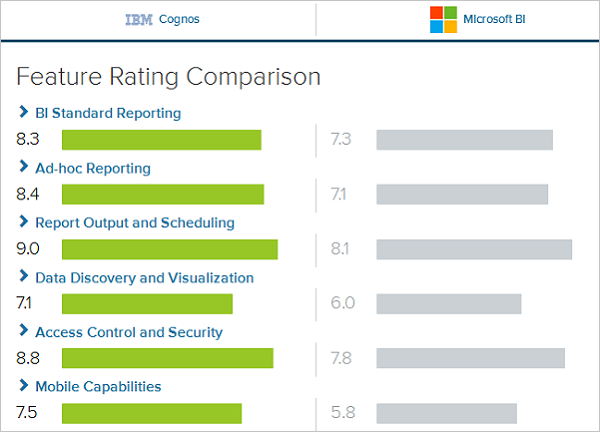

Cognos can be considered as a robust solution which allows you to create a variety of reports like Cross tabs, Active reports (latest feature in Cognos 10), and other report structure. You can create user prompts, scheduling of report is easy and you can export and view reports in different formats. The Microsoft BI provides easy visualization of business data as well as Easy integration with Microsoft Excel.

## IBM Cognos vs SAP Business Objects
SAP BO supports its own ETL tool SAP Data Services. IBM Cognos doesn’t support its own ETL tool. The IBM Cognos 8 doesn’t provide offline reporting features however it is there in SAP Business Objects reporting tools.

In Cognos the entire functionality is divided into multiple tools Query studio, Analysis studio, event studio etc. It is a tough task to learn all the tools. In SAP Business Objects, you have multiple tools like Web Intelligence for reporting, IDT for Universe Designer, Dashboard Designer so users feel that it is a tough task to manage and learn all the tools.

In IBM Cognos, data generated can be transformed in various formats (for instance, HTML, PDF, etc.) and can also be accessed from multiple locations (e-mail, mobile, office, etc.). IBM provides several planning capabilities such as forecasts, budgets, advance scenario modelling etc. Selection of BI tool depends on various factors like need of company, software version, features supported and the license cost.

# Cognos - Components and Services
There are various components in Cognos that communicate with each other using BI Bus and are known as Simple Object Access Protocol (SOAP) and supports WSDL. BI Bus in Cognos architecture is not a software component but consists of a set of protocols that allows communication between Cognos Services.

The processes enabled by the BI Bus protocol includes −

   * Messaging and dispatching
   * Log message processing
   * Database connection management
   * Microsoft .NET Framework interactions
   * Port usage
   * Request flow processing
   * Portal Pages

When you install Cognos 8 using the Installation wizard, you specify where to install each of these components −

## Gateways
The Cognos 8 Web server tier contains one or more Cognos 8 gateways. The web communication in Cognos 8 is typically through gateways, which reside on one or more web servers. A gateway is an extension of a web server program that transfers information from the web server to another server. Web communication can also occur directly with a Cognos 8 dispatcher but this option is less common.

Cognos 8 supports several types of Web gateways, including −

   * **CGI** − The default gateway, CGI can be used for all supported Web servers. However, for enhanced performance or throughput, you may choose one of the other supported gateway types.
   * **ISAPI** − This can be used for the Microsoft Internet Information Services (IIS) Web server. It delivers faster performance for IIS.
   * **apache_mod** − You can use an apache_mod gateway with the Apache Web server.
   * **Servlet** − If your Web server infrastructure supports servlets or you are using an application server, you can use a servlet gateway.

## Application Tier Components
This component consists of a dispatcher that is responsible to operate services and route requests. The dispatcher is a multithreaded application that uses one or more threads per request. The configuration changes are routinely communicated to all the running dispatchers. This dispatcher includes Cognos Application Firewall to provide security for Cognos 8.

The dispatcher can route requests to a local service, such as the report service, presentation service, job service, or monitor service. A dispatcher can also route requests to a specific dispatcher to run a given request. These requests can be routed to specific dispatchers based on load-balancing needs, or package or user group requirements.

## Content Manager
Content Manager contains Access Manager, the primary security component of Cognos 8. Access Manager leverages your existing security providers for use with Cognos 8. It provides Cognos 8 with a consistent set of security capabilities and APIs, including user authentication, authorization, and encryption. It also provides support for the Cognos namespace.

# Cognos - Connections
You can report interactive user reports in Cognos Studio on the top of various data sources by creating relational and OLAP connections in web administration interface which are later used for data modeling in Framework Manager known as packages. All the reports and dashboards that are created in Cognos Studio they are published to Cognos Connection and portal for distribution. The report studio can be used to run the complex report and to view the Business Intelligence information or this can also be accessed from different portals where they are published.

Cognos Connections are used to access reports, queries, analysis, and packages. They can also be used to create report shortcuts, URLs and pages and to organize entries and they can also be customized for other use.

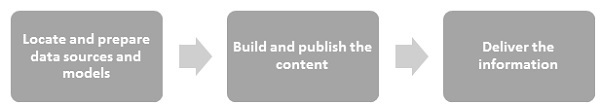

## Connecting Different Data Sources
A data source defines the physical connection to a database and different connection parameters like connection time out, location of database, etc. A data source connection contains credential and sign on information. You can create a new database connection or can also edit an existing data source connection.

You can also combine one or more data source connections and create packages and published them using Framework manager.

### Dynamic Query Mode
The dynamic query mode is used to provide communication to data source using XMLA/Java connections. To connect to the Relation database, you can use type4 JDBC connection which converts JDBC calls into vendor specific format. It provides improved performance over type 2 drivers because there is no need to convert calls to ODBC or database API. Dynamic query mode in Cognos connection can support the following types of Relational databases −

   * Microsoft SQL Server
   * Oracle
   * IBM DB2
   * Teradata
   * Netezza

To support OLAP data sources, Java/XMLA connectivity provides optimized and enhanced MDX for different OLAP versions and technology. The Dynamic query mode in Cognos can be used with the following OLAP data sources −

   * SAP Business Information Warehouse (SAP BW)
   * Oracle Essbase
   * Microsoft Analysis Services
   * IBM Cognos TM1
   * IBM Cognos Real-time Monitoring

### DB2 Data Sources
The DB2 connection type are used to connect to DB2 Windows, Unix and Linux, Db2 zOS, etc.

The common connection parameters used in DB2 data source includes −

   * Database Name
   * Timeouts
   * Signon
   * DB2 connect string
   * Collation Sequence

## Creating a Data Source Connection in IBM Cognos
To create models in IBM Cognos Framework Manager, there is a need to create a data source connection. When defining the data source connection, you need to enter the connection parameters – location of database, timeout interval, Sign-on, etc.

In IBM Cognos Connection → click on the **Launch IBM Cognos Administration**

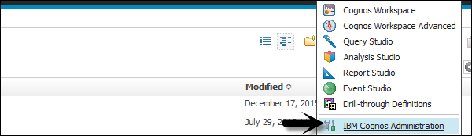

In the Configuration tab, click Data Source Connections. In this window, navigate to the **New Data Source button**.

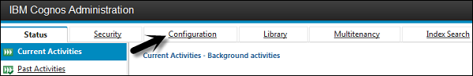


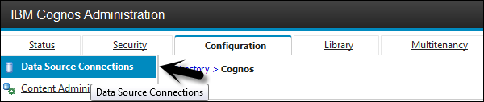

Enter the unique connection name and description.

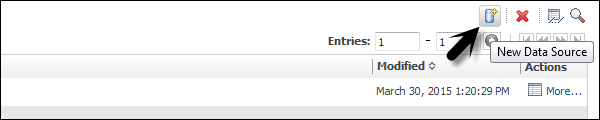

You can add a description related to the data source to uniquely identify the connection and click the next button.

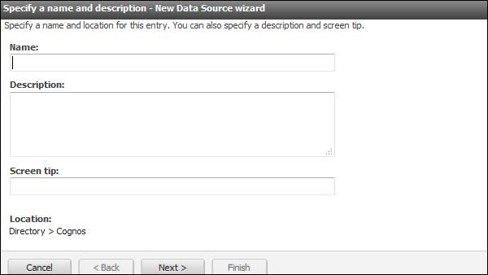

Select the type of connection from the drop down list and click on the next button as shown in the following screenshot.

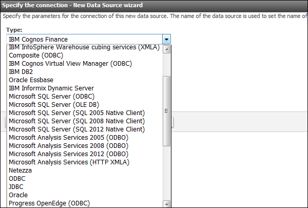

In the next screen that appears, enter the connection details as shown in the following screenshot.

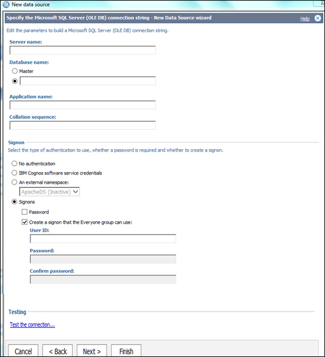

You can use the Test connection to test the connectivity to the data source using connection parameters that you have defined. Click on the finish button once done.

## Data Source Security Setup
Data Source Security can be defined using IBM Cognos authentication. As per the data source, different types of authentication can be configured in the Cognos connection −

**No Authentication** − This allows login to the data source without using any sign-on credentials. This type of connection doesn’t provide data source security in connection.

**IBM Cognos Software Service Credential** − In this type of a sign-on, you log in to the data source using a logon specified for the IBM Cognos Service and the user does not require a separate database sign-on. In a live environment, it is advisable to use individual database sign on.

**External Name Space** − It requires the same BI logon credentials that are used to authenticate the external authentication namespace. The user must be logged into the name space before logging in to the data source and it should be active.

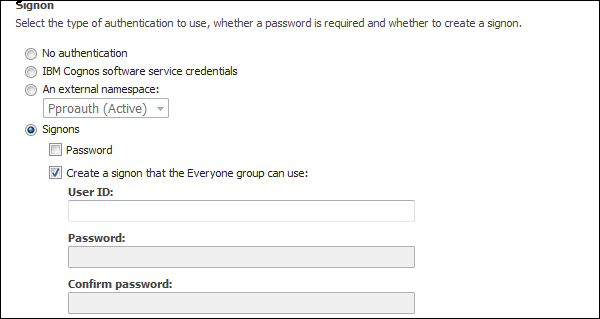

All the data sources also support data source sign-on defined for everyone in the group or for individual users, group or roles. If the data source requires a data source sign-on, but you don't have the access to a sign-on for this data source, you will be prompted to log on each time you access the data source.

IBM Cognos also supports security at cube level. If you are using cubes, security may be set at the cube level. For **Microsoft Analysis Service**, security is defined at the cube level roles.

# Cognos - Packages
In this chapter, we will discuss how to create a package using COGNOS.

## How to Create a Package?
In IBM Cognos, you can create packages for SAP BW or power cube data sources. Packages are available in the Public folder or in My folder as shown in the following screenshot.

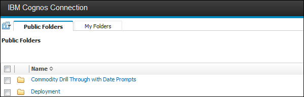

Once a package is deployed, the default configuration is applied on the package. You can configure a package to use different settings or you can modify the settings of the existing package.

To configure a package, you should have administrator privilege.

Locate the package in the Public folder, click on More button under the Action tab as shown in the following screenshot.

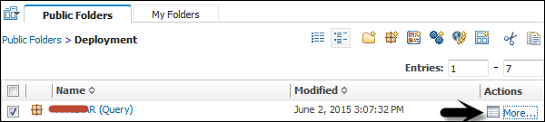

Click on Modify the package configuration and Click Select an analysis. Select the default analysis to be used for this package when a new analysis is created. Click OK and change the package settings as required and click Finish.

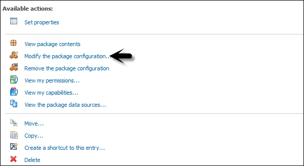

### Creating a New Package
In the Package tab, Public folder, you can also create a new Package using the IBM Cognos connection.

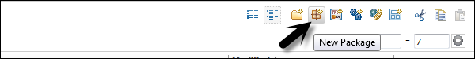

Select the data source that you want to use in the package and click OK.

## Scheduling Reports in IBM Cognos
You can also schedule the reports in IBM Cognos as per your business requirements. Scheduling a report allows you to save the refresh time. You can define various scheduling properties like frequency, time zone, start and end date, etc.

To schedule a report, select the report and go to More button as shown in the following screenshot.

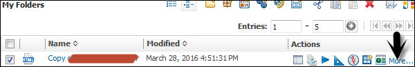

You have an option to add a new schedule. Select the New Schedule button as shown in the following screenshot.

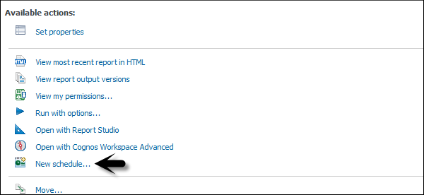

You can select the following options under the Schedule tab −

   * Frequency
   * Start and End
   * Priority
   * Daily Frequency, etc.

When the scheduling properties are defined, you can save it by clicking the OK button at the bottom. Disabling the Schedule options allows you to make the schedule inactive but the schedule will be saved for the report. You can remove this option any time to enable the schedule again.

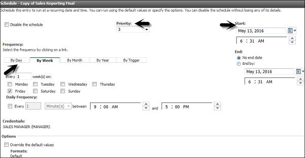

To edit an existing schedule, select the report and go to More. You can modify an existing schedule or remove the schedule permanently.

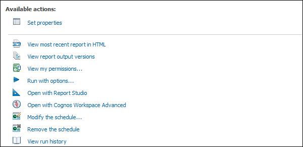

# Cognos - Framework Manager
In this chapter, we will discuss regarding what a Framework Manager is and about its various other components.

## What is a Framework Manager?
IBM Cognos Framework Manager is used to create business model of metadata derived from one or more data sources. It is a Windows based tool which is used to publish the business models to Cognos BI in the form of packages which can be used for analytical reporting and analysis.

Before you start a new project in Framework Manager, it is necessary that you go through BI reporting requirements that helps you to identify data strategies, metadata, report package delivery, etc. This helps you to identify which data sources are required in the Framework Manager to get the required data in the BI report. You should consider the following factors before starting a new project in the Framework manager.

   * Data Sources required to meet BI needs.
   * Types of DW system
   * Data refresh in Data Warehouse
   * BI Reporting- Daily, Weekly, or monthly.

## Metadata Modeling
A Metadata model is defined as the collection of database objects (tables, columns and relationship between objects) imported from the database. When you run the report, metadata published in BI Cognos portal generates a SQL statement according to the query.

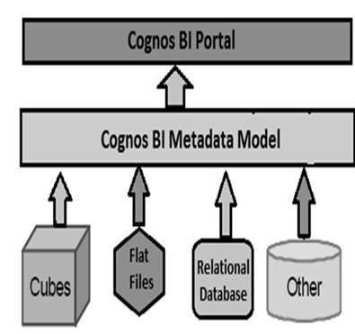

The IBM Cognos Framework manager can hide the complexity of data in the data source and also alter the way how data is shown to users. It provides a view that is easy for BI users to understand and perform analysis and reporting.

## IBM Cognos Framework Manager User Interface
The following screenshot shows the IBM Cognos BI Framework Manager User Interface.

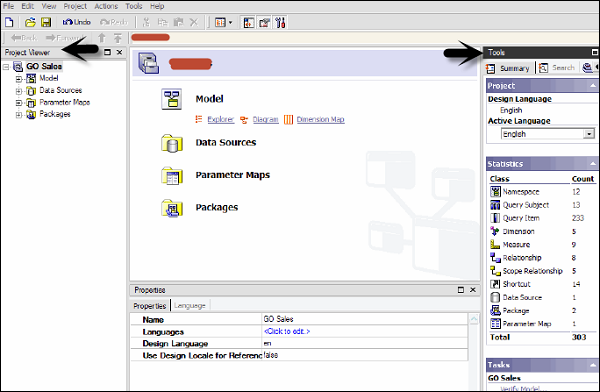

Following are the various components of the above screenshot that are explained in detail for better understanding −

   * **Project Viewer** − This pane on left side allows you to access all the existing projects in a tree format.
   * **Project Info** − This is the center pane that is used to manage objects of an existing project. This has three tabs: Explorer, Diagram and Dimension.
   * **Properties** − This pane at the bottom is used to set the value of different properties of an object in a project.
   * **Tools** − This pane on the right side provides you various important useful tools. You can perform a search, or display an object and its dependent objects, changing project language, etc.

## Importing Metadata from a Relational Database
For importing Metadata from a Relational Database, you map the database objects to the Framework manager objects. In the Framework Manager, you can import all the objects or you can select particular objects like tables, columns, functions, stored procedures, views, etc.

Only user defined Stored procedures are supported.

To create a metadata model, run metadata wizard from the Action menu. Select a data source connection and click the Next button. Select the check boxes for the objects you want to import.

Specify how the import should handle duplicate object names. Choose either to import and create a unique name, or not to import. If you choose to create a unique name, the imported object appears with a number.

**For example** − When you see QuerySubject and QuerySubject1 in your project. Then click Import.

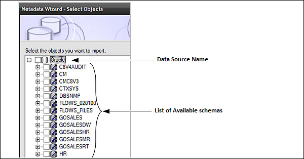

Import statistics including a list of objects that could not be imported and a count of objects that were imported are shown.

The next step is to click on the Finish button.

After importing Metadata, you must check the imported Metadata for the following areas −

   * Relationships and Cardinality
   * Determinants
   * Usage property for query items
   * Regular Aggregate property for query items

### Importing Metadata from Cognos 8 Model
In the Framework Manager, you can also import metadata from an existing Cognos 8 Model. To import Metadata from the Cognos 8 model, go to **Actions → Run Metadata wizard**.

Click on the Cognos 8 Model and then the Next button. Navigate to the .cpf file from Cognos 8 Model and the click on Next.

Select the check boxes for objects you want to import and then click on Next and then on Finish.

### Modeling Relational Metadata
Once you import the metadata, next is to validate the objects for reporting requirement. You can select the objects that appear in the report and test them. You can create two views of the Metadata Model −

   * Import View
   * Business View

The Import view shows you the metadata imported from the data source. To validate the data as per your BI reporting, you can perform the following steps −

   * Ensure that the relationships reflect the reporting requirements.
   * Optimize and customize the data retrieved by the query subjects.
   * Optimize and customize the data retrieved by dimensions. You may want to store dimensions in a separate dimensional view.
   * Handle support for multilingual metadata.
   * Control how data is used and formatted by checking query item properties.

Business view is used to provide the information in metadata. You can perform calculations, aggregations and apply filters in Business view and easily allow users to build the report. You can add business rules such as custom calculations and filters that define the information users can retrieve.

Organize the model by creating separate views for each user group that reflect the business concepts familiar to your users.

# Cognos - Relationships in Metadata Model
Relationships are used to create queries on multiple objects in a metadata model. Relationships can be bidirectional and without creating relationship, objects are individual entities with no use in metadata model.

Each object in metadata model is connected using primary or foreign key in the data source. You can create or remove relationships in the metadata model to meet the business requirements.

There are different relationships which are possible, some of them are −

   * **One to One** − When an instance of one query subject is related to another instance. For example: Each customer has one customer id.
   * **One to Many** − This relationship occurs when one instance of query subject relates to multiple instances. For example: Each doctor has many patients.
   * **Many to Many** − This relationship occurs when many instances of a query subject relates to multiple instances. For example: Each patient has many doctors.

## Cardinality Concept
It is defined as the number of related rows for each of the two query subjects. Cardinality is used in the following ways −

   * Loop Joins in Star schema
   * Optimized access to data source
   * Avoid double counting fact data

While using the Relational database as a data source, Cardinality can be defined considering the following rules −

   * Primary and Foreign keys
   * Match query item names represent uniquely indexed columns
   * Matching query item names

The most common ways to define Cardinality is by using the primary and foreign key. To view the key information that was imported, right click on the query subject → Edit Definition. You can import many to many relationships, optional relationships, and outer joins from the data source.

## Relationship Notation in Metadata Model
In the Framework manager, a relation is represented by **Merise notation**. The first part of this notation represents the type of join for this relationship.

   * 0..1 represents zero or one match
   * 1..1 represents one to one match
   * 0..n represents Zero or no matches
   * 1..n represents One or more matches
   * 1 − An inner join with all matching rows from both objects.
   * 0 − An Outer join with all objects from both, including the items that don’t match.

## Creating or Modifying the Relationships
To create a Relationship or to combine logically related objects which are not joined in metadata import. You can manually create relationship between objects or can automatically define relationship between objects based on selected criteria.

To create a Relationship, use CTRL key to select one or more query items, subjects or dimensions. Then go to **Action Menu → Create Relationship**.

If this is a valid Relationship, the Framework manager wants to create a shortcut to the relationship. You can then click on the OK button.


Once you create a relationship after the metadata import, you can also modify the relationship or Cardinality in the Framework manager.

To edit a Relationship, click a relationship and from **Action menu → click Edit Definition**.

From the **Relationship Expression tab → Select Query items, Cardinalities and Operators**.


To create an additional Join, go to the **Relationship Expression tab → New Link and Define New Relationship**.

To test this Relationship, go to **Relationship SQL tab → rows to be returned → Test**.


Click on OK button.

## Creating a Relationship Shortcut
A Relationship shortcut is defined as the pointer to an existing relationship and to reuse the definition of an existing relationship. When you make any change to the source Relationship, they are automatically updated in shortcuts. Relationship shortcuts are also used to resolve ambiguous relationship between query subjects.

The Framework Manager asks whether you want to create a relationship shortcut whenever you create a relationship and both these conditions are true.

   * At least one end for the new relationship is a shortcut.
   * A relationship exists between the original objects.

Go to **Action Menu → Create Relationship**.

If this is a valid Relationship, Framework manager wants to create a shortcut to the relationship. Click YES. A list appears of all relationships in which one end is a model object and the other end is either another model object or a shortcut to another model object.

Click OK.

## Create a Query Subject
A query subject is defined as a set of query items that have an inherent relationship. A query subject can be used to customize the data they retrieve using a Framework Manager.

The following are the query subject types in a Framework Manager −

   * **Data Source Query Subject** − These are based on the Relational metadata defined by the SQL statements and are automatically created for each table and view when you import metadata into model.
   * 
   * **Model Query Subjects** − They are not directly created from a data source but are based on the query items defined in other query subjects or dimensions. Using the model query subject, it allows you to create more abstract and business view of data source.
   * **Stored Procedure Query Subjects** − They are created when a Procedure is imported from a Relational data source. IBM Cognos Framework Manager only supports user defined Stored Procedures and system stored procedures are not supported.


### How to create a Data Source Query Subject?
From **Actions Menu → Create → Query Subject**.


Enter the name of a new Query Subject.

Click on **Data Source → OK to open new Query Subject wizard**.


Follow the steps till the Finish button appears → Finish

Right click on **Query Subject → Edit Definition**. Click on the **SQL tab → Available database objects box, drag objects to the SQL box**.

You can also insert a data source reference, insert a macro, embed a calculation and embed a filter.

Select the actions from the list and click OK.


## Edit SQL
When you edit any Relation database source, create or query a Relation database, then SQL is used in the background. You can use the following options −

   * Cognos SQL
   * Native SQL
   * Pass through SQL

To edit SQL of the model query subject, copy SQL from query Information tab and paste to the new data source query subject. It is possible to convert a model query subject to data source query subject.

   * Click Data Source query subject and **Action menu → Edit Definition**.
   * Click on SQL button, drag objects or type in SQL you want.
   * Click OK.


### Change Type of SQL
You can select the type of SQL to be used when you define data source query subject. These factors should be considered while considering type of SQL −

Also note that it is not possible to change the type of SQL for query subjects based on the OLAP data sources.

To change SQL type, go to Query subject you want to change.

Go to **Actions menu → Edit Definition and go to Query Information button**.


Go to **Options → SQL Settings tab**.

To change the type of SQL, click on SQL Type List. Then, click OK.

# Cognos - Query Studio
Query Studio is defined as a web based tool for creating queries and reports in Cognos 8. It is also used to run simple queries and reports as well.

In Query Studio, the following functions can be performed −

   * **Viewing Data** − Using Query Studio, you can connect to data source to view the data in a tree hierarchy. You can see query subject, query item details, etc.
   * **Creating BI Reports** − You can use Query studio to create simple reports by using the data source. You can also refer existing reports to create a new report.
   * **Changing Existing Reports** − You can also change existing reports by editing report layout – Add charts, titles, headings, border styles, etc.
   * **Data Customization in Report** − You can apply various customizations in reports- Filters, Calculations and aggregations to perform data analysis, drill up and drill down, etc.

# Cognos - Ad-hoc Reports
Using ad-hoc reporting, a user can create queries or reports for ad-hoc analysis. Ad-hoc reporting feature allows business users to create simple queries and reports on the top of fact and dimension table in data Warehouse.

The Query Studio in Cognos BI, provides the following features −

   * View data and perform ad-hoc data analysis.
   * Save the report for future use.
   * Work with data in the report by applying filters, summaries and calculations.
   * To create ad-hoc report using query studio, login to IBM Cognos software and click on Query my data.


Select the report package. Next time you visit this page; you will see your selection under the recently used packages. Click on the package name.


In the next screen, you can add Dimension elements, filters and prompts, facts and calculation, etc.


You should insert the objects in this order. To insert object in the report, you can use Insert button at the bottom.

   * Insert and filter dimension elements
   * Insert filters and prompts
   * Insert facts and calculations
   * Apply finishing touches
   * Save, run, collaborate, and share

At the top, you have the tool bar, where you can create a new report, save existing report, cut, paste, insert charts, drill up and down, etc.


When you insert all the objects to a report, you can click on the Run option () at the top.

# Cognos - Report Types
You can use different report types in the Cognos Query Studio to meet the business requirements. You can create the following report types in the Query Studio −

**List Reports** − These reports are used to show your entire customer base as shown in the following screenshot.

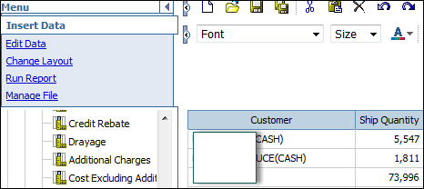

**Crosstab Reports** − These are used to show quantity sold with product and region on different axis.

**Charts** − You can insert charts to show data graphically. You can combine a chart with a Crosstab or also with a list report.

# Cognos - Creating a Report
You can create a new report by inserting objects from the data source in the Query Studio. You can also change an existing report and save it with different name.

You can open Query Studio by going to Query my data option on the home page or you can go to **Launch → Query Studio**.

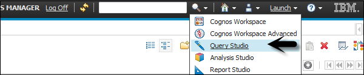

In the next screen, you will be prompted to select a package to add objects in the reports. You can select a recently used package or any other package created in the Framework Manager.

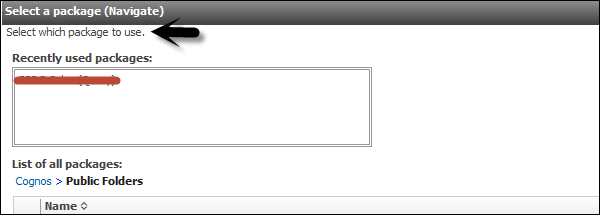

You can see Query items listed on the left side. You can add data and save the report.

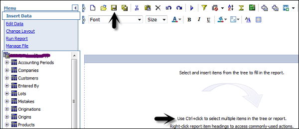

# Cognos - Open an Existing Report
You can open an existing report in the Query Studio and save it with a different name after making changes.

To open an existing report, locate and click the name of the report you want to open.

The report opens in the Query Studio. You can use the Open with Query Studio  to identify a Query Studio report in the Cognos Connection.

Or you can launch Query Studio and go to open option at the top.


Search the report in the list of Available folders → OK


# Cognos - Add Data to a Report
You can add objects from a data source. Each object has a representative icon and can insert all the following objects to a report.


# Cognos - Saving a Report
When you save a report in the Query Studio, it saves the query definition. It doesn’t save the data while saving the report. When you run a report saved a week back, the data in that report reflects the recent changes in the data source.

To save a report, click on the Save icon at the top.


In the next screen, enter the name, description and location where you want to save the report → OK.


## Saving a Report with a different Name and Location
You can use Save as option to save a report with different name or at a different location as shown in the following screenshot.


**Specify a name and location** − To include a description, type the information you want to add in the Description box.


Click OK.

# Cognos - Run a Report
A report in the Query Studio runs when you update data from data source in the report. When you open an existing report or make any changes to a report, Query Studio again runs the report.

You can use the following options to run a report −

   * **Run with Prompt** − You can run a report using a user prompt. When you run the report, you are prompted to select the value.
   * **Run with all Data** − The Run with all data command runs the report using the full data source. Running a report can take a long time. If you plan to make several changes to a report, run the report in preview mode to save time and computer resources by limiting the rows of data that your report retrieves.
   * **Preview Report with no Data** − You can use the preview option when you want to see how the report will look like. This is useful when you want to make formatting changes.

Open the report that you want in Query Studio. From the Run Report menu, choose how to run the report −

To run the report using all the data, click Run with All Data as shown in the following screenshot.


To run the report using limited data, click Preview with Limited Data.


If the package that the report is based on contains a design filter, performance is improved.

To run the report using no data, click Preview with No Data.

## Run a Report in PDF, XML, and CSV format
You can run a report in PDF, XML or in a CSV format. To run a report in different formats, select the report and click on Run with options.


Select the format in which you want to run the report. You can choose from the following formats. Select the format and click Run at the bottom as shown in the following screenshot.


# Cognos - Printing a Report
You can also print a report to get a copy on paper. You can directly enter the Printer location while running the report or you can run the report in a PDF format and later you can take a printout of the report.

To take the print of the report directly, select the report and click on Run with options.

In the Delivery mode, select print the report and enter the location as shown in the following screenshot.

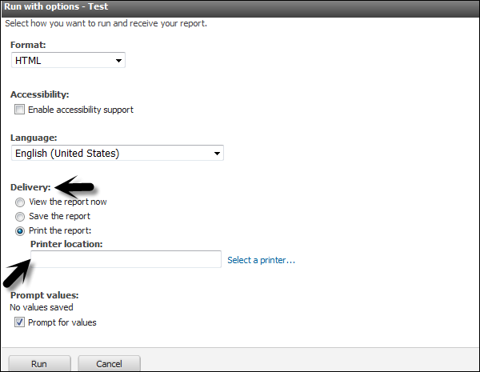

# Cognos - Report Studio
Report Studio is a web-based tool that is used by report developers to create multi pages, complex reports on top of multiple data sources. You can create sales reports, inventory reports, account statements, balance sheets, etc.

## How to Create a Report in Report Studio?
To create Reports in Report Studio, you should have a good understanding on user interface. Report Studio user interface is divided into two parts −

   * Explorer Bar on the Left Side.
   * Work area for report design.

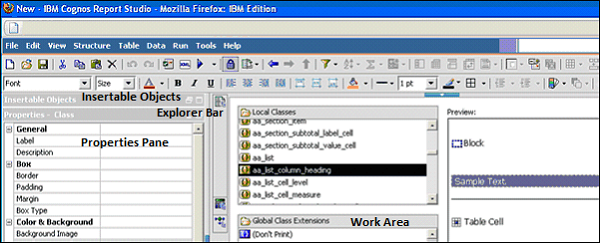

The above screenshot has three major blocks, which are as follows −

   * **Insertable Object Pane** − The Insertable Objects pane contains objects that you can add to a report. These objects can be added by dragging them to the work area. It can contain −
   * Source tab (That contains item from the package).
   * Data Items (Queries created in the report).
   * Toolbox (different objects like graphics that can be added to the report)
   * **Properties Pane** − The Properties pane lists the properties that you can set for an object in a report. To get the help, select the property and use keyboard key F1.
   * **Work Area** − The work area is known as the area where the report is designed.

## How to Open Report Studio?
On the home page, go to **Launch → Report Studio → Select a Package** or in the IBM Cognos Welcome page, click on Author advanced reports to open Report Studio.


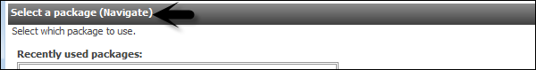

On the home screen of Report Studio, you have an option to create a new report or open an existing report.

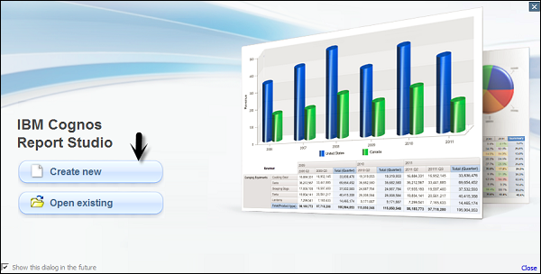

You will be prompted to select the type of report you want to create. You have the option to select different report types.

# Cognos - Report Templates
In Report Studio, you can create different types of reports. They allow you to present the data in different formats like a list report can be used to show the customer information.

**The following reports can be created in Report Studio** −

## List Report
This report is used to show the data in detailed format. Data is shown in rows and columns and each column contains all the values of a data item.

## Crosstab
Like list report, a cross tab report also shows the data in row and columns, but the data is compact and not detailed. At the intersection points of rows and columns, you show the summarized data.

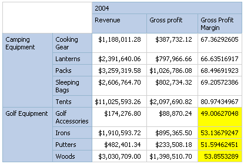

## Chart
You can use the Report Studio to create many chart types, including column, bar, area, and line charts. You can also create custom charts that combine these chart types.

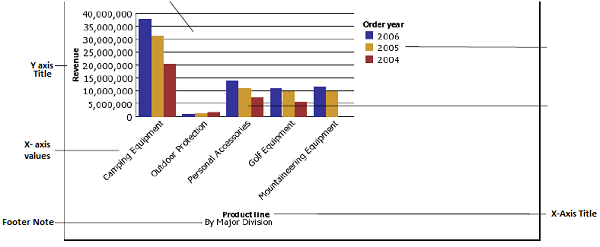

## Map
You can also use maps in the Report Studio to present data for a particular region, country or a location.

**A map report consists of three parts** −

   * Region Layer
   * Point Layer
   * Display Layer

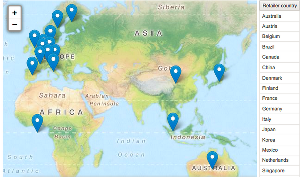

## Repeater
Repeaters are used to add repeat items in a report while running the report. To add a Repeater, drag a repeater from the tool box to work area.

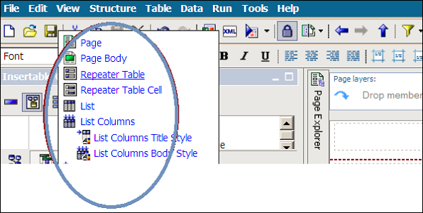

# Cognos - List Report
A list report that shows the data in rows and columns and each cell shows the data in the database or you can also add custom calculations in a list report.

To create a new list report, go to New → Blank as shown in the following screenshot.


When you select a list report, you get the following structure of the report in the Report Studio. You have to drag the objects from the package on the left side to the report structure.


You can also edit the title of the report that will appear once you run the report.


You can use different tools at the top for the report formatting. To save a report, click on the save button. To run a report, click on Run  report.


Once you save the report, you have an option to save it in the Public folder or My folder.


When you click on the Run option, you can select different formats to run the report.


# Cognos - Crosstab Report
You will be prompted to select the type of report you want to create. You have option to select from different report types.


Select Crosstab as type of the report and click OK.

The structure of a Crosstab report is opened as shown in the following screenshot.


In the Insertable Objects pane, on the Source tab, click the data item you want to add to the crosstab and drag it to the Rows or Columns.


A black bar indicates where you can drop the data item. Repeat the above given steps to insert additional data items.

You add dimensions to rows or columns and to add measures to the crosstab, drag the measures you want to Measures.


When you run the report, a crosstab report is generated that has one edge.

## Formatting a Crosstab
You can also format the crosstab to give them appearance as per the requirement. When you specify formatting for all rows, columns, fact cells, or the crosstab, the formatting is automatically applied to any new items you add.

### Crosstab Style order
When you apply styles such as font color, rows and columns, intersections this is applied in the following order.

   * Crosstab fact cells
   * Fact cells in the outermost rows
   * Fact cells in the innermost rows
   * Fact cells in the outermost columns
   * Fact cells in the innermost columns
   * Crosstab intersections

To do formatting of crosstab, click anywhere in the Crosstab. Click the select ancestor button in the title bar of the Properties pane and then click Crosstab as shown in the following screenshot.


In the Properties pane, click the property you want and then specify a value. For example, if you want to specify a background color, click on Background Color and choose the color you want to use.


You can also right-click the row or column and click Select Member Fact Cells. In the Properties pane, click the property you want and then specify a value.


# Cognos - Creating a Chart
In Report Studio, you can create many chart types like column, bar, area, line charts or a custom chart that combines these chart types.


In the Source tab, expand the query.

   * Drag Revenue to the Measure (y-axis) drop zone.
   * Drag Current year to the Series drop zone.
   * Drag Order to the Categories (x-axis) drop zone.


Drag the objects as shown in the above screenshot.


Save the chart using the tool bar at the top. Save it to Public or My Folder as mentioned in the previous topic. Run the report to see the result in a chart format.

You can also create a Repeater table or a map report in Cognos Report Studio.

# Cognos - Report Functions
There are various Report functions that can be used in a Cognos report.

Some of these different report functions include −

## _days_between
This function is used to return a positive or a negative number representing the number of days between the two datetime expressions. If a timestamp_exp1 &lt; timestamp_exp2 then the result will be a –ve number.

### How to use
```
_days_between(timestamp_exp1, timestamp_exp2)
```
## _days_to_end_of_month
This function is used to return a number representing the number of days remaining in the month represented by the datetime expression timestamp_exp.

### How to use
```
_days_to_end_of_month(timestamp_exp)
```
## _first_of_month
This function is used to return a datetime that is the first day of the month represented by timestamp_exp.

## _add_days
This function is used to return the datetime resulting from adding integer_exp days to timestamp_exp.

### How to use
```
_add_days(timestamp_exp, integer_exp)
```
## _add_months
This function is used to return the datetime resulting from adding integer_exp months to timestamp_exp.

### How to use
```
_add_months(timestamp_exp, integer_exp)
```
## _add_years
This function is used to return the datetime resulting from adding integer_exp years to timestamp_exp.

### How to use
```
_add_years(timestamp_exp, integer_exp)
```
## _age
This function is used to return a number that is obtained from subtracting timestamp_exp from today's date in YYYYMMDD format (years, months, days).

### How to use
```
_age(timestamp_exp)
```
## _day_of_week
This function is used to return the day of week (between 1 and 7), where 1 is the first day of the week as indicated by integer_exp (between 1 and 7, 1 being Monday and 7 being Sunday). Note that in ISO 8601 standard, a week begins with Monday being day 1. In North America where Sunday is the first day of the week being day 7.

### How to use
```
_day_of_week(timestamp_exp, integer_exp)
```
## _day_of_year
This function is used to return the ordinal for the day of the year in date_ exp (1 to 366). Also known as the Julian day.

### How to use
```
_day_of_year(timestamp_exp)
```
Like these, there are various other Report functions as well that can be used.

# Cognos - Report Validation
This is used to ensure that your report doesn’t contain any error. When a report created in the older version of Cognos is upgraded it is automatically validated.

To validate a report, go to the Tools menu and click on the Validate button as shown in the following screenshot.

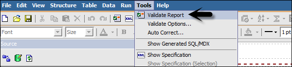


There are different Validation levels −

   * **Error** − To retrieve all errors returned from the query.
   * **Warning** − To retrieve all errors and warnings returned from the query.
   * **Key Transformation** − To retrieve important transformation steps.
   * **Information** − To retrieve other information related to query planning and execution.

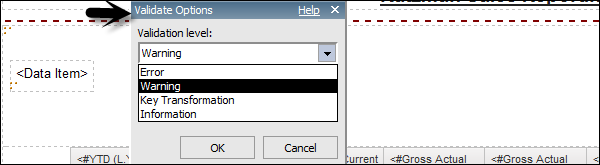

# Cognos - Report Run with Options
You can run the report with different options. To set the report options, go to Run options.

**You get different options** − 

   * **Format** − You can select from different format.

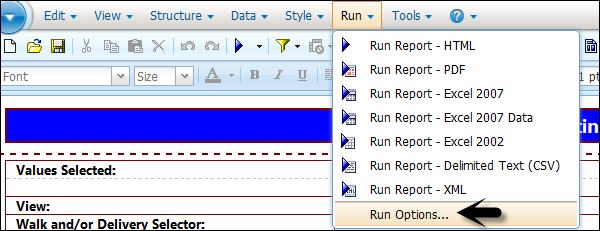

   * **To select Paper size** − You can select from different paper sizes, orientation.
   * **Select Data mode** − All data, limited data, and no data.
   * **Language** − Select language in which you want to run the report.
   * Rows per page and prompt option, etc.

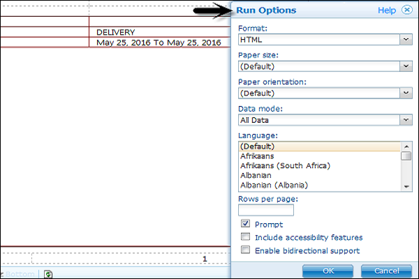

# Cognos - Report Administration
Report Administration allows you to give permissions to different users on the report level. You can define various other properties like output versions, permissions, general properties, etc.

To open Report Properties and the permissions tab, go to More Options in the IBM Cognos home page.

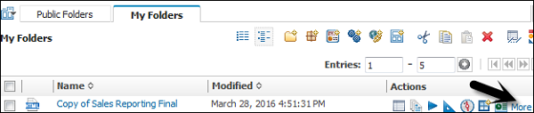

You can select the following actions in more options −

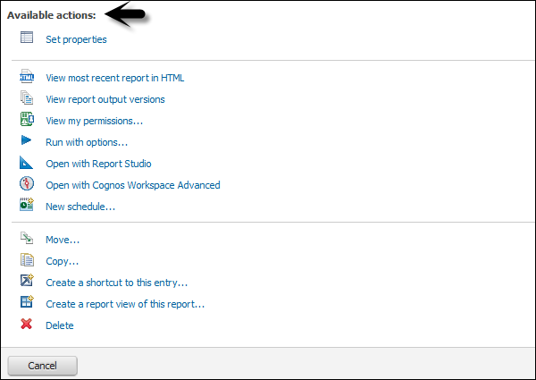

In the permission tab, you can specify access permissions for this entry. By default, an entry acquires its access permissions from a parent. You can override those permissions with the permissions set explicitly for this entry.

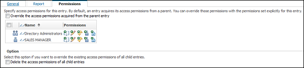

You can also move, copy or delete a report in More Options. You can create a shortcut entry or report view of the report.

# Cognos - Filters
Filters are used to limit the data that you want in your report. You can apply one or more filters in a Cognos report and the report returns the data that meet the filter conditions. You can create various custom filters in a report as per the requirement.

   * Select the column to filter by.
   * Click the drop down list from the Filter button.
   * Choose Create Custom Filter.
   * The Filter Condition dialog displays.


In the next window, define the filter’s parameters.

   * **Condition** − click the list arrow to see your choices (Show or Don’t show the following values).
   * **Values** − click the list arrow to see your choices.
   * **Keywords** − allows you to search for specific values within the values list.
   * **Values List** − shows the field values which you can use as filter values. You can select one or many. Use the arrow button to add multiple values.


Select a value and click the right pointing arrow to move the value into the selected column. You can use the Ctrl key to add multiple values at tone time. Click OK when the filter is defined.


## Deleting a Filter
A filter can be deleted by using the following steps −

   * Go to the Query Explorer as shown in the above screenshot
   * Click on Query and Locate the Detail Filters pane in the upper right side of the window as shown in above screenshot
   * Select the filter that you want to delete and press the delete button
   * You can also cut/copy a filter


# Cognos - Custom Calculations
You can add custom calculations to your report as per the business requirement. With the help of operators, different calculations can be added like if you want to add a new value salary*0.2 as a Bonus.

To create Calculations in a Report −

   * Select the item in the report.
   * Click the insert calculation button and select the calculation to perform.


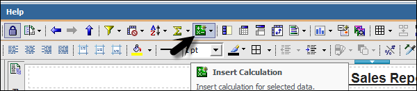

To change the order of the operands or the name of the calculated item added to the report, click Custom. The calculation appears as a new row or a column in your report.

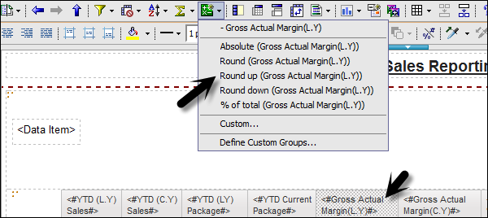

## Drilling
Drill up and drill down is used to perform analysis by moving between levels of information. Drill down is used to see more detailed information to lowest level and drill up is used to compare the results.

To drill down or up in a single row or column, pause the pointer over the label text until the icon with the plus sign (+) and caret drill down drill up icon appears and the text is underlined, and then click.

To drill down or up in both a row and column simultaneously, click on the value at the intersection of the row and the column, and then click again.

# Cognos - Analysis Studio
Analysis Studio is used to focus on the items that are important for the business. You can do comparisons, trend analysis and analysis like top and bottom performers and also allow you to share your analysis with others.

Analysis Studio is not only used by BI Analysts but also by business users who understand business and want to find answers to business queries using historical data.

You can use Analysis Studio to compare and manipulate data to understand the relationships between data and its relative importance. Whether you want to assess revenue growth or to identify top performers, Analysis Studio provides the filtering, calculating, and sorting support you need for analysis.

## Interface
The Analysis Studio consists of several areas that are shown in the following areas and are explain in detail as well.

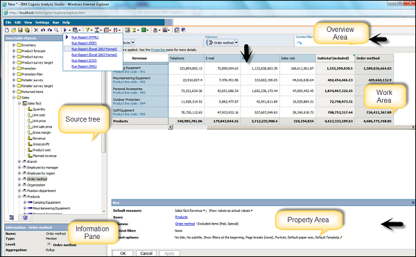

   * **Insertable Object Pane** − The Source tab of the Insertable Objects pane contains the source tree for the package selected for the analysis.
   * **Information Pane** − The Information pane shows the name, level, attributes (if any), and aggregation associated with the selected item in the source tree, as well as any additional information provided by the data modeler.
   * **Properties Pane** − You can use Properties pane to make several changes and apply them at the same time, instead of running different commands.
   * **Work Area** − This area contains the crosstab or charts to perform the analysis. You can display analysis in the form a Crosstab, chart or a combination of both.

And lastly there is the **Overview Area** as well.

# Cognos - Create an Analysis
To create an analysis in the Analysis studio, you have to select a package as data source. You can create a new analysis or use an existing analysis as reference to create a new analysis by changing its name before saving it.

To create an Analysis − Select the Package you want to use from the Public folder. Go to Report Studio as shown in the following screenshot.


In a new dialog window, select a Blank Analysis or Default Analysis.

   * **Blank Analysis** − A blank analysis starts with a blank crosstab in the work area.
   * **Default Analysis** − A default analysis uses the default analysis for the package as defined in Cognos Connection or the first two dimensions in the data source for the crosstab rows and columns and the first measure in the data source for the crosstab measure.

After selecting, click OK. The Analysis Studio starts. The items that you can use in the analysis are listed in the Insertable Objects pane.


# Cognos - Save an Analysis
To save an analysis, you can click on the save button at the top as shown in the following screenshot.


Enter a name of the analysis and location → then click OK.

# Cognos - Open Existing Analysis
To open an existing Analysis, locate the name of the analysis that you want to open and click it. It is opened in Analysis Studio.


You can make any changes as per the requirement. Save the analysis.

You can also open a new analysis while working in an existing analysis, click the new button on the toolbar. The new analysis maintains the state of the source tree in the Insertable Objects pane and maintains any items on the Analysis Items tab.

# Cognos - Event Studio
Cognos Event Studio is a Web-based tool that allows you to create and manage agents to monitor data and perform tasks when the data meets predefined thresholds.

## Events
You can specify an event condition to perform a task. An event is defined as query expression in a data package.

When a record matches the event condition, it causes an agent to perform tasks. When an agent runs, it checks the data for any event instances.

## Event Instance
An agent monitors data, each event instance is detected. Task execution rules are followed to determine if an agent will perform the task. Task frequency defines that a task should be performed once or repeated for each event instance.


## Event List
You can categorize the event as per the task performed. The event list shows all the events that are executed by an agent. Different event categorization includes −

   * New
   * Ongoing and Changed
   * Ongoing and Unchanged
   * Ceased

An event key is used to determine whether an event is new, ongoing but changed, ongoing and unchanged, or ceased. Event Studio compares the event instances detected in each agent run with those detected in the previous run. To ensure it correctly matches the event instances for comparison, you must define an event key. The event key is the combination of data items that uniquely defines an event instance.

## Agent
An agent runs to check occurrences of the event. An agent performs a task for events that meet the execution rules.

## Tasks
A task can be used to notify users about a change in business event. Users can take appropriate actions as per the event.

You can create a task for the following functions −

   * Add an Item
   * Send an Email
   * Publish a new item
   * Run a Job
   * Run an import
   * Run an Export and many more.

# Cognos - Notification Methods
An agent can use different notification methods to notify business users. An agent can notify business users by −

   * An email to business users.
   * Publishing a news item to a folder frequently used by users.

## Email to Business Users
You can notify people by email using either a report task or an email task. To help you decide which method to use, you should understand how they differ.

You can use either a report task or an email task −

   * To send a single email text message.
   * To attach a single report in the specified output formats.
   * If you attach only one HTML report and leave the body field empty, the report appears in the message body.
   * To add links to a single report for the specified output formats.

## News Item Published
In this, you can publish a news item/headline to a folder whose content can be viewed in a Cognos Navigator portlet and in any folder view. When a Business user clicks on the headline, it can open the content or view it as a web page.


[Previous Page](../cognos/cognos_notification_methods.md) [Next Page](../cognos/cognos_useful_resources.md) 
