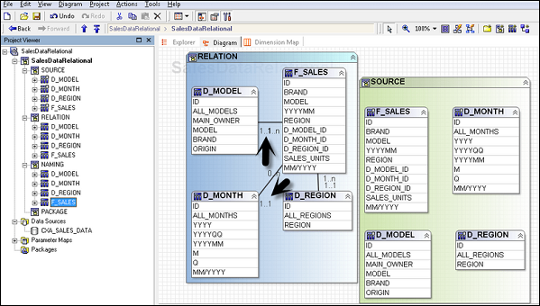
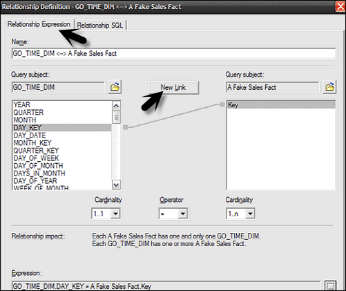
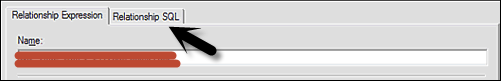
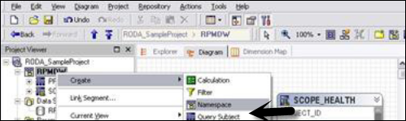
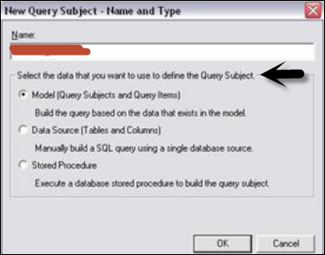
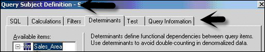
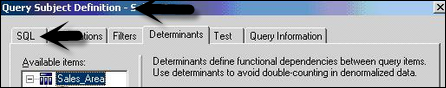

# Cognos - Relationships in Metadata Model
Relationships are used to create queries on multiple objects in a metadata model. Relationships can be bidirectional and without creating relationship, objects are individual entities with no use in metadata model.

Each object in metadata model is connected using primary or foreign key in the data source. You can create or remove relationships in the metadata model to meet the business requirements.

There are different relationships which are possible, some of them are −

   * **One to One** − When an instance of one query subject is related to another instance. For example: Each customer has one customer id.
   * **One to Many** − This relationship occurs when one instance of query subject relates to multiple instances. For example: Each doctor has many patients.
   * **Many to Many** − This relationship occurs when many instances of a query subject relates to multiple instances. For example: Each patient has many doctors.

## Cardinality Concept
It is defined as the number of related rows for each of the two query subjects. Cardinality is used in the following ways −

   * Loop Joins in Star schema
   * Optimized access to data source
   * Avoid double counting fact data

While using the Relational database as a data source, Cardinality can be defined considering the following rules −

   * Primary and Foreign keys
   * Match query item names represent uniquely indexed columns
   * Matching query item names

The most common ways to define Cardinality is by using the primary and foreign key. To view the key information that was imported, right click on the query subject → Edit Definition. You can import many to many relationships, optional relationships, and outer joins from the data source.

## Relationship Notation in Metadata Model
In the Framework manager, a relation is represented by **Merise notation**. The first part of this notation represents the type of join for this relationship.

   * 0..1 represents zero or one match
   * 1..1 represents one to one match
   * 0..n represents Zero or no matches
   * 1..n represents One or more matches
   * 1 − An inner join with all matching rows from both objects.
   * 0 − An Outer join with all objects from both, including the items that don’t match.

## Creating or Modifying the Relationships
To create a Relationship or to combine logically related objects which are not joined in metadata import. You can manually create relationship between objects or can automatically define relationship between objects based on selected criteria.

To create a Relationship, use CTRL key to select one or more query items, subjects or dimensions. Then go to **Action Menu → Create Relationship**.

If this is a valid Relationship, the Framework manager wants to create a shortcut to the relationship. You can then click on the OK button.

Once you create a relationship after the metadata import, you can also modify the relationship or Cardinality in the Framework manager.

To edit a Relationship, click a relationship and from **Action menu → click Edit Definition**.

From the **Relationship Expression tab → Select Query items, Cardinalities and Operators**.

To create an additional Join, go to the **Relationship Expression tab → New Link and Define New Relationship**.

To test this Relationship, go to **Relationship SQL tab → rows to be returned → Test**.

Click on OK button.

## Creating a Relationship Shortcut
A Relationship shortcut is defined as the pointer to an existing relationship and to reuse the definition of an existing relationship. When you make any change to the source Relationship, they are automatically updated in shortcuts. Relationship shortcuts are also used to resolve ambiguous relationship between query subjects.

The Framework Manager asks whether you want to create a relationship shortcut whenever you create a relationship and both these conditions are true.

   * At least one end for the new relationship is a shortcut.
   * A relationship exists between the original objects.

Go to **Action Menu → Create Relationship**.

If this is a valid Relationship, Framework manager wants to create a shortcut to the relationship. Click YES. A list appears of all relationships in which one end is a model object and the other end is either another model object or a shortcut to another model object.

Click OK.

## Create a Query Subject
A query subject is defined as a set of query items that have an inherent relationship. A query subject can be used to customize the data they retrieve using a Framework Manager.

The following are the query subject types in a Framework Manager −

   * **Data Source Query Subject** − These are based on the Relational metadata defined by the SQL statements and are automatically created for each table and view when you import metadata into model.
   * 
   * **Model Query Subjects** − They are not directly created from a data source but are based on the query items defined in other query subjects or dimensions. Using the model query subject, it allows you to create more abstract and business view of data source.
   * **Stored Procedure Query Subjects** − They are created when a Procedure is imported from a Relational data source. IBM Cognos Framework Manager only supports user defined Stored Procedures and system stored procedures are not supported.

### How to create a Data Source Query Subject?
From **Actions Menu → Create → Query Subject**.

Enter the name of a new Query Subject.

Click on **Data Source → OK to open new Query Subject wizard**.

Follow the steps till the Finish button appears → Finish

Right click on **Query Subject → Edit Definition**. Click on the **SQL tab → Available database objects box, drag objects to the SQL box**.

You can also insert a data source reference, insert a macro, embed a calculation and embed a filter.

Select the actions from the list and click OK.

## Edit SQL
When you edit any Relation database source, create or query a Relation database, then SQL is used in the background. You can use the following options −

   * Cognos SQL
   * Native SQL
   * Pass through SQL

To edit SQL of the model query subject, copy SQL from query Information tab and paste to the new data source query subject. It is possible to convert a model query subject to data source query subject.

   * Click Data Source query subject and **Action menu → Edit Definition**.
   * Click on SQL button, drag objects or type in SQL you want.
   * Click OK.

### Change Type of SQL
You can select the type of SQL to be used when you define data source query subject. These factors should be considered while considering type of SQL −

Also note that it is not possible to change the type of SQL for query subjects based on the OLAP data sources.

To change SQL type, go to Query subject you want to change.

Go to **Actions menu → Edit Definition and go to Query Information button**.

Go to **Options → SQL Settings tab**.

To change the type of SQL, click on SQL Type List. Then, click OK.

[Previous Page](../cognos/cognos_framework_manager.md) [Next Page](../cognos/cognos_query_studio.md) 
