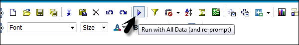
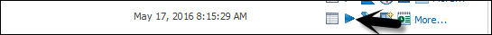
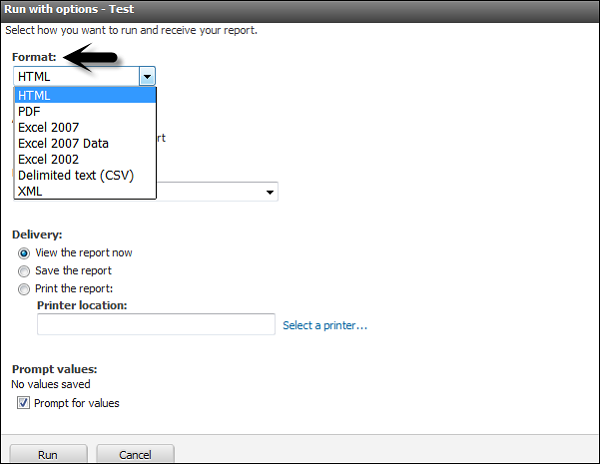

# Cognos - Run a Report
A report in the Query Studio runs when you update data from data source in the report. When you open an existing report or make any changes to a report, Query Studio again runs the report.

You can use the following options to run a report −

   * **Run with Prompt** − You can run a report using a user prompt. When you run the report, you are prompted to select the value.
   * **Run with all Data** − The Run with all data command runs the report using the full data source. Running a report can take a long time. If you plan to make several changes to a report, run the report in preview mode to save time and computer resources by limiting the rows of data that your report retrieves.
   * **Preview Report with no Data** − You can use the preview option when you want to see how the report will look like. This is useful when you want to make formatting changes.

Open the report that you want in Query Studio. From the Run Report menu, choose how to run the report −

To run the report using all the data, click Run with All Data as shown in the following screenshot.

To run the report using limited data, click Preview with Limited Data.

If the package that the report is based on contains a design filter, performance is improved.

To run the report using no data, click Preview with No Data.

## Run a Report in PDF, XML, and CSV format
You can run a report in PDF, XML or in a CSV format. To run a report in different formats, select the report and click on Run with options.

Select the format in which you want to run the report. You can choose from the following formats. Select the format and click Run at the bottom as shown in the following screenshot.

[Previous Page](../cognos/cognos_saving_a_report.md) [Next Page](../cognos/cognos_printing_a_report.md) 
