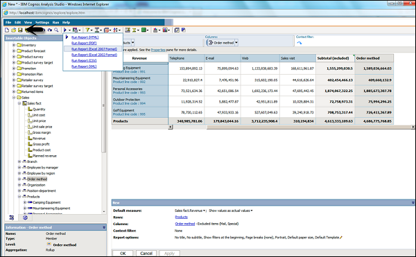

# Cognos - Save an Analysis
To save an analysis, you can click on the save button at the top as shown in the following screenshot.

Enter a name of the analysis and location → then click OK.

[Previous Page](../cognos/cognos_create_an_analysis.md) [Next Page](../cognos/cognos_open_existing_analysis.md) 
