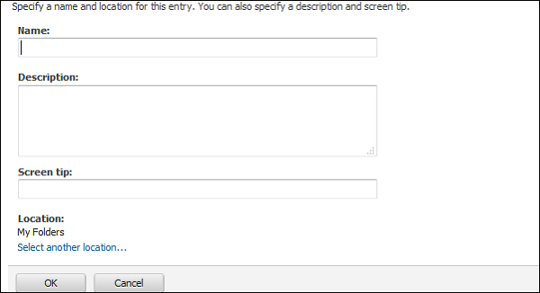
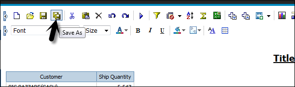
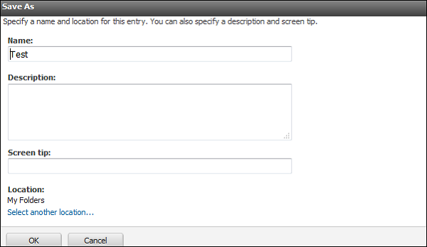

# Cognos - Saving a Report
When you save a report in the Query Studio, it saves the query definition. It doesn’t save the data while saving the report. When you run a report saved a week back, the data in that report reflects the recent changes in the data source.

To save a report, click on the Save icon at the top.

In the next screen, enter the name, description and location where you want to save the report → OK.

## Saving a Report with a different Name and Location
You can use Save as option to save a report with different name or at a different location as shown in the following screenshot.

**Specify a name and location** − To include a description, type the information you want to add in the Description box.

Click OK.

[Previous Page](../cognos/cognos_add_data_to_report.md) [Next Page](../cognos/cognos_run_a_report.md) 
