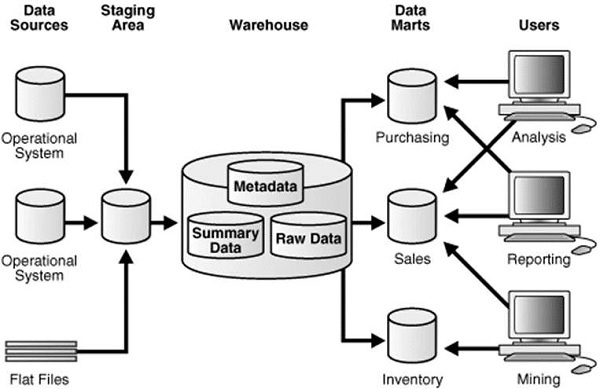

# Data Warehouse - ETL & Reporting Tools
An ETL tool extracts the data from all these heterogeneous data sources, transforms the data (like applying calculations, joining fields, keys, removing incorrect data fields, etc.), and loads it into a Data Warehouse.

## Extraction
A staging area is required during the ETL load. There are various reasons why staging area is required. The source systems are only available for specific period of time to extract data. This period of time is less than the total data-load time. Therefore, staging area allows you to extract the data from the source system and keeps it in the staging area before the time slot ends.

The staging area is required when you want to get the data from multiple data sources together or if you want to join two or more systems together.

**For example** − You will not be able to perform an SQL Query joining two tables from two physically different databases.

The data extractions’ time slot for different systems vary as per the time zone and operational hours. The data extracted from the source systems can be used in multiple Data Warehouse Systems, Operation Data Stores, etc.

ETL allows you to perform complex transformations and requires extra area to store the data.

## Transform
In data transformation, you apply a set of functions on extracted data to load it into the target system. The data that does not require any transformation is known as a direct move or pass through data.

You can apply different transformations on extracted data from the source system. For example, you can perform customized calculations. If you want sum-of-sales revenue and this is not in database, you can apply the SUM formula during transformation and load the data.

**For example** − If you have the first name and the last name in a table in different columns, you can use concatenate before loading.

## Load
During the Load phase, data is loaded into the end-target system and it can be a flat file or a Data Warehouse system.

## BI Reporting Tool
BI (Business Intelligence) tools are used by business users to create basic, medium, and complex reports from the transactional data in data warehouse and by creating Universes using the **Information Design Tool/UDT**. Various SAP and non-SAP data sources can be used to create reports.

There are quite a few BI Reporting, Dashboard and Data Visualization Tools available in the market. Some of which are as follows − 

   * SAP Business Objects Web Intelligence (WebI)
   * Crystal Reports
   * SAP Lumira
   * Dashboard Designer
   * IBM Cognos
   * Microsoft BI Platform
   * Tableau Business Intelligence
   * JasperSoft
   * Oracle BI OBIEE
   * Pentaho
   * QlickView
   * SAP BW
   * SAS Business Intelligence
   * Necto
   * Tibco Spotfire

[Previous Page](../cognos/data_warehouse_schemas.md) [Next Page](../cognos/cognos_introduction.md) 
