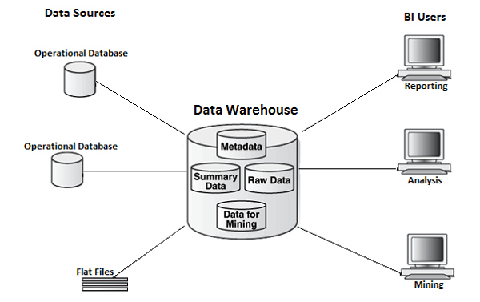
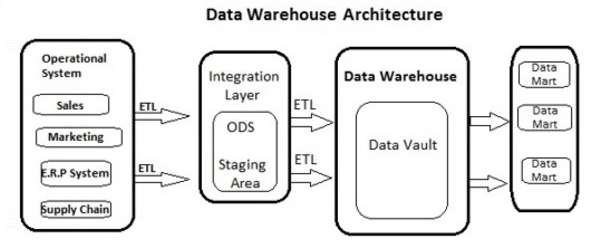
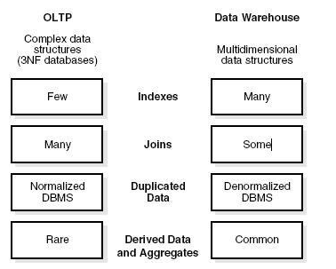
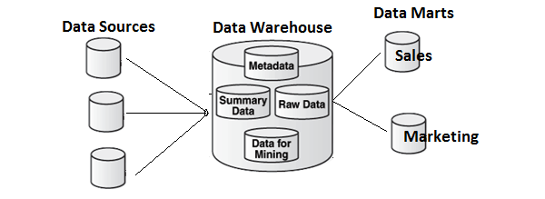

# Data Warehouse - Overview
A Data Warehouse consists of data from **multiple heterogeneous data sources** and is used for analytical reporting and decision making. Data Warehouse is a central place where data is stored from different data sources and applications.

The term Data Warehouse was first invented by Bill Inmom in 1990. A Data Warehouse is always kept separate from an Operational Database.

The data in a DW system is loaded from operational transaction systems like −

   * Sales
   * Marketing
   * HR
   * SCM, etc.

It may pass through operational data store or other transformations before it is loaded to the DW system for information processing.

A Data Warehouse is used for reporting and analyzing of information and stores both historical and current data. The data in DW system is used for Analytical reporting, which is later used by Business Analysts, Sales Managers or Knowledge workers for decision-making.



In the above image, you can see that the data is coming from **multiple heterogeneous data** sources to a Data Warehouse. Common data sources for a data warehouse includes −

   * Operational databases
   * SAP and non-SAP Applications
   * Flat Files (xls, csv, txt files)

Data in data warehouse is accessed by BI (Business Intelligence) users for Analytical Reporting, Data Mining and Analysis. This is used for decision making by Business Users, Sales Manager, Analysts to define future strategy.

## Features of a Data Warehouse
It is a central data repository where data is stored from one or more heterogeneous data sources. A DW system stores both current and historical data. Normally a DW system stores 5-10 years of historical data. A DW system is always kept separate from an operational transaction system.

The data in a DW system is used for different types of analytical reporting range from Quarterly to Annual comparison.

### Data Warehouse Vs Operational Database
The differences between a Data Warehouse and Operational Database are as follows −

   * An **Operational System** is designed for known workloads and transactions like updating a user record, searching a record, etc. However, Data Warehouse transactions are more complex and present a general form of data.
   * An **Operational System** contains the current data of an organization and Data warehouse normally contains the historical data.
   * An **Operational Database** supports parallel processing of multiple transactions. Concurrency control and recovery mechanisms are required to maintain consistency of the database.
   * An **Operational Database** query allows to read and modify operations (insert, delete and Update) while an OLAP query needs only read-only access of stored data (Select statement).

## Architecture of Data Warehouse
Data Warehousing involves data cleaning, data integration, and data consolidations. A Data Warehouse has a 3-layer architecture −

### Data Source Layer
It defines how the data comes to a Data Warehouse. It involves various data sources and operational transaction systems, flat files, applications, etc.

### Integration Layer
It consists of Operational Data Store and Staging area. Staging area is used to perform data cleansing, data transformation and loading data from different sources to a data warehouse. As multiple data sources are available for extraction at different time zones, staging area is used to store the data and later to apply transformations on data.

### Presentation Layer
This is used to perform BI reporting by end users. The data in a DW system is accessed by BI users and used for reporting and analysis.

The following illustration shows the common architecture of a Data Warehouse System.



## Characteristics of a Data Warehouse
The following are the key characteristics of a Data Warehouse −

   * **Subject Oriented** − In a DW system, the data is categorized and stored by a business subject rather than by application like equity plans, shares, loans, etc.
   * **Integrated** − Data from multiple data sources are integrated in a Data Warehouse.
   * **Non Volatile** − Data in data warehouse is non-volatile. It means when data is loaded in DW system, it is not altered.
   * **Time Variant** − A DW system contains historical data as compared to Transactional system which contains only current data. In a Data warehouse you can see data for 3 months, 6 months, 1 year, 5 years, etc.

## OLTP vs OLAP
Firstly, OLTP stands for **Online Transaction Processing**, while OLAP stands for **Online Analytical Processing**

In an OLTP system, there are a large number of short online transactions such as INSERT, UPDATE, and DELETE.

Whereas, in an OLTP system, an effective measure is the processing time of short transactions and is very less. It controls data integrity in multi-access environments. For an OLTP system, the number of transactions per second measures the effectiveness. An OLTP Data Warehouse System contains current and detailed data and is maintained in the schemas in the entity model (3NF).

**For Example** −

A Day-to-Day transaction system in a retail store, where the customer records are inserted, updated and deleted on a daily basis. It provides faster query processing. OLTP databases contain detailed and current data. The schema used to store OLTP database is the Entity model.

In an OLAP system, there are lesser number of transactions as compared to a transactional system. The queries executed are complex in nature and involves data aggregations.

### What is an Aggregation?
We save tables with aggregated data like yearly (1 row), quarterly (4 rows), monthly (12 rows) or so, if someone has to do a year to year comparison, only one row will be processed. However, in an un-aggregated table it will compare all the rows. This is called Aggregation.

There are various Aggregation functions that can be used in an OLAP system like Sum, Avg, Max, Min, etc.

**For Example** −

```
SELECT Avg(salary)
FROM employee
WHERE title = 'Programmer';
```
### Key Differences
These are the major differences between an OLAP and an OLTP system.

   * **Indexes** − An OLTP system has only few indexes while in an OLAP system there are many indexes for performance optimization.
   * **Joins** − In an OLTP system, large number of joins and data are normalized. However, in an OLAP system there are less joins and are de-normalized.
   * **Aggregation** − In an OLTP system, data is not aggregated while in an OLAP database more aggregations are used.
   * **Normalization** − An OLTP system contains normalized data however data is not normalized in an OLAP system.



## Data Mart Vs Data Warehouse
Data mart focuses on a single functional area and represents the simplest form of a Data Warehouse. Consider a Data Warehouse that contains data for Sales, Marketing, HR, and Finance. A Data mart focuses on a single functional area like Sales or Marketing.



In the above image, you can see the difference between a Data Warehouse and a data mart.

## Fact vs Dimension Table
A fact table represents the measures on which analysis is performed. It also contains foreign keys for the dimension keys.

**For example** − Every sale is a fact.

The Dimension table represents the characteristics of a dimension. A Customer dimension can have Customer_Name, Phone_No, Sex, etc.


[Previous Page](../cognos/index.md) [Next Page](../cognos/data_warehouse_schemas.md) 
