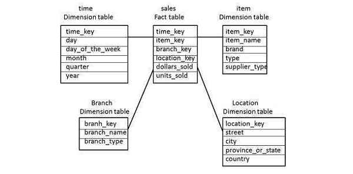
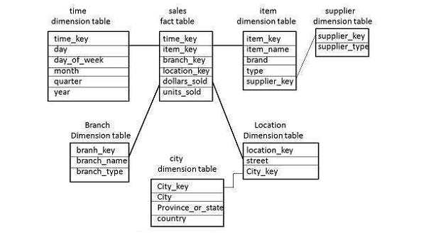
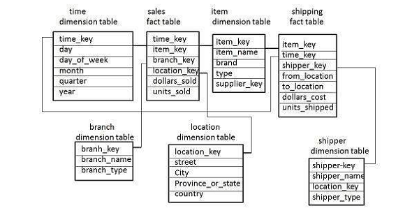

# Data Warehouse - Schemas
A schema is defined as a logical description of database where fact and dimension tables are joined in a logical manner. Data Warehouse is maintained in the form of Star, Snow flakes, and Fact Constellation schema.

## Star Schema
A Star schema contains a fact table and multiple dimension tables. Each dimension is represented with only one-dimension table and they are not normalized. The Dimension table contains a set of attributes.

### Characteristics
   * In a Star schema, there is only one fact table and multiple dimension tables.
   * In a Star schema, each dimension is represented by one-dimension table.
   * Dimension tables are not normalized in a Star schema.
   * Each Dimension table is joined to a key in a fact table.

The following illustration shows the sales data of a company with respect to the four dimensions, namely Time, Item, Branch, and Location.

There is a fact table at the center. It contains the keys to each of four dimensions. The fact table also contains the attributes, namely dollars sold and units sold.

**Note** − Each dimension has only one-dimension table and each table holds a set of attributes. For example, the location dimension table contains the attribute set {location_key, street, city, province_or_state, country}. This constraint may cause data redundancy.

**For example** − "Vancouver" and "Victoria" both the cities are in the Canadian province of British Columbia. The entries for such cities may cause data redundancy along the attributes province_or_state and country.

## Snowflakes Schema
Some dimension tables in the Snowflake schema are normalized. The normalization splits up the data into additional tables as shown in the following illustration.

Unlike in the Star schema, the dimension’s table in a snowflake schema are normalized.

**For example** − The item dimension table in a star schema is normalized and split into two dimension tables, namely item and supplier table. Now the item dimension table contains the attributes item_key, item_name, type, brand, and supplier-key.

The supplier key is linked to the supplier dimension table. The supplier dimension table contains the attributes supplier_key and supplier_type.

**Note** − Due to the normalization in the Snowflake schema, the redundancy is reduced and therefore, it becomes easy to maintain and the save storage space.

## Fact Constellation Schema (Galaxy Schema)
A fact constellation has multiple fact tables. It is also known as a Galaxy Schema.

The following illustration shows two fact tables, namely Sales and Shipping −

The sales fact table is the same as that in the Star Schema. The shipping fact table has five dimensions, namely item_key, time_key, shipper_key, from_location, to_location. The shipping fact table also contains two measures, namely dollars sold and units sold. It is also possible to share dimension tables between fact tables.

**For example** − Time, item, and location dimension tables are shared between the sales and shipping fact table.

[Previous Page](../cognos/data_warehouse_overview.md) [Next Page](../cognos/data_warehouse_etl_and_reporting_tools.md) 
