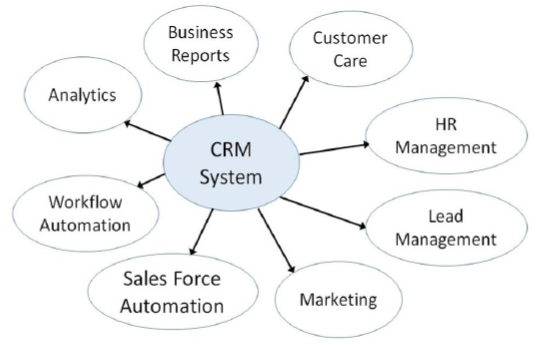
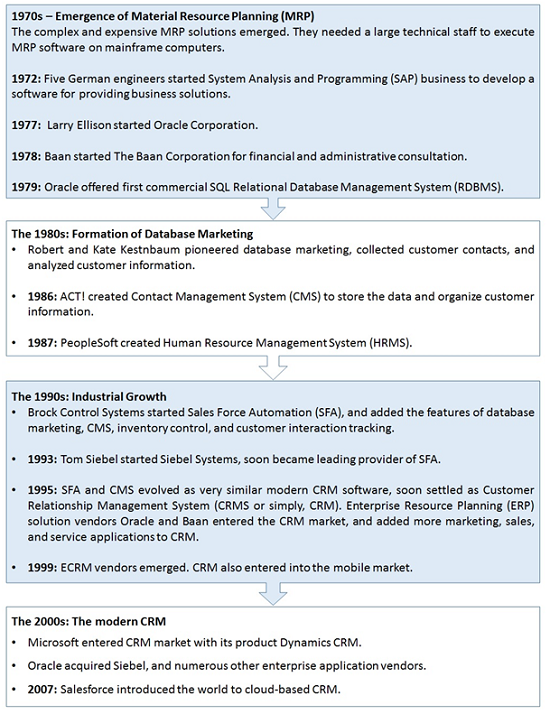
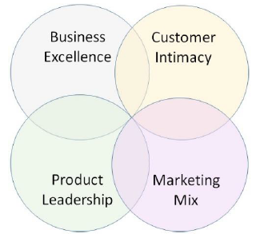
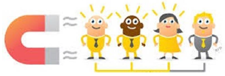
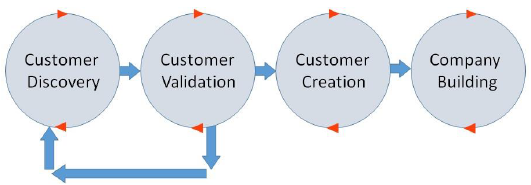
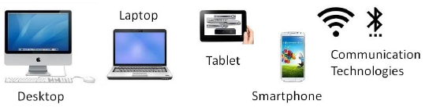
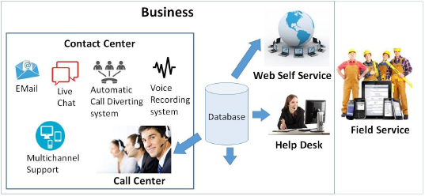

# CRM - Quick Guide
# CRM - Introduction
Business people started using the term Customer Relationship Management (CRM) since the early 1990s when the concept of business started to change from being transactional to relational. CRM directly contributes towards customer benefits and the growth of businesses.

Information Technology plays a very critical role in identifying, acquiring, and retaining the customers, and thereby managing a healthy relationship with them.

Here in this chapter, we will discuss the very basics of CRM.

## What is CRM?
There can be multiple definitions of CRM from different perspectives −

   * From the viewpoint of the Management, CRM can be defined as .
   * By equating the term with technology, the IT organizations define CRM as .
   * As per Franics Buttle, World’s first professor of CRM, it is the core business strategy that integrates internal processes and functions, and external networks, to create and deliver value to a target customer at profit. It is grounded on high quality customer data and information technology.

The primary goal of CRM is to increase customer loyalty and in turn improve business profitability.

## Ingredients of CRM
Take a look at the following illustration. It shows the ingredients that work together to form a successful CRM system.



Here are some of the important ingredients of CRM −

   * **Analytics** − Analytics is the process of studying, handling, and representing data in various graphical formats such as charts, tables, trends, etc., in order to observe market trends.
   * **Business Reporting** − Business Reporting includes accurate reports of sales, customer care, and marketing.
   * **Customer Service** − Customer Service involves collecting and sending the following customer-related information to the concerned department −
   * **Human Resource Management** − Human Resource Management involves employing and placing the most eligible human resource at a required place in the business.
   * **Lead Management** − Lead Management involves keeping a track of the sales leads and distribution, managing the campaigns, designing customized forms, finalizing the mailing lists, and studying the purchase patterns of the customers.
   * **Marketing** − Marketing involves forming and implementing sales strategies by studying existing and potential customers in order to sell the product.
   * **Sales Force Automation** − Sales Force Automation includes forecasting, recording sales, processing, and keeping a track of the potential interactions.
   * **Workflow Automation** − Workflow Automation involves streamlining and scheduling various processes that run in parallel. It reduces costs and time, and prevents assigning the same task to multiple employees.

## Objectives of CRM
The most prominent objectives of using the methods of Customer Relationship Management are as follows −

   * **Improve Customer Satisfaction** − CRM helps in customer satisfaction as the satisfied customers remain loyal to the business and spread good word-of-mouth. This can be accomplished by fostering customer engagement via social networking sites, surveys, interactive blogs, and various mobile platforms.
   * **Expand the Customer Base** − CRM not only manages the existing customers but also creates knowledge for prospective customers who are yet to convert. It helps creating and managing a huge customer base that fosters profits continuity, even for a seasonal business.
   * **Enhance Business Sales** − CRM methods can be used to close more deals, increase sales, improve forecast accuracy, and suggestion selling. CRM helps to create new sales opportunities and thus helps in increasing business revenue.
   * **Improve Workforce Productivity** − A CRM system can create organized manners of working for sales and sales management staff of a business. The sales staff can view customer’s contact information, follow up via email or social media, manage tasks, and track the salesperson’s performance. The salespersons can address the customer inquiries speedily and resolve their problems.

## History of CRM


# CRM - Types
In the past twenty years, the focus of global markets has shifted from sellers to customers. Today, customers are more powerful than sellers, if we consider the driving factors of market. We have different types of CRM according to the changes in customer portfolios, speed of business operations, requirement of handling large data, and the need of sharing information, resources, and efforts jointly.

CRM systems are divided based on their prominent characteristics. There are four basic types of CRM systems −

   * Strategic CRM
   * Operational CRM
   * Analytical CRM
   * Collaborative CRM

The following table lists the types of CRM and their characteristic features −

## Strategic CRM
Strategic CRM is a type of CRM in which the business puts the customers first. It collects, segregates, and applies information about customers and market trends to come up with better value proposition for the customer.

The business considers the customers’ voice important for its survival. In contrast to Product-Centric CRM (where the business assumes customer requirements and focuses on developing the product that may sometimes lead to over-engineering), here the business constantly keeps learning about the customer requirements and adapting to them.

These businesses know the buying behavior of the customer that happy customers buy more frequently than rest of the customers. If any business is not considering this type of CRM, then it risks losing the market share to those businesses, which excel at strategic CRM.

## Operational CRM
Operational CRM is oriented towards customer-centric business processes such as marketing, selling, and services. It includes the following automations: Sales Force Automation, Marketing Automation, and Service Automation.

**Salesforce** is the best suitable CRM for large established businesses and **Zoho** is the best CRM for growing or small-scale businesses.


### Sales Force Automation
SFA is the application of technology to manage selling activities. It standardizes a sales cycle and common terminology for sales issues among all the sales employees of a business. It includes the following modules −

   * **Product Configuration** − It enables salespersons or customers themselves to automatically design the product and decide the price for a customized product. It is based on if-then-else structure.
   * **Quotation and Proposal Management** − The salesperson can generate a quotation of the product prices and proposal for the customer by entering details such as customer name, delivery requirements, product code, number of pieces, etc.
   * **Accounts Management** − It manages inward entries, credit and debit amounts for various transactions, and stores transaction details as records.
   * **Lead Management** − It lets the users qualify leads and assigns them to appropriate salespersons.
   * **Contact Management** − It is enabled with the features such as customers’ contact details, salespersons’ calendar, and automatic dialing numbers. These all are stored in the form of computerized records. Using this application, a user can communicate effectively with the customers.
   * **Opportunity Management** − It lets the users identify and follow leads from lead status to closure and beyond closure.

### Marketing Automation
Marketing automation involves market segmentation, campaigns management, event-based marketing, and promotions. The campaign modules of Marketing Automation enable the marketing force to access customer-related data for designing, executing and evaluating targeted offers, and communications.

**Event-based (trigger) marketing** is all about messaging and presenting offers at a particular time. For example, a customer calls the customer care number and asks about the rate of interest for credit card payment. This event is read by CRM as the customer is comparing interest rates and can be diverted to another business for a better deal. In such cases, a customized offer is triggered to retain the customer.

### Service Automation
Service automation involves service level management, resolving issues or cases, and addressing inbound communication. It involves diagnosing and solving the issues about product.

With the help of Interactive Voice Response (IVR) system, a customer can interact with business computers by entering appropriate menu options. Automatic call routing to the most capable employee can be done.

Consumer products are serviced at retail outlets at the first contact. In case of equipment placed on field, the service expert may require product servicing manual, spare parts manual, or any other related support on laptop. That can be availed in service automation.

## Analytical CRM
Analytical CRM is based on capturing, interpreting, segregating, storing, modifying, processing, and reporting customer-related data. It also contains internal business-wide data such as **Sales Data** (products, volume, purchasing history), **Finance Data** (purchase history, credit score) and **Marketing Data** (response to campaign figures, customer loyalty schemes data). **Base CRM** is an example of analytical CRM. It provides detailed analytics and customized reports.

Business intelligence organizations that provide customers’ demographics and lifestyle data over a large area pay a lot of attention to internal data to get more detail information such as, “Who are most valuable customers?”, “Which consumers responded positively to the last campaign and converted?”, etc.

Analytical CRM can set different selling approaches to different customer segments. In addition, different content and styling can be offered to different customer segments. For the customers, analytical CRM gives customized and timely solutions to the problems. For the business, it gives more prospects for sales, and customer acquisition and retention.

## Collaborative CRM
Collaborative CRM is an alignment of resources and strategies between separate businesses for identifying, acquiring, developing, retaining, and maintaining valuable customers. It is employed in B2B scenario, where multiple businesses can conduct product development, market research, and marketing jointly.

Collaborative CRM enables smooth communication and transactions among businesses. Though traditional ways such as air mail, telephone, and fax are used in communication, collaborative CRM employs new communication systems such as chat rooms, web forums, Voice over Internet Protocol (VoIP), and Electronic Data Interchange (EDI).


There are collaborative CRMs with in-built **Partner Relationship Management (PRM)** software application which helps in managing partner promotions. **SugarCRM** is a popular collaborative CRM. It enables expert collaboration and provides state-of-the-art social capabilities.

## CRM Software Buying Considerations
A business needs to consider the following points while selecting a CRM software −

   * **Business strategy and processes** − It helps to automate a customer management strategy. Hence before selecting a CRM software, a business should be clear with its strategies and desired processes.
   * **Business requirements** − CRM systems range from domain specialty solutions that focus on solving a specific area such as sales force automation, marketing automation, services automation, partner management, etc., to complete enterprise management solutions.
   * **Size of business** − Small businesses require tools that are easy to learn and can handle a wide range of the most common tasks. Large businesses opt for applications that handle more complex tasks and thousands of users.
   * **Customer base** − The size of the customer base a business is required to handle.
   * **Budget** − A business needs to set a budget prior vendor selection. The budget allocated for CRM varies according to the degree of customization required.
   * **Context** − The context in which a business is functioning, e.g., B2B or B2C, determines which CRM the business should go for.
   * **Sales channels** − The sales channels a business is employing: Direct sale, channel sale such as distributors, or Direct to customers via retail. They matter while selecting the most suitable CRM software.
   * **System integration** − All the interfaces the business needs and the CRM vendor can support without requiring too much custom services effort.
   * **Strength of partners** − The partners must be able to provide a business with additional support, or help to implement the CRM successfully.

# CRM - Customer Relationships
Being social animals, we are naturally inclined towards interaction. The bonding that takes place when we communicate in a healthy manner paves smooth ways for many difficult challenges. In the role of customers, we interact with salespersons, dealers, wholesalers, and suppliers.

In the term CRM, ‘R’ stands for **relationship**, but can a relationship between a customer and a business exist? Let us discuss more about the term **relationship** and its role in businesses.

## What is Relationship?
The Oxford Dictionary defines **relationship** as, .

Investment of time, trust, transparency, care, and communication are vital for any relationship to build and survive. This is applicable to human relationships. As far as a formal business domain is concerned, the definition goes as follows −


If a person on his journey stops at a roadside eating joint and buys a burger, it is a transaction; not a relationship. But when a person goes to a particular shop repeatedly, because he likes the store’s ambience, quality of products, or the way he receives service at the shop, then it can be quoted as a relationship.


Some experts say, only repeated interaction over time does not make complete sense of the term **relationship**. It also needs some emotional element of affection and care.

### Evolution of Customer-Suplier Relationship
F. Robert Dwyer, a marketing professor at Lindner College of Business states five phases through which a customer-supplier relationship evolves −


   * **Awareness** − The parties come in contact with each other and see each other as a possible customer or supplier.
   * **Exploration** − The parties find out more about one another’s capabilities and business prospects. Trial purchasing takes place and performance is assessed. If deal is not smooth then the relationship terminates with the damage of less costs.
   * **Expansion** − It is composed of attraction, communication, bargaining, development of rules, and development of expectations from each other.
   * **Commitment** − Trust begins to develop and deals are executed as per the norms and expectations. Mutual understanding and cooperation develops, and number of transactions start building up.
   * **Dissolution** − Not all relationships can survive. Some relationships are terminated either bilaterally (both parties agree to end) or unilaterally (one party decides to end). If it is bilateral decision then both parties retrieve the invested amount and resources. Supplier exits relationship in case of failure to contribute sales volume or profit. Customer ends relationship unilaterally due to changes in product requirement, repeated servicing failure, etc.

Dissolution can be avoided by reducing cost-to-serve.

## Why a Business Wants Relationship with its Customers?
Every business regards its customers as a lifetime stream of revenue; losing a single customer can cost the business very high. **Lifetime Value (LTV)** for a customer is considered to analyze the effectiveness of a particular marketing channel.

For example, if the **Churn Rate** of a business X is 5% and that of business Y is 10%, then in the long-term, business X would have a larger customer base than business Y, which places business X at the position of competitive advantage and directly influences profit of both the businesses.

A business can generate greater sales volume and in turn greater revenue if it knows its customers well and have good relationship with them. Thus, solely for the economic purpose, every business wants to have healthy relationships with their customers.

## Relationship Management Theories
There are various schools of thoughts with different theories of relationship management. Let us discuss some of them briefly −

### Theory by Industrial Marketing and Purchasing Group (IMP Group)
This Europe-based research initiative in Industrial Marketing focuses on B2B relationships and states the following characteristics −

   * Buyers and sellers both actively participate in the transaction to find solutions to their respective challenges.
   * Buyer-seller relationships are normally long-term and close.
   * Relationships are composed of interpersonal bond, connections among businesses, and strengths or weaknesses of the business.
   * The transactions often occur with respect to relationship’s history.
   * The businesses chose the mode and the manner of interaction with the entities at various levels of importance.

### Theory by Nordic School
A Scandinavian services marketing group, named The Nordic School, emphasizes on supplier-customer relationship. It identifies the triplet of relationship marketing as −

   * **Interaction** − As customers and suppliers interact, each one provides a service to another. Customer provides information and supplier provides solution.
   * **Dialogue** − Communication is bilateral and is essential for the survival of the relationship.
   * **Value** − The business needs to generate something that is perceived as value to the customer.

### Theory by Anglo-Australian School
It states that relationships are important not only from the viewpoint of customers but also from the angle of stakeholders of the business such as employees, suppliers, and government. It also found out that customer’s satisfaction and customer retention are value drivers of any business.

### Theory by North American School
According to this theory, good relationships reduce costs significantly. Trust and commitment are vital attributes of a successful relationships. By connecting the trust to the commitment, this theory states that trust created on the basis of minimal functional conflicts, communication, non-opportunistic behavior, and cooperation. Commitment is linked to high relationship termination cost and relationship benefits.

### Theory by (Guanxi) Asian School
This theory is based upon the teachings of Lord Buddha regarding social conducts and acts of reciprocation. This theory states that people from a family, friendship, same-clan fellowship are connected to each other due to informal social relationships which impose them to follow reciprocal obligations to acquire the resources by exchanging favors and cooperation.

# CRM - 21st Century Customers
Customers in the last decade only used to be concerned about quantity, quality, and price. In today’s information-driven world, the customers have not remained merely as people buying goods or services from a business. Along from being concerned about the questions such as "how many", “how much”, and "what", they are groomed smart enough to ask, "why?". Today’s customers are hard to convince and are difficult to please too.

## Who is an Empowered Customer?
Today’s customers are empowered. Empowered customers are those having the control to buy goods or services from a business when and where they want it, by selecting from a vast range of available choice. Empowered customers access the Internet and collect information about products, dealers, and prices. They take advice from friends or at times from strangers too, before making a buying decision.


By using various digital devices, they can find out the specifications of a product or service before arriving at buying decision. They are smart and alert buyers who also keep high expectations. When a business fulfills most of the expectations, the empowered customers can be loyal to them.

Let us analyze the phases a customer goes through when a business offers products/services to the customers.

## Customer Life Cycle
Customer Life Cycle is used to describe the phases through a customer goes. Here are the important stages of a customer life cycle −

   * **Reaching** − It is the phase where a business communicates with its target customer. It is mainly done through advertisements.
   * **Acquisition** − Attracting and influencing the target customer. The marketing team decides the scope of the target audience and convinces the customers about the benefits of its products/services.
   * **Conversion** − It is when customers decide to purchase a product or service.
   * **Retention** − In addition to flawless products/services, the business offers some extra facilities to the customer such as priority treatment, beautiful store ambience, free parking, etc., to retain existing customers.
   * **Inspiration** − To inspire a regular customer into a loyal one by establishing a sound relationship. When a business puts efforts on providing polite and quick service, personal attention from the staff, knowledgeable sales staff, then the customers are automatically inspired to buy a product/service from a particular vendor.


Let us now try to figure out what differentiates a customer from a consumer.

## Consumer vs. Customer
A **consumer** is a user of a product or a service, whereas a **customer** is a buyer of a product or service. A customer decides what to buy and executes the deal of purchasing by paying and availing the product or service. A consumer uses the product or service for oneself.

For example, the customer of a pet food is not the consumer of that product. Similarly, if a mother in a supermarket is buying  for her baby, then she is a customer and her baby is a consumer.

## Types of Customers
There can be various types of customers a business have to deal with. Here are some prominent types of customers −

   * **Loyal Customers** − They are completely satisfied customers. Though they are less in numbers, they can promote more sales and profit. They expect individual attention and demand polite and respectful response from the supplier.
   * **Discount Customers** − They visit the business outlets frequently but transact only when business offers discounts on regular products and brands. They are the ones who buy only low cost products. Their buying behavior changes according to the rate of discounts. They are important to a business, as they contribute a significant portion of business profit.
   * **Impulsive Customers** − They are with the business in urge and buy on impulse. They don’t plan for buying anything specific in advance, but they urge to buy anything that they find good and productive at the time when they are in the store. These customers are challenging and very difficult to convince. They are capable of bringing high profit when treated tactfully.
   * **Need-Oriented Customers** − They have a specific product on mind and they often plan before buying. They only buy when they need a product. They are difficult to satisfy. They need reasons to switch to another product or brand.
   * **Wanderers** − They are least profitable ones to a business. At times, they are not sure what to buy. They are normally new in the industry and mostly visit the suppliers only to confirm their needs on products. They like to find out the features of the products in the market but they are least interested in buying.
   * **High Volume Customers** − They are the ones who consume a high volume of products.
   * **High Future Lifetime Value Customers** − The ones who can contribute profits in future.
   * **Benchmark Customers** − They are the ones whom other customers follow.
   * **Door Openers** − They can open doors to a new market for the supplier.
   * **Inspiring Customers** − They force the suppliers to change for betterment. They suggest product improvements or inform the suppliers about opportunities of cost reduction.

## Customer Orientation
There are three types of customer orientations −

   * **Cost-Oriented Customers** − They concentrate on products with least costs and are ready to compromise on efficacy, performance, and quality. They are ready to blame the supplier on the occurrence of fault in product without thinking that they are responsible for choosing less quality product. Some customers tend to fix problems with a local, less-skilled dealer or by themselves without taking a supplier’s direct help as it is cheaper. These customers also at times buy second hand products and expect it to perform as efficiently as a new one. The suppliers always find themselves arrested in payment-related issues with these customers.
   * **Value-Oriented Customers** − They always look for efficient and high-performing products, as they know that they are making a profitable deal for a long run. For them, paying a high initial cost is their long-term investment to enjoy its hassle-free benefits in future. They are satisfied customers. They often tend to maintain a healthy relationship with the suppliers.
   * **Technology-Oriented Customers** − They opt for the best technology products rather than less cost, good quality, or performance. They are technology-conscious as they find using products with latest technology would sustain in the ever-changing technological environment. These customers have detailed eye towards technical aspects of a product and tendency to interact with other customers of their type. They are also satisfied customers and tend to maintain healthy relationship with supplier.

## Customer Management Strategies
There are seven core customer management strategies −

   * **Start a relationship** − When a customer is identified as having a high potential to bring profits, start a relationship.
   * **Protect the relationship** − When the customer is significant for the business and when there is a possibility of the competitor’s attraction, then the managers need to protect the relationship.
   * **Relationship re-engineering** − This is necessary when the managers find that the customer is not profitable as desired at the current stage. In such a case, serve the customer by low-cost automated channels.
   * **Enhance the relationship** − The managers identify up-selling and cross-selling opportunities and try to boost the customer on the scale of value.
   * **Harvest the relationship** − When the managers do not want to spend much on the existing customer development, they use the cash flow from these customers to develop new customers.
   * **End the relationship** − It is good to end the relationship when the customer shows no sign of contributing to future business profit.
   * **Regain the customer** − When the customer goes to the competitor while choosing another option to fulfill his requirement, then the managers need to implement win-back strategies to regain the customer and understand the reason of departing the customer.

## Customer Acquisition
Customer acquisition is the art of persuading the customers to buy products or to avail services offered by a business. Each time a business invents new strategies for acquiring new customers, the strategy gets saturated over some time.

The strategy that worked in the past may not remain effective in the future. Hence the businesses need to keep tuned with the market situations, government policies and plan the new strategies.

It requires diligent planning, forming acquisition strategy, communicating with customers, advertising the products aggressively on various media, conducting flash sales, etc., to acquire new customers.

# CRM - Building Value for Customers
The terms **cost** and **value** are often misunderstood as same, though these two terms are poles apart in their meaning. The cost of a product is nothing but the amount a customer pays to the seller to avail the product. When the customer says a product is “value for money”, it means the product delivers what it is supposed to in the exchange of a reasonable cost.

## What is Value?
The value of a product or a service is nothing but the customer’s perception of the ratio of benefits received to the sacrifices made while purchasing a product or service from a business.

```
Value = Benefits / Sacrifices
```
Value is directly affected by customer’s perception, which can be altered positively by increasing benefits and decreasing sacrifices.

## Customer’s Sacrifices
The customers make the following sacrifices when it comes to buying from a business −

### Time
This is the time taken to physically arrive at the business outlet or to search for the required product online, and to compare various similar products with respect to specifications and costs. It also includes waiting time to avail the required product and extended time when a business delivers a product with incorrect specification.

### Money
It is the primary concern. Apart from the cost of product or services the business offers, it may be the cost of Value Addition Tax (VAT), surcharge, interest on the late payments, etc. Similarly, there can be discounts for first few customers or under any other schemes.

### Energy
The customers invest energy to get ready, step out for shopping, to drive or to travel from home to the business outlet. The energy also includes fuel consumption for transport.

### Emotional Costs
Purchasing a product can be a very hectic, frustrating, and at times annoying experience for the customers. Right from planning what and when to purchase, budgeting, getting ready and stepping out of the house for shopping, being through the crowd on the road, arriving at the store, dealing with the business staff who don’t possess adequate knowledge of the product or schemes, paying exaggerated prices, carrying heavy packages, exchanging faulty or outdated products, etc. At times the customers need to travel in bad weather only to find out that the last piece of the required product was just picked by some other customer.

While buying the product, the customer has to deal with various risks such as financial (regarding product price), physical (possibility of the product turning harmful to customer’s body), and performance (possibility of the product failure).

## Sources of Value
There are various sources of creating value for the products the customer purchases −

### Value through Operational Excellence
It involves the following −

   * Being innovative in product design.
   * Following rigorous quality while manufacturing.
   * Keeping a golden mean of price and quality.
   * Handling efficient supply chains.
   * Cooperating closely among suppliers.
   * Satisfying customers’ expectations.



### Value through Product Leadership
It involves the engagement of the business in continuous product innovation for improvement, large share of investment in product research and development along with the risk. The business creates value by providing the best quality product or service solution in adequate time.

### Value through Customer Intimacy
Customer intimacy is generated and developed by understanding customer requirements, offering customized products, creating best outlet ambience, the warmth and interest of business staff while communicating with customers, and putting the customer first.

### Value through Marketing Mix
The marketing force of a business combines various components of marketing mix (Product, Price, Place, and Promotion) together to create the best value for the customer. In case of services, as they are intangible unlike products, three more components are considered namely process, physical evidence, and people.

The marketing mix is planned such that is strikes a good balance among customer and business entities, to satisfy the both.

# CRM - Managing the Customers
The purpose of businesses is to serve the customers. The prime goal of today’s businesses is to keep their customers satisfied because without customers the businesses won’t exist and without satisfied customers, they won’t prosper.

The businesses need to manage their customers at different times such as acquisition, development, and retention.

## The New Customers
The customers can be new from two perspectives −

   * **Customer New to the Business Organization** − They are the customers who are likely to divert from the competitor to a business if a business offers variety in product or service or better deal. These customers can be very expensive to acquire if they are loyal to their existing supplier.
   * **Customer New to the Product or Service** − These are the customers who find new solution for their new or existing needs. In such case, they can avail a different product altogether. For example, a parent buys diapers for their baby irrespective of the baby’s gender. But when their baby grows into a toddler, they buy either doll or a toy car, depending upon the toddler’s gender.

The customers also goes for another product of the same product category. For example, on increasing family’s strength, the customers prefers to go for bigger car.

## Strategies for Customer Acquisition
The new customers contribute to business growth and future profitability. Two types of customers can be acquired by a business −

   * New customers (who never purchased any product from the business).
   * Diverted customers (who left purchasing products or services form a business).

### Product Awareness
New customers can be acquired by the following means −

   * Communicating with the customers via Email, Airmails, electronic or print media, and creating awareness of the product and offers.
   * Advertising on the television or Internet.
   * Offering sample product for zero cost.



### Better Deals
Acquiring diverted customers is mainly winning back the customers who diverted to competitors for some reasons. The businesses form the strategies of offering better price deals, free maintenance service, or by offering some additional benefits to the customers.

### CRM Tools for Customer Acquisition
The following tools are used in acquiring new customers −

   * Lead Management
   * Campaign Management
   * Event Based Marketing
   * CRM Analytics

## Phases of Customer Development
Customer development is an important process in any product development with which a business uses customer feedback to define and develop its product. The four core phases of Customer Development (Four Steps to Epiphany) are as given −

### Customer Discovery
In this phase, a business evaluates how it can address the customer needs or problems. The business knows about the target customer. The business gathers customer feedback about their requirements.

### Customer Validation
This is a phase when the customers understand the idea of the product and validates the product by realizing that the product will be able to solve their problems. In this phase, a business knows about the problem and the solution.



### Customer Creation
The business then evaluates customer feedback, and plans a strategy for product launch and product positioning in the market based on the feedback.

### Company Building
It includes transforming ideas and concepts to execution and scaling the business venture.

## Strategies for Customer Retention
As the existing customers drive current business profitability, retaining them is vital for any business. Customer retention is the process of maintaining continuous trading relationship in long term. It can be achieved by the following strategies −

### Negative Strategies
The clauses of penalty, switching costs, and high exit costs make the customers feel trapped with the business. If the business enforces such strategies, it risks the reputation by customers’ negative word-of-mouth.

### Positive Strategies
They help increasing customer delight by understanding customer requirements, meeting them, and providing little more beyond their expectation. Customers are delighted to do business with you when their perception is more than their expectation.

```
D = P > E
Where, P = Perception, E = Expectation
```
   * Adding perceived value, ideally without increasing product or service prices.
   * Conducting loyalty schemes by rewarding the high spending customers.
   * Organizing sales promotion where a business offers discounts on future purchases, cash back on spending above a specific amount, gifts, scratch coupons, etc.

### Which Customers a Business Should Retain?
The cost of retaining highly committed customers is lesser than one required for retaining non-committed significant customers. The recently acquired customers are likely to deflect when a business fails to provide good service or product.

A business should retain the following customers −

   * The ones satisfied with the product or service.
   * The ones who can suggest product innovation.
   * The ones who are value to the business and are capable of contributing to business profit.

### CRM Tools for Customer Retention
There are numerous tools for customer retention in CRM systems −

   * **Campaign Management Software** that tracks the up-selling and cross-selling campaigns and their effectiveness in terms of profit margins.
   * **Data Mining** helps in preparing customized offers by referring to the stored transaction history of customers and suggesting probability of what customer might buy.
   * **Event-based Marketing** helps to send offers to the customers when an important event is triggered. For example, a bank sends its customer the interest rates on fixed deposit on opening a savings account with a bank.
   * **Channel Integration** helps to manage working of various communication channels harmoniously to avoid creating and sending different customized offer for the same product and customer.
   * **Market Optimizing Software** enables marketers to manage their campaigns across various customer segments, handle budget constraints, track various costs, etc.

## Strategies for Terminating Customer Relationship
Not all customer relationships are worth carrying forward. The relationships are terminated either from customer side or from business side. Businesses terminate customer relationships with unprofitable customers.

### Which Customer Relationship a Business Should Terminate?
The business should not hesitate to terminate the relationship with the following −

   * Serial complainants of product or service.
   * Constantly late-paying customers.
   * Fraudulent customers.
   * The ones who constantly look for better deals.

### Raise the Prices
This is a feasible option where the business offers customized price. The customer can choose to pay for high price or leave from the customer base. It works as a filter for separating unprofitable customers.

### Re-specify Product
This includes changing the product design or appearance to different grade so that it remains no more appealing for the customers to whom a business wants to sack.

### Unbundle Offers
A business can unbundle the components under an offer, redesign the offer, and re-bundle different components with new price. The non-interested customers get filtered by this strategy.

# CRM - Implementing CRM Projects
Implementing a CRM project in an organization takes more than purchasing and installing the CRM form a vendor. It needs setting up the features of CRM system according to the business requirement, training the staff, and overall shifting from conventional work culture to a new method of handling work and customer relationships.

There are various phases a business needs to go through while implementing CRM projects. Here in this chapter, we will discuss in brief how to implement a CRM project.

## Developing CRM Strategy
This is the first stage. CRM strategy is a top management level plan of aligning employees, CRM process, and technology to achieve business goals.

### Situation Analysis
The business conducts situation analysis by considering internal and external factors. This is nothing but SWOT (Strength, Weakness, Opportunities, and Threats) analysis to find out how the business is doing with the objective of examining readiness for CRM implementation.


The managers analyze and appraise existing customer strategy, served market segments, market position of business, marketing channels, etc. They try to find out the answers for the questions such as −

   * Which customer segments does the business serve?
   * What are the marketing and customer related objectives of the business?
   * What is the business position and market share?
   * What is the cost to customer management?
   * How effective the present strategies of customer acquisition and retention?
   * Which products/services under what category does the business offer?
   * To what extent the customers are aware of the products/services?
   * Who are business competitors, and what are profit margins?
   * Which channels we use for product distribution? What is the depth of channel penetration?
   * Which channels are effective? Which are becoming obsolete?
   * How do channel partners find dealing with our business?
   * Will the business buy, rent, or create its own CRM? What is each option’s feasibility?

Thus, situation analysis serves as a foundation to know what the managers want to achieve by implementing CRM.

## Building CRM Project Foundation
Before implementing CRM projects, there are various changes required to bring in the business environment such as −

   * The working culture changes present in the business organization.
   * As the CRM can mean different to the people from different domains, it is necessary for the business to start educating the staff on CRM systems.
   * The top management of business also sets up the vision on how CRM will change the business to benefits regarding serving the customer better and earning high revenue.
   * Clear priorities are set for objectives and activities such as enhancement of customers’ experience, cost reduction, increasing revenue, etc.
   * Goals (qualitative results) and objectives (quantitative results) are set.
   * Governance structure of experts is formed which is essential to identify and allocate resources and responsibilities appropriately.
   * The internal IT staff of the organization is put to perform several CRM related roles such as networking, database management, front-end development, system integration, etc.
   * The management identifies change and project management needs in the organization, and risk factors.

## Identifying Business Processes
The processes are the ways by which the business gets the things done. The processes can be of the following types −

   * **Vertical** − Located completely within a department. For example, customer acquisition is only marketing related process, whereas annual revenue and tax calculation are accounts processes.
   * **Horizontal** − They span across various departments in the business. For example, product manufacturing is cross functional across R&amp;D, finance, material management, sales, etc.
   * **Primary** − They have major impact on the business costs or revenue. For example, picking and delivering packages is primary process for a courier company.
   * **Secondary** − They have minor impact on the cost or revenue of the business.
   * **Front-Office** − They encounter the customers. For example, complaint handling.
   * **Back-office** − They are where customers are directly involved. They are not known to the customers. For example, database management, procurement, etc.

The business needs to anticipate which existing processes may get affected and to what extent.

## Specifying Requirements
During this step, the business identifies the stakeholders (staff, sales team, marketing team, channel partners, IT specialists, etc.), processes, data requirements, and technology.

### Data Requirements
The business needs to create the inventory for the available data for the CRM purposes. There are different data requirements for different CRM types as shown −


   * Which database system the business will require for CRM?
   * What is the number of customers the business have?
   * How much the number of customers can increase in future?
   * Which fields of data are mandatory and which are additional for the business?

The business develops a customer related database to store the customer information, such as contact data, contact history, transaction history, communication preferences, opportunities with customer, and so on.

### Technology Requirements
It includes selection the required CRM technology from a wide choice.

   * How to access the CRM software: from business server (On-Premise) or from vendor’s server (Hosted or Online) via internet?
   * Which CRM applications can fulfill the business vision and objectives among a myriad number of applications under CRM.
   * What hardware is required for sales, services, and marketing staff?
   * What is the required hardware platform on which the database will reside and function?

## Creating Proposals
The business forms a well-structured Request for Proposal (RFP) in which it lists down the idea and vision of CRM, the type of CRM required, process, technology, costs, time frames, contracts, and staff issues.

The proposal is descriptive enough to give idea to the vendor about the business structure and requirements. The business then invites at least three and at the most six technology vendors by sending the proposal.

## Selecting Partner
When a business receives response from various vendors, it need to select a right vendor. The business management assesses the proposal responses on the scale of importance of issues included in the RFP. It the shortlists the technology vendors and invites them for demonstrating their CRM products.

## Implementing the CRM Project
The business takes the following steps to −

   * Chalk out the internal project plan.
   * Refine the project plan with incorporating the technology vendor.
   * Identify customization needs as no off-the-shelf CRM software can completely satisfy the CRM needs of a business. It is done with lead developer, database developer, front-end developer, and vendor.
   * Create a prototype of the customized software.
   * Test the prototype on dummy database and users. Test it first on the newly acquired customers rather than directly on the customer database.
   * Identify further customization and training requirements.
   * Create in-house awareness on the final system installation.

## Performance Evaluation
As a final and continual stage for large span of time, the business evaluates how well does the CRM perform. When a business implements new technology, the users take a large span of time to get acquainted and comfortable with the technology.

There are two variables the business considers −

   * **Project outcomes** − Whether or not the project went on as per the plan without overrunning budgets, costs, and time. Is it working smoothly and successfully?
   * **Business outcomes** − Has the business objectives set initially have achieved?

If the business objective was to improve the rate of customer retention, the rate was 70% before CRM coming to aid, and it went up to 78% after CRM implementation then the business has achieved its objective.

# CRM - Customer Related Databases
The customer related database gives a business an insight on the customer behavior. It is the foundation on which the CRM software strategies work. For any business using the CRM, the customer-related database is highly important to impart the customer-based strategies and tactics.

The database supports all the forms of CRM − Strategic, Operational, Analytical, and Collaborative.

## What is Customer-Related Database?
It is the collection of customer-related information focusing on historic sales, current opportunities, and future opportunities. These databases are maintained by a number of different functions such as sales managers, channel managers, product managers, etc. It can store information such as −

   * Customer’s personal information containing fields for name, address, contact details, contact preferences, age, marital status, birthdate, anniversary, professional and social status, etc.
   * Sales managers can record past transactions, product preferences, opportunities, campaigns, enquiries, billing, etc.
   * Channel managers can record business-owned retail outlets, online retail information.
   * Product managers may record product preference, price band, product categories explored, etc.


Based on the respective purposes, there are two types of databases − **Operational** and **Analytical**. The operational data resides in Online Transaction Processing (OLTP) database and analytical data resides in Online Analytical Processing (OLAP) database.

## Developing and Maintaining Customer-Related Database
The database is a repository of collection of files (or tables). The files contain a number of records (or rows of the table), which in turn contain various fields (or columns of the table). Each file contains information about a topic such as customer, sales, products, etc.

The steps given below are followed to create and maintain a customer-related database −


The database always needs to be very accurate and up-to-date.

## Types of Customer Data
There are mainly two types of CRM data − **Primary** and **Secondary**. The primary data is the one which is collected for the first time. The secondary data is the one which has been collected earlier.

The primary data is collected by conventional means such as conducting surveys, holding a skill competition, inviting the customers to subscribe for the newsletter or to register their purchase, etc.

## Database and Hardware for CRM
The CRM software use Relational Database architecture. It is composed of tables with rows and columns. The tables are connected to other tables by a unique identification number stored in the ID field, named **primary key**.

### Database Management Systems for CRM
There are many database management systems available in the market today. Some popular ones are Microsoft’s SQL server, Oracle, DB2 from IBM, etc. These systems help to update and administer the database.

### Hardware Considerations for CRM Database
The hardware platform on which the database will reside is selected based on the following factors −

   * The database size.
   * The existing technology used in the business.
   * The location of CRM users. Especially in case of global use of CRM, the multilingual users from different time zones can access the CRM for operational and analytical purposes.

## Data Attributes
The CRM data must have the following attributes −

   * It must be **sharable** because many people need to access it from various geographical locations.
   * It must be **relevant** means pertaining to the given purpose.
   * It should be most **accurate**. Inaccurate data wastes the marketing efforts of the business, predicts wrong opportunities and serves the customers with insufficient and inaccurate service. Data should be reviewed timely to ensure removal of inaccuracy taken place while acquiring and entering the data.
   * It should be **up-to-date** means it should store and show the latest information.
   * It should be **transportable** from one location to other. It should be available where the users need it. The technology of compiling and handling data electronically is essential for today’s fast-paced businesses.
   * It should be **secured**. Businesses need to keep their data safe from loss and theft and unethical snooping as many businesses can subscribe to the same CRM software through the same portal.

## Data Warehousing (DW)
Data warehouses are huge repositories of customer related data accepted from various databases. These repositories can be as much as a few terabytes (2 bytes).

Numerous global businesses operating from various countries and continents generate huge volume of data. This data needs to be converted into useful information for further operations and analysis. Data warehouse does this task by −

   * Accepting the data from ETL system that extracts valuable data, transforms it into a required format, and loads it into the database.
   * Organizing data according to subjects of business and various time periods.
   * Standardizing data coming from various sources in a single format. For example, bringing salutations, codes (m/f or male/female), units of measurement, etc. in the same format.
   * Conducting periodic update of data, say daily or weekly, depending upon business requirements. It is not done in real time.
   * Providing updated data for the purpose of analytics, data mining, and reporting.


## Data Marts
It is the smaller version of a data warehouse which caters to a particular business or a function. Data mart projects are inexpensive than data warehouse projects as the volume of the data is smaller and the functions for which it is used are specific. The costs, time, and efforts required to handle such data are less.

## Data Access and Interrogation
CRM applications allow users to interact with the database. For example, a salesperson adds customer data at the time of billing or after the customer service call is attended. Also, the users need to interrogate the data for analytical purpose.

Thus, data access and interrogation is essential and is carried out by the following three ways −

### Data Mining
Data mining is the process of sifting through the huge volume of data to get most relevant information in the shortest possible time. CRM takes the help of Artificial Intelligence to find out the solutions for the most important questions of the business.

In the context of CRM, data mining is the application of predictive analytics to support marketing, sales, and services. In CRM, data mining finds associations among data, classifies the customers according to business value, and helps to find answers of the following questions −

   * Which customers the business should target?
   * What is the cost of customer acquisition?
   * Which customers are buying (or not buying) the products?
   * Who are high/medium/low margin customers?
   * What profile customers are defaulting payment repeatedly?
   * How can a business segment its market?
   * Can the business offer a common price for all customer segments?

For example, an analyst of Walmart noticed that the sale of beer and diapers is high on Fridays. Having this fact brought to the notice of Walmart, the business kept the two products close to each other on the shelves. This resulted in the sale rise of both the products.

Thus, data mining helps in generating sales volumes by providing most relevant data for marketers’ analysis.

### Database Queries
The queries are the tools to access and modify the database. **Structured Query Language** (SQL) is used for management of Rational Databases. The queries come in the form of statements such as SELECT, ADD, DELETE, UPDATE, DROP, etc.

For example, look at the following query statements −

```
CREATE DATABASE Db_Name
DELETE * FROM EMPLOYES
SELECT Emp_Name, Emp_Salary
FROM Employees
WHERE Emp_Salary >= 25000
```
### Reports
CRM Applications generate reports on periodic basis for analyzing the traits of sale, performance, and many other allied activities. Reports are generally accessed by management people of the business for performance assessment.

OLAP technology is capable of showing data at a level as lowest as a salesperson’s and as highest as a region, which can be helpful to assess the performance and question the underperformance.

## Position of CRM with Respect to Database
After having known various types of CRM in earlier chapter, let us see which CRM stands where with respect to the customer database −


Analytical CRM works most closely with the customer database and strategic CRM works farthest from the database.

# CRM - Sales Force Automation (SFA)
Automation is essential in CRM considering the requirement of handling a huge size of customer base and the level of complexity in each sales force related or marketing related tasks. CRM makes use of three types of automation: Sales Force Automation (SFA), Marketing Automation (MA), and Services Automation (SA). In this chapter, we will learn about Sales Force Automation.

CRM needs to be accessed by various people in the business. It is most frequently accessed and used by salespersons and managers of the sales activities at various ranks of seniority. SalesForce is a software that works as a supporting system for the salespersons and managers to achieve their work related objectives. SFA technology helps a business to collect, store, modify, analyze, and transport the sales related data. SFA is the strategy used to drive efficiencies in your sales processes.

SFA software is used by various salespersons such as salespersons in B2B and B2C contexts, door-to-door salesmen, direct sellers, online sellers, etc. It is used by managers to track customers, manage sales pipelines, customize the offers, and generate reports, to name a few.

## SFA Solution Providers
Some SFA providers are specialists focus on a particular functionality of SFA. They compete against enterprise solution providers (who provide a complete range of business solutions such as Supply Chain Management (SCM), Enterprise Resource Planning (ERP), and CRMs) and also some providers of CRM suites that include SFA modules. Some renowned SFA specialists are as given below −

The CRM solution providers also come up with **configurators**, the software engines that allows the customers to customize their products. Since the configurators help to build customized products, the stress on the salespersons of handling complex data without errors is reduced. In turn, their training cost is also reduced.

For example, Dell computers allows its customers to interact with the configurator. The customers can select devices of their own choice and specifications, and build their own computers.

## SFA Hardware and Infrastructure
In the era of growing businesses, the SFA hardware and infrastructure must be able to cope up with large number of customers for long time.

In house salespersons are comfortable using desktop or laptop computers but the outdoor salespersons of a business prefer palmtops, tablets, phablets, or simply, the smartphones. In such wide range of devices, the SFA technology should be capable of executing on each type of device.



In case of global business, the salespersons and managers across all the outlets need to access the CRM database a large number of times. In such situation, the SFA technology should be equipped with handling distant communication or data transfer over wireless and speedy media.

## SFA Allied Services
The services generally take 50 to 60% portion of the total automation project costs. For example, data services such as data security.

The SFA project managers sometimes buy services from the service providers. The service providers contribute in business profits and the cost of the entire CRM projects. These services need re-engineering or tuning few selling processes according to the business requirements.

## Functionalities of SFA Software
An SFA software can provide the following functionalities −

   * **Account management** − Under this, the salespersons and managers get a complete overview of customer relationship. It includes customer’s personal details, contact, past contacts, past orders delivered, current orders, transactions, etc.
   * **Contact management** − It refers customers’ contact numbers, Email ID, address, contact preferences, etc., for maintaining contacts by creation, updating, tracking appointments and contacts, etc.
   * **Contract management** − It helps users to manage contracts with the customers by offering the functions of tracking, monitoring, progressing, and terminating the contracts.
   * **Document management** − It helps the users maintain product lists, brochures, product specification manuals, price lists, and quotation templates.
   * **Event management** − It enables to plan the events such as conference, trade show, webinars, seminars, meetings, etc. with customers or other partners. It features event calendar, event reports, etc.
   * **Incentives management** − The sales managers use this function to appraise and reward the salesperson’s efforts. It can be linked to payroll application for automatic payment.
   * **Lead management** − It enables the business to create, assign leads to various salespersons for equal task distribution, and track sales leads.
   * **Opportunities management** − It enables users to create opportunity, administer its progress, and estimate users’ bonus.
   * **Order management** − Once the customers agree to purchase a product, this facility turns quotation into accurately priced orders. It is composed of price lists and product configurator.
   * **Pipeline management** − It helps to maintain entire sales cycle right from identification of prospects to order delivery and closure.
   * **Product Encyclopedia** − It is an electronic encyclopedia of products with their names, model numbers, picture, and specifications. It is made accessible to the customer online.
   * **Product Configuration** − It enables users or customers to design and price the product by selecting the specifications of their choice.
   * **Product Visualization** − It enables the users or customers to create a realistic 3D model of the product. It is created by referring to the technical diagrams.
   * **Quotation management** − It allows the salespersons and managers to create, edit, and deliver customized proposal.
   * **Sales prediction** − It helps the salespersons and managers to forecast sales figures.

## Benefits of Sales Force Automation
Vendors, salespersons, and managers claim myriad benefits of implementing and using SFA. Some important benefits are as listed −

   * **Vendor’s perspective** − Improved customer relationship, staff productivity, and business revenue.
   * **Salesperson’s perspective** − More closing opportunities, short sale cycles, ease of tracking sales cycle.
   * **Manager’s perspective** − Increase in salesforce productivity and accurate reporting.
   * **Business perspective** − Improved customer relationships, Increase in sales revenue, improved market share, increase in profitability.

### Popular SFAs
Some Popular Salesforce Automation Software Systems are: Salesforce.com, Infusionsoft, Microsoft Dynamics CRM, Prophet CRM, PlanPlus online, Sugar CRM, etc.

# CRM - Marketing Automation
Marketing professionals more often than not tend to be a little unorganized when it comes to planning, designing, and implementing their marketing strategies. It may be due to approaching deadlines or near-to-impossible targets. With the help of marketing automation software, they can become more organized.


There are two components of marketing automation −

   * **Hardware** − Computing devices (Computers, laptops, tablets, etc.), networking devices (modems, routers, firewalls, etc.)
   * **Software** − The solution that offer smooth management of marketing practices.

## Marketing Automation Software Applications
There are large number of marketing automation software applications available to date. Some of them are as follows −

   * **Asset management** − It enables the business to identify and track the tangible or intangible assets the customers purchase, rent, license, or download.
   * **Campaign management** − It enables businesses to plan, design, test, and implement a multichannel communication as well as track its progress and learn from its outcome. It also enables to create product awareness among customers, influence their behavior, and motivate them to purchase the product or visit the business website. This software provides the following key elements
   * **Setting the workflow** − It organizes the tasks with respect to their priorities.
   * **Segmentation and Targeting** − Entire customer base is divided into groups such that the marketers can serve each group in the best way.
   * **Personalization** − The messages and offers are customized individually.
   * **Execution** − The campaign can be executed simultaneously through multiple communication channels such as television, telephone, Email, mobile messages.
   * **Measurement** − It aids in measuring the success of the campaign. The outcomes are referred in future campaigns.
   * **Reporting** − Reports help to assess marketing efforts and progress.
   * **Customer Segmentation** − This application categorizes the customers into relevant groups so that there are strong links between the members of the same groups and they are served to more customized offers.
   * **Direct mail campaign management** − It involves sending offers to the customers by post. Though it is traditional way, it is still in practice.
   * **Email Campaign management** − It enables sending offer Emails on permission of the customers. Email campaigns give insight of Click Through Rate (CTR) and conversion rate.
   * **Marketing Performance Management** − It helps to evaluate the performance of campaigns, offers, marketing channels, marketing processes, and strategies. It helps to measure customer satisfaction, churn rate, and migration.
   * **Marketing Resource Management** − It enables marketers to handle the resources, assets, and processes effectively. It includes modules for digital asset management, time management, event planning, etc.
   * **Document management** − It ensures all marketing documents are safe, up-to-date and sharable among marketing staff when required.
   * **Reporting** − This functionality enables periodic report generation for the purpose of assessment and tracking progress.

The other examples of marketing automation software are product lifecycle management, partner marketing, and telemarketing.

## Benefits of Marketing Automation
The benefits of implementing marketing automation are −

   * **Enhanced marketing processes** − More streamlined and cost-efficient processes, which can be followed by even a novice marketer.
   * **Greater reachability to audience** − Hundreds and thousands advertises can be shown using multiple channels, which increases marketing productivity.
   * **Effective Closed Loop Marketing (CLM)** − The marketing strategy that is based on “Plan-Implement-Assess-Learn and Change” stages is called closed loop marketing. MA ensures effective implementation of CLM.
   * **Improved marketing knowledge** − Reporting facility increases marketer’s insight into customers, campaigns, market trends, etc.
   * **Increased customer experience** − MA ensures sending no spam mails. On the contrary, it sends the customers only appropriate offers at right times.
   * **Instant response** − Without being a part of annual campaign plan, the marketers can respond to an opportunity immediately.

# CRM - Service Automation
Service automation is the process that works as a supporting system for the service staff and managers to achieve their work related objectives. Infrastructure, Data, Devices, and Software are the key components of service automation.



There are five major domains of service automation −

   * **Contact centers** − They are the main basis of customer relationship. They address customer queries via Email, telephone, instant messaging, SMS, or fax. They have databases, Automatic Call Diversion (ACD) system, and voice recording system. The staff responds to Emails and chats with customers regarding problem and solution.
   * **Call centers** − They are a part of contact centers which majorly handle inbound and outbound calls. They perform typically more generic duties, deal with people and calls which are outside the business, and at times can make outgoing calls. The staff needs to have excellent patience, and reading and listening skills.
   * **Help desks** − They are internal to the business. They are oriented towards supporting the business staff. Helpdesks generally provides diagnostic and troubleshooting help.
   * **Field service** − The service engineers or technicians visit customer’s workplace or home to install, repair, or maintain the products. They visit factories, workshops, warehouses, and offices to provide service. They also help the customer to specify the product, test, and demonstrate it after installation.
   * They need to access and update the data from their computing devices. Technology businesses such as Aesta, Corrigo, Oracle, Ventyx, etc. provide powerful software applications to cater the need of service force.
   * **Web-based Self Service** − Some businesses offer solutions to the customers’ problems on the web itself. The customers can buy products online, track installation and service issues, and conduct online diagnostics.

## Benefits of Service Automation
The benefits of implementing service automation are −

   * **Enhanced service processes** − Service requests are attended quickly and routed to appropriate service staff.
   * **Enhanced productivity** − Since optimal number of customers are scheduled, the service time take is used at its best thus increasing productivity.
   * **Increased customer experience** − Since service staff has full access to the service history, they ensure that right service is delivered to the customer at appropriate service status. This improves customer satisfaction.

## Service Automation Software Applications
There are large number of service automation software applications available in the market. Some important ones are as follows −

   * **Activity management** − It enables the service staff to track workload, assign priorities to the service according to urgency, set appointment alerts, set alarms on attended but unresolved services, etc.
   * **Agent management** − It enables businesses to manage globally dispersed, employed or outsourced, operating in different time zones service agents.
   * **Case management** − It ensures each customer enquiry or issue is routed to appropriate agent or technician according to the agent’s competencies and skills. When the customer raises double ticket by email or otherwise for an issue, the software automatically communicates with the customer at various stages of resolving the issue. It enables the technicians to diagnose and close the case quickly.
   * **Customer self-service** − It enables for the customers to track the packages they sent or expecting to receive from courier service. The customers can transact online, track their shipments, and pay for the service, all by themselves.
   * **Email Response Management System (ERMS)** − It provides automated and customized Email responding to large volume of customers. It also provides multilingual spellchecker, and Email analytics and templates.
   * **Scheduling** − It enables to schedule the service technician’s work on the basis of hours, days, or months. It deals with the record of technician details, skills, availability of working, charges taken, etc. It also records customer details, accessing hours, location, distance, issue, and service level agreement.
   * **Inbound Communication Management (ICM)** − It is uses by contact centers for equal distribution, queuing, and routing of incoming communication via phones, Emails, SMSs, Chat, IMs, etc.
   * **Outbound Communication Management (OCM)** − It enables service staff to acknowledge service requests, invoicing for out of warranty services, advising on pre-servicing tasks to the customer, track the service tasks, and post-service communication with the customer.
   * **Job management** − It helps field technicians or service engineers to manage their work related issues such as taking preventing measures against failure, system servicing, recording meter readings, installation, upgradation, and inspection.
   * **Spare parts management** − It serves the field technicians with the data about the number of parts available. The technicians can also check the availability of parts with fellow technicians or at regional warehouse. It also enables to purchase, transfer and manage faulty parts so that when they attend to resolve a service issue, they are completely equipped.

# CRM - Emerging Trends
Till now, we have have learnt that the CRM software helps businesses to manage customer relationship and enhance customer experience proficiently. It also helps businesses to optimize the marketing programs and use marketing analytics for contemplating future strategies. CRM in services improves customer satisfaction thereby increasing the business ROI. Let us now discuss what new trends are emerging in the field of CRM.

## What is ECRM?
This is a new trend in CRM which exploits the power of internet. Electronic Customer Relationship Management (ECRM) aims at developing and establishing all CRM functions with the use of digital communication tools such as EMail, chatrooms, instant messaging, forums, etc.

ECRM is motivated by the ease of internet access from various computing devices such as desktops, laptops, tablets, and smartphones.

### Features of ECRM
   * It enables the businesses to interact with their customers and employers using internet.
   * ECRM offers seamless integration of CRM processes.
   * ECRM is speedy and reliable.
   * It is highly secured from threats.

### Difference between CRM and ECRM
The following table highlights the differences between CRM and ECRM.

## Future CRM Trends
Here are some upcoming trends the CRM solution vendors are following −

### Integrating Data from Multiple Channels
The CRM solution providers are working on moving social media data to more secure communication channel. They are also exploring how they can integrate unstructured data coming from multiple channels such as Email and mobile smartphones.

### Handling Big Data
As the data is penetrating from multiple channels with high volume, velocity, and variety, the CRM solution providers are exploring how this big data can be managed well to be able to use effectively.

### Shifting to Cloud-based CRM
The businesses are preferring cloud-based CRM software to overcome the problems with on premise CRM software (in which every new feature development requires an expensive upgrade). The cloud-based CRM also lessens the burden of business for investing in infrastructure.

### Social CRM
The customers are into the practice of reading reviews, recommendations, and judging the product or service before deciding to purchase. The businesses are keen to employ social CRM tools in their CRM software as the social media can bring an insight of customer preferences and behavior.

### The Mobile CRM is Expected to be Powerful
Today’s CRM solution providers are investing a handsome amount to bring more rigor in the mobile platforms of CRM applications.

### Using CRM data effectively
The historical and current data of the customers is so huge that the CRM users spend more time in entering the same in the system than using it effectively for beneficial purpose. CRM solution providers are also working on providing simpler and easier ways of handling customer data using mobile devices.

### CRM Software Systems with Wearables
It is the next big revolution in the development of CRM software systems. Wearable are the devices worn by the consumers to track their health and fitness information.

If CRM applications are integrated with wearable computing devices, then the businesses can get benefited by having real time information of customers and access to their account data. The businesses can then engage with their customers effectively and discover opportunities of selling and enhancing customer relationships.

### Creating Best Customer Experiences
Though life is not all segregated between black and white moments; for the customers and businesses it is. The customers remember business products and services by associating with best and worst experiences. The businesses using CRM are placing the activities related to making their customers feel good in their list of top priorities.

### CRM to XRM
xRM is evolved CRM. There is little limitation in the word CRM which depicts Customer Relationship Management. XRM is eXtreme Relationship Management, or Any (replace X with any value) Relationship Management. The scope of XRM is different and larger than the scope of CRM.

For example, a business is managing contracts, grievances, policies, building assets, parking violations, property taxes, etc. The list is near to endless. This all management is catered by XRM, a business can manage the relationship of anything within itself.


[Previous Page](../customer_relationship_management/crm_emerging_trends.md) [Next Page](../customer_relationship_management/crm_useful_resources.md) 
