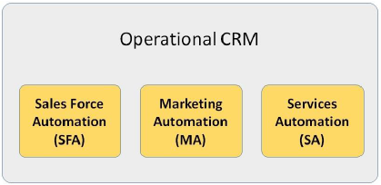
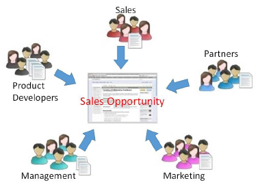

# CRM - Types
In the past twenty years, the focus of global markets has shifted from sellers to customers. Today, customers are more powerful than sellers, if we consider the driving factors of market. We have different types of CRM according to the changes in customer portfolios, speed of business operations, requirement of handling large data, and the need of sharing information, resources, and efforts jointly.

CRM systems are divided based on their prominent characteristics. There are four basic types of CRM systems −

   * Strategic CRM
   * Operational CRM
   * Analytical CRM
   * Collaborative CRM

The following table lists the types of CRM and their characteristic features −

## Strategic CRM
Strategic CRM is a type of CRM in which the business puts the customers first. It collects, segregates, and applies information about customers and market trends to come up with better value proposition for the customer.

The business considers the customers’ voice important for its survival. In contrast to Product-Centric CRM (where the business assumes customer requirements and focuses on developing the product that may sometimes lead to over-engineering), here the business constantly keeps learning about the customer requirements and adapting to them.

These businesses know the buying behavior of the customer that happy customers buy more frequently than rest of the customers. If any business is not considering this type of CRM, then it risks losing the market share to those businesses, which excel at strategic CRM.

## Operational CRM
Operational CRM is oriented towards customer-centric business processes such as marketing, selling, and services. It includes the following automations: Sales Force Automation, Marketing Automation, and Service Automation.

**Salesforce** is the best suitable CRM for large established businesses and **Zoho** is the best CRM for growing or small-scale businesses.

### Sales Force Automation
SFA is the application of technology to manage selling activities. It standardizes a sales cycle and common terminology for sales issues among all the sales employees of a business. It includes the following modules −

   * **Product Configuration** − It enables salespersons or customers themselves to automatically design the product and decide the price for a customized product. It is based on if-then-else structure.
   * **Quotation and Proposal Management** − The salesperson can generate a quotation of the product prices and proposal for the customer by entering details such as customer name, delivery requirements, product code, number of pieces, etc.
   * **Accounts Management** − It manages inward entries, credit and debit amounts for various transactions, and stores transaction details as records.
   * **Lead Management** − It lets the users qualify leads and assigns them to appropriate salespersons.
   * **Contact Management** − It is enabled with the features such as customers’ contact details, salespersons’ calendar, and automatic dialing numbers. These all are stored in the form of computerized records. Using this application, a user can communicate effectively with the customers.
   * **Opportunity Management** − It lets the users identify and follow leads from lead status to closure and beyond closure.

### Marketing Automation
Marketing automation involves market segmentation, campaigns management, event-based marketing, and promotions. The campaign modules of Marketing Automation enable the marketing force to access customer-related data for designing, executing and evaluating targeted offers, and communications.

**Event-based (trigger) marketing** is all about messaging and presenting offers at a particular time. For example, a customer calls the customer care number and asks about the rate of interest for credit card payment. This event is read by CRM as the customer is comparing interest rates and can be diverted to another business for a better deal. In such cases, a customized offer is triggered to retain the customer.

### Service Automation
Service automation involves service level management, resolving issues or cases, and addressing inbound communication. It involves diagnosing and solving the issues about product.

With the help of Interactive Voice Response (IVR) system, a customer can interact with business computers by entering appropriate menu options. Automatic call routing to the most capable employee can be done.

Consumer products are serviced at retail outlets at the first contact. In case of equipment placed on field, the service expert may require product servicing manual, spare parts manual, or any other related support on laptop. That can be availed in service automation.

## Analytical CRM
Analytical CRM is based on capturing, interpreting, segregating, storing, modifying, processing, and reporting customer-related data. It also contains internal business-wide data such as **Sales Data** (products, volume, purchasing history), **Finance Data** (purchase history, credit score) and **Marketing Data** (response to campaign figures, customer loyalty schemes data). **Base CRM** is an example of analytical CRM. It provides detailed analytics and customized reports.

Business intelligence organizations that provide customers’ demographics and lifestyle data over a large area pay a lot of attention to internal data to get more detail information such as, “Who are most valuable customers?”, “Which consumers responded positively to the last campaign and converted?”, etc.

Analytical CRM can set different selling approaches to different customer segments. In addition, different content and styling can be offered to different customer segments. For the customers, analytical CRM gives customized and timely solutions to the problems. For the business, it gives more prospects for sales, and customer acquisition and retention.

## Collaborative CRM
Collaborative CRM is an alignment of resources and strategies between separate businesses for identifying, acquiring, developing, retaining, and maintaining valuable customers. It is employed in B2B scenario, where multiple businesses can conduct product development, market research, and marketing jointly.

Collaborative CRM enables smooth communication and transactions among businesses. Though traditional ways such as air mail, telephone, and fax are used in communication, collaborative CRM employs new communication systems such as chat rooms, web forums, Voice over Internet Protocol (VoIP), and Electronic Data Interchange (EDI).

There are collaborative CRMs with in-built **Partner Relationship Management (PRM)** software application which helps in managing partner promotions. **SugarCRM** is a popular collaborative CRM. It enables expert collaboration and provides state-of-the-art social capabilities.

## CRM Software Buying Considerations
A business needs to consider the following points while selecting a CRM software −

   * **Business strategy and processes** − It helps to automate a customer management strategy. Hence before selecting a CRM software, a business should be clear with its strategies and desired processes.
   * **Business requirements** − CRM systems range from domain specialty solutions that focus on solving a specific area such as sales force automation, marketing automation, services automation, partner management, etc., to complete enterprise management solutions.
   * **Size of business** − Small businesses require tools that are easy to learn and can handle a wide range of the most common tasks. Large businesses opt for applications that handle more complex tasks and thousands of users.
   * **Customer base** − The size of the customer base a business is required to handle.
   * **Budget** − A business needs to set a budget prior vendor selection. The budget allocated for CRM varies according to the degree of customization required.
   * **Context** − The context in which a business is functioning, e.g., B2B or B2C, determines which CRM the business should go for.
   * **Sales channels** − The sales channels a business is employing: Direct sale, channel sale such as distributors, or Direct to customers via retail. They matter while selecting the most suitable CRM software.
   * **System integration** − All the interfaces the business needs and the CRM vendor can support without requiring too much custom services effort.
   * **Strength of partners** − The partners must be able to provide a business with additional support, or help to implement the CRM successfully.

[Previous Page](../customer_relationship_management/crm_introduction.md) [Next Page](../customer_relationship_management/customer_relationships.md) 
