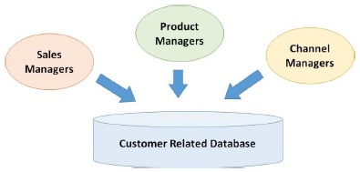
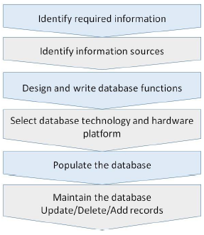
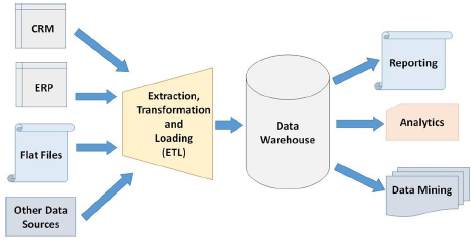
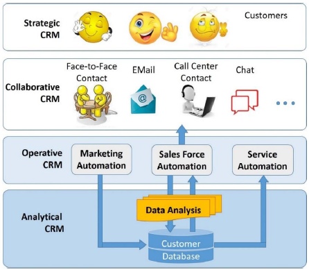

# CRM - Customer Related Databases
The customer related database gives a business an insight on the customer behavior. It is the foundation on which the CRM software strategies work. For any business using the CRM, the customer-related database is highly important to impart the customer-based strategies and tactics.

The database supports all the forms of CRM − Strategic, Operational, Analytical, and Collaborative.

## What is Customer-Related Database?
It is the collection of customer-related information focusing on historic sales, current opportunities, and future opportunities. These databases are maintained by a number of different functions such as sales managers, channel managers, product managers, etc. It can store information such as −

   * Customer’s personal information containing fields for name, address, contact details, contact preferences, age, marital status, birthdate, anniversary, professional and social status, etc.
   * Sales managers can record past transactions, product preferences, opportunities, campaigns, enquiries, billing, etc.
   * Channel managers can record business-owned retail outlets, online retail information.
   * Product managers may record product preference, price band, product categories explored, etc.



Based on the respective purposes, there are two types of databases − **Operational** and **Analytical**. The operational data resides in Online Transaction Processing (OLTP) database and analytical data resides in Online Analytical Processing (OLAP) database.

## Developing and Maintaining Customer-Related Database
The database is a repository of collection of files (or tables). The files contain a number of records (or rows of the table), which in turn contain various fields (or columns of the table). Each file contains information about a topic such as customer, sales, products, etc.

The steps given below are followed to create and maintain a customer-related database −



The database always needs to be very accurate and up-to-date.

## Types of Customer Data
There are mainly two types of CRM data − **Primary** and **Secondary**. The primary data is the one which is collected for the first time. The secondary data is the one which has been collected earlier.

The primary data is collected by conventional means such as conducting surveys, holding a skill competition, inviting the customers to subscribe for the newsletter or to register their purchase, etc.

## Database and Hardware for CRM
The CRM software use Relational Database architecture. It is composed of tables with rows and columns. The tables are connected to other tables by a unique identification number stored in the ID field, named **primary key**.

### Database Management Systems for CRM
There are many database management systems available in the market today. Some popular ones are Microsoft’s SQL server, Oracle, DB2 from IBM, etc. These systems help to update and administer the database.

### Hardware Considerations for CRM Database
The hardware platform on which the database will reside is selected based on the following factors −

   * The database size.
   * The existing technology used in the business.
   * The location of CRM users. Especially in case of global use of CRM, the multilingual users from different time zones can access the CRM for operational and analytical purposes.

## Data Attributes
The CRM data must have the following attributes −

   * It must be **sharable** because many people need to access it from various geographical locations.
   * It must be **relevant** means pertaining to the given purpose.
   * It should be most **accurate**. Inaccurate data wastes the marketing efforts of the business, predicts wrong opportunities and serves the customers with insufficient and inaccurate service. Data should be reviewed timely to ensure removal of inaccuracy taken place while acquiring and entering the data.
   * It should be **up-to-date** means it should store and show the latest information.
   * It should be **transportable** from one location to other. It should be available where the users need it. The technology of compiling and handling data electronically is essential for today’s fast-paced businesses.
   * It should be **secured**. Businesses need to keep their data safe from loss and theft and unethical snooping as many businesses can subscribe to the same CRM software through the same portal.

## Data Warehousing (DW)
Data warehouses are huge repositories of customer related data accepted from various databases. These repositories can be as much as a few terabytes (2 bytes).

Numerous global businesses operating from various countries and continents generate huge volume of data. This data needs to be converted into useful information for further operations and analysis. Data warehouse does this task by −

   * Accepting the data from ETL system that extracts valuable data, transforms it into a required format, and loads it into the database.
   * Organizing data according to subjects of business and various time periods.
   * Standardizing data coming from various sources in a single format. For example, bringing salutations, codes (m/f or male/female), units of measurement, etc. in the same format.
   * Conducting periodic update of data, say daily or weekly, depending upon business requirements. It is not done in real time.
   * Providing updated data for the purpose of analytics, data mining, and reporting.



## Data Marts
It is the smaller version of a data warehouse which caters to a particular business or a function. Data mart projects are inexpensive than data warehouse projects as the volume of the data is smaller and the functions for which it is used are specific. The costs, time, and efforts required to handle such data are less.

## Data Access and Interrogation
CRM applications allow users to interact with the database. For example, a salesperson adds customer data at the time of billing or after the customer service call is attended. Also, the users need to interrogate the data for analytical purpose.

Thus, data access and interrogation is essential and is carried out by the following three ways −

### Data Mining
Data mining is the process of sifting through the huge volume of data to get most relevant information in the shortest possible time. CRM takes the help of Artificial Intelligence to find out the solutions for the most important questions of the business.

In the context of CRM, data mining is the application of predictive analytics to support marketing, sales, and services. In CRM, data mining finds associations among data, classifies the customers according to business value, and helps to find answers of the following questions −

   * Which customers the business should target?
   * What is the cost of customer acquisition?
   * Which customers are buying (or not buying) the products?
   * Who are high/medium/low margin customers?
   * What profile customers are defaulting payment repeatedly?
   * How can a business segment its market?
   * Can the business offer a common price for all customer segments?

For example, an analyst of Walmart noticed that the sale of beer and diapers is high on Fridays. Having this fact brought to the notice of Walmart, the business kept the two products close to each other on the shelves. This resulted in the sale rise of both the products.

Thus, data mining helps in generating sales volumes by providing most relevant data for marketers’ analysis.

### Database Queries
The queries are the tools to access and modify the database. **Structured Query Language** (SQL) is used for management of Rational Databases. The queries come in the form of statements such as SELECT, ADD, DELETE, UPDATE, DROP, etc.

For example, look at the following query statements −

```
CREATE DATABASE Db_Name
DELETE * FROM EMPLOYES
SELECT Emp_Name, Emp_Salary
FROM Employees
WHERE Emp_Salary >= 25000
```
### Reports
CRM Applications generate reports on periodic basis for analyzing the traits of sale, performance, and many other allied activities. Reports are generally accessed by management people of the business for performance assessment.

OLAP technology is capable of showing data at a level as lowest as a salesperson’s and as highest as a region, which can be helpful to assess the performance and question the underperformance.

## Position of CRM with Respect to Database
After having known various types of CRM in earlier chapter, let us see which CRM stands where with respect to the customer database −



Analytical CRM works most closely with the customer database and strategic CRM works farthest from the database.


[Previous Page](../customer_relationship_management/implementing_crm_projects.md) [Next Page](../customer_relationship_management/crm_sales_force_automation.md) 
