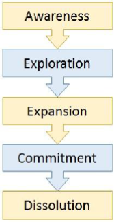

# CRM - Customer Relationships
Being social animals, we are naturally inclined towards interaction. The bonding that takes place when we communicate in a healthy manner paves smooth ways for many difficult challenges. In the role of customers, we interact with salespersons, dealers, wholesalers, and suppliers.

In the term CRM, ‘R’ stands for **relationship**, but can a relationship between a customer and a business exist? Let us discuss more about the term **relationship** and its role in businesses.

## What is Relationship?
The Oxford Dictionary defines **relationship** as, .

Investment of time, trust, transparency, care, and communication are vital for any relationship to build and survive. This is applicable to human relationships. As far as a formal business domain is concerned, the definition goes as follows −

If a person on his journey stops at a roadside eating joint and buys a burger, it is a transaction; not a relationship. But when a person goes to a particular shop repeatedly, because he likes the store’s ambience, quality of products, or the way he receives service at the shop, then it can be quoted as a relationship.

Some experts say, only repeated interaction over time does not make complete sense of the term **relationship**. It also needs some emotional element of affection and care.

### Evolution of Customer-Suplier Relationship
F. Robert Dwyer, a marketing professor at Lindner College of Business states five phases through which a customer-supplier relationship evolves −

   * **Awareness** − The parties come in contact with each other and see each other as a possible customer or supplier.
   * **Exploration** − The parties find out more about one another’s capabilities and business prospects. Trial purchasing takes place and performance is assessed. If deal is not smooth then the relationship terminates with the damage of less costs.
   * **Expansion** − It is composed of attraction, communication, bargaining, development of rules, and development of expectations from each other.
   * **Commitment** − Trust begins to develop and deals are executed as per the norms and expectations. Mutual understanding and cooperation develops, and number of transactions start building up.
   * **Dissolution** − Not all relationships can survive. Some relationships are terminated either bilaterally (both parties agree to end) or unilaterally (one party decides to end). If it is bilateral decision then both parties retrieve the invested amount and resources. Supplier exits relationship in case of failure to contribute sales volume or profit. Customer ends relationship unilaterally due to changes in product requirement, repeated servicing failure, etc.

Dissolution can be avoided by reducing cost-to-serve.

## Why a Business Wants Relationship with its Customers?
Every business regards its customers as a lifetime stream of revenue; losing a single customer can cost the business very high. **Lifetime Value (LTV)** for a customer is considered to analyze the effectiveness of a particular marketing channel.

For example, if the **Churn Rate** of a business X is 5% and that of business Y is 10%, then in the long-term, business X would have a larger customer base than business Y, which places business X at the position of competitive advantage and directly influences profit of both the businesses.

A business can generate greater sales volume and in turn greater revenue if it knows its customers well and have good relationship with them. Thus, solely for the economic purpose, every business wants to have healthy relationships with their customers.

## Relationship Management Theories
There are various schools of thoughts with different theories of relationship management. Let us discuss some of them briefly −

### Theory by Industrial Marketing and Purchasing Group (IMP Group)
This Europe-based research initiative in Industrial Marketing focuses on B2B relationships and states the following characteristics −

   * Buyers and sellers both actively participate in the transaction to find solutions to their respective challenges.
   * Buyer-seller relationships are normally long-term and close.
   * Relationships are composed of interpersonal bond, connections among businesses, and strengths or weaknesses of the business.
   * The transactions often occur with respect to relationship’s history.
   * The businesses chose the mode and the manner of interaction with the entities at various levels of importance.

### Theory by Nordic School
A Scandinavian services marketing group, named The Nordic School, emphasizes on supplier-customer relationship. It identifies the triplet of relationship marketing as −

   * **Interaction** − As customers and suppliers interact, each one provides a service to another. Customer provides information and supplier provides solution.
   * **Dialogue** − Communication is bilateral and is essential for the survival of the relationship.
   * **Value** − The business needs to generate something that is perceived as value to the customer.

### Theory by Anglo-Australian School
It states that relationships are important not only from the viewpoint of customers but also from the angle of stakeholders of the business such as employees, suppliers, and government. It also found out that customer’s satisfaction and customer retention are value drivers of any business.

### Theory by North American School
According to this theory, good relationships reduce costs significantly. Trust and commitment are vital attributes of a successful relationships. By connecting the trust to the commitment, this theory states that trust created on the basis of minimal functional conflicts, communication, non-opportunistic behavior, and cooperation. Commitment is linked to high relationship termination cost and relationship benefits.

### Theory by (Guanxi) Asian School
This theory is based upon the teachings of Lord Buddha regarding social conducts and acts of reciprocation. This theory states that people from a family, friendship, same-clan fellowship are connected to each other due to informal social relationships which impose them to follow reciprocal obligations to acquire the resources by exchanging favors and cooperation.

[Previous Page](../customer_relationship_management/crm_types.md) [Next Page](../customer_relationship_management/twenty_first_century_customers.md) 
