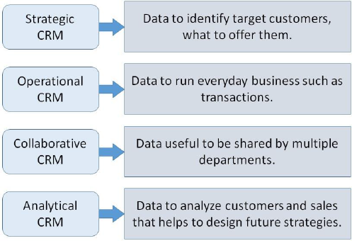

# CRM - Implementing CRM Projects
Implementing a CRM project in an organization takes more than purchasing and installing the CRM form a vendor. It needs setting up the features of CRM system according to the business requirement, training the staff, and overall shifting from conventional work culture to a new method of handling work and customer relationships.

There are various phases a business needs to go through while implementing CRM projects. Here in this chapter, we will discuss in brief how to implement a CRM project.

## Developing CRM Strategy
This is the first stage. CRM strategy is a top management level plan of aligning employees, CRM process, and technology to achieve business goals.

### Situation Analysis
The business conducts situation analysis by considering internal and external factors. This is nothing but SWOT (Strength, Weakness, Opportunities, and Threats) analysis to find out how the business is doing with the objective of examining readiness for CRM implementation.

The managers analyze and appraise existing customer strategy, served market segments, market position of business, marketing channels, etc. They try to find out the answers for the questions such as −

   * Which customer segments does the business serve?
   * What are the marketing and customer related objectives of the business?
   * What is the business position and market share?
   * What is the cost to customer management?
   * How effective the present strategies of customer acquisition and retention?
   * Which products/services under what category does the business offer?
   * To what extent the customers are aware of the products/services?
   * Who are business competitors, and what are profit margins?
   * Which channels we use for product distribution? What is the depth of channel penetration?
   * Which channels are effective? Which are becoming obsolete?
   * How do channel partners find dealing with our business?
   * Will the business buy, rent, or create its own CRM? What is each option’s feasibility?

Thus, situation analysis serves as a foundation to know what the managers want to achieve by implementing CRM.

## Building CRM Project Foundation
Before implementing CRM projects, there are various changes required to bring in the business environment such as −

   * The working culture changes present in the business organization.
   * As the CRM can mean different to the people from different domains, it is necessary for the business to start educating the staff on CRM systems.
   * The top management of business also sets up the vision on how CRM will change the business to benefits regarding serving the customer better and earning high revenue.
   * Clear priorities are set for objectives and activities such as enhancement of customers’ experience, cost reduction, increasing revenue, etc.
   * Goals (qualitative results) and objectives (quantitative results) are set.
   * Governance structure of experts is formed which is essential to identify and allocate resources and responsibilities appropriately.
   * The internal IT staff of the organization is put to perform several CRM related roles such as networking, database management, front-end development, system integration, etc.
   * The management identifies change and project management needs in the organization, and risk factors.

## Identifying Business Processes
The processes are the ways by which the business gets the things done. The processes can be of the following types −

   * **Vertical** − Located completely within a department. For example, customer acquisition is only marketing related process, whereas annual revenue and tax calculation are accounts processes.
   * **Horizontal** − They span across various departments in the business. For example, product manufacturing is cross functional across R&amp;D, finance, material management, sales, etc.
   * **Primary** − They have major impact on the business costs or revenue. For example, picking and delivering packages is primary process for a courier company.
   * **Secondary** − They have minor impact on the cost or revenue of the business.
   * **Front-Office** − They encounter the customers. For example, complaint handling.
   * **Back-office** − They are where customers are directly involved. They are not known to the customers. For example, database management, procurement, etc.

The business needs to anticipate which existing processes may get affected and to what extent.

## Specifying Requirements
During this step, the business identifies the stakeholders (staff, sales team, marketing team, channel partners, IT specialists, etc.), processes, data requirements, and technology.

### Data Requirements
The business needs to create the inventory for the available data for the CRM purposes. There are different data requirements for different CRM types as shown −

   * Which database system the business will require for CRM?
   * What is the number of customers the business have?
   * How much the number of customers can increase in future?
   * Which fields of data are mandatory and which are additional for the business?

The business develops a customer related database to store the customer information, such as contact data, contact history, transaction history, communication preferences, opportunities with customer, and so on.

### Technology Requirements
It includes selection the required CRM technology from a wide choice.

   * How to access the CRM software: from business server (On-Premise) or from vendor’s server (Hosted or Online) via internet?
   * Which CRM applications can fulfill the business vision and objectives among a myriad number of applications under CRM.
   * What hardware is required for sales, services, and marketing staff?
   * What is the required hardware platform on which the database will reside and function?

## Creating Proposals
The business forms a well-structured Request for Proposal (RFP) in which it lists down the idea and vision of CRM, the type of CRM required, process, technology, costs, time frames, contracts, and staff issues.

The proposal is descriptive enough to give idea to the vendor about the business structure and requirements. The business then invites at least three and at the most six technology vendors by sending the proposal.

## Selecting Partner
When a business receives response from various vendors, it need to select a right vendor. The business management assesses the proposal responses on the scale of importance of issues included in the RFP. It the shortlists the technology vendors and invites them for demonstrating their CRM products.

## Implementing the CRM Project
The business takes the following steps to −

   * Chalk out the internal project plan.
   * Refine the project plan with incorporating the technology vendor.
   * Identify customization needs as no off-the-shelf CRM software can completely satisfy the CRM needs of a business. It is done with lead developer, database developer, front-end developer, and vendor.
   * Create a prototype of the customized software.
   * Test the prototype on dummy database and users. Test it first on the newly acquired customers rather than directly on the customer database.
   * Identify further customization and training requirements.
   * Create in-house awareness on the final system installation.

## Performance Evaluation
As a final and continual stage for large span of time, the business evaluates how well does the CRM perform. When a business implements new technology, the users take a large span of time to get acquainted and comfortable with the technology.

There are two variables the business considers −

   * **Project outcomes** − Whether or not the project went on as per the plan without overrunning budgets, costs, and time. Is it working smoothly and successfully?
   * **Business outcomes** − Has the business objectives set initially have achieved?

If the business objective was to improve the rate of customer retention, the rate was 70% before CRM coming to aid, and it went up to 78% after CRM implementation then the business has achieved its objective.

[Previous Page](../customer_relationship_management/crm_managing_customers.md) [Next Page](../customer_relationship_management/customer_related_databases.md) 
