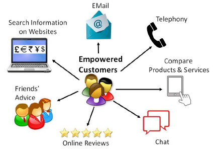
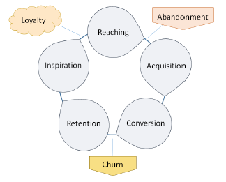

# CRM - 21st Century Customers
Customers in the last decade only used to be concerned about quantity, quality, and price. In today’s information-driven world, the customers have not remained merely as people buying goods or services from a business. Along from being concerned about the questions such as "how many", “how much”, and "what", they are groomed smart enough to ask, "why?". Today’s customers are hard to convince and are difficult to please too.

## Who is an Empowered Customer?
Today’s customers are empowered. Empowered customers are those having the control to buy goods or services from a business when and where they want it, by selecting from a vast range of available choice. Empowered customers access the Internet and collect information about products, dealers, and prices. They take advice from friends or at times from strangers too, before making a buying decision.

By using various digital devices, they can find out the specifications of a product or service before arriving at buying decision. They are smart and alert buyers who also keep high expectations. When a business fulfills most of the expectations, the empowered customers can be loyal to them.

Let us analyze the phases a customer goes through when a business offers products/services to the customers.

## Customer Life Cycle
Customer Life Cycle is used to describe the phases through a customer goes. Here are the important stages of a customer life cycle −

   * **Reaching** − It is the phase where a business communicates with its target customer. It is mainly done through advertisements.
   * **Acquisition** − Attracting and influencing the target customer. The marketing team decides the scope of the target audience and convinces the customers about the benefits of its products/services.
   * **Conversion** − It is when customers decide to purchase a product or service.
   * **Retention** − In addition to flawless products/services, the business offers some extra facilities to the customer such as priority treatment, beautiful store ambience, free parking, etc., to retain existing customers.
   * **Inspiration** − To inspire a regular customer into a loyal one by establishing a sound relationship. When a business puts efforts on providing polite and quick service, personal attention from the staff, knowledgeable sales staff, then the customers are automatically inspired to buy a product/service from a particular vendor.

Let us now try to figure out what differentiates a customer from a consumer.

## Consumer vs. Customer
A **consumer** is a user of a product or a service, whereas a **customer** is a buyer of a product or service. A customer decides what to buy and executes the deal of purchasing by paying and availing the product or service. A consumer uses the product or service for oneself.

For example, the customer of a pet food is not the consumer of that product. Similarly, if a mother in a supermarket is buying  for her baby, then she is a customer and her baby is a consumer.

## Types of Customers
There can be various types of customers a business have to deal with. Here are some prominent types of customers −

   * **Loyal Customers** − They are completely satisfied customers. Though they are less in numbers, they can promote more sales and profit. They expect individual attention and demand polite and respectful response from the supplier.
   * **Discount Customers** − They visit the business outlets frequently but transact only when business offers discounts on regular products and brands. They are the ones who buy only low cost products. Their buying behavior changes according to the rate of discounts. They are important to a business, as they contribute a significant portion of business profit.
   * **Impulsive Customers** − They are with the business in urge and buy on impulse. They don’t plan for buying anything specific in advance, but they urge to buy anything that they find good and productive at the time when they are in the store. These customers are challenging and very difficult to convince. They are capable of bringing high profit when treated tactfully.
   * **Need-Oriented Customers** − They have a specific product on mind and they often plan before buying. They only buy when they need a product. They are difficult to satisfy. They need reasons to switch to another product or brand.
   * **Wanderers** − They are least profitable ones to a business. At times, they are not sure what to buy. They are normally new in the industry and mostly visit the suppliers only to confirm their needs on products. They like to find out the features of the products in the market but they are least interested in buying.
   * **High Volume Customers** − They are the ones who consume a high volume of products.
   * **High Future Lifetime Value Customers** − The ones who can contribute profits in future.
   * **Benchmark Customers** − They are the ones whom other customers follow.
   * **Door Openers** − They can open doors to a new market for the supplier.
   * **Inspiring Customers** − They force the suppliers to change for betterment. They suggest product improvements or inform the suppliers about opportunities of cost reduction.

## Customer Orientation
There are three types of customer orientations −

   * **Cost-Oriented Customers** − They concentrate on products with least costs and are ready to compromise on efficacy, performance, and quality. They are ready to blame the supplier on the occurrence of fault in product without thinking that they are responsible for choosing less quality product. Some customers tend to fix problems with a local, less-skilled dealer or by themselves without taking a supplier’s direct help as it is cheaper. These customers also at times buy second hand products and expect it to perform as efficiently as a new one. The suppliers always find themselves arrested in payment-related issues with these customers.
   * **Value-Oriented Customers** − They always look for efficient and high-performing products, as they know that they are making a profitable deal for a long run. For them, paying a high initial cost is their long-term investment to enjoy its hassle-free benefits in future. They are satisfied customers. They often tend to maintain a healthy relationship with the suppliers.
   * **Technology-Oriented Customers** − They opt for the best technology products rather than less cost, good quality, or performance. They are technology-conscious as they find using products with latest technology would sustain in the ever-changing technological environment. These customers have detailed eye towards technical aspects of a product and tendency to interact with other customers of their type. They are also satisfied customers and tend to maintain healthy relationship with supplier.

## Customer Management Strategies
There are seven core customer management strategies −

   * **Start a relationship** − When a customer is identified as having a high potential to bring profits, start a relationship.
   * **Protect the relationship** − When the customer is significant for the business and when there is a possibility of the competitor’s attraction, then the managers need to protect the relationship.
   * **Relationship re-engineering** − This is necessary when the managers find that the customer is not profitable as desired at the current stage. In such a case, serve the customer by low-cost automated channels.
   * **Enhance the relationship** − The managers identify up-selling and cross-selling opportunities and try to boost the customer on the scale of value.
   * **Harvest the relationship** − When the managers do not want to spend much on the existing customer development, they use the cash flow from these customers to develop new customers.
   * **End the relationship** − It is good to end the relationship when the customer shows no sign of contributing to future business profit.
   * **Regain the customer** − When the customer goes to the competitor while choosing another option to fulfill his requirement, then the managers need to implement win-back strategies to regain the customer and understand the reason of departing the customer.

## Customer Acquisition
Customer acquisition is the art of persuading the customers to buy products or to avail services offered by a business. Each time a business invents new strategies for acquiring new customers, the strategy gets saturated over some time.

The strategy that worked in the past may not remain effective in the future. Hence the businesses need to keep tuned with the market situations, government policies and plan the new strategies.

It requires diligent planning, forming acquisition strategy, communicating with customers, advertising the products aggressively on various media, conducting flash sales, etc., to acquire new customers.

[Previous Page](../customer_relationship_management/customer_relationships.md) [Next Page](../customer_relationship_management/building_value_for_customers.md) 
