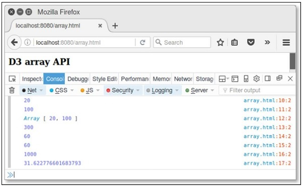
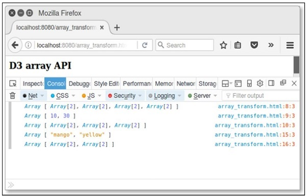

# D3.js - Array API
D3 contains a collection of modules. You can use each module independently or a collection of modules together to perform operations. This chapter explains about the Array API in detail.

## What is an Array?
An Array contains a fixed-size sequential collection of elements of the same type. An array is used to store a collection of data, but it is often more useful to think of an array as a collection of variables of the same type.

## Configuring API
You can easily configure the API using the script below.

```
<script src = "https://d3js.org/d3-array.v1.min.js"></script>
<body>
   <script>
   </script>
</body>
```
## Array Statistics API Methods
Following are some of the most important array statistics API methods.

   * d3.min(array)
   * d3.max(array)
   * d3.extent(array)
   * d3.sum(array)
   * d3.mean(array)
   * d3.quantile(array)
   * d3.variance(array)
   * d3.deviation(array)

Let us discuss each of these in detail.

### d3.min(array)
It returns the minimum value in the given array using natural order.

**Example** − Consider the following script.

```
<script>
   var data = [20,40,60,80,100];
   console.log(d3.min(data));
</script>
```
**Result** − The above script returns the minmum value in the array 20 in your console.

### d3.max(array)
It returns the maximum value in a given array.

**Example** − Consider the following script.

```
<script>
   var data = [20,40,60,80,100];
   console.log(d3.max(data));
</script>
```
**Result** − The above script returns the maximum value in the array (100) in your console.

### d3.extent(array)
It returns the minimum and maximum value in the given array.

**Example** − Consider the following script.

```
<script>
   var data = [20,40,60,80,100];
   console.log(d3.extent(data));
</script>
```
**Result** − The above script returns an extent value [20,100].

### d3.sum(array)
It returns the sum of the given array of numbers. If the array is empty, it returns 0.

**Example** − Consider the following below.

```
<script>
   var data = [20,40,60,80,100];
   console.log(d3.sum(data));
</script>
```
**Result** − The above script returns the sum value is 300.

### d3.mean(array)
It returns the mean of the given array of numbers.

**Example** − Consider the following below.

```
<script>
   var data = [20,40,60,80,100];
   console.log(d3.mean(data));
</script>
```
**Result** − The above script returns the mean value as 60. Similarly, you can check the median value.

### d3.quantile(array)
It returns the p-quantile of the given sorted array of numbers, where p is a number in the range[0, 1]. For example, the median can be computed using p = 0.5, the first quartile at p = 0.25, and the third quartile at p = 0.75. This implementation uses the R-7 method, default R programming language and Excel.

**Example** − Consider the following example.

```
var data = [20, 40, 60, 80, 100];
d3.quantile(data, 0); // output is 20
d3.quantile(data, 0.5); // output is 60
d3.quantile(data, 1); // output is 100
```
Similarly, you can check other values.

### d3.variance(array)
It returns the variance of the given array of numbers.

**Example** − Consider the following script.

```
<script>
   var data = [20,40,60,80,100];
   console.log(d3.variance(data));
</script>
```
**Result** − The above script returns the variance value as 1000.

### d3.deviation(array)
It returns the standard deviation of the given array. If the array has fewer than two values, it returns as undefined.

**Example** − Consider the following below.

```
<script>
   var data = [20,40,60,80,100];
   console.log(d3.deviation(data));
</script>
```
**Result** − The above script returns the deviation value as 31.622776601683793.

**Example** − Let us perform all the Array API methods discussed above using the following script. Create a webpage “array.html” and add the following changes to it.

```
<html>
   <head>
      <script type = "text/javascript" src = "https://d3js.org/d3.v4.min.js"></script>
   </head>

   <body>
      <h3>D3 array API</h3>
      <script>
         var data = [20,40,60,80,100];
         console.log(d3.min(data));  
         console.log(d3.max(data));
         console.log(d3.extent(data));
         console.log(d3.sum(data));
         console.log(d3.mean(data));
         console.log(d3.quantile(data,0.5));
         console.log(d3.variance(data));
         console.log(d3.deviation(data));
      </script>
   </body>
</html>
```
Now, request the browser and we will see the following response.

<iframe style="margin:5px;" frameborder="0" scrolling="0" width="660px" height="150px" src="../d3js/src/array.htm"></iframe>



## Array Search API Methods
Following are a couple of important Array search API methods.

   * d3.scan(array)
   * d3.ascending(a, b)

Let us understand both of these in detail.

### d3.scan(array)
This method is used to perform a linear scan of the specified array. It returns the index of the least element to the specified comparator. A simple example is defined below.

**Example** −

```
var array = [{one: 1}, {one: 10}];
console.log(d3.scan(array, function(a, b) { return a.one - b.one; })); // output is 0
console.log(d3.scan(array, function(a, b) { return b.one - a.one; })); // output is 1
```
### d3.ascending(a, b)
This method is used to perform the comparator function. It can be implemented as −

```
function ascending(a, b) {
   return a < b ? -1 : a > b ? 1 : a > =  b ? 0 : NaN;
}
```
If no comparator function is specified to the built-in sort method, the default order is alphabetical. The above function returns -1, if a is less than b, or 1, if a is greater than b, or 0.

Similarly, you can perform descending(a, b) method. It returns -1, if a is greater than b, or 1, if a is less than b, or 0. This function performs reverse natural order.

**Example** −

Create a webpage **array_search.html** and add the following changes to it.

```
<html>
   <head>
      <script type = "text/javascript" src = "https://d3js.org/d3.v4.min.js"></script>
   </head>

   <body>
      <h3>D3 array API</h3>
      <script>
         var array = [{one: 1}, {one: 10}];
         console.log(d3.scan(array, function(a, b) { return a.one - b.one; })); // 0
         console.log(d3.scan(array, function(a, b) { return b.one - a.one; })); // 1
      </script>
   </body>
</html>
```
Now, request the browser and we will see the following result.

<iframe style="margin:5px;" frameborder="0" scrolling="0" width="660px" height="150px" src="../d3js/src/array_search.htm"></iframe>

## Array Transformations API
Following are some of the most prominent array transformations API methods.

   * d3.cross(a, b[, reducer])
   * d3.merge(arrays)
   * d3.pairs(array[, reducer])
   * d3.permute(array, indexes)
   * d3.zip(arrays)

Let us understand each of these in detail.

### d3.cross(a, b[, reducer])
This method is used to return the Cartesian product of the given two arrays a and b. A simple example is defined below.

```
d3.cross([10, 20], ["a", "b"]); // output is [[10, "a"], [10, "b"], [20, "a"], [20, "b"]]
```
### d3.merge(arrays)
This method is used to merge the arrays and it is defined below.

```
d3.merge([[10], [20]]); // output is [10, 20]
```
### d3.pairs(array[, reducer])
This method is used to pair array elements and is defined below.

```
d3.pairs([10, 20, 30, 40]); // output is [[10, 20], [20, 30], [30, 40]]
```
### d3.permute(array, indexes)
This method is used to perform the permutation from specified array and indexes. You can also perform the values from an object into an array. It is explained below.

```
var object = {fruit:"mango", color: "yellow"},
   fields = ["fruit", "color"];
d3.permute(object, fields); // output is "mango" "yellow"
```
### d3.zip(arrays)
This method is used to return an array of arrays. If arrays contain only a single array, the returned array contains one-element arrays. If no argument is specified, then the returned array is empty. It is defined below.

```
d3.zip([10, 20], [30, 40]); // output is [[10, 30], [20, 40]]
```
**Example** − Create a webpage **array_transform** and add the following changes to it.

```
<html>
   <head>
      <script type = "text/javascript" src = "https://d3js.org/d3.v4.min.js"></script>
   </head>

   <body>
      <h3>D3 array API</h3>
      <script>
         console.log(d3.cross([10, 20], ["a", "b"]));
         console.log(d3.merge([[10], [30]]));
         console.log(d3.pairs([10, 20, 30, 40]));
         var object = {fruit:"mango", color: "yellow"},
         fields = ["fruit", "color"];
         console.log(d3.permute(object, fields)); 
         console.log(d3.zip([10, 20], [30, 40]));
      </script>
   </body>
</html>
```
Now, request the browser and we will see the following response.

<iframe style="margin:5px;" frameborder="0" scrolling="0" width="660px" height="150px" src="../d3js/src/array_transform.htm"></iframe>




[Previous Page](../d3js/d3js_geographies.md) [Next Page](../d3js/d3js_collections_api.md) 
